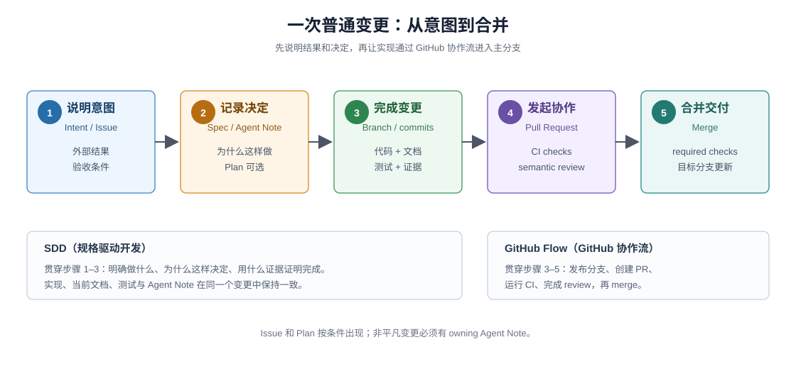

# 从规格到合并，再到可持续参与

## 这组文档写给谁

这组文档写给已经知道 git 可以提交代码，但还不熟悉 Spec-driven Development（SDD，规格驱动开发）和 GitHub Flow（GitHub 协作流）的读者。读完新手主线后，你应该能回答三个问题：一次变更为什么要先说明结果，代码之外还要一起提交什么，以及 GitHub 为什么不只是存放代码的地方。

掌握普通流程后，你还可以沿两条高级路径继续：一条核对复杂 SDD/GitHub Flow 的精确条件；另一条理解 DSH 怎样把仓库本身组织成 development harness（开发 Harness），让 fresh coding agent（初次进入项目的编码代理）能够理解、修改和验证 DSH。

DSH 没有正式声明采用一套名为 SDD 的方法。本专题借用 SDD 的视角解释仓库已经存在的规则：**先把意图、决定和验收说清楚，再让实现、文档、测试与这些规格一起演进。**

`_agent_ready_development/` 是可以独立发行的学习与研究语料。它先讲通用的 SDD 和 GitHub Flow，再用 DSH 的 Agent Note、Plan Mode、`.github/` policy、CI 和 Development Harness 作为具体案例；所需概念都在本目录中引入，目录外链接只指向 DSH 自己的源码、文档与规则作为一手证据。

## 先分清两个概念

**Spec-driven Development（SDD，规格驱动开发）**回答“做什么、为什么这样做、怎样证明完成”。这里的 specification（规格）不是一份巨大的设计文档，而是分布在任务上下文、Agent Note、当前文档和测试中的一组可核验事实。

**GitHub Flow（GitHub 协作流）**回答“一个变更怎样从个人分支进入主分支”。它的普通路径是 branch（分支）→ commit（提交）→ Pull Request（PR）→ Continuous Integration（CI，持续集成）与 review（评审）→ merge（合并）。

DSH 把两者叠在一起：SDD 让变更有清楚的目标、决定和证据；GitHub Flow 让这些内容经过远端检查与评审后安全进入主分支。



## 普通变更只有五步

1. **说明意图。** 在 Issue（GitHub 工作项）或任务上下文中写清外部结果和验收条件。
2. **记录决定。** 非平凡变更新增或更新 Agent Note（仓库决策记录）；设计复杂时可以先使用 Plan Mode（计划模式）。
3. **完成变更。** 在分支上同时更新代码、当前文档和能抓住回归的测试或其它 evidence（验证证据）。
4. **发起协作。** Push（推送）分支并创建 PR；GitHub workflow（工作流）运行 CI，reviewer 检查自动化无法判断的语义。
5. **合并交付。** Required checks（必需检查）和 review 状态满足后 merge；主分支成为新的当前状态。

这五步是一条学习主线，不是一条所有变更都必须逐项出现的固定流水线。Issue 和 Plan Mode 都有适用条件；非平凡变更必须有 owning Agent Note（拥有该决定的 Agent Note）。

## 三条阅读路径

**路径一：先学会跟一次普通变更。** 按顺序阅读下面五篇，每篇只增加一层概念：

| 章节 | 读完能回答 |
|---|---|
| [`01-follow-a-change.md`](./01-follow-a-change.md) | 一个具体变更从想法到合并到底发生了什么 |
| [`02-specs-and-decisions.md`](./02-specs-and-decisions.md) | Issue、Agent Note、Plan、代码、文档和测试为什么不能互相替代 |
| [`03-github-flow.md`](./03-github-flow.md) | branch、PR、CI、review、merge 怎样组成普通 GitHub Flow |
| [`04-implementation-and-evidence.md`](./04-implementation-and-evidence.md) | 实现时要带上哪些证据，本地检查与远端 CI 怎样分工 |
| [`05-review-and-merge.md`](./05-review-and-merge.md) | 自动检查、语义评审、用户授权与最终合并分别负责什么 |

第一次阅读可以在 `05` 结束。

**路径二：核对 Advanced SDD Flow（高级 SDD 流程）。** 需要查精确 policy、内部状态或例外流程时，进入 [Advanced SDD Flow 参考](./advanced/00-index.md)。它回答复杂变更怎样流转。

**路径三：理解 DSH Development Harness。** 想知道 DSH 为什么容易被 coding agent 理解和修改，以及 `AGENTS.md`、Agent Notes、Skills、gates、runtime inspection 和 `.github/` 怎样共同工作时，进入 [Development Harness 专题](./development-harness/00-index.md)。它回答仓库怎样帮助参与者完成流程。

## 核心术语

| English | 中文理解 | 在本专题中的作用 |
|---|---|---|
| specification / spec | 规格 | 对意图、决定、当前行为或验收证据的可核验描述 |
| Spec-driven Development / SDD | 规格驱动开发 | 让实现持续服从已写明的意图、决定和证据 |
| GitHub Flow | GitHub 协作流 | 让分支变更经过 PR、CI 和评审后进入主分支 |
| Issue | GitHub 工作项 | 记录外部问题、目标和验收条件 |
| Agent Note | 仓库定义的决策记录 | 保存为什么这样决定、放弃了什么以及后果 |
| Plan Mode | 计划模式 | 在实现前让用户评审一次性的实施计划；可选 |
| Pull Request / PR | 变更评审请求 | 汇集 diff、讨论、检查和合并状态 |
| Continuous Integration / CI | 持续集成 | 在远端自动运行仓库定义的检查 |
| semantic review | 语义评审 | 判断实现是否真的符合意图、决定和使用场景 |
| merge | 合并 | 把通过检查与评审的变更纳入目标分支 |
| development harness | 开发 Harness | 帮助参与者理解、修改和验证代码库的仓库级机制 |
| Skill | 可调用任务知识 | 面向特定任务、带适用条件与验证要求的工作流程 |

后文保留这些英文名称，因为它们也是 GitHub、命令和仓库文件中的可搜索词；中文解释负责建立含义，不另造一套无法对应源码的术语。

## 怎样阅读 DSH 引用

本专题先在正文内给出完整解释，再把 DSH 链接作为一手证据。关键规则会摘录为 Markdown blockquote，并标明它来自 DSH 的哪个子系统、workflow、规则文件或 Agent Note；页末“证据入口”进一步说明每个链接能够核对什么。读者不需要先打开这些链接才能理解正文，只有核查当前实现或继续深入时才需要进入 DSH 仓库。

## 一句话记忆

**SDD 管“变更应该成为什么”，GitHub Flow 管“变更怎样安全到达主分支”，Development Harness 管“参与者怎样看懂规则、做出修改并获得反馈”。**

## 验证

修改本目录后运行：

```sh
node _agent_ready_development/verify.mjs
```

该命令检查严格 UTF-8、单个结尾换行、Markdown 相对链接和锚点，以及 SVG 的 XML 结构与实体。流程事实的准确性仍由语义复核和 [`_coverage/00-corpus-maintenance.md`](./_coverage/00-corpus-maintenance.md) 中记录的来源范围保证。
