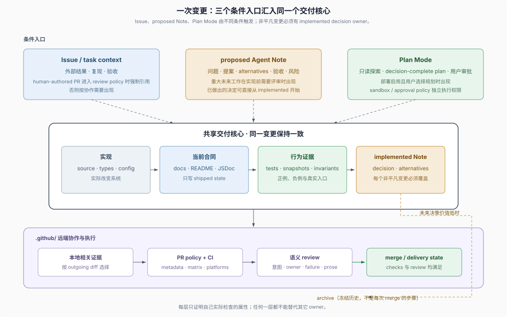

# Advanced SDD Flow · 精确机制与例外流程

## 什么时候读这里

这里是 Advanced SDD Flow reference（高级 SDD 流程参考），面向已经理解 [Foundations 新手主线](../foundations/00-index.md)，并需要核对精确条件、内部状态或少见流程的读者。各页支持按问题查找，不要求从 `01` 顺序读到 `08`。

普通 branch → PR → CI/review → merge 流程在 Foundations 教程已经完整说明。这里保留实现细节，是为了回答“具体由哪个文件执行”“边界条件是什么”“失败后怎样处理”，不是为了给第一次阅读增加前置知识。

本目录只拥有复杂变更的流程机制。DSH 怎样通过仓库结构、Skills、可执行反馈和运行时查询帮助 coding agent 修改自身，由独立的 [Development Harness 专题](../development-harness/00-index.md) 说明；流程页只在任务需要时链接相应概念，不重复那条叙事。

## 参考目录

| 页面 | 适用问题 | 新手阶段可以暂时忽略 |
|---|---|---|
| [`01-agent-note-lifecycle.md`](./01-agent-note-lifecycle.md) | proposed、implemented、rejected、archived 的转换、supersession（取代关系）与冻结 triplet | sidecar hash、完整取代条件 |
| [`02-issue-pr-lifecycle.md`](./02-issue-pr-lifecycle.md) | trusted policy（可信策略）、Project lifecycle（项目生命周期）、CI workflow 和 Dependabot | policy 函数条件、runner/job 拆分 |
| [`03-plan-and-sandbox.md`](./03-plan-and-sandbox.md) | `plan/mode` event、pending transition（待提交转换）和审批时序 | session log payload、pre-step 时机 |
| [`04-gates-and-local-checks.md`](./04-gates-and-local-checks.md) | outgoing scope（待推送范围）、focused coverage（聚焦覆盖率）和远端矩阵 | exact base、job topology |
| [`05-prose-doc-standards.md`](./05-prose-doc-standards.md) | 文档 owner、双语 pairing（配对）和 VitePress projection（站点投影） | generator 与 manifest 细节 |
| [`06-review-and-human-role.md`](./06-review-and-human-role.md) | 高风险 semantic review、findings 和 review 状态失效 | 生命周期、安全与真实入口清单 |
| [`07-push-merge-stacked-prs.md`](./07-push-merge-stacked-prs.md) | branch rewrite（分支改写）与 Stacked Pull Requests（依赖式 PR 栈） | GraphQL stack membership、partial landing |
| [`08-example-web-seam.md`](./08-example-web-seam.md) | git 历史能够证明和不能证明哪些流程事实 | 历史 commit 与现行格式差异 |

## 使用方式

先从 Foundations 教程找到你不确定的概念，再进入一篇对应 reference。页面末尾的“证据入口”链接到 owning source、policy、workflow、skill 或 Agent Note；需要判断固定基线中的仓库事实时，以这些来源为准。
