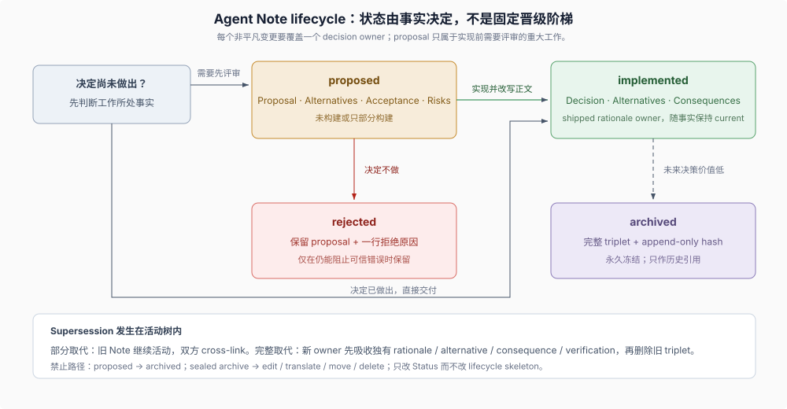

# Advanced 01 · Agent Note lifecycle（生命周期）

## 一句话

Agent Note 保存代码和当前文档无法承载的 rationale（决定理由）与 alternatives（放弃的备选方案）。每个非平凡变更都要新增或更新一个 owning Note，但 Note 不必从 `proposed/` 开始，也不会在实现后自动进入 archive（归档）。

> Every non-trivial change MUST add or update at least one Agent Note in the same PR. [...] A proposal for substantial future work starts in `proposed/`; a decision already made starts in `implemented/`.
>
> — DSH [`.agents/notes/README.md` 的 “When to write one”](https://github.com/deepseek-ai/deepseek-harness/blob/46a7f68b0922371ce7144b668b90e377d8e799f4/.agents/notes/README.md#when-to-write-one)。这段原文同时建立“非平凡变更必须有 owner”和“implemented 不必经过 proposed”两个条件。

## 1. 先决定从哪里开始

| 当前事实 | 动作 |
|---|---|
| 重大工作尚未构建，决定需要先评审 | 在 `proposed/<class>/` 新建 Note |
| 决定已经做出并随当前变更交付 | 直接在 `implemented/<class>/` 新建 Note |
| 现有 Note 已拥有同一个决定 | 更新 owner，不创建重复 Note |
| 新决定只部分取代旧决定 | 保留双方并交叉链接，更新仍然有效的事实 |
| 新决定完整取代旧决定 | 新 owner 吸收所有独有 rationale、alternative、consequence、verification 和 coverage gap 后，旧 implemented Note 才可删除 |

“每个非平凡变更必须有 Note”约束的是**决定覆盖**，不是要求每次先写 proposal。

## 2. 路径同时编码状态和类别

活动树使用 `{lifecycle}/{class}/yyyy-mm-dd-topic-title.md`：

- `lifecycle` 是 `proposed/`、`implemented/` 或 `rejected/`；低未来价值的 implemented triplet 另行移动到冻结的 `archived/` 树；
- `class` 是 `feature`、`bug-fix`、`simplification`、`architecture`、`process` 或 `testing`；
- 日期是主题首次提出的日期，不是实现或归档日期。

分类是 `scripts/agent-note-tree.ts` 中的封闭集合，门禁拒绝未知目录。`refactor` 不在集合中；不增加能力的删除或收缩归 `simplification`。

## 3. 四个状态服务不同读者任务

| 状态 | 内容 | 读者怎样使用 |
|---|---|---|
| `proposed/` | 未完成或仅部分完成的重大未来工作 | 评审问题、方案、验收和风险，不能当成已交付功能 |
| `implemented/` | 已交付决定及其替代方案和后果 | 作为当前 rationale owner，并随路径、名称、默认值和机制保持 current |
| `rejected/` | 被否决的提案及一行拒绝原因 | 仅在仍能阻止一个可信错误时保留 |
| `archived/` | 未来决策价值低的 implemented 历史快照 | 只作历史引用，永久冻结，不是当前权威 |

`proposed → rejected` 冻结提案；`proposed → implemented` 必须改写成已交付事实；`implemented → archived` 只在未来决策价值低时发生。Proposed Note 永不归档，过时提案应转 rejected；rejected Note 失去防错价值后删除完整 triplet。

## 4. 文件格式让状态转换可检查

`pnpm run verify-agent-note-format` 是 `doc-sync` 的一部分，强制：

- 前三行是 `# Agent Note: <title>`、空行、`Status: <status>`，且 status 与目录一致；
- body 以 `## Problem` 开头；
- proposed 使用 `## Proposal / ## Alternatives considered / ## Acceptance criteria / ## Risks`；
- implemented 使用 `## Decision / ## Alternatives considered / ## Consequences`，拒绝 proposal-era 的 `Proposal / Plan / Migration plan / Acceptance criteria` 标题；
- rejected 保留提案体，拒绝结论写在 `Status:` 行；
- 每个活动 Note 都有 `## Alternatives considered`，只有规则生效前且无法重建 alternatives 的 Note 可使用固定 grandfather 注释。

格式门禁只证明结构满足规则，不证明决定正确、替代方案真实或 shipped facts 与代码一致；这些仍需语义 review。

## 5. `proposed → implemented` 是正文改写

移动和改写必须在同一变更完成：

- `Proposal` 改成现在式 `Decision`；
- acceptance 与 risks 中仍有维护价值的事实进入 `Consequences` 或现在式 `Testing / Verification`；
- 删除迁移计划和未来时态，记录实际交付内容；
- 同一 diff 更新源码、当前文档和行为证据。

只修改路径和 `Status:` 会让未来计划伪装成当前事实，因此格式 gate 和 code review 都检查这次改写。

## 6. supersession 与 archive 是两种不同收敛

Supersession 判断“哪个活动 Note 继续拥有决定”；archive 判断“一个已完成决定是否仍值得留在活动语料”。新建 Note 时要主动搜索相同决定、机制和被拒替代方案：完整取代才允许合并 owner，部分取代保持双方活动并交叉链接。

Archive 只移动完整 `.md`、`.zh.md`、`.i18n.yaml` triplet，在两种语言的 status 下插入相同 `Archived: YYYY-MM-DD`，重录 sidecar，并修复活动 prose 的入站链接。`verify-archived-agent-notes` 把归档内容写入 append-only hash manifest；封存后不得编辑、翻译、移动或删除。

`dsh-archive-agent-notes` 在这里拥有具体的保留、归档与删除判断；Skill 为什么适合承载这类情境化流程、又为什么不能替代格式 gate，见 [Development Harness 的 Skills 章节](../development-harness/03-skills-as-procedural-memory.md)。

## 证据入口

- DSH [`.agents/notes/README.md`](https://github.com/deepseek-ai/deepseek-harness/blob/46a7f68b0922371ce7144b668b90e377d8e799f4/.agents/notes/README.md)：生命周期、分类、统一正文结构、完整取代与归档条件。
- DSH [implemented Note 子树规则](https://github.com/deepseek-ai/deepseek-harness/blob/46a7f68b0922371ce7144b668b90e377d8e799f4/.agents/notes/implemented/AGENTS.md)：implemented Note 如何随已交付路径、名称和机制保持当前。
- DSH [archived Note 子树规则](https://github.com/deepseek-ai/deepseek-harness/blob/46a7f68b0922371ce7144b668b90e377d8e799f4/.agents/notes/archived/AGENTS.md)：归档 triplet 的冻结与 seal 约束。
- DSH [`dsh-archive-agent-notes` skill](https://github.com/deepseek-ai/deepseek-harness/blob/46a7f68b0922371ce7144b668b90e377d8e799f4/.agents/skills/dsh-archive-agent-notes/SKILL.md)：何时保留、归档或删除 Note 的判定流程。
- DSH [统一格式 Agent Note](https://github.com/deepseek-ai/deepseek-harness/blob/46a7f68b0922371ce7144b668b90e377d8e799f4/.agents/notes/implemented/process/2026-07-05-uniform-agent-note-format.md)：为什么三种活动 lifecycle 使用一套可检查格式。
