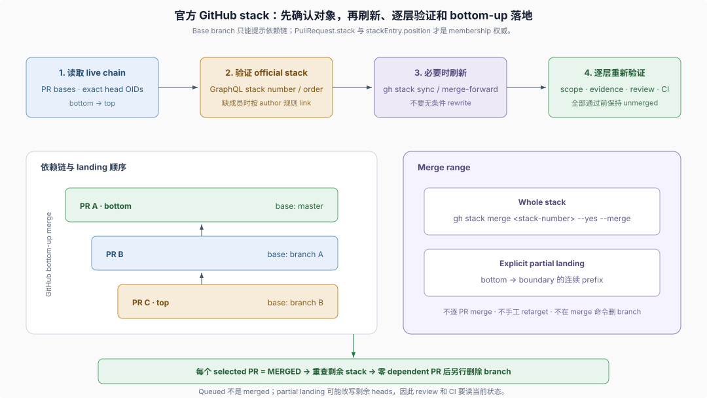

# Advanced 07 · Branch rewrite 与 Stacked Pull Requests

## 一句话

普通 push 在发布前完成相关证据；branch rewrite（分支历史改写）只用 exact `--force-with-lease` 或 GitHub stack 自带的 lease protection（租约保护）；同仓库依赖 PR 链必须先成为官方 Stacked Pull Requests（依赖式 PR 栈），再由 `gh stack merge` 按依赖顺序落地。

> Land dependent PRs through GitHub's native stack object and `gh stack merge`. Do not reproduce stack semantics by merging and retargeting individual PRs with `gh pr merge` and `gh pr edit`.
>
> — DSH [`dsh-merging-stacked-prs` skill 的开篇](https://github.com/deepseek-ai/deepseek-harness/blob/dd6322d604e00eec1ba5e0c8541159906a21094a/.agents/skills/dsh-merging-stacked-prs/SKILL.md)。这条规则确定官方 stack object 才拥有依赖顺序、retarget 和 merge 状态。

本页展开两个交付 Skills 的精确操作；它们为什么以 Skill 而不是 standing rule 或 gate 承载，见 [Development Harness 的 Skills 章节](../development-harness/03-skills-as-procedural-memory.md)。



## 1. 普通 push 的闭环

1. 验证 live base，解析 outgoing scope，运行尚未通过且覆盖该 diff 的相关证据。
2. 正常 commit；pre-commit fixer 若改了 staged files，检查实际结果。
3. 正常 push，让 pre-push incremental typecheck 运行。
4. Fetch 并确认 remote branch ref 与 local `HEAD` 一致。
5. 有 PR 时读取 `gh pr checks`；pending 仍是 pending，failure 先诊断。

若 GitHub 没有创建 workflow run，先读 mergeability。`CONFLICTING/DIRTY` 的 PR 不产生 `pull_request` workflow run；空 commit、draft/ready toggle 或 revert-and-restore 不能修复这个状态。

## 2. Standalone branch 的历史改写

Rebase 在 review 后仍允许，但会使旧 commit OID、inline comment anchor、approval 和 check assumptions 失效。改写前 fetch remote branch 并记录 exact OID，发布时使用：

```sh
git push --force-with-lease=<branch>:<observed-oid>
```

Remote head 已前进就让 push 失败，重新读取状态；raw `--force` 永不允许。改写后重新 fetch heads，并审计 unresolved review threads、approvals、mergeability 与 checks。

## 3. 先确认依赖链是官方 stack

同仓库 A ← B ← C 的依赖 PR 不能靠逐个 `gh pr merge` 和手工 retarget 模拟 stack。Landing 前：

- `gh stack --version` 必须可用；cross-fork chain 直接停止；
- 从 live PR bases 建立 bottom-to-top 顺序：底层指向 trunk，每个上层指向正下方 head branch；
- GraphQL 的 `PullRequest.stack` 与 `stackEntry.position` 是 membership 权威，不能只看 base branch；
- 一个已有 stack 若含冲突顺序、意外 entry 或出现多个 stack number，变更 GitHub 状态前请求用户决定；
- 缺失成员且作者完全一致时，可按 bottom-to-top 用 `gh stack link` 自动加入；作者不同或未知时先问用户。

不自动 dissolve、reorder 或 rebuild 现有 stack。

## 4. 只在需要时刷新

Live merge state 或 repository rules 要求更新 trunk 时，二选一：

- **Native cascading rebase**：`gh stack sync` 可能改写并推送每层；冲突进入 `gh stack rebase`，解决、验证后用 `gh stack push` 发布；
- **Incremental merge-forward**：先把 trunk merge 到最底受影响层，再 bottom-to-top 把更新后的 parent merge 进 child；base 在进行中前进时先保留 checkpoint，再合入新 tip。

不要因为存在 refresh 命令就无条件改写 branch。`gh stack sync` 的 publication-before-validation 例外要求 sync 前 clean worktree、记录 official order 与 exact heads；返回后重查 stack，逐层重算 scope 并验证。全部通过前不得 merge 或声称 ready。

## 5. 通过 stack API 落地

Merge 前重新查询 official stack，要求 selected PR 各自 open、non-draft、顺序正确，并满足自己的 review/check requirements。Ready top layer 不能证明 dependencies ready。

“Land the stack”默认选择整个 stack：

```sh
gh stack merge <stack-number> --yes --merge
```

部分落地必须由用户明确 boundary PR，并包含 bottom 到 boundary 的连续 prefix：

```sh
gh stack merge <boundary-pr> --yes --merge
```

不传 `--delete-branch`，不手工 retarget dependents，不逐 PR merge。Native API 按 bottom-up 处理选择范围，并负责剩余上层的 retarget/rebase；merge queue 可能分组落地，但 queued 不等于 merged。

## 6. 落地后验证再清理

等待每个 selected PR 报告 `MERGED`。Partial landing 后重新查询 official stack，确认剩余 PR 保持预期顺序和 base，并重新检查 GitHub 可能改写后的 heads、review 与 CI。

Branch deletion 是独立最后一步：对应 PR 已 `MERGED`，且 `gh pr list --state open --base <branch>` 返回零个依赖 PR，才能删除。

## 证据入口

- DSH [`dsh-pre-push-checks` skill](https://github.com/deepseek-ai/deepseek-harness/blob/dd6322d604e00eec1ba5e0c8541159906a21094a/.agents/skills/dsh-pre-push-checks/SKILL.md)：普通 push、history rewrite 和 `gh stack sync` 后的证据顺序。
- DSH [`dsh-merging-stacked-prs` skill](https://github.com/deepseek-ai/deepseek-harness/blob/dd6322d604e00eec1ba5e0c8541159906a21094a/.agents/skills/dsh-merging-stacked-prs/SKILL.md)：官方 membership、link、sync、merge 与落地后验证流程。
- DSH [stack review guide](https://github.com/deepseek-ai/deepseek-harness/blob/dd6322d604e00eec1ba5e0c8541159906a21094a/docs/cookbook/responding-to-pr-review-on-a-stack.md)：review 修复怎样沿依赖层传播。
- DSH [根 `AGENTS.md`](https://github.com/deepseek-ai/deepseek-harness/blob/dd6322d604e00eec1ba5e0c8541159906a21094a/AGENTS.md)：允许的 merge-forward、rebase、lease 与 history 规则。
- DSH [Native stacks Agent Note](https://github.com/deepseek-ai/deepseek-harness/blob/dd6322d604e00eec1ba5e0c8541159906a21094a/.agents/notes/implemented/process/2026-08-02-native-github-stacks-and-optional-rebases.md)：为什么同仓依赖链必须交给 GitHub 官方 stack。
- DSH [Incremental retargeting Agent Note](https://github.com/deepseek-ai/deepseek-harness/blob/dd6322d604e00eec1ba5e0c8541159906a21094a/.agents/notes/implemented/process/2026-07-26-incremental-pr-base-retargeting.md)：merge-forward 时怎样保留中间 checkpoint 并逐层推进。
