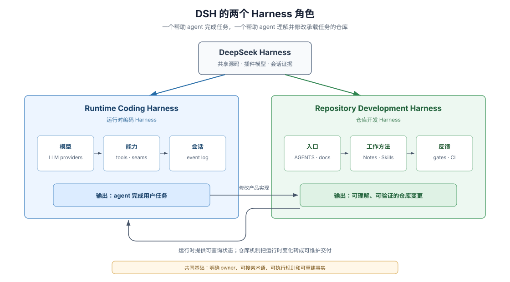

# Development Harness · DSH 如何帮助 agent 修改 DSH

## 两种 Harness

DeepSeek Harness（DSH）首先是一个 coding harness（编码代理运行框架）：它把模型、工具、会话和交互组合成可运行的 agent。这个专题关心它的另一面：DSH 也把自己的仓库组织成 development harness（开发 Harness），让不熟悉项目的 coding agent 能找到规则、定位修改位置、选择工作方法、验证结果，并把决定留给后续参与者。

这不是说仓库能够自动完成开发，也不是说 agent 不再需要判断。更准确的说法是：DSH 把尽可能多的参与知识从个人经验移入可搜索文件、类型、检查命令和运行时状态，让剩余判断有明确输入和反馈。

> This codebase is developed primarily by coding agents. Agents follow enforced gates far more reliably than prose conventions [...].
>
> — DSH [`Mechanical quality gates over prose guidelines` Agent Note](https://github.com/deepseek-ai/deepseek-harness/blob/dd6322d604e00eec1ba5e0c8541159906a21094a/.agents/notes/implemented/process/2026-06-11-quality-gates.md)。这段原文说明 DSH 为什么把可机械判断的规则落实为检查，而不只依赖文字约定。

## Development Harness 解决什么问题

一个 fresh coding agent（初次进入这个项目的编码代理）进入大型仓库时，通常缺少五类信息：必须遵守什么、系统由什么组成、改动应该落在哪里、当前任务应采用什么工作流程，以及怎样知道自己真的做对了。

DSH 分别给出可查入口：

| 问题 | DSH 中的主要回答 |
|---|---|
| 必须遵守什么 | 根级与子目录 `AGENTS.md` |
| 系统由什么组成 | architecture、glossary、subsystem docs 和 generated catalogs |
| 为什么这样设计 | Agent Notes 及其 alternatives（替代方案） |
| 当前任务怎样做 | `.agents/skills/` 中的 development Skills |
| 怎样证明完成 | 类型、测试、snapshots、invariants、repository gates 和 GitHub CI |

这些文件并非越多越好。关键在于每类事实有 owner（拥有者），读者可以从短入口逐步进入详细来源，而不必先通读整个仓库。

## 阅读路径

本专题先走一遍具体任务，再拆解背后的机制：

| 章节 | 读完能回答 |
|---|---|
| [`01-follow-a-fresh-agent.md`](./01-follow-a-fresh-agent.md) | 一个新 agent 如何从任务进入 DSH 并完成闭环 |
| [`02-legibility-and-ownership.md`](./02-legibility-and-ownership.md) | 规则、当前事实、决策理由和负知识分别住在哪里 |
| [`03-skills-as-procedural-memory.md`](./03-skills-as-procedural-memory.md) | Skills 为什么不是普通文档，也不是自动门禁 |
| [`04-paved-road-and-participation.md`](./04-paved-road-and-participation.md) | 插件结构怎样给不同半径的修改提供明确入口 |
| [`05-executable-feedback.md`](./05-executable-feedback.md) | 类型、测试、invariant、CI 与 review 怎样逐层发现错误 |
| [`06-runtime-inspection.md`](./06-runtime-inspection.md) | agent 怎样查询实际配置和活运行时，而不是只猜源码 |
| [`07-boundaries-and-costs.md`](./07-boundaries-and-costs.md) | 哪些原则可以迁移，哪些 DSH 成本不能忽略 |

第一次阅读建议按顺序进行。只想理解复杂 PR 怎样经过 GitHub 时，应进入 [Advanced SDD Flow](../advanced-sdd-flow/00-index.md)；那里讲流程的精确条件，这里讲仓库为什么能让 agent 参与这些流程。

## 核心术语

| English | 中文理解 | 本专题中的含义 |
|---|---|---|
| development harness | 开发 Harness | 帮助参与者理解、修改和验证一个代码库的仓库级机制 |
| legibility | 可读性 | 新参与者建立正确心智模型并找到事实 owner 的难度 |
| knowledge externalization | 知识外置 | 把个人经验变成可搜索、可检查或可执行的仓库知识 |
| procedural memory | 程序化工作记忆 | 面向特定任务、带适用条件和验证步骤的工作方法 |
| paved road | 正确路径 | 仓库为常见修改提供的首选入口、范本和反馈组合 |
| inspectability | 可检查性 | 查询实际配置、注册项和运行状态的能力 |

英文词保留下来，是因为它们能够直接对应 DSH 文件、类型和命令；中文解释负责先建立含义。

## 怎样阅读证据

正文先讲清结论，再摘录 DSH 原文作为引子。页面末尾的“证据入口”会标明具体 DSH 文件及它能证明的事实。所有外部链接都固定到 DSH commit `dd6322d604e00eec1ba5e0c8541159906a21094a`；本文归纳出的解释不会伪装成 DSH 的正式自述。

## 证据入口

- DSH [`docs/architecture.md`](https://github.com/deepseek-ai/deepseek-harness/blob/dd6322d604e00eec1ba5e0c8541159906a21094a/docs/architecture.md)：产品插件树、事件扩展点、会话日志和新行为归属表。
- DSH [`docs/AGENTS.md`](https://github.com/deepseek-ai/deepseek-harness/blob/dd6322d604e00eec1ba5e0c8541159906a21094a/docs/AGENTS.md)：不同文档层级、Skills 与 Agent Notes 的职责分工。
- DSH [`quality-gates Agent Note`](https://github.com/deepseek-ai/deepseek-harness/blob/dd6322d604e00eec1ba5e0c8541159906a21094a/.agents/notes/implemented/process/2026-06-11-quality-gates.md)：coding-agent 生产方式与机械检查选择之间的一手因果说明。
