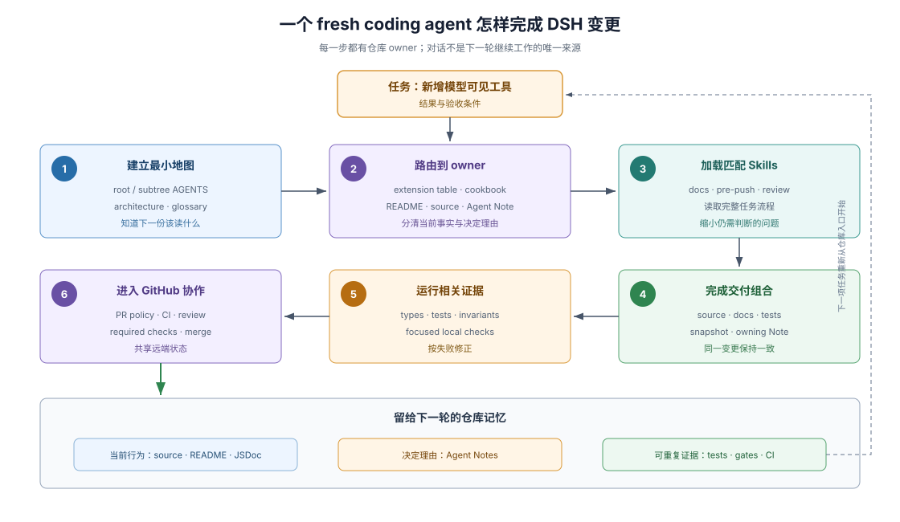

# 01 · 跟着一个 fresh coding agent（新编码代理）进入 DSH

## 场景

假设一个从未参与 DSH 的 coding agent 收到任务：“新增一个会出现在模型请求中的工具，并让 Web 界面正确展示它。”这个场景不是某个历史 PR 的复述，而是用 DSH 固定基线的规则串起一次典型参与过程。

目标不是记住所有命令，而是看清一个新参与者如何连续回答六个问题：先读什么、代码放哪、为什么这样放、采用哪项工作流程、什么算完成，以及结果怎样进入主分支。

## 1. 先建立最小地图

agent 从根级 `AGENTS.md` 得到常驻规则和仓库布局；任务涉及 `packages/`，所以继续读 `docs/architecture.md` 和 `packages/AGENTS.md`。它不需要先遍历全部包，因为 architecture 的“Where new behavior goes”已经把目标映射到扩展机制。

> New behavior attaches to a documented extension point. Changing the loop itself updates this map.
>
> — DSH [`docs/architecture.md` 的行为归属表](https://github.com/deepseek-ai/deepseek-harness/blob/46a7f68b0922371ce7144b668b90e377d8e799f4/docs/architecture.md#where-new-behavior-goes)。原文说明新增行为先寻找已有扩展点；修改 `agent-loop` 是需要额外说明的例外。

表中“Add a model-facing capability”指向 `ctx.tools`。因此 agent 的第一项设计判断不是“在哪个 loop 函数里插代码”，而是“这个功能是否属于工具注册”。如果需求其实是一项可替换能力，它还需要检查 Service Definition、Provider、Consumer 三个角色，而不能把一个工具包误称为完整 capability seam（能力接缝）。

## 2. 找到当前事实和决定 owner

agent 接着读取 adding-a-tool cookbook（添加工具操作指南）、工具包 README、相关 JSDoc 和相邻生产实现。它们回答当前接口、配置、错误和展示责任。若任务改变了已有设计决定，agent 再查拥有该决定的 Agent Note；Note 回答“为什么”和“放弃了什么”，不替代当前源码和 README。

这一步把资料分成三类：

| 资料 | 当前任务从中取得什么 |
|---|---|
| architecture / cookbook | 行为应该落在哪个机制、按什么入口实施 |
| package README / JSDoc / source | 当前调用方式、失败行为和所有权 |
| Agent Note | 决策理由、替代方案和不可随意恢复的旧路径 |

这种分工的意义是：agent 不从一个过时的设计故事猜当前 API，也不从当前代码反推已经丢失的设计理由。

## 3. 为具体任务加载 Skills

根级规则只适合放每轮都需要的 standing orders（常驻指令）。当任务进入文档结构、push 前检查或 PR review 等具体场景时，agent 加载对应 development Skill：例如 `dsh-doc`、`dsh-pre-push-checks` 和 `dsh-code-review`。

Skill 不替 agent 决定产品需求，也不自动证明实现正确。它把该任务的输入、检查顺序、例外和输出格式集中起来，让 agent 不必从多份规则重新拼装流程。Skills 的完整分工见 [Skills 专章](./03-skills-as-procedural-memory.md)。

## 4. 完成一个交付组合

“工具能运行”只是实现的一部分。模型可见或产品用户可见的非平凡变化还要让当前接口与行为、行为证据和决策记录一起更新：

1. 源码和类型实现功能，并通过 `ctx.effect()` 或注册表 disposer 保持生命周期归属。
2. package README 和 JSDoc 说明参数、结果、失败、模型可见内容和展示意图。
3. unit tests 抓住局部行为与卸载；真实组合或 snapshot 证明装配后的模型或用户输出。
4. owning Agent Note 记录决定、替代方案和后果；非平凡变更不能只留下 PR 对话。

> Every non-trivial change includes at least one Agent Note in the same PR.
>
> — DSH [`docs/AGENTS.md`](https://github.com/deepseek-ai/deepseek-harness/blob/46a7f68b0922371ce7144b668b90e377d8e799f4/docs/AGENTS.md)。这条规则把设计记忆纳入同一个交付单元，而不是把它留在某一轮 agent 的上下文里。

## 5. 让错误尽早出现

实现过程中，TypeScript 先检查静态接口，配置加载检查可解析的误配置，unit tests 检查局部行为，runtime invariant（运行时不变量检查）比较真实关系，focused local checks（聚焦本地检查）覆盖待推送差异。每一层只证明自己观察到的性质。

agent 不应因为一个检查为绿就跳过其它层：coverage 只能说明代码执行过，snapshot 才能固定组装后的外部输出，semantic review（语义评审）仍要判断实现是否符合需求和设计 owner。证据分层见 [可执行反馈](./05-executable-feedback.md)。

## 6. 把结果交给 GitHub 协作

Push 和 Pull Request（PR）把本地交付组合放进 GitHub Flow。`.github/` 中的 workflow 决定远端触发、权限、runner 和检查聚合；repository scripts 拥有实际检查逻辑；reviewer 检查自动化不能判断的意图、生命周期、安全与表述。

这部分的精确 policy 和失败状态由 [Advanced SDD Flow](../advanced-sdd-flow/00-index.md) 拥有。Development Harness 只强调一件事：远端反馈不是仓库知识之外的附加步骤，它是同一套规则的另一个执行环境。

## 任务完成后留下了什么

任务结束后，后续 agent 不需要读取本次任务的对话。它可以从当前源码和 README 得到行为，从 Agent Note 得到理由，从测试和 snapshots 得到可重复证据，从 Skills 得到任务流程，从 PR 与 CI 得到远端状态。这就是 development harness 的可观察结果：参与知识留在仓库和协作系统中，而不是只留在参与者记忆里。

## 证据入口

- DSH [`docs/architecture.md`](https://github.com/deepseek-ai/deepseek-harness/blob/46a7f68b0922371ce7144b668b90e377d8e799f4/docs/architecture.md)：工具注册、seam、session event 与 loop 修改的归属入口。
- DSH [`adding-a-tool cookbook`](https://github.com/deepseek-ai/deepseek-harness/blob/46a7f68b0922371ce7144b668b90e377d8e799f4/docs/cookbook/adding-a-tool.md)：新增模型工具的真实实施入口和验证义务。
- DSH [`Agent Note rules`](https://github.com/deepseek-ai/deepseek-harness/blob/46a7f68b0922371ce7144b668b90e377d8e799f4/.agents/notes/README.md)：决策记录的职责、生命周期与格式。
- DSH [`dsh-pre-push-checks`](https://github.com/deepseek-ai/deepseek-harness/blob/46a7f68b0922371ce7144b668b90e377d8e799f4/.agents/skills/dsh-pre-push-checks/SKILL.md)：怎样从 outgoing diff 选择相关本地证据，并把穷举矩阵留给 CI。
- DSH [`dsh-code-review`](https://github.com/deepseek-ai/deepseek-harness/blob/46a7f68b0922371ce7144b668b90e377d8e799f4/.agents/skills/dsh-code-review/SKILL.md)：review 需要覆盖的语义、生命周期、安全和真实入口问题。
