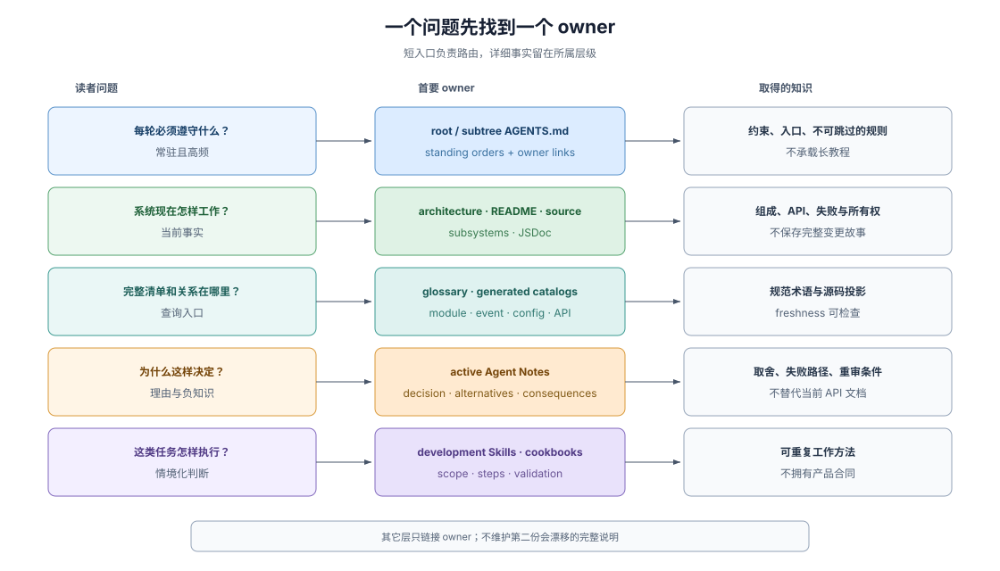

# 02 · 可读性与知识归属

## 可读不等于文件少

Legibility（可读性）不是把大型仓库压缩成一篇总览，也不是要求 agent 记住所有包。对 coding agent 更实用的定义是：遇到一个问题时，它能以有限上下文找到正确 owner，区分当前事实与设计理由，并知道下一层应该读什么。

DSH 通过分层减少两种错误：一是同一规则在多个地方各写一版，二是所有细节都进入根级指令，使真正重要的规则被淹没。

> Each fact has one home: the tier whose job it is; elsewhere, link there.
>
> — DSH [`docs/AGENTS.md` 的文档层级规则](https://github.com/deepseek-ai/deepseek-harness/blob/46a7f68b0922371ce7144b668b90e377d8e799f4/docs/AGENTS.md#the-tier-taxonomy-one-home-per-fact)。这段原文建立了“一个事实一个 owner”的组织原则。

## 五类问题，五类 owner

| 读者的问题 | 首要 owner | 不应从这里取得什么 |
|---|---|---|
| 每轮必须遵守什么 | 根级或子目录 `AGENTS.md` | 详细教程、历史故事 |
| 系统当前怎样组成 | architecture、subsystem docs、package README、源码 | 设计取舍的完整理由 |
| 术语与代码位置是什么 | glossary、生成目录、module/event/capability catalogs | 手工维护的第二份清单 |
| 为什么选择这一方案 | active Agent Note | 当前 API 的唯一说明 |
| 某类任务怎样执行 | `.agents/skills/` 与 cookbook | 产品运行时 API 与行为 |

这张表不是要求读者依次通读五层，而是给每个问题一个首选入口。一个 Agent Note 可以链接当前源码，architecture 可以链接 subsystem reference，但它们不复制对方拥有的详细事实。

## 当前事实与决策理由必须分开

源码、类型、README 和当前文档回答“系统现在做什么”。Agent Note 回答“为什么这样决定、什么替代方案输了、这个决定带来什么后果”。两者混在一起会产生相反风险：只读代码会重走已否定路径，只读 Note 会把历史实现细节误当成当前 API。

Agent Note 还有 lifecycle（生命周期）：`proposed` 是待评审方案，`implemented` 描述已经落地的决定，`rejected` 只在仍能阻止一个合理错误时保留，`archived` 是冻结历史而非当前权威。精确状态转换由 [Agent Note 高级参考](../advanced-sdd-flow/01-agent-note-lifecycle.md) 说明。

## 负知识也需要 owner

Negative knowledge（负知识）包括“为什么不采用某条路”“这里为什么没有 runtime invariant”“这个能力有哪些已知限制”。如果这些信息只存在于 review 对话，fresh agent 很容易重复提出同一方案，或者把明确的缺席当作遗漏。

DSH 使用 rejected Agent Notes、README 的 Known Limitations、README 中“为什么不发布 `./invariant`”的理由，以及冻结 archive 保存不同类型的负知识。它们的共同作用不是证明永远不能改变，而是让改变从已知理由开始。

## 生成目录降低查询成本

工具、配置、持久事件、模块关系、capability seam 和 Cordis API 等清单由源码生成并检查 freshness（新鲜度）。生成目录的角色是 index（索引）：agent 可以按名称查询完整集合，而不必相信一张人工维护、可能已经漂移的表。

生成不等于语义正确。它能证明目录与被扫描源码一致，不能证明接口设计合理、JSDoc 准确或测试抓住了真实回归；这些仍由 owner prose、测试和 review 负责。

## 渐进读取保护上下文

根级 `AGENTS.md` 只保留每轮需要的 standing orders，并链接详细 owner；architecture 提供有序地图；catalog 支持查询；Skill 在任务匹配时才加载完整工作流。Progressive disclosure（渐进披露）让 agent 先取得方向，再为当前问题支付细节成本。

可读性因此不是“把一切写进上下文”，而是“让读者知道下一份最小且权威的材料在哪里”。

## 证据入口

- DSH [`docs/AGENTS.md`](https://github.com/deepseek-ai/deepseek-harness/blob/46a7f68b0922371ce7144b668b90e377d8e799f4/docs/AGENTS.md)：文档层级、一个事实一个 owner、tutorial/reference 分工和 Skills 的位置。
- DSH [`docs/glossary.md`](https://github.com/deepseek-ai/deepseek-harness/blob/46a7f68b0922371ce7144b668b90e377d8e799f4/docs/glossary.md)：一个概念使用一个 canonical term（规范术语）的规则。
- DSH [`Agent Note rules`](https://github.com/deepseek-ai/deepseek-harness/blob/46a7f68b0922371ce7144b668b90e377d8e799f4/.agents/notes/README.md)：决策理由、替代方案、生命周期和 archive 的 owner。
- DSH [`docs/module-graph.md`](https://github.com/deepseek-ai/deepseek-harness/blob/46a7f68b0922371ce7144b668b90e377d8e799f4/docs/module-graph.md)：从源码生成的仓库关系索引实例。
- DSH [`docs/event-producer-consumer.md`](https://github.com/deepseek-ai/deepseek-harness/blob/46a7f68b0922371ce7144b668b90e377d8e799f4/docs/event-producer-consumer.md)：事件 producer、consumer 和 dispatch mode 的生成索引实例。
- DSH [`docs/capability-seams.md`](https://github.com/deepseek-ai/deepseek-harness/blob/46a7f68b0922371ce7144b668b90e377d8e799f4/docs/capability-seams.md)：Service Definition、providers 与 consumers 的生成关系索引。
- DSH [`docs/persistence-catalog.md`](https://github.com/deepseek-ai/deepseek-harness/blob/46a7f68b0922371ce7144b668b90e377d8e799f4/docs/persistence-catalog.md)：可写入 session log 的事件及其声明位置的生成索引。
