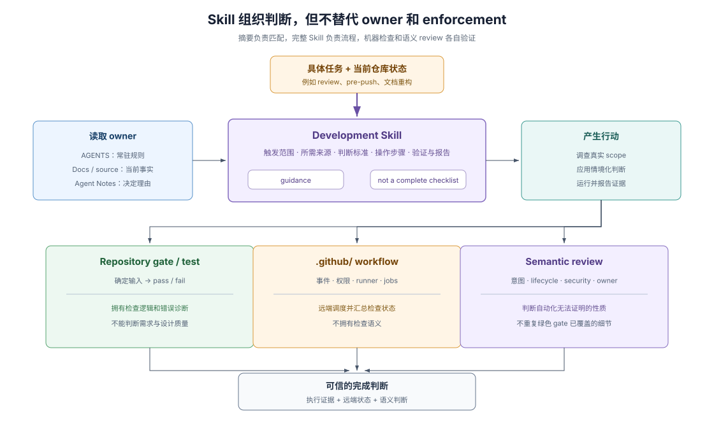

# 03 · Skills：把判断过程变成可调用知识

## 规则与检查之间还缺一层

`AGENTS.md` 适合保存每轮都需要的规则，repository gate（仓库检查）适合对确定条件给出通过或失败。但许多开发任务不能只靠一句规则或一个布尔结果完成，例如：怎样选择最小可信的 push 前证据、怎样审查 lifecycle race（生命周期竞态）、怎样判断 Agent Note 应保留还是归档。

这些任务需要读取上下文、应用判断标准、执行若干步骤并报告结果。DSH 把这类知识放进 development Skill（开发 Skill）。

> Skills (`.agents/skills/`) | Reusable workflows and specialized decision standards
>
> — DSH [`docs/AGENTS.md` 的层级表](https://github.com/deepseek-ai/deepseek-harness/blob/dd6322d604e00eec1ba5e0c8541159906a21094a/docs/AGENTS.md#the-tier-taxonomy-one-home-per-fact)。这一定义把 Skill 定位为可复用工作流和专门判断标准，而不是产品 API 或运行时行为的 owner。

## 先分清两种 Skill

DSH 仓库同时出现两类同名概念，读者必须先区分：

| 名称 | 位置 | 服务对象 | 作用 |
|---|---|---|---|
| repository development Skills | `.agents/skills/` | 修改 DSH 的 coding agent | 提供任务触发条件、判断标准、操作流程和验证要求 |
| runtime Skill capability | `packages/skill/` | 运行在 DSH 中的产品 agent | 发现、选择并加载项目、用户或 provider 提供的 Skill 内容 |

二者都使用“按需加载任务知识”的思想，但不是同一套执行机制。前者属于仓库开发环境；后者是 DSH 产品本身的 Service Definition、filesystem provider 和 model-facing consumer。不能用产品包 README 替代仓库开发 Skill，也不能把 `.agents/skills/` 当成 `ctx.skills` 的完整运行时 API 与行为说明。

## DSH 的 development Skills 覆盖哪些判断

固定基线中的仓库 Skills 可以按任务分成三组：

| 任务组 | Skills |
|---|---|
| 决策语料与简化 | `dsh-archive-agent-notes`、`dsh-find-simplifications` |
| 文档、表达与发布 | `dsh-doc`、`dsh-prose-standard`、`dsh-trim-cot-leakage`、`dsh-translate-docs`、`dsh-doc-site-sync` |
| 交付、评审与可见证据 | `dsh-pre-push-checks`、`dsh-code-review`、`dsh-merging-stacked-prs`、`record-browser-gif` |

这不是要求 agent 每轮加载全部 Skill。每个 `SKILL.md` 的 frontmatter（文件头元数据）用 `name` 和 `description` 说明适用任务；命中任务后才读取完整正文及其必要 references 或 scripts。不同 agent host 如何发现和触发仓库 Skill，可以不同；DSH 仓库拥有的是 Skill 内容及其适用范围。

## 一个 Skill 怎样参与任务

典型调用过程可以压缩为五步：

1. **Match（匹配）**：任务名称或语义符合 Skill description。
2. **Load（加载）**：在采取任务动作前读完整 `SKILL.md`，不能从摘要猜工作流。
3. **Resolve sources（解析来源）**：Skill 指向 standing rules、docs、Agent Notes 或脚本，agent 读取任务所需 owner。
4. **Apply judgment（应用判断）**：按实际 diff、风险和状态选择动作；Skill 可以明确排除范围和停止条件。
5. **Verify and report（验证并报告）**：运行适用检查，只报告真正执行过的证据和仍存在的边界。

这个过程把 procedural memory（程序化工作记忆）从某位资深参与者的习惯，变成可发现、可复用、可审查的仓库文件。

## Skill 不等于 gate

> This skill is guidance, not a complete checklist. [...] The report identifies paths and dirty layers but does not replace semantic review.
>
> — DSH [`dsh-code-review`](https://github.com/deepseek-ai/deepseek-harness/blob/dd6322d604e00eec1ba5e0c8541159906a21094a/.agents/skills/dsh-code-review/SKILL.md)。这段原文明确限制了 Skill 的强制力：它组织判断，但不把语义 review 降成机械清单。

| 载体 | 擅长回答 | 不能替代 |
|---|---|---|
| `AGENTS.md` | 每轮必须遵守什么 | 情境化长流程 |
| Skill | 面对某类任务怎样调查、判断和验证 | 确定性 pass/fail 与产品 API/行为 |
| repository script / gate | 一个可机械条件是否满足 | 意图和设计质量 |
| `.github/` workflow | 何时、以何权限、在哪个 runner 执行检查 | 检查逻辑本身和本地判断 |
| Agent Note | 为什么选择这一决定 | 具体执行步骤 |
| current docs / README | 系统现在怎样工作 | 决策历史和临时 review 流程 |

好的 Skill 会链接这些 owner，而不是复制它们。规则改变时更新规则 owner；脚本接口改变时更新脚本和调用 Skill；产品行为改变时更新源码与当前文档。

## Runtime Skill capability 为什么仍值得对照

DSH 产品的 `ctx.skills` 把 provider discovery（提供方发现）、scope（作用域）、invocation policy（调用策略）和 model-facing loading（模型侧加载）分开。`dsh-tool-skill` 先给模型名称与描述目录，只有选中后才加载正文；这把上下文成本控制在当前任务需要的范围内。

> This catalog contains summaries only; do not infer or follow a skill's instructions until it has been loaded.
>
> — DSH [`@deepseek-ai/dsh-tool-skill` README](https://github.com/deepseek-ai/deepseek-harness/blob/dd6322d604e00eec1ba5e0c8541159906a21094a/packages/skill/tool-skill/README.md)。这段产品侧提示与仓库开发 Skill 的组织目标相似：摘要负责发现，完整正文才拥有指令。

这种相似说明 DSH 在产品运行时和仓库开发中都重视按需知识，但不能据此声称两者共享同一 registry 或调用策略。

## Skills 的边界

Skill 仍是 prose（文字指令）：agent 可能误读、漏读或在不匹配的任务上调用。高风险规则若可机械判断，仍应下沉到类型、gate 或 runtime invariant；不能机械判断的部分由 Skill 缩小问题，再由 semantic review 复核。

因此 Skills 的价值不是“自动执行一切”，而是让复杂判断有稳定入口、明确来源、可重复过程和诚实的适用边界。

## 证据入口

- DSH [`.agents/skills/`](https://github.com/deepseek-ai/deepseek-harness/tree/dd6322d604e00eec1ba5e0c8541159906a21094a/.agents/skills)：固定基线中的仓库 development Skills 全集。
- DSH [`dsh-code-review`](https://github.com/deepseek-ai/deepseek-harness/blob/dd6322d604e00eec1ba5e0c8541159906a21094a/.agents/skills/dsh-code-review/SKILL.md)：Skill 作为 guidance、语义 review 输入和 finding 输出的具体实例。
- DSH [`dsh-pre-push-checks`](https://github.com/deepseek-ai/deepseek-harness/blob/dd6322d604e00eec1ba5e0c8541159906a21094a/.agents/skills/dsh-pre-push-checks/SKILL.md)：按 outgoing scope 选择证据而不是固定跑全套的实例。
- DSH [`@deepseek-ai/dsh-skill` README](https://github.com/deepseek-ai/deepseek-harness/blob/dd6322d604e00eec1ba5e0c8541159906a21094a/packages/skill/skill/README.md)：产品 runtime Skill registry 的 Service Definition 与 provider/consumer 边界。
- DSH [`@deepseek-ai/dsh-skill-filesystem` README](https://github.com/deepseek-ai/deepseek-harness/blob/dd6322d604e00eec1ba5e0c8541159906a21094a/packages/skill/skill-filesystem/README.md)：产品侧本地 Skill 根目录、格式和发现规则。
- DSH [`@deepseek-ai/dsh-tool-skill` README](https://github.com/deepseek-ai/deepseek-harness/blob/dd6322d604e00eec1ba5e0c8541159906a21094a/packages/skill/tool-skill/README.md)：产品侧 Skill catalog 与按需加载的 model-facing consumer。
