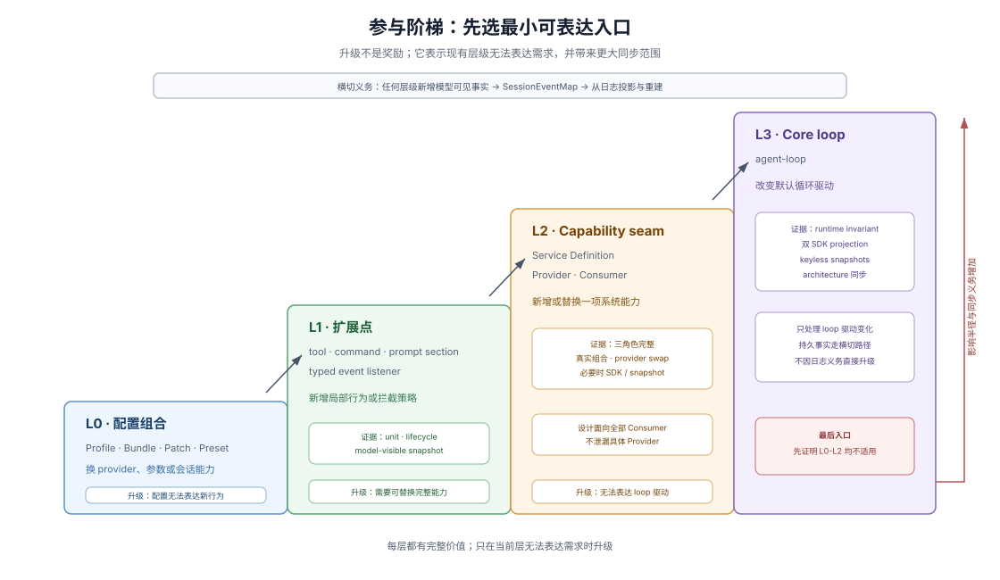

# 04 · 正确路径与参与阶梯

## 可读之后还要知道从哪里改

文档能让 agent 理解系统，却不能自动减少错误入口。Paved road（正确路径）指仓库为常见变化提供首选扩展点、生产范本、生命周期规则和对应证据；读者不必先创造一种接入方式，再等待 review 告诉它方向错了。

DSH 的正确路径建立在插件模型上。Model adapter（模型适配器）、tool registry（工具注册表）、session log（会话日志）和 agent loop（代理循环）都作为 Cordis Plugin（Cordis 插件）参与同一棵运行时树；新行为优先挂到现有 plugin（插件）、event（事件）或 capability service（能力服务），而不是修改一个不可替换的中央循环。

> There is no privileged core to patch: you extend dsh by mounting a plugin beside the others, and registrations are effects that unwind when their plugin unloads.
>
> — DSH [`docs/architecture.md`](https://github.com/deepseek-ai/deepseek-harness/blob/580646c14fb998532a6ef19bb4cc4009cd74b786/docs/architecture.md)。这段原文同时规定扩展位置和生命周期：贡献由插件拥有，插件卸载时注册效果撤销。

## 两张地图回答不同问题

DSH 的 runtime composition（运行时组成）和 durable history（持久历史）由不同机制回答：

| 问题 | 主要机制 | 对开发者的意义 |
|---|---|---|
| 当前系统由什么组成 | live plugin tree（活插件树） | 查询哪些 provider、tool、listener 和 scope 正在生效 |
| 会话已经发生什么 | append-only session event log（仅追加会话事件日志） | 从记录重建模型历史、UI、fork、telemetry 和 persistence |

Agent loop 位于两者之间：从当前插件树取得能力，把模型和工具执行产生的事实写入 session log。开发者不需要从一个大函数同时推断“现在装了什么”和“之前发生了什么”。

## 四级参与阶梯

不同改动半径有不同首选入口。下面的 participation ladder（参与阶梯）是本文根据 DSH architecture、cookbooks 和仓库规则归纳的学习模型，不是 DSH 的正式分级名称。

| 层级 | 首选入口 | 典型变化 | 何时升级 |
|---|---|---|---|
| L0 组合 | Profile、Bundle、Patch、Preset | 换 provider、改参数、改变某类会话能力 | 配置无法表达新行为 |
| L1 扩展点 | tool、command、prompt section、typed event listener | 新增模型工具、命令或拦截策略 | 变化是一项需要替换实现的完整能力 |
| L2 capability seam | Service Definition、Provider、Consumer | 新 filesystem、shell、LLM 或 sandbox backend | 现有扩展点和 seam 都不能表达 loop 驱动 |
| L3 core loop | `agent-loop` | 改变默认循环驱动 | 现有扩展点和 capability seam 都无法表达所需行为 |

阶梯不是价值排序。L0 的部署替换是完整系统能力，不是“较低级的代码”；L3 也不是更先进，只是影响范围最大、同步义务最多。

Session 持久化是横切义务，不是从 L0、L1 或 L2 升级到 L3 的判据。任何层级新增模型可见事实时，都要同时扩展 `SessionEventMap`，并从日志投影和重建该事实。

## 先用归属问题缩小选择

面对新行为，可以依次询问：

1. 它只是替换配置或组合吗？优先留在 L0。
2. 它能由现有 tool、command、prompt section 或 typed event listener 表达吗？优先留在 L1；观察或拦截 request、tool 或 turn 时选择相应 dispatch mode。
3. 它是一项需要可替换 Provider，并由 Consumer 通过稳定 Service Definition 使用的完整能力吗？设计完整 capability seam，进入 L2。
4. 无论选择哪一层，它是否新增模型可见、且必须在 reload、resume 或 fork 后重建的事实？若是，扩展 `SessionEventMap` 并从 log 投影。
5. 现有扩展点和 capability seam 都不能表达所需的循环驱动吗？此时才论证 L3 core loop 修改。

Architecture 的“Where new behavior goes”把常见目标列成可查询表；extension cookbook 再把 feature 映射到实施指南。这些入口把“改哪里”从仓库经验转成可核对的设计判断。

## 生命周期只有一套所有权

注册 tool、service、listener 或其它贡献时，`ctx.effect()`、`ctx.on()` 和 register disposer 把贡献归属于当前 Fiber。插件卸载、HMR 或显式 dispose 使用同一条清理路径。Agent 因此不需要在“正式注册”和“临时注册”之间选择两套生命周期协议。

这条规则并不保证任意外部副作用可逆：已经发送的网络消息、写入的文件或外部交易不会因为 disposer 自动补偿。Effect 负责撤销它拥有的注册和资源；业务补偿仍需所属能力明确设计。

## Seam 是完整能力，不是一个接口文件

DSH 把 capability seam 定义为 Service Definition、一个或多个 Service Providers、一个或多个 Consumers 三种角色。Definition 必须服务全部当前 Consumer，而不是为一个实现暴露方便方法；Consumer 依赖 Service Definition 暴露的能力接口，而不是具体 Provider。

这个分工让“换 provider”成为部署选择，但也增加设计和真实组合测试成本。只有当变化确实需要替换能力时才进入 L2，避免为局部工具制造多包结构。

## 正确路径怎样帮助 agent

Agent 在每层都能找到三种东西：明确入口、可复制的生产范本、与影响半径匹配的检查。错误路径不是完全不可能，但通常更早遇到类型、load failure、test、invariant 或 review 反馈；正确路径则沿着既有机制名称和 owner 前进。

## 证据入口

- DSH [`docs/architecture.md`](https://github.com/deepseek-ai/deepseek-harness/blob/580646c14fb998532a6ef19bb4cc4009cd74b786/docs/architecture.md)：plugin tree、session log、capability seam 和“Where new behavior goes”归属表。
- DSH [`docs/glossary.md`](https://github.com/deepseek-ai/deepseek-harness/blob/580646c14fb998532a6ef19bb4cc4009cd74b786/docs/glossary.md#capability-seam)：seam 三角色的规范定义。
- DSH [`docs/cordis-primer.md`](https://github.com/deepseek-ai/deepseek-harness/blob/580646c14fb998532a6ef19bb4cc4009cd74b786/docs/cordis-primer.md)：Context、Plugin、Fiber、Event 与 Effect 的运行时语义。
- DSH [`extension cookbook`](https://github.com/deepseek-ai/deepseek-harness/blob/580646c14fb998532a6ef19bb4cc4009cd74b786/docs/cookbook/extension-cookbook.md)：feature 到机制和操作指南的细化入口。
- DSH [`packages/AGENTS.md`](https://github.com/deepseek-ai/deepseek-harness/blob/580646c14fb998532a6ef19bb4cc4009cd74b786/packages/AGENTS.md)：包级能力角色、生命周期测试和 invariant 义务。
