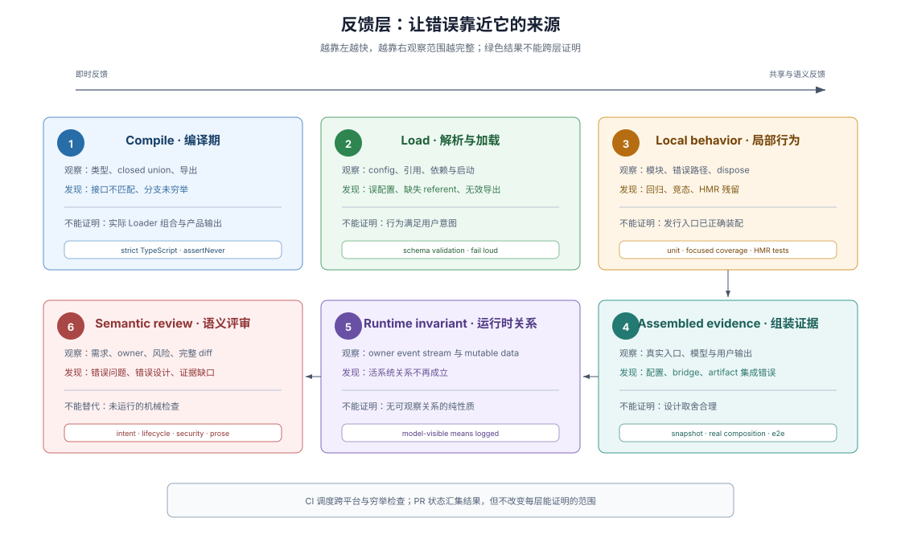

# 05 · 可执行反馈：错误在哪里被发现

## Development Harness 不只提供阅读材料

如果规则只能被阅读，agent 做错后仍要等 review 才知道。DSH 把可机械判断的规则接到类型、load validation（加载校验）、测试、runtime invariant（运行时不变量检查）和 repository gate（仓库检查），让错误在距离来源较近的位置出现；无法机械判断的语义仍交给 review。

> Every mechanically checkable AGENTS.md promise gets a command that exits non-zero. CI invokes the exhaustive set, while Git hooks reserve their latency budget for cheap local defects:
>
> — DSH [`Mechanical quality gates over prose guidelines` Agent Note](https://github.com/deepseek-ai/deepseek-harness/blob/46a7f68b0922371ce7144b668b90e377d8e799f4/.agents/notes/implemented/process/2026-06-11-quality-gates.md)。这段决定说明规则怎样从文字进入本地与 CI 的可执行路径。

## 六层反馈各自证明什么

| 反馈层 | 典型机制 | 能证明 | 不能单独证明 |
|---|---|---|---|
| 编译期 | strict TypeScript、closed union、declaration merging | 类型关系和穷举分支成立 | 运行时组合正确 |
| Load / parser | config schema、引用解析、fail loud | 输入在最早可解析点合法 | 行为满足用户意图 |
| 局部行为 | unit tests、focused coverage、HMR disposal tests | 所属模块的正例、错误和生命周期 | 已发行入口与完整产品输出 |
| 组装行为 | snapshots、real composition、built smokes、e2e | 真实入口产生预期外部结果 | 设计选择合理 |
| 运行时关系 | package invariant | 活系统中的 owner relationship 持续成立 | 没有可观察关系的纯函数性质 |
| 语义判断 | code review、用户验收 | 意图、架构、风险和证据是否对齐 | 每个机械细节都已执行 |

每层只拥有自己能够观察的性质。`test:coverage` 为绿不代表产品工作；snapshot 为绿不代表 API 设计合理；review 也不应手工重复已经由绿色 gate 精确拒绝的格式问题。

## Runtime invariant 检查关系，不检查存在性

一个有效 invariant（不变量检查）比较 package 拥有的权威事件流或可变数据关系。例如 model-visible means logged（模型可见内容必须被记录）由 agent-loop invariant 重建请求并和 session log 派生结果比较。

并非每个包都有有意义的运行时关系。DSH 在这种情况下不发布 `./invariant`，而是在 package README 记录原因；为了满足形式而留下空 installer，或断言 service 存在、plugin metadata、effect 和固定例子，都违反 `AGENTS.md` 的成文纪律（`docs/subsystems/invariants.md` 称其为 convention）；门禁 `verify-package-invariants` 拒的是空/忽略 reporter 与 publish/omit 不一致这类机械可判的形态。缺少检查和明确判定“这里没有可观察关系”是两种不同状态。

## 负例证明检查真的会失败

> A guard only guards if the regression fails it. [...] introduce the regression, watch red, revert.
>
> — DSH [`docs/testing.md`](https://github.com/deepseek-ai/deepseek-harness/blob/46a7f68b0922371ce7144b668b90e377d8e799f4/docs/testing.md#test-the-real-entry-path)。这段规则要求新检查经过 negative control（负例控制），避免一个永远为绿的脚本被误认为保护。

同一原则也要求 e2e “verify the world, not the self-report”：测试重新读取文件、运行命令或观察持久状态，而不相信 agent 声称自己完成了任务。

## 本地检查与 CI 按成本和范围分工

`dsh-pre-push-checks` 先解析 outgoing scope（待推送范围），再为受影响行为选择最小可信证据。Git hooks 保留低延迟检查；GitHub CI 执行穷举 coverage、平台矩阵和较重的真实入口检查。

这不是降低本地标准，而是把反馈按成本和适用范围分工：开发循环先得到相关红灯，远端再验证跨平台和仓库级完整性。精确选择方法见 [Evidence routing 参考](../sdlc-reference/04-gates-and-local-checks.md)。

## `.github/` 是远端反馈执行层

Repository scripts 拥有“检查什么”；`.github/workflows/` 拥有“在什么事件、权限、runner、并发和 job 依赖下运行”。PR status 汇集这些结果，branch protection 或 merge policy 再消费状态。

因此 `.github/` 属于 Development Harness，但不替代本地规则和源码检查。它把仓库已经拥有的证据放入共享协作状态。具体 Issue、PR 和 CI lifecycle 见 [GitHub automation 参考](../sdlc-reference/02-issue-pr-lifecycle.md)。

## Skill、gate 与 review 形成闭环

Skill 帮 agent 决定该查什么和跑什么；gate 对确定条件给出红绿结果；review 检查两者未覆盖的语义。三者不是成熟度不同的同一种工具，而是处理不同类型不确定性的机制。

一个可持续的反馈闭环要求错误信息指出失败对象、违反规则和修正入口。Agent 的下一次行动由实际失败驱动，而不是从无上下文的“检查失败”猜原因。

## 证据入口

- DSH [`quality-gates Agent Note`](https://github.com/deepseek-ai/deepseek-harness/blob/46a7f68b0922371ce7144b668b90e377d8e799f4/.agents/notes/implemented/process/2026-06-11-quality-gates.md)：机械规则、本地 hooks 和 CI 穷举路径的决策理由。
- DSH [`docs/testing.md`](https://github.com/deepseek-ai/deepseek-harness/blob/46a7f68b0922371ce7144b668b90e377d8e799f4/docs/testing.md)：test tiers、真实入口、negative control 和 snapshot 义务。
- DSH [`scripts/run-gates.ts`](https://github.com/deepseek-ai/deepseek-harness/blob/46a7f68b0922371ce7144b668b90e377d8e799f4/scripts/run-gates.ts)：仓库检查逻辑的聚合入口。
- DSH [`.github/workflows/ci.yml`](https://github.com/deepseek-ai/deepseek-harness/blob/46a7f68b0922371ce7144b668b90e377d8e799f4/.github/workflows/ci.yml)：PR CI 的触发、job、runner 和依赖关系。
- DSH [`dsh-pre-push-checks`](https://github.com/deepseek-ai/deepseek-harness/blob/46a7f68b0922371ce7144b668b90e377d8e799f4/.agents/skills/dsh-pre-push-checks/SKILL.md)：按实际差异选择本地证据的程序化判断。
- DSH [`dsh-code-review`](https://github.com/deepseek-ai/deepseek-harness/blob/46a7f68b0922371ce7144b668b90e377d8e799f4/.agents/skills/dsh-code-review/SKILL.md)：自动检查之外的 correctness、lifecycle、security 与 semantic review。
