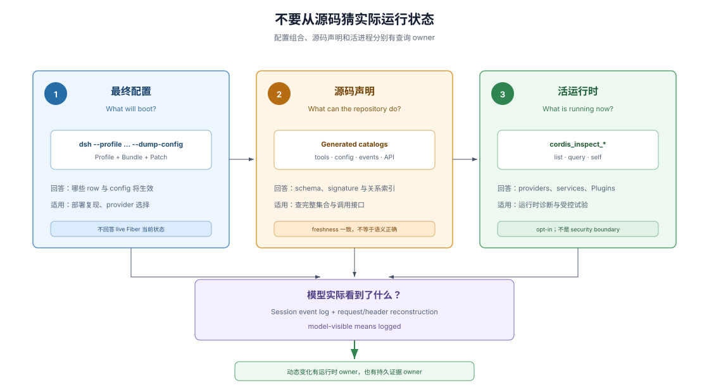

# 06 · 动态可检查性：询问实际运行状态

## 源码只能说明可能性

静态 import 和 package tree 能说明仓库可能提供哪些能力，却不能单独回答某台机器、某个 profile 或某个 session 实际加载了什么。Profile、Bundle、Patch、Preset、scope 和 plugin lifecycle 会共同改变活运行时。

Inspectability（可检查性）要求系统提供查询入口，让 agent 用当前状态验证假设，而不是只从源码结构猜部署结果。



## 查询一：最终配置树是什么

> To see the tree your machine boots:
>
> ```sh
> dsh --profile web --dump-config
> ```
>
> — DSH [`docs/architecture.md`](https://github.com/deepseek-ai/deepseek-harness/blob/580646c14fb998532a6ef19bb4cc4009cd74b786/docs/architecture.md#profiles-and-bundles)。这条命令回答 profile、bundle 和 patch 叠加后的实际 boot 配置，而不是源码中可能出现的所有插件。

当 provider 是否生效、某个 config 为什么被替换或某个配置项从哪一层进入系统不清楚时，最终配置树比扫描 import 更接近问题对象。它也为 bug report 提供可复现输入。

## 查询二：仓库有哪些静态接口与注册项

生成的 tool catalog、config catalog、persistence catalog、event producer/consumer map、capability graph 和 Cordis API reference 把源码声明变成可搜索索引。Freshness gate 会在源码变化而生成物未同步时失败。

这些 catalog 回答“仓库声明了什么”，不是“当前进程正运行什么”。它们适合查工具 schema、事件 dispatch mode、配置字段和 service signature；实际 provider 与 Fiber 状态仍要问活运行时。

## 查询三：当前进程里有什么

DSH 的 opt-in `@deepseek-ai/dsh-tool-cordis` 在固定基线注册两个只读查询工具（0.1.7 线 #4745 起，`cordis_inspect_self` 与四个变更工具已退役）：`cordis_inspect_list` 发现 Host 与 Client Inspect Providers 及其方法，`cordis_inspect_query` 按 provider 声明的 schema 执行精确查询。

> List every Cordis Inspect Provider currently known to the Host [...]. Call this Tool before writing or configuring a plugin, then select the provider and method for cordis_inspect_query from its result. Do not guess names or treat an Inspect method as a business Service that Plugin code can call. [...] Run a read-only query declared by an Inspect Provider. [...] This Tool cannot invoke business Service methods or modify the runtime.
>
> — DSH [`tool-cordis` source 的两个工具 description](https://github.com/deepseek-ai/deepseek-harness/blob/580646c14fb998532a6ef19bb4cc4009cd74b786/packages/extensions/tool-cordis/src/index.ts)（0.1.7 线起该包只注册这两个只读工具，不再贡献 system prompt，查询纪律由工具描述自述）：查询先发现 provider 与方法，再按返回 schema 执行，不能猜名称或把只读 Inspect method 当成业务 Service。

Inspect Provider 可以把 Host service、event、builtin 与 tool 信息，以及 Client slot tree、props 和 theme tokens 暴露为只读查询。dynamic Plugin 的版本、源码与诊断改由 Plugin Manager 面与 runner 的程序化 API 承载（工具侧不再提供 self 检查）。

## 从查询进入可撤销试验

~~固定基线的源码和生成 tool catalog 还列出 `cordis_define`、`cordis_run`、`cordis_stop` 和 `cordis_undefine`，与三个只读查询工具合计七个 model-facing tools~~（0.1.7 线 #4745 起退役：tool-cordis 只注册 `cordis_inspect_list` / `cordis_inspect_query` 两个只读工具，`packages/extensions/tool-cordis/src/index.ts:23,42`；本节留作机制记录，现行面见上文两工具与本页 :27 的说明）。dynamic package 的定义/运行/停止生命周期移入 `cordis-host-runner` / `cordis-client-runner` 的程序化 API；持久安装走 `plugin_manager` 工具 + bundle。

这些动作适合验证“按这个 Plugin 方式注册会发生什么”，不等于修改仓库：dynamic package 只存在于当前 DSH 进程，不创建文件、不改变 `cordis.yml`、不自动晋升为正式插件，也不跨 DSH restart 保留。需要永久保存时，仍要回到普通开发流程完成源码、文档、测试和决策记录。

## 动态能力不是安全边界

动态 Plugin 的 Host 定义在 fresh vm realm 中求值，vm 只防意外全局污染（accidental global pollution）；Context façade 隐藏 framework internals，但注入的 `ctx.shell`、`ctx.fs` 和 `ctx.web` 仍具有真实运行时权限。`tool-cordis` 本身只读；需要授权的变更面是通过 Plugin Manager 进行的持久安装与配置。

因此“可查询”不表示“可修改”，可撤销 plugin contribution 也不表示外部副作用能够事务回滚。Dynamic package 的生命周期和部署安全是两个不同问题。

## 动态变化仍要可重建

Plugin set 可以变化，但任何真正进入模型请求的 tool schema、prompt section 或消息都必须通过 session event 与 request header 重建。`model-visible means logged` 把运行时动态和 durable evidence（持久证据）连接起来。

这使 agent 能分别询问三个问题：配置会加载什么、源码声明什么、当前进程运行什么；如果变化影响模型，再从日志核对模型实际看到了什么。

## 证据入口

- DSH [`docs/architecture.md`](https://github.com/deepseek-ai/deepseek-harness/blob/580646c14fb998532a6ef19bb4cc4009cd74b786/docs/architecture.md)：ordered config layers、`--dump-config`、session log 和 model-visible means logged。
- DSH [`tool-cordis` source](https://github.com/deepseek-ai/deepseek-harness/blob/580646c14fb998532a6ef19bb4cc4009cd74b786/packages/extensions/tool-cordis/src/index.ts)：固定基线实际注册的两个只读 inspect tools（`cordis_inspect_list`、`cordis_inspect_query`）。
- DSH [`docs/tool-catalog.md`](https://github.com/deepseek-ai/deepseek-harness/blob/580646c14fb998532a6ef19bb4cc4009cd74b786/docs/tool-catalog.md#deepseek-aidsh-tool-cordis)：从源码生成的两个只读工具 schema 及 opt-in 说明。
- DSH [`@deepseek-ai/dsh-tool-cordis` README 的 “Known Limitations and Deferred Work”](https://github.com/deepseek-ai/deepseek-harness/blob/580646c14fb998532a6ef19bb4cc4009cd74b786/packages/extensions/tool-cordis/README.md#known-limitations-and-deferred-work)（0.1.7 线起该包只剩两个只读检查工具，改动类 cordis_define/run/stop/undefine 退役、持久修改改走 plugin_manager）：检查工具不能调用业务方法、配置插件或执行生成代码。
- DSH [`docs/config-catalog.md`](https://github.com/deepseek-ai/deepseek-harness/blob/580646c14fb998532a6ef19bb4cc4009cd74b786/docs/config-catalog.md)：生成的配置字段索引。
- DSH [`docs/event-producer-consumer.md`](https://github.com/deepseek-ai/deepseek-harness/blob/580646c14fb998532a6ef19bb4cc4009cd74b786/docs/event-producer-consumer.md)：生成的事件 producer、consumer 和 dispatch mode 索引。
- DSH [`docs/capability-seams.md`](https://github.com/deepseek-ai/deepseek-harness/blob/580646c14fb998532a6ef19bb4cc4009cd74b786/docs/capability-seams.md)：生成的 Service Definition、provider 与 consumer 关系索引。
- DSH [`docs/persistence-catalog.md`](https://github.com/deepseek-ai/deepseek-harness/blob/580646c14fb998532a6ef19bb4cc4009cd74b786/docs/persistence-catalog.md)：生成的 durable session event 声明索引。
