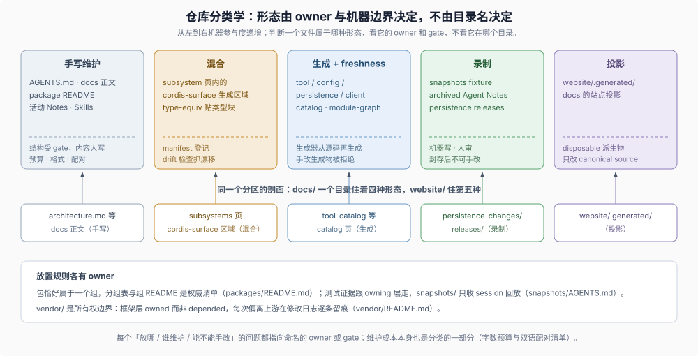

# 08 · 仓库分类学：什么放在哪里，怎样维护

## 目录树是分类系统，不是历史堆叠

大型仓库最常见的漂移方式不是代码错误，而是“东西放错了地方”：同一事实出现在第二份手写清单、生成的产物被手改、测试期望输出堆进与它无关的目录。DSH 用成文规则回答“什么放在哪里、由谁维护、改了谁会发现”：顶层分区各辖其职，包“恰好属于一个组”，内容按维护形态分成手写、生成、混合、录制、投影五类，每类有命名的 owner、生成器或 verifier。

照分类走的参与者（人或 agent）不需要猜放置，也不需要为每个目录重新发明惯例；对同时阅读多个仓库的 coding agent（例如一个 DSH 插件仓库加 DSH 本体），一致的分类意味着同样的检索模式在两边都成立。



## 1. 顶层分区各辖其职

| 分区 | 拥有 | 规则 owner |
|---|---|---|
| `packages/<group>/<pkg>` | 产品源码：每个 `@deepseek-ai/dsh-*` npm 包 | `packages/README.md` 的分组表与 `packages/AGENTS.md` |
| `apps/` | 应用入口（Web、Desktop、CLI reference） | 根 `AGENTS.md`（只有 `dsh` profile 启动受支持的应用） |
| `vendor/` | 框架层的 vendored 源码副本 | `vendor/README.md` 的 manifest 与本地修改日志 |
| `python/`、`native/` | 另外两条发布 lane 的代码 | `python/README.md`、`native/README.md` |
| `docs/` | 全部手写与生成文档，双语配对 | `docs/AGENTS.md` 的 tier 分类法 |
| `.agents/` | Agent Notes（决定记录）与 development Skills | `.agents/notes/README.md` 与各 Skill |
| `.github/` | 远端执行面：workflows、issue policy、模板、review-ownership | `.github/AGENTS.md` 与各 workflow 自身 |
| `scripts/` | 检查（gates）与生成器 | `scripts/AGENTS.md` 与 `run-gates.ts` |
| `snapshots/` | 只收 session 回放 fixture | `snapshots/AGENTS.md` |
| `benchmarks/`、`website/`、`patches/` | 性能门禁、站点投影、依赖补丁 | 各自 README |

每个分区的职责由一个具体文件拥有，而不是由惯例拥有；想确认“这个仓库里 X 放哪”，读的是文件，不是记忆。

## 2. 包的分组规则

包的放置规则写成分文表格：

> Every package lives in exactly one group; new packages join existing groups, and a new group updates its own README and this table.
>
> — DSH [`packages/README.md` 的 “Package groups”](https://github.com/deepseek-ai/deepseek-harness/blob/580646c14fb998532a6ef19bb4cc4009cd74b786/packages/README.md#package-groups)。每个组 README 是该家族的权威包清单；新增包优先加入既有组，新组必须同时更新自己的 README 与总表。

分组之上还有发布期望分层：

> Most groups are product — stable API. The exceptions: `experimental/` publishes without stability or support promises, and `test-support/`, `runtime-diagnostics/`, and `util/` are support with lower compatibility expectations.
>
> — DSH [`packages/README.md` 的 “Release expectations”](https://github.com/deepseek-ai/deepseek-harness/blob/580646c14fb998532a6ef19bb4cc4009cd74b786/packages/README.md#release-expectations)。product / support / experimental 三类承担不同的兼容义务，分类因此同时约束“放哪”与“承诺什么”。

依赖方向也有分类规则：

> Extension plugins depend on Service Definitions, never concrete providers.
>
> — DSH [`packages/README.md` 的 “Dependencies”](https://github.com/deepseek-ai/deepseek-harness/blob/580646c14fb998532a6ef19bb4cc4009cd74b786/packages/README.md#dependencies)。扩展插件依赖 Service Definition 而不是具体 provider，这让“换 provider”保持为部署选择；依赖图本身由生成器产出（`docs/module-graph.md`，freshness 门禁）。

## 3. 内容的五种维护形态

“这个文件是静态的还是动态的”在 DSH 中有精确答案——不是二选一，而是五类，每类有明确的机器边界：

| 形态 | 内容 | 机器边界 |
|---|---|---|
| 手写维护 | `AGENTS.md`、docs 正文、package README、活动 Agent Notes、Skills | 结构受 gate（预算、格式、配对），内容是人写的 |
| 生成 + freshness 门禁 | tool/config/persistence/client catalog、`dependency-catalog.json`、`module-graph`、doc graphs、Cordis API、session-format catalog | 从源码再生成；手改生成物被拒绝 |
| 混合 | subsystem 页内的 `cordis-surface` 生成区域；`type-equiv` / `public-api` 贴类型块 | 生成区域登记在 manifest，贴类型块 drift 检查 |
| 录制 | `snapshots/` 的 session fixture、archived Agent Notes、`docs/persistence-changes/releases/` | 机器写出、人审阅、封存后不可手改 |
| 投影 | `website/.generated/` | canonical source 的 disposable 派生物 |

生成的边界由文档标准直接规定：

> Exhaustive English sources regenerated from source and freshness-gated; reviewed Chinese counterparts follow the pairing workflow.
>
> — DSH [`docs/AGENTS.md` tier 表的生成 reference 行](https://github.com/deepseek-ai/deepseek-harness/blob/580646c14fb998532a6ef19bb4cc4009cd74b786/docs/AGENTS.md#the-tier-taxonomy-one-home-per-fact)。同一行同时禁止“Hand edits to generated English sources or regions”——生成物上没有人工编辑的合法位置。

混合形态把生成内容嵌进手写页：subsystem 页拥有手写叙述，页内 `cordis-surface` 区域承载生成的 Cordis API；文档里贴的类型声明用 ` ```ts type-equiv `、剥掉 body 的公共类声明用 ` ```ts public-api `，都登记进 manifest 由 `verify-type-equiv` 抓漂移。录制形态的边界见快照规则（下节）与 [archived Note 冻结](../sdlc-reference/01-agent-note-lifecycle.md)。投影细节由 [文档所有权参考](../sdlc-reference/05-prose-doc-standards.md) 拥有。

分类还有两个仪表：`scripts/doc-budgets.manifest.json` 给常驻文档设字数上限（上限是 guardrail 不是压缩目标，超限要走 relocate → condense → raise 的顺序）；`scripts/translation-pairing.manifest.json` 与配对门禁的发现范围逻辑共同定义双语配对范围与豁免（manifest 的 `excluded` 只列工作文档类条目；vendor 不配对与 `AGENTS.md` 英文单语由门禁的范围逻辑实现）。维护成本本身也是分类的一部分。

## 4. 证据放置：跟 owning 层走

测试期望输出最容易堆错地方，DSH 为此给 `snapshots/` 写了硬边界：

> This tree contains only tests whose committed session JSONL is replay input and expected persisted output. Keep non-session ARIA, geometry, generator, CLI, and unit expected output with its owning app, script, or package; use `test:expected`, `test:web`, or `test` for its owning tier.
>
> — DSH [`snapshots/AGENTS.md`](https://github.com/deepseek-ai/deepseek-harness/blob/580646c14fb998532a6ef19bb4cc4009cd74b786/snapshots/AGENTS.md)。快照树只收 session 回放；非 session 的期望输出跟 owning 层走，不留“测试杂物间”。提交的 session 是 normalization fixed point——录制与刷新写新版本号命名的输出，不重命名、不删除已提交的世代。

放置规则的精神：证据住在被它证明的对象旁边，集中目录只收真正同类的证据。

## 5. vendor：分类也是所有权边界

`vendor/` 回答的不是“放哪”而是“归谁所有”：

> They are copied into this monorepo instead of being depended on via npm, so that the harness fully owns its framework layer (auditable, patchable, pinned).
>
> — DSH [`vendor/README.md`](https://github.com/deepseek-ai/deepseek-harness/blob/580646c14fb998532a6ef19bb4cc4009cd74b786/vendor/README.md)。框架层选择被仓库拥有而不是被依赖，代价是每次偏离上游都要留痕：

> Keep this log exhaustive — every divergence from upstream must be listed.
>
> — DSH [`vendor/README.md` 的 “Local modifications”](https://github.com/deepseek-ai/deepseek-harness/blob/580646c14fb998532a6ef19bb4cc4009cd74b786/vendor/README.md#local-modifications)。manifest 表记录上游版本与 commit，修改日志逐条记录本地分叉；审计性是 owned 选择的直接义务。

## 6. 分类为什么对 agent 重要

分类系统的可观察收益与 [知识归属](./02-legibility-and-ownership.md) 相同：每个“放哪 / 谁维护 / 能不能手改”的问题都有命名的 owner 或 gate，agent 不需要为每个目录重新判断。它额外解决的问题是一致性：当 coding agent 同时阅读多个仓库（插件仓库与 DSH 本体），两边沿用同样的分类逻辑时，同样的检索模式与判断标准都成立；哪边偏离，agent 就要在哪边重新学一套局部惯例。

DSH 怎样把这套逻辑延伸给外部插件作者，见 [下一篇](./09-plugin-author-entry.md)。

## 证据入口

- DSH [`packages/README.md`](https://github.com/deepseek-ai/deepseek-harness/blob/580646c14fb998532a6ef19bb4cc4009cd74b786/packages/README.md)：包分组、发布期望与依赖方向的成文规则。
- DSH [`packages/AGENTS.md`](https://github.com/deepseek-ai/deepseek-harness/blob/580646c14fb998532a6ef19bb4cc4009cd74b786/packages/AGENTS.md)：包级约定、invariant 义务与生命周期测试。
- DSH [`snapshots/AGENTS.md`](https://github.com/deepseek-ai/deepseek-harness/blob/580646c14fb998532a6ef19bb4cc4009cd74b786/snapshots/AGENTS.md)：session 回放 fixture 的放置与世代规则。
- DSH [`vendor/README.md`](https://github.com/deepseek-ai/deepseek-harness/blob/580646c14fb998532a6ef19bb4cc4009cd74b786/vendor/README.md)：vendoring manifest 与本地修改日志。
- DSH [`docs/AGENTS.md`](https://github.com/deepseek-ai/deepseek-harness/blob/580646c14fb998532a6ef19bb4cc4009cd74b786/docs/AGENTS.md)：文档 tier 分类法、生成物边界与字数预算。
- DSH [`scripts/doc-budgets.manifest.json`](https://github.com/deepseek-ai/deepseek-harness/blob/580646c14fb998532a6ef19bb4cc4009cd74b786/scripts/doc-budgets.manifest.json) 与 [`scripts/translation-pairing.manifest.json`](https://github.com/deepseek-ai/deepseek-harness/blob/580646c14fb998532a6ef19bb4cc4009cd74b786/scripts/translation-pairing.manifest.json)：预算与双语配对的范围清单。
