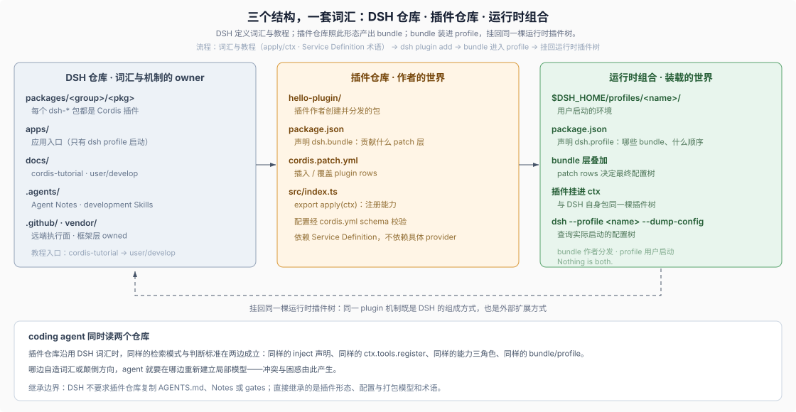

# 09 · 插件作者入口：DSH 怎样教外部开发者

## DSH 不只为自身贡献者组织知识

前面各篇讲的是 DSH 自己的开发体系；DSH 同时为**插件作者**维护了一条独立的文档 tier。这条线不是附属说明，而是有分层课程的正式入口：先教 Cordis 运行时（`docs/cordis-tutorial/` 七讲），再教 Harness 插件（`docs/user/develop/` 的 basic / framework / practice 三层），最后给出打包与安装模型。插件作者与 DSH 自身开发者共享同一套概念词汇——plugin、apply/ctx、Service Definition、bundle、profile。

## 1. 两条教程线，两个起点

Cordis tutorial 面向 agent 开发者，每讲都是在仓库 scratch 目录里可运行的例子，不需要 API key：

> This tutorial teaches Cordis hands-on: each chapter is a runnable example you build in a scratch directory inside this repository, ending with a plugin wired into real harness services.
>
> — DSH [`docs/cordis-tutorial/index.md`](https://github.com/deepseek-ai/deepseek-harness/blob/580646c14fb998532a6ef19bb4cc4009cd74b786/docs/cordis-tutorial/index.md)。七讲从 first plugin、lifecycle 与 effects、services、events、config 走到 composition 与 HMR，末讲 “Into the harness” 把一个模型可调用工具注册进 harness 的 `tools` service、经真实 tool pipeline 执行并观察结果事件——教程的终点是接入真实 harness 服务，不是玩具示例。

> To write plugins for the harness itself — loaded from a `cordis.yml` and driven from the Web UI rather than the launcher below — start from your first Harness plugin.
>
> — DSH [`docs/cordis-tutorial/index.md`](https://github.com/deepseek-ai/deepseek-harness/blob/580646c14fb998532a6ef19bb4cc4009cd74b786/docs/cordis-tutorial/index.md)。两条线的分界由加载方式定义：scratch 运行器用于学 Cordis；写“真正的” harness 插件（经 `cordis.yml` 加载、从 Web UI 驱动）从 `docs/user/develop/basic/` 进入。

`docs/user/develop/` 自身分三层：basic（Your first plugin、Plugin configuration、Build a tool、Package and install a plugin）、framework（Event system、Services and dependencies）、practice（LLM adapters、Creator mode 的动态插件配置）。进度与 [参与阶梯](./04-paved-road-and-participation.md) 的 L0–L1 对应，但用作者视角的语言讲述。

## 2. 插件的最小定义

全部教程从同一条定义出发：

> In Harness, a plugin is a TypeScript module that exports an `apply` function. The framework calls `apply` when loading the plugin and passes a `ctx` context object through which the plugin registers capabilities: [...] That is the complete configuration.
>
> — DSH [`docs/user/develop/basic/index.md` 的 “What is a plugin?”](https://github.com/deepseek-ai/deepseek-harness/blob/580646c14fb998532a6ef19bb4cc4009cd74b786/docs/user/develop/basic/index.md#what-is-a-plugin)。插件没有独立的引导协议：注册即 `apply(ctx)`，配置经 `cordis.yml` 的 schema 校验，工具经 `ctx.tools.register` 与 `defineTool`。DSH 自身的 `packages/` 包也是同一种插件——同一机制既是内部组成方式也是外部扩展方式。

## 3. bundle 与 profile：作者侧的组合模型

打包教程把 [组合层](./04-paved-road-and-participation.md) 的 L0 词汇用两个 manifest 讲清楚：

> A bundle is what you author and distribute; a profile is what a user boots with `dsh --profile <name>`. Nothing is both.
>
> — DSH [`docs/user/develop/basic/publish.md` 的 “Two concepts, two manifests”](https://github.com/deepseek-ai/deepseek-harness/blob/580646c14fb998532a6ef19bb4cc4009cd74b786/docs/user/develop/basic/publish.md#two-concepts-two-manifests)。bundle 的 `package.json` 声明 `dsh.bundle`，回答“这个包贡献什么”（插入或覆盖 plugin rows 的 patch 层）；profile 声明 `dsh.profile`，回答“哪些 bundle 按什么顺序组成这套环境”。安装走 `dsh plugin add`，分层顺序决定最终合成配置——与 [`--dump-config`](./06-runtime-inspection.md) 查询的是同一棵配置树。

发布链因此是 plugin → bundle → profile：作者写插件并打包成 bundle，用户把 bundle 装进 profile 并启动。这条链与 DSH 自身的 [发布序列](../sdlc-reference/11-release.md) 不同——后者属于 DSH 仓库自己的 npm 发布 lane，不约束外部插件。

## 4. 为什么插件仓库要与这套词汇对齐

本文的归纳（DSH 没有为外部插件仓库写参与规则）：开发 DSH 插件的 coding agent 同时读两个仓库。当插件仓库沿用 DSH 的同一套概念——插件是导出 `apply` 的模块、配置走 schema、依赖 Service Definition 而非具体 provider、分发单位是 bundle——agent 在两边使用同样的检索模式与判断标准：同样的 `inject` 声明、同样的 `ctx.tools.register`、同样的“能力 = Service Definition + Provider + Consumer”分解。哪边自造词汇或颠倒这些方向，agent 就要在哪边重新建立一套局部模型，冲突与困惑由此产生。

需要同样明确的是继承的边界：DSH 并不要求插件仓库复制 `AGENTS.md`、Agent Notes、gates 或发布序列——那些是 DSH 自身作为开发 Harness 的参与机制。插件作者从 DSH 直接继承的是插件形态、配置与打包模型和术语；[分类学精神](./08-repository-taxonomy.md)（一个事实一个 owner、生成物有生成器、决定有记录）是可迁移的原则，不是对插件仓库的强制要求。

## 证据入口

- DSH [`docs/cordis-tutorial/index.md`](https://github.com/deepseek-ai/deepseek-harness/blob/580646c14fb998532a6ef19bb4cc4009cd74b786/docs/cordis-tutorial/index.md)：Cordis 七讲教程的入口、受众与 scratch 运行方式。
- DSH [`docs/user/develop/basic/index.md`](https://github.com/deepseek-ai/deepseek-harness/blob/580646c14fb998532a6ef19bb4cc4009cd74b786/docs/user/develop/basic/index.md)：插件的最小定义与第一个插件的完整路径。
- DSH [`docs/user/develop/basic/publish.md`](https://github.com/deepseek-ai/deepseek-harness/blob/580646c14fb998532a6ef19bb4cc4009cd74b786/docs/user/develop/basic/publish.md)：bundle/profile 二分、manifest 语义与 `dsh plugin add` 安装。
- DSH [`docs/user/develop/framework/`](https://github.com/deepseek-ai/deepseek-harness/tree/580646c14fb998532a6ef19bb4cc4009cd74b786/docs/user/develop/framework) 与 [`docs/user/develop/practice/`](https://github.com/deepseek-ai/deepseek-harness/tree/580646c14fb998532a6ef19bb4cc4009cd74b786/docs/user/develop/practice)：事件、服务依赖与 LLM adapter、动态插件配置的进阶层。
- DSH [`docs/cordis-primer.md`](https://github.com/deepseek-ai/deepseek-harness/blob/580646c14fb998532a6ef19bb4cc4009cd74b786/docs/cordis-primer.md)：教程之外的浓缩概念参考。
- DSH [`packages/README.md` 的 “Dependencies”](https://github.com/deepseek-ai/deepseek-harness/blob/580646c14fb998532a6ef19bb4cc4009cd74b786/packages/README.md#dependencies)：扩展插件依赖 Service Definition、不依赖具体 provider 的方向规则。
