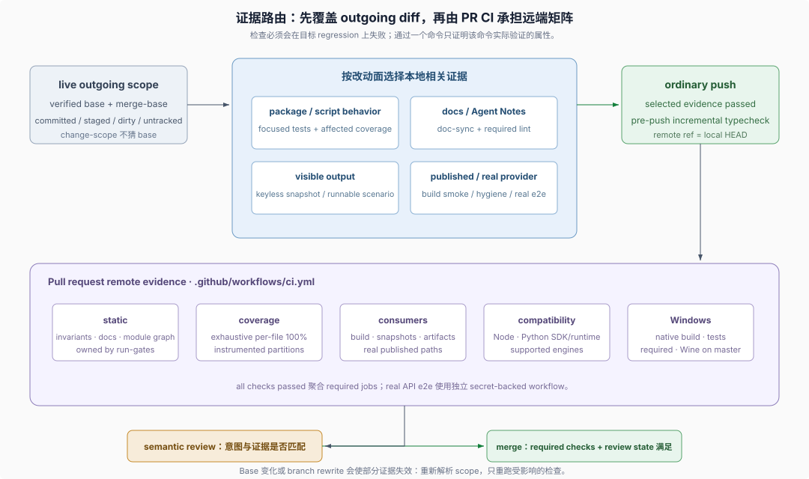

# Reference 04 · Evidence routing（证据路由）

## 一句话

DSH 把机械可检查的 invariant（不变量）接到会失败的顶层命令；push 前按 outgoing diff（待推送差异）选择最小可信证据，Pull Request CI 再运行远端矩阵。Focused evidence（聚焦证据）与 exhaustive CI（穷举式 CI）是先后两层，不是二选一。

> Match evidence to the surface: focused behavior tests, model/user-output snapshots, `doc-sync` for docs, built smokes for published paths, and real-API e2e for providers.
>
> — DSH [根 `AGENTS.md` 的 “Run relevant checks locally”](https://github.com/deepseek-ai/deepseek-harness/blob/580646c14fb998532a6ef19bb4cc4009cd74b786/AGENTS.md#run-relevant-checks-locally)。这条 standing order 定义本地证据按改动面选择，而不是默认运行全部检查。



## 1. 检查逻辑与执行环境分属两边

| owner | 责任 |
|---|---|
| `package.json`、`scripts/run-gates.ts`、各 verifier/test | 定义检查逻辑、依赖、失败退出和聚合命令 |
| `dsh-pre-push-checks` | 根据真实 outgoing scope 选择 push 前相关证据 |
| `.github/workflows/ci.yml` | 定义 PR 触发、runner、权限、并发、缓存、job 依赖与结果聚合 |
| Git hooks | pre-commit 修 staged lint 并查 whitespace/vendor metadata；pre-push 只跑 incremental typecheck |
| reviewer | 判断意图、设计、prose 和测试场景是否真的匹配；绿色检查不建立这些语义属性 |

`.github/` 因而是流程的一部分，但不是检查清单的唯一 owner。Workflow 调用 `check:ci:*`，具体 gate inventory 继续由仓库脚本维护。

Skill、repository gate、GitHub workflow 和 semantic review 的一般职责分工由 [Development Harness 的 Skills 章节](../repo-harness/03-skills-as-procedural-memory.md) 统一说明；本页只保留 push 前与 PR CI 的精确证据路由。

## 2. 先解析 outgoing scope

`dsh-pre-push-checks` 先确认 checkout 和 branch，再验证 live PR base 或 stack parent，并运行：

```sh
pnpm --silent run change-scope --base <verified-base-ref>
```

报告区分 merge-base 以来的 committed paths 与当前 staged、unstaged、untracked paths。Base retarget 或 merge 后要重新解析 scope，因为组合后的 diff 可能触及新的行为；命令不会猜测或 fetch base。

## 3. 每种改动选择会抓住其 regression 的证据

| 改动面 | 本地相关证据 |
|---|---|
| package 或 script 行为 | owning Vitest file/test name；跨包共享行为再扩到相邻 package |
| docs、Agent Notes、catalog、doc-linked comments | `pnpm run doc-sync`；文档 workflow 要求时加 full lint |
| model、editor、CLI、terminal 可见输出 | owning keyless snapshot 或真实 runnable-example scenario |
| manifest、public export、build config、worker/bin、built runtime | build、相关 hygiene 与 built-artifact smoke |
| real provider 或 agent behavior | 有 credentials 时运行对应 e2e target，绝不输出 secrets |

测试选择和 coverage 选择是两件事。Focused coverage 要同时指定 owning tests 与受影响 source include，并在该 source 范围继续满足 per-file 100%；不能用 `--passWithNoTests`、降低 threshold 或人为缩小 include 掩盖缺口。

本地不因“准备 commit/push”重复一个已经通过且未被新改动失效的检查，也不专门重跑 typecheck 去复制 pre-push hook。全库 rehearsal 只用于用户明确要求、CI 诊断或无法可信拆分的仓库级变更。

## 4. PR CI 承担穷举与平台信号

`ci.yml` 在每个 pull request 上运行，并在同一 ref 出现新 head 时取消旧 run。下面是本页需要说明的证据类别，不是逐 job inventory：

- Node 24 static gates；
- exhaustive per-file coverage；
- build-backed snapshots、文档类型检查和 artifact consumers；
- supported Node compatibility；
- Python SDK 与 release-shaped runtime；
- required native Windows build 与 native tests，以及不进入该聚合的 Windows coverage 与 observational job。

`all checks passed` 聚合 required job 结果；`.github/AGENTS.md` 明确 native Windows build 与 process 检查计入该 PR verdict，Wine 只在 master-only 的 `ci-master.yml` 里用 hosted Linux 运行 Windows Node。精确 job 和命令以 DSH 的 [`ci.yml`](https://github.com/deepseek-ai/deepseek-harness/blob/580646c14fb998532a6ef19bb4cc4009cd74b786/.github/workflows/ci.yml) 与 [`run-gates.ts`](https://github.com/deepseek-ai/deepseek-harness/blob/580646c14fb998532a6ef19bb4cc4009cd74b786/scripts/run-gates.ts) 为准，专题不复制完整 gate inventory。

Secret-backed e2e 在独立 workflow 里运行；无 key 时的本地命令 self-skip，不应被描述为真实 provider 已验证。产品可见 GUI 变更还需要从 PR 的真实 server/model flow 录制 GIF，这份证据不由普通 unit test 或 mock fixture 替代。

## 5. 负例把规则接到真实接受路径

新增可机械检查的规则不止需要 verifier。顶层执行命令必须实际包含它，并且 changed acceptance path 至少有一个 invalid case 通过真实 runner 被拒绝。否则“存在一个脚本”和“CI 会阻止错误”之间没有证据链。

同一原则适用于测试：断言要在目标 regression 上失败；e2e 重跑命令或重读外部状态，而不是只信 agent 自述；published bin、Loader、worker、ACP bridge 和 subprocess 使用各自真实入口。

## 6. 失败后的状态

普通 push 前的相关检查失败就停止并修复，不能把 CI 当作试运行。环境特异性需要记录 exact command、failing test 和平台差异后才能成立。

`gh stack sync` 是唯一顺序例外：它把 fetch、cascade rebase 和 push 合成一步，无法在 publication 前插入验证。Sync 后立即对每个 rewritten layer 重算 scope、运行相关证据，并在全部通过前保持 PR unmerged；失败时保留 lease-protected heads，修复、验证再发布 correction。

## 证据入口

- DSH [根 `AGENTS.md`](https://github.com/deepseek-ai/deepseek-harness/blob/580646c14fb998532a6ef19bb4cc4009cd74b786/AGENTS.md#run-relevant-checks-locally)：本地 relevant checks 与 CI exhaustive matrix 的职责分配。
- DSH [`dsh-pre-push-checks` skill](https://github.com/deepseek-ai/deepseek-harness/blob/580646c14fb998532a6ef19bb4cc4009cd74b786/.agents/skills/dsh-pre-push-checks/SKILL.md)：怎样解析 outgoing scope 并选择最小可信证据。
- DSH [PR CI workflow](https://github.com/deepseek-ai/deepseek-harness/blob/580646c14fb998532a6ef19bb4cc4009cd74b786/.github/workflows/ci.yml)：远端 runner、job 依赖和 `all checks passed` 聚合。
- DSH [`.github/AGENTS.md`](https://github.com/deepseek-ai/deepseek-harness/blob/580646c14fb998532a6ef19bb4cc4009cd74b786/.github/AGENTS.md)：PR Windows signals 中哪些计入 required 聚合，哪些留在 master-only workflow。
- DSH [gate scheduler](https://github.com/deepseek-ai/deepseek-harness/blob/580646c14fb998532a6ef19bb4cc4009cd74b786/scripts/run-gates.ts)：顶层 gate 的命令、依赖与并行调度真源。
- DSH [测试策略](https://github.com/deepseek-ai/deepseek-harness/blob/580646c14fb998532a6ef19bb4cc4009cd74b786/docs/testing.md)：coverage、snapshot、真实入口和 negative control 的证据要求。
- DSH [Quality gates Agent Note](https://github.com/deepseek-ai/deepseek-harness/blob/580646c14fb998532a6ef19bb4cc4009cd74b786/.agents/notes/implemented/process/2026-06-11-quality-gates.md)：为什么仓库优先把规则接成可执行检查。
