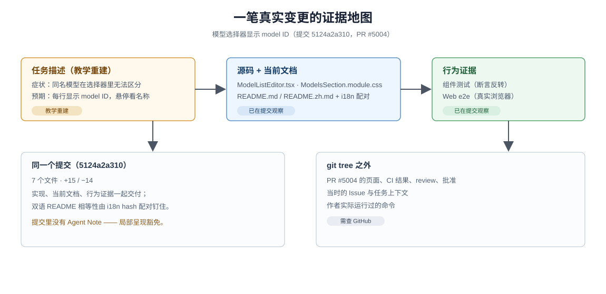

# 01 · 跟着一笔真实变更走完主流程

## 你要接手的任务

用户报告了一个可观察的问题：**在“获取可用模型”的选择器里，两个模型显示同一个名字**。因为列表默认显示模型的显示名，同名模型无法区分；用户还提到，辨认时其实更想看到原始的 model ID（配置和日志里使用的那个标识符），名称在需要时再看。

把这条症状改写成外部结果与验收，任务就成型了：

- 当前问题：选择器每行显示显示名；同名模型无法区分；
- 预期结果：每行显示原始 model ID，并能在需要时看到模型名称；
- 验收方式：打开选择器能看到每行的 ID，悬停能看到名称；旧显示不应再出现；
- 可见影响：只有这个选择器的呈现发生变化。

这些内容是 intent（意图）和 acceptance criteria（验收条件）。它们约束外部结果，但不提前指定必须修改哪个函数——实施者仍要根据源码选择正确位置，评审人也因此知道最后该观察什么。

这是从已交付行为**重建的教学任务描述**。本教程的主例是真实提交 `5124a2a310`（PR #5004）：用户看到等宽字体的 model ID，悬停时辨认模型名称。它当时对应的原始 Issue、作者实际跑过的命令和远端检查结果，git tree 里**不存在**，本教程不声称拥有它们；涉及“当时在 GitHub 上发生了什么”的地方，会明确标注 [`需查 GitHub`]。本页钉版链接指向固定基线 `46a7f68b09`（dsh-v0.1.7-rc.1）——该提交已在这条历史里，链接展示的是交付后的形态。

## 练习：这笔变更属于哪类入口

仓库的 Issue 模板有两种现行入口，分节结构不同：

- [Bug 模板](https://github.com/deepseek-ai/deepseek-harness/blob/46a7f68b0922371ce7144b668b90e377d8e799f4/.github/ISSUE_TEMPLATE/bug.md)：Summary / Reproduction / Current behavior / Expected behavior / Environment——为“现有预期行为的失效”设计；
- [Feature 模板](https://github.com/deepseek-ai/deepseek-harness/blob/46a7f68b0922371ce7144b668b90e377d8e799f4/.github/ISSUE_TEMPLATE/feature.md)：Motivation / Behavior——为“新增或有意改变可观察行为”设计。

主例该用哪份？提交标题写的是 `fix(web)`，但“显示 ID 而不是名称”更接近有意改变呈现，而不是修复失效。先自己判断一次，再体会这个张力的用处：选哪份模板，就是在逼作者讲清“这是坏了，还是要变”——Bug 模板要复现步骤和“预期行为”，Feature 模板要动机，两条路最后都落在可观察结果上。两份模板都是现行入口，本教程不声称其中一份就是 PR #5004 的真实 Issue（`需查 GitHub`）。

## 第零步：找到这项修改的家

实施前先回答“改哪里、谁拥有这块行为”。一个新到仓库的 agent 会走这条链：

1. 根 [`AGENTS.md`](https://github.com/deepseek-ai/deepseek-harness/blob/46a7f68b0922371ce7144b668b90e377d8e799f4/AGENTS.md) 的 Repository layout 表：`packages/` 下按 `client/` 分组的 GUI 包；
2. [`packages/README.md`](https://github.com/deepseek-ai/deepseek-harness/blob/46a7f68b0922371ce7144b668b90e377d8e799f4/packages/README.md) 的分组表 → `packages/client/` → 包 README；
3. [`packages/client/ui-settings-models/README.md`](https://github.com/deepseek-ai/deepseek-harness/blob/46a7f68b0922371ce7144b668b90e377d8e799f4/packages/client/ui-settings-models/README.md)：Models 设置页的 owner，其中“Adding and deleting providers”一节正是选择器行为的当前合同。

问一个问题就够了：**这项显示修改，为什么不应当去改 agent loop（驱动模型对话与工具调用的核心循环）？** 因为它只影响一个 UI 组件的呈现，不碰任何服务、事件或模型可见的输出。反过来，如果任务要改的是可替换的能力（比如“模型目录从哪里来”），就要继续走到 [architecture 文档](https://github.com/deepseek-ai/deepseek-harness/blob/46a7f68b0922371ce7144b668b90e377d8e799f4/docs/architecture.md)；那类“可替换能力的接缝”（seam）本教程不展开。

还有一处要如实说明：包 README 拥有行为合同，却不点名组件文件——从 `src/client/` 的组件清单和关键词检索定位最后一跳，是 agent 的常规动作，不是缺陷。

## 第一步交付了什么：打开这笔提交

`git show --stat 5124a2a310` 列出 7 个文件、15 行新增、14 行删除——一个典型的“小而完整”的交付组合：

| 文件 | 角色 | 事实来源 |
|---|---|---|
| [`ModelListEditor.tsx`](https://github.com/deepseek-ai/deepseek-harness/blob/46a7f68b0922371ce7144b668b90e377d8e799f4/packages/client/ui-settings-models/src/client/ModelListEditor.tsx) | 实现：候选行渲染 `{candidate.id}` 而非显示名 | `已在提交观察` |
| [`ModelsSection.module.css`](https://github.com/deepseek-ai/deepseek-harness/blob/46a7f68b0922371ce7144b668b90e377d8e799f4/packages/client/ui-settings-models/src/client/ModelsSection.module.css) | 实现：等宽字体 token、单行截断 | `已在提交观察` |
| [`provider-form.client.spec.tsx`](https://github.com/deepseek-ai/deepseek-harness/blob/46a7f68b0922371ce7144b668b90e377d8e799f4/packages/client/ui-settings-models/tests/provider-form.client.spec.tsx) | 组件测试：断言选择器显示 id、按名称搜索仍可用 | `已在提交观察` |
| [`models-settings.e2e.ts`](https://github.com/deepseek-ai/deepseek-harness/blob/46a7f68b0922371ce7144b668b90e377d8e799f4/apps/web/tests/models-settings.e2e.ts) | Web e2e：真实浏览器里勾选 `gpt-6-astra` | `已在提交观察` |
| [`README.md`](https://github.com/deepseek-ai/deepseek-harness/blob/46a7f68b0922371ce7144b668b90e377d8e799f4/packages/client/ui-settings-models/README.md) / [`README.zh.md`](https://github.com/deepseek-ai/deepseek-harness/blob/46a7f68b0922371ce7144b668b90e377d8e799f4/packages/client/ui-settings-models/README.zh.md) | 当前文档：两语言同步改述新行为 | `已在提交观察` |
| [`README.i18n.yaml`](https://github.com/deepseek-ai/deepseek-harness/blob/46a7f68b0922371ce7144b668b90e377d8e799f4/packages/client/ui-settings-models/README.i18n.yaml) | 配对记录：记下两份 README 各自的 git blob hash（git 对文件内容算出的校验和，内容一变就变），改动后重新记录 | `已在提交观察` |

SDD 在 DSH 的日常开发里就是这个样子：**实现、当前文档、行为证据装在同一个提交里**，连“中英文档必须相等”都被 hash 配对记录钉死——文档不是代码写完后补的，而是同一笔变更的组成部分。

再注意提交里**没有**什么：没有 Agent Note，没有 Issue 文本，没有 CI 截图。缺了什么和有什么一样，都是信息——为什么缺了也合规，下一节和 [02](./02-specs-and-decisions.md) 分别解释。

## 证据地图：每一步谁拥有证据

沿“需求 → 源码/README → 测试 → PR”走一遍，每步标注它的证据等级：

| 步骤 | 打开什么 | 证据等级 |
|---|---|---|
| 用户需要什么 | 本页重建的任务描述（症状：同名模型不可区分） | `教学重建` |
| 系统当前如何呈现 | `ModelListEditor.tsx` 第 450 行附近：`{candidate.name ?? candidate.id}`（旧行为，行号按提交的父版本） | `已在提交观察` |
| 交付后如何呈现 | 同文件：`{candidate.id}` + `title` 悬停 + 等宽样式 | `已在提交观察` |
| 当前合同怎么说 | 包 README 的 “Adding and deleting providers” 一节 | `已在提交观察` |
| 什么抓住回归 | 组件测试两个场景共 6 条反转断言 + e2e 一处可访问名断言 | `已在提交观察` |
| 哪项检查会因旧行为失败 | 组件测试（[04](./04-implementation-and-evidence.md) 有实测红灯） | `已在提交观察` |
| PR 页面当时怎样 | 提交标题的 `(#5004)`；`需查 GitHub`——本语料钉版时无法访问该 PR 页面 | `需查 GitHub` |

三个标注的含义：`已在提交观察` = 仓库的 git 历史里可以亲自 `git show` 核对；`现行规则要求` = DSH 今天的规则这样规定（给出文件）；`需查 GitHub` = 只有远端记录能回答，正文不替它编造。

一个容易踩的坑：**PR #5004 不是 Issue #5004**。提交标题里的 `(#5004)` 指 Pull Request；它是否关联、关联了哪个 Issue，需要查 GitHub 记录，不能从 git tree 推断。

## 哪些机制按条件出现

| 机制 | 普通规则 | 在主例中 |
|---|---|---|
| Issue | 需要外部跟踪或仓库 policy 要求关联时使用 | 未见；是否有关联 `需查 GitHub` |
| proposed Agent Note | 重大未来工作需先评审决定时使用 | 未用 |
| Plan Mode | 用户或部署选择先计划后实现时使用 | 未见 |
| owning Agent Note | 承载持久决定理由的变更都要新增或更新（机械/局部编辑豁免） | **豁免**（见下） |

## 练习：这笔修改为什么不需要 Agent Note

打开 [Agent Note 规则](https://github.com/deepseek-ai/deepseek-harness/blob/46a7f68b0922371ce7144b668b90e377d8e799f4/.agents/notes/README.md) 找到这句话的原文：

> Mechanical or local edits, including local UI presentation and interaction changes, are exempt.

再问三个问题：(1) 这笔修改改变的是呈现，还是改变了任何“为什么选当前方案、主动放弃了什么”的持久取舍？(2) 一年后有人想了解“为什么选择器显示 ID 而不是名称”，答案在源码和 README 里已经完整吗？(3) 如果把同样的判断用在 pnpm 锁那笔修改上（[02](./02-specs-and-decisions.md) 的对照案例），结论会不同吗？

**判据**：机械/局部编辑豁免不是因为“改动小”，而是因为**决定理由无处安放以外的所有事实都有 owner**——行为归源码与测试，当前合同归 README，回归证据归测试。改动小但携带持久取舍的变更仍然需要 Note。

## 读完这一篇应记住

一笔变更不是“写代码，然后让 CI 看看”。它先有可观察结果，再把实现、当前文档和能在旧行为上失败的行为证据装进同一个提交；条件化的机制（Issue、Note、Plan）只在需要它们承载的事实时出现。

回扣开篇的三条立场：**每类事实有唯一 owner**——这一页你亲眼看到意图、行为、合同、证据各自住在哪个文件里；**agent 是一等参与者**——你按“根 AGENTS.md → 分组表 → 包 README”的公开入口找到了它们，没有靠任何口头指引。

下一篇解释这些内容为什么分散在不同位置：[规格与决定](./02-specs-and-decisions.md)。
