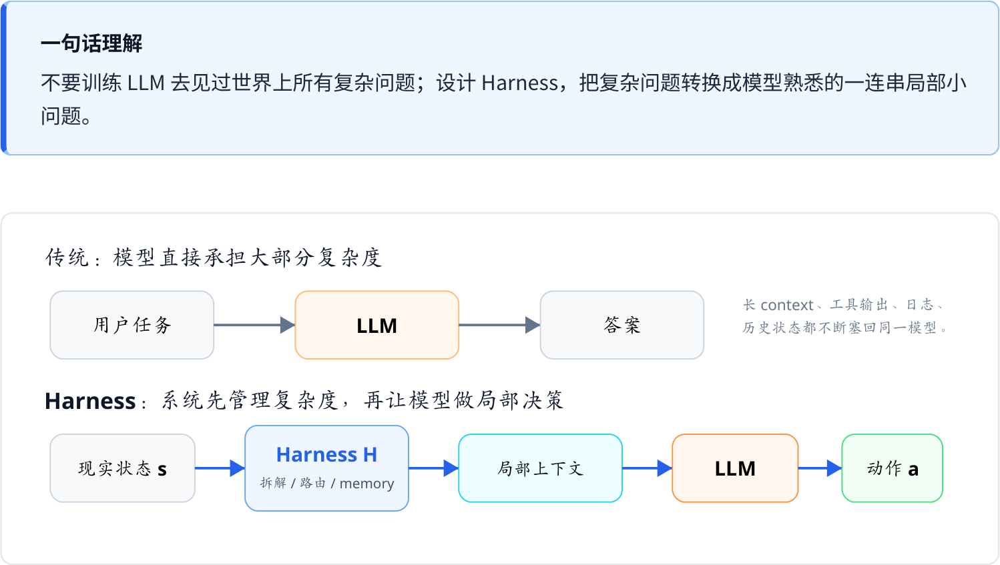
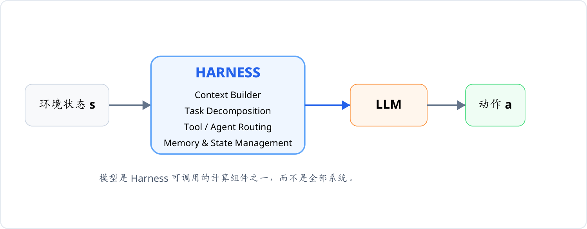
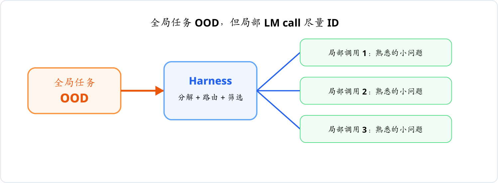
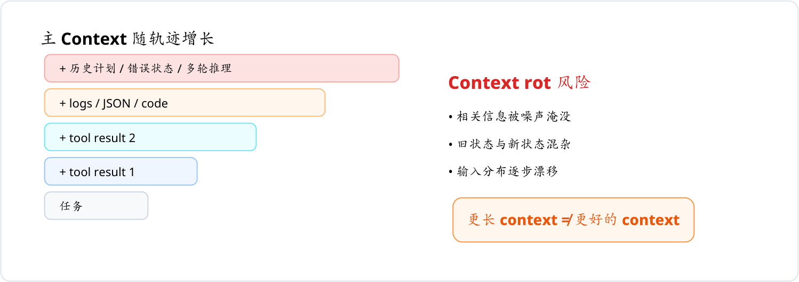
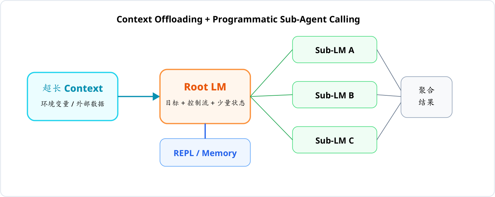
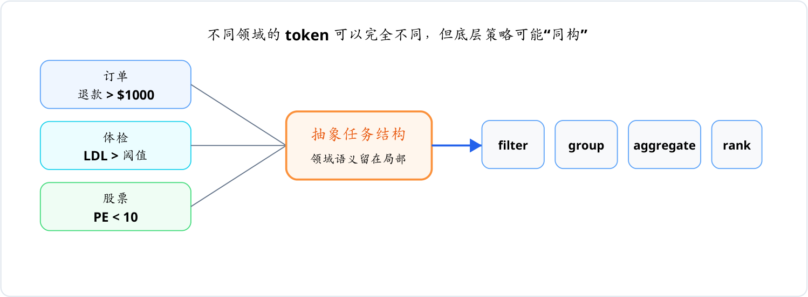
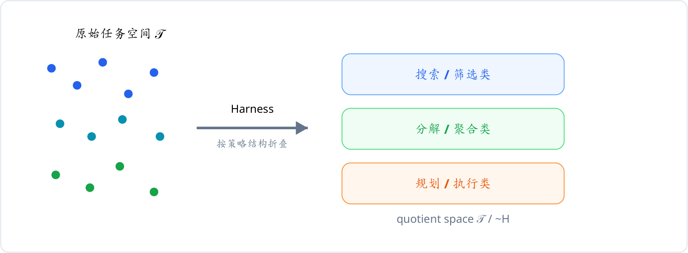
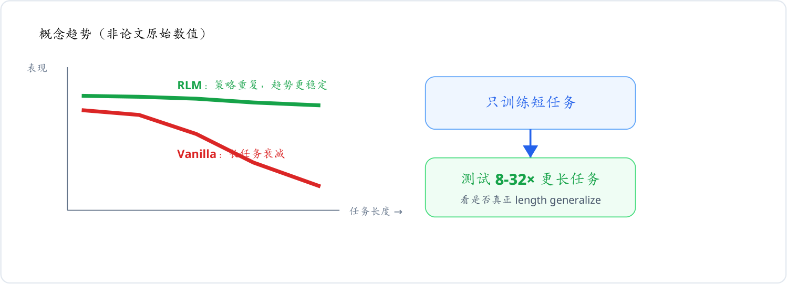
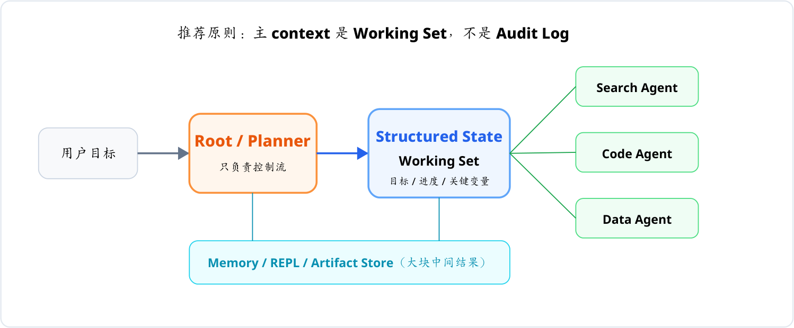

# Harness 与组合泛化

《Language model harnesses are compositional generalizers》中文深度解读与 Agent 工程化说明

> **一句话理解**
>
> 不要训练 LLM 去见过世界上所有复杂问题；设计 Harness，把复杂问题转换成模型熟悉的一连串局部小问题。

> **图 1**｜从「LLM 直接扛复杂度」到「系统先管理复杂度，再让 LLM 做局部决策」。

- **整理对象**：Alex L. Zhang & Omar Khattab, 2026
- **原文**：Language model harnesses are compositional generalizers
- **用途**：面向 AI Agent、RLM、长上下文与多工具系统设计的概念梳理。

---

## 00 · 阅读路线（Reading Map）

建议按顺序读：先理解 Harness，再理解它为什么会影响泛化。

1. **Harness 到底是什么**：它不是「工具列表」，而是 AI 系统控制层
2. **组合泛化**：为什么会 A、B、C 不代表模型会自动组合 A+B+C
3. **Locally In-Distribution**：把一个 OOD 大问题变成一串 ID 小问题
4. **Context rot**：为什么把所有历史塞回 context 可能越来越差
5. **RLM**：Context Offloading 与 Programmatic Sub-Agent Calling
6. **Task Isomorphism**：不同领域任务如何映射到同一底层策略
7. **等价类与 Quotient Space**：Harness 如何「压缩任务空间」
8. **实验**：短任务训练，为什么能迁移到 8-32× 更长任务
9. **跨领域泛化**：从「记住领域」转向「学会算法」
10. **对 Agent 工程的直接启发**：Working Set，而不是 Audit Log
11. **Harness-first Agent 设计检查清单**
12. **局限与边界**：哪些结论还不能过度外推

> **阅读时抓住这条主线**
>
> 世界复杂度上升，不必让每一次 LM call 的复杂度同步上升。Harness 的价值，是把全局复杂性转化为局部、稳定、可复用的计算结构。

---

## 01 · Harness 到底是什么？

把「模型外层」从工程胶水提升为架构本体。

传统理解中，AI 系统的核心是模型：用户把问题交给 LLM，LLM 生成答案。Agent 出现后，我们又在模型旁边加入搜索、Shell、Python、数据库、API 等工具。文章进一步主张：真正决定系统能否稳定解决复杂任务的，是包在模型外层的 Harness。

Harness 可以理解为一个高层控制器。它决定：模型这一轮能看到什么、哪些信息暂时不看、任务要不要拆开、调用哪个工具或子模型、结果放进哪里、下一轮如何恢复状态。

> **图 2**｜Harness 的本质是「信息选择 + 控制流 + 状态管理」。

作者形式化写成 **H: s → a**。`s` 是环境完整状态，`a` 是系统下一步动作；这意味着 Harness 本身就是智能系统的一部分。

这会带来一个重要观念变化：未来所谓「模型架构」，可能不再只指 Transformer、Attention、MoE、RoPE；它也可能包含 memory、REPL、sub-agent、tool routing、context management 与 control flow。

---

## 02 · 组合泛化（Compositional Generalization）

会零件，不等于会组装。Compositional Generalization 是文章真正要解决的问题。

假设模型已经会搜索、分类、计数和排序。现在给它一个从未训练过的任务：分析 100 万份客服记录，筛出物流问题，按地区分组，计算投诉比例，再找出异常地区。这个任务没有引入全新的原子能力，真正困难的是把已有能力按正确顺序组合起来。

模型已经会：

- Search
- Classify
- Group
- Count
- Rank

真正要泛化的是：**Search → Classify → Group → Count → Rank**

组合顺序、循环、分支、聚合方式，往往比单个能力本身更决定复杂任务是否成功。

> **文章的批评**
>
> 如果每出现一种新长度、新领域、新工具组合，就必须再造训练环境和长轨迹 RL，那么扩展方式仍偏向 brute-force post-training，而不是可复用的算法性泛化。

| 传统扩展方式 | Harness 期望的方式 |
| --- | --- |
| 新任务 → 新数据 → 新 RL 环境 → 新训练成本 | 新任务 → 识别已有结构 → 复用已有策略 → 组合执行 |

---

## 03 · Locally In-Distribution（LID）

整体任务可以陌生，但每一次模型调用尽量保持熟悉。

一个 200 万 token、5000 个文档、需要几十步推理和多种工具的全局任务，对模型来说可能完全 OOD（Out-of-Distribution）。文章提出：不要让模型直接吃下整个 OOD 状态，而要由 Harness 将它转换成一组局部、边界清晰的调用。

> **图 3**｜关键不是「任务拆小」本身，而是让拆后的输入形态稳定、接近模型熟悉的分布。

因此 LID 的工程要求包括：目标明确、状态结构化、上下文体量可控、工具输出经过筛选、每个子任务尽量只有一个主目标。

> **核心公式**
>
> OOD Global Task → Harness → Sequence of Locally In-Distribution LM Calls

---

## 04 · Context rot

为什么「给更多信息」反而可能更差？

长上下文最大的风险不是装不下，而是输入越来越不像模型熟悉的分布。

很多 ReAct / Coding Agent 的默认机制是：每次 reasoning、tool call、tool result 都追加回主 context。几十步以后，context 同时包含代码、Shell 输出、JSON、搜索结果、旧计划、新计划、错误日志和多轮中间推理。

> **图 4**｜Context 逐渐从「当前工作集」变成「完整审计日志」。

问题不仅是 token 变多，还包括信息竞争、状态冲突和分布漂移。模型必须在每一轮重新从大量历史中找出真正相关的状态。

> 主 context 应该更像 **CPU cache / working set**，而不是日志仓库。大块证据应放在外部 memory / artifact store，需要时再检索。

---

## 05 · RLM

把 Context 从「提示词」变成「环境状态」。

Recursive Language Model 的真正价值，不只是能看超长文本。

RLM 的关键做法是：超长 context 不直接塞给 root LM，而是作为环境中的变量存在。Root LM 只需要知道目标、可用接口和少量状态，然后通过 REPL / Python 对 context 进行 peek、grep、split、transform，并在必要时对子片段调用 sub-LM。

> **图 5**｜Root LM 负责控制流，大块数据与中间结果留在外部状态中。

- **Context Offloading**：任务相关的大体量内容保存在外部环境，不持续污染 root context。
- **Programmatic Sub-Agent Calling**：子模型输出可以先进入变量或存储，而不是原封不动返回 root LM；后续 agent 可以直接消费这些结构化结果。

> **类比**
>
> Root LM ≈ 控制器 / CPU；REPL / Memory ≈ RAM；Sub-LM ≈ 函数；Context ≈ 外部数据。

---

## 06 · Task Isomorphism

表面不同，底层可以是同一个算法。把「领域泛化」转化为「结构复用」。

文章最有启发性的推论之一是：订单、医疗、股票、社交媒体等任务在 token 层面差异巨大，但底层计算结构可能完全相同。例如都可以抽象为 filter → group → aggregate → rank。

> **图 6**｜Harness 把领域语义留在局部，把可复用的控制结构暴露给 root LM。

Harness 被称为 compositional generalizer，是因为它重新表示任务，使「已经学会的策略组件」更容易在新领域重新组合。

---

## 07 · 等价类与 Quotient Space

Harness 不只是压缩 token，更可能是在「压缩任务空间」。

作者用等价关系来形式化「任务同构」的直觉。设所有任务轨迹构成集合 𝒯；Harness 定义某种关系 ~H。当两条原本不同的任务轨迹经过 Harness 后，对 root LM 呈现出相似的控制结构时，可以把它们视为同一个策略等价类。

> **图 7**｜原本极其庞杂的任务空间，经 Harness 映射后可能只剩较少的可复用策略类别。

数学记号 𝒯 / ~H 可以理解为「把所有属于同一策略结构的任务折叠在一起」。这不是说原始内容真的相同，而是说对负责控制流的模型而言，它们需要的决策模式相似。

> **重要提醒**
>
> LID、task isomorphism、equivalence class 在文章中主要是一套解释性理论框架，而不是已经被严格证明、可精确计算的数学定理。

---

## 08 · 实验

短任务训练，为何能迁移到更长任务？文章最关键的证据是 length generalization。

作者使用 Qwen3-30B-A3B-Instruct-2507 进行 RL，对比 RLM 与 vanilla Transformer。核心设计是：训练阶段只提供较短任务，但评估阶段测试 8-32× 更长的任务。涉及 MRCRv2、GraphWalks、LongBenchPro、OOLONG、OOLONG-Pairs、Ada-LEval 等环境。

> **图 8**｜概念示意：RLM 学到的「分解 + 重复调用 + 聚合」更容易随长度扩展。（概念趋势，非论文原始数值）

| 实验维度 | 设计 | 要验证的问题 |
| --- | --- | --- |
| 训练长度 | 短任务 | 是否学到可复用结构，而非只拟合长度 |
| 评估长度 | 约 8-32× 更长 | 是否出现真正的 length generalization |
| 比较对象 | RLM vs Vanilla | Harness 是否改变泛化方式 |
| 训练配置 | 150 steps；batch 64；4 rollouts / sample | 在相同基础模型下比较训练行为 |

文章观察到：vanilla Transformer 的训练 reward 可以持续提高，但长任务 eval 改善有限；RLM 则更容易在短训练与长评估之间同步提升。作者的解释是：RLM 在短任务里学到的是可重复执行的算法，而不是只适用于某个长度的轨迹模板。

---

## 09 · 跨领域泛化

真正迁移的是「策略」，而不是「语料」。

如果底层 decomposition 相近，领域变化不一定等于全新任务。

文章还测试了 cross-domain generalization：在一种内容聚合任务上训练，再到另一种完全不同的文本域上评估；或者从写作类内容迁移到数学问题、从一种社交文本检索迁移到另一种对话错误检索。

> 可复用 Strategy：search / filter / classify → aggregate / verify
>
> 理想迁移：Domain A → Strategy → Domain B

**关键区别**：「Domain A → 记住 Domain A」与「Domain A → 学会 Strategy → Domain B」是两种完全不同的学习结果。Harness 的目标是促进后者。

文章还出现过一个很有意思的现象：eval improvement 可能大于 train improvement。原因是模型早期会偷懒，把整个任务交给一个 subcall；继续 RL 后，它开始学习真正的 decomposition，于是短任务只略有改善，长任务却显著受益。

---

## 10 · 对 Agent 工程的直接启发

从「长轨迹 agent」走向「状态化、结构化、可组合」的 agent。

> **图 9**｜Harness-first Agent：主模型只保留目标、计划和结构化状态；大块中间结果放在外部。

推荐原则：**主 context 是 Working Set，不是 Audit Log**。

- **Root / Planner**：只负责当前决策与控制流，不携带全部历史细节。
- **Structured State**：显式保存任务阶段、已完成事项、约束、关键变量、下一步候选。
- **Memory / Artifact Store**：保存大块文档、日志、代码 diff、子任务输出，按需检索。
- **Sub-agent**：接受局部、边界清晰的问题；输出结构化结果，而不是长篇自由文本。
- **Context Builder**：每轮重新构造最小但充分的 context，而不是机械 append 所有历史。

> 最值得落地的一句话：**Context 应该是 working set，而不是 audit log。**

---

## 11 · Harness-first Agent 设计检查清单

把文章观点转化为可执行的工程规则。

| 检查项 | 要问的问题 |
| --- | --- |
| 上下文边界 | 主模型是否只看到当前决策真正需要的信息？是否存在无条件 append 全部工具输出的路径？ |
| 外部状态 | 大文档、日志、代码、表格、中间结果是否能留在 memory / artifact store，而不是回灌主 context？ |
| 任务分解 | 子任务是否能定义成边界清晰、输入输出可验证的小问题？ |
| 结构化输出 | sub-agent 是否优先返回 JSON / schema / key findings，而不是难以继续消费的长 prose？ |
| 策略复用 | 不同领域任务能否映射到相同的 search / filter / compare / aggregate / verify 控制结构？ |
| 失败恢复 | 某个 subcall 失败后，系统能否只重跑局部，而不用重放整个长轨迹？ |
| 验证机制 | 是否有独立 check / critic / tool-based verification，而不是让同一模型「自己相信自己」？ |
| 成本控制 | 更多 subcall 带来的推理成本，是否换来了更好的长度泛化、稳定性和可恢复性？ |

> **判断是否设计成功**
>
> 如果任务长度变成 10×、数据域换掉、工具结果更多，但 Root LM 每一轮看到的问题形态仍然相对稳定，那么 Harness 就开始真正发挥「组合泛化器」的作用。

---

## 12 · 局限与边界

这篇文章很重要，但不能把它读成「RLM 已经解决通用智能」。

- **理论仍偏解释性**：LID、isomorphism、equivalence class 很难被严格测量；文章只能使用 trajectory 相似度等 proxy。
- **Benchmark 天然适合 decomposition**：许多任务可以 chunk / search / filter / aggregate，因此 RLM 的优势有明确结构基础；不能直接推出所有现实任务都一样。
- **RLM 不会自动产生好分解**：模型可能走捷径，例如把整个任务塞给单个 subcall，因此仍需要 RL、提示、distillation 或监督。
- **推理成本更高**：多次 subcall 会增加 runtime。文章报告同规模训练中，RLM 大约为 vanilla 的 1.5-3×；优势是复杂任务可能获得更好的扩展性，而不是「免费」。
- **状态管理成为新难题**：把 context 移出主模型后，需要可靠的 memory、schema、权限、版本、错误恢复和可观察性。

> **正确的结论强度**
>
> 文章提供了很强的 evidence：Harness 可以显著改变泛化行为；但「组合泛化主要应该存在于 Harness 中」仍应视为一个正在被验证的研究方向，而不是已经完成证明的定理。

不要把「好 Harness」误解成「万能拆解器」：

| 适合 | 需要谨慎 | 尚未证明 |
| --- | --- | --- |
| 可分解 / 可验证 / 可聚合：搜索、数据、代码、文档 | 强耦合、全局一致性强、难以局部验证的任务 | 所有任务都能同构、所有领域都能稳定迁移 |

---

## 13 · 最终总结

把整篇文章压缩成一条完整逻辑链。

1. **世界任务越来越复杂** — 更长 context、更多工具、更多数据、更长 horizon。
2. **不要让每一次 LM call 同步变复杂** — 否则会持续遭遇 context rot、分布漂移和长轨迹泛化问题。
3. **Harness 负责分解与重表示** — 把全局 OOD 任务转成局部、可复用、接近训练分布的 LM calls。
4. **RLM 是一种具体实现** — Context Offloading + Programmatic Subcalls + External State。
5. **最终目标是 Compositional Generalization** — 让模型学习可复用的算法结构，而不是为每种长度、领域和任务重新训练。

> **如果只记住一句话：** 不要训练 LLM 去见过世界上所有复杂问题；设计一个 Harness，让复杂问题在 LLM 看来始终像它已经会做的简单问题。

---

## 参考文章

- Alex L. Zhang & Omar Khattab (2026), *Language model harnesses are compositional generalizers* — <https://alexzhang13.github.io/blog/2026/harness/>
- Alex L. Zhang, *Recursive Language Models* — <https://alexzhang13.github.io/blog/2025/rlm/>

> 本文档中的结构图为解释性原创示意图；实验趋势图仅表达文章讨论的方向，不代表原文具体实验数值。
