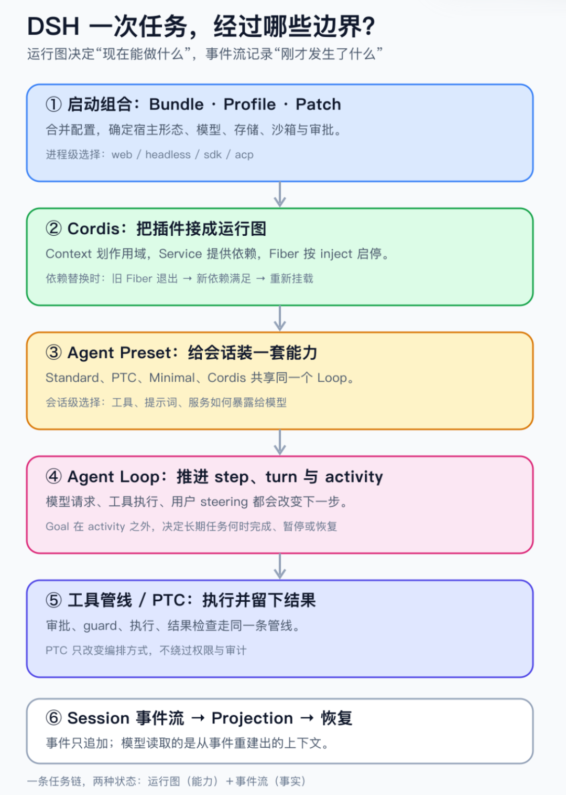
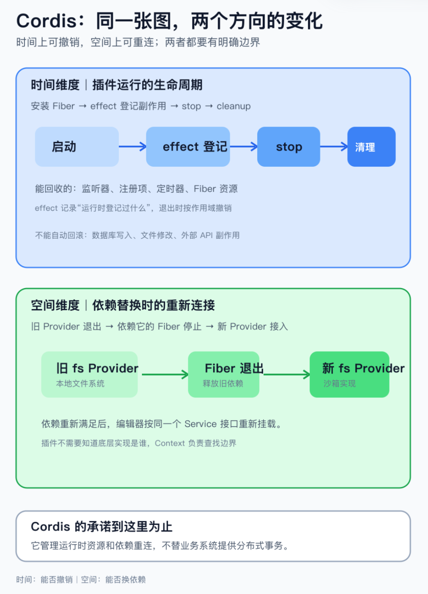
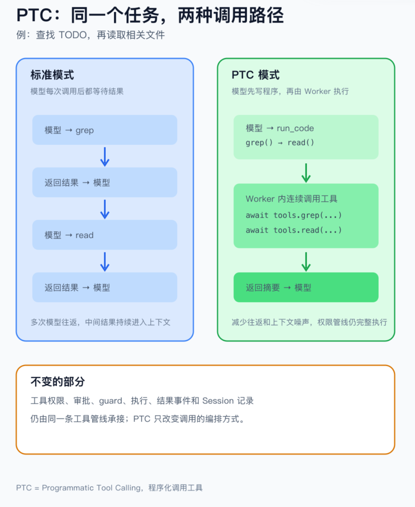
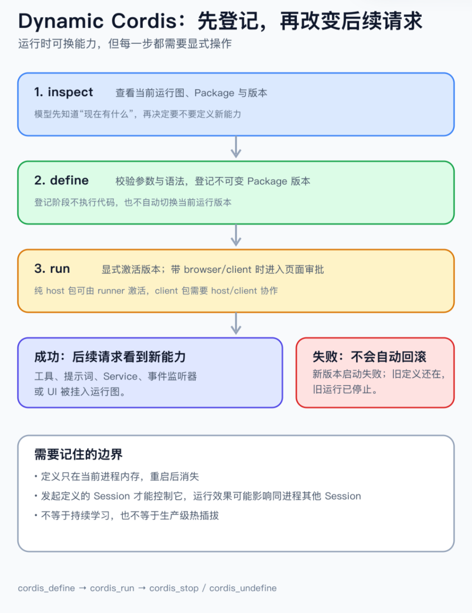

# DeepSeek Harness：重新设计 Agent 运行时

Original 若飞 若飞 架构师

_Aug 31, 2026, 11:42 PM_ _广东_

在小说阅读器读本章

去阅读

在公众号小说中沉浸阅读

架构师（JiaGouX）

我们都是架构师！
架构未来，你来不来？

* * *

周末，抽了点时间，把 DSH 的代码扒了一番。拆 Agent 的代码，最先映入眼帘的往往还是那个 Loop：

`把消息和工具交给模型   → 模型决定是否调用工具   → 运行工具，把结果交回模型   → 直到模型给出最终回复`

DSH 也没有跳出这个基本结构。只看这几行，很难辨认它和其他 Coding Agent 的差别。真正拉开距离的地方，是模型、工具、会话、权限、插件和宿主都被放进了同一套运行时。

前面沿着 DSH 看过两个局部问题：为什么 Loop 也要进插件树，一次运行又该在哪一层停下来。把视线拉回整套代码，真正考究的反而可能是 Loop 周围那些边界。

一个 Agent 真正跑起来以后，系统还要回答一串更麻烦的问题：

-   • 这一轮到底装了哪些工具、提示词和服务？

-   • 工具已经返回，任务为什么还没有结束？

-   • 进程中断后，哪些事实可以恢复，哪些外部结果只能标成未知？

-   • 运行中加了一个新工具，谁负责停用、换版和清理它留下的资源？

**DSH 的主要变化，就发生在这些边界上。**

Cordis 维护一张会变化的运行图，Session 保存只追加的事件流。Agent Loop 从前者拿能力，推进任务，再把已经发生的事写回后者。PTC、Goal 和 Dynamic Cordis，放回这两条线里就不容易看散。

本文核对的是 `dsh-v0.1.2-alpha.2`，commit 为 `0a53fb55be`。DSH 目前还是处于 Developer Preview，下面谈的是当前实现呈现出的架构，不是对稳定接口的承诺。

如果把 Agent 拆成模型、协议和运行时三层，模型负责理解和推理，协议负责传消息与工具结果，DSH 处理的是最靠近执行的那一层：能力怎么装进来，调用怎么被拦住，事实怎么记下来，一次任务又在哪儿继续或停下。下面只沿这条运行时边界往下看。

## 先把 DSH 画成一条运行链

如果只看目录，DSH 很容易显得复杂。换成一次任务真正经过的路径，会清楚不少：

`Bundle + Runtime Profile + Patch                 ↓           Cordis 宿主运行图                 ↓      Agent Preset（会话能力组合）                 ↓             Agent Loop                 ↓         工具管线 / PTC                 ↓           Session 事件流                 ↓        停止、恢复与 Goal`

Agent 的最小循环

图 1：DSH 沿用 Agent 的最小循环，差别主要落运行时如何组合和替换能力。

这条链上同时跑着两件事。

Cordis 关心的是“现在能做什么”：哪些插件已经挂上，能提供哪些 Service（服务），依赖换掉以后谁要退出。Session 关心的是“刚才发生了什么”：用户发了什么，模型发起了哪一步请求，工具有没有返回，这个 turn 为什么收口。

前一类状态要能组合、替换、撤销；后一类事实最好只追加，回放和恢复才有依据。理解 DSH，我会先记住一句话：**运行图回答现在能做什么，事件流回答刚才做过什么。**

这也解释了 DSH 为什么既像一款 Coding Agent，又像一套 Agent 开发框架。产品形态是现成的，底层却把模型适配、工具、文件系统、沙箱、会话存储和循环拆成了可装配部件。代码任务只是目前最完整的用法。

## 两层装配，各管一段

DSH 有两层装配，经常被混在一起。

`web`、`headless`、`sdk`、`sdk-minimal` 和 `acp` 是 Runtime Profile（运行时配置）。它们和 Bundle、用户 Patch、命令行 Patch 一起，决定一个进程启动时装入什么：浏览器应用、一次性无界面任务、SDK 的 JSON-RPC 服务、极简 SDK，还是自动化 ACP 服务；会话存在哪里、用哪个模型、是否接沙箱和审批，也在这里定下来。这是进程级的宿主形态，不是某个会话的工具开关。

Standard、PTC、Minimal 和 Cordis 是 Agent Preset（会话预设）。一个 Web 进程可以承载多个 Session，每个 Session 自己选 Preset。Service（服务）按 agent、preset、global 三层查找，离当前 Agent 近的实现优先。同一个进程因此可以让两个会话看到不同的工具和提示词，不必启动两套 Web 服务。

四个 Preset 的名字看着像四种 Agent，源码里的关系其实简单得多。

Preset 只决定会话挂载时带上哪组插件、工具和提示词，底下还是同一套 Loop、Session 和工具管线。

-   • **Standard** 装入日常 Coding Agent 所需的完整能力。

-   • **PTC** 改变模型看到和组织工具的方式。

-   • **Minimal** 收窄模型面前的提示词与工具面，适合做基线和控制变量。

-   • **Cordis** 在 Standard 之上增加运行时检查与动态插件工具。

切换 Preset，本质上是在换“这一轮带什么能力”，不是复制四份 Agent Loop。

配置还有一个容易踩坑的顺序：先合并 Bundle，再叠加 Profile 自带的 patch、用户目录里的 patch，最后才是命令行 `--patch`。后面的 Entry ID 会覆盖前面的同名项，而且 `config` 整段替换，不会自动深合并。遇到“源码里明明有，运行时却没有”，先看最终配置；`--dump-config` 打印实际组合树，`--dump-default-config` 只看 bundles-only 的基线。

Profile 的重载策略也不一样。没有另行指定时，自定义 Profile 默认支持运行中的 patch 重载，随附的 `web` Profile 也支持；`headless`、`sdk`、`sdk-minimal` 和 `acp` 只在启动时应用一次。一次性任务或 stdio 服务已经工作后，再替换依赖很容易把生命周期拆开，所以这些入口选择 startup-only。`--dump-config` 会附上来源注释；非法 patch 不会让进程悄悄带着半套配置继续跑，而是保留最后一份有效组合并报告错误。

配置行描述的是依赖关系，不是启动脚本的先后顺序。比如编辑器声明自己需要 `tools` 和 `fs`：

`- id: editor  name: '@deepseek-ai/dsh-tool-str-replace-editor'  inject: [tools, fs]`

`fs` Provider（提供文件系统能力的实现）还没出现，编辑器对应的 Fiber 就先等着；Provider 换成沙箱实现后，Cordis 让旧 Fiber 退出，再按新依赖重新挂载。`inject` 约束的是运行时依赖，不是操作系统权限。

宿主组合和会话 Preset 要分开看，运行时里却会碰到一起。Preset ID 只能告诉 Session 当时选了哪套组合，不会替你封存插件代码、锁文件和外部依赖。已经产生历史的会话也不适合中途换 Preset，否则旧工具调用和新工具结果会混在一起。进程重启后若要复现这次运行，发布层还得固定源码提交、配置和依赖版本。

选中配置只解决了“装什么”；装进去怎么连接，依赖变化时怎么退出和重装，得看 Cordis。

## Cordis 维护的不是注册表，是一张活的运行图

普通插件注册表按名字登记实现，需要时取出来。Cordis 还要回答两个问题：插件处在哪个 Context 或 realm（运行作用域），能看到哪一层 Service；依赖什么时候满足，插件何时启动、退出，退出时要收回哪些注册和资源。

举个简单例子。编辑工具依赖 `ctx.fs`，它不必知道背后是本地文件系统、沙箱包装，还是另一个 Provider。更近的 realm 提供新 `fs` Service 后，依赖它的插件可以重新绑定。插件通过 `ctx` 注册的工具、事件监听器和清理函数，也会跟着自己的生命周期撤销。

Cordis 论文把这两组问题称为时空可组合性。落到代码里，就是两件事：

-   • 一个组件拆掉时，运行时能不能找到它登记过的副作用并清理；

-   • 一个依赖被替换时，使用它的组件能不能停止旧运行，再基于新依赖启动。

源码里的几个名词，对应的都是运行图上的具体动作：`Context` 划作用域和 Service 查找边界；`Service` 给出稳定接口；`Fiber` 代表一次插件运行；`inject` 声明 Fiber 依赖哪些 Service；`effect` 把监听器、注册项、定时器和清理函数绑在一起。依赖没满足，Fiber 等待；依赖失效，旧 Fiber 退出，新的依赖满足后再启动。

Cordis 的两个维度：可撤销的变化与可重连的依赖

图 2：Cordis 一边录插件留下的运行时资源，一边在依赖替换后停止旧运行并重新连接。

DSH 能把文件系统、模型、工具，甚至 Agent Loop 放进插件树，靠的就是这套语义。组件有明确的装配位置、依赖和退出方式，核心流程不用为每一种变化继续堆条件分支。

Event（事件）是另一条扩展缝。文件写入可以挂到 `fs/write-intent` 或 `fs/edit-intent`，Agent 可以挂到 `agent/pre-step`、`agent/request`，模型流则有 `llm/stream`。Service 决定“调用谁”，Event 决定“在哪个时刻插入策略”；权限、观测、提示词改写和结果检查就不用全塞进 Loop。

不过，Agent Loop 做成插件，不代表正在工作的 Loop 可以随时无损替换。

一个活动 Loop 手里可能还握着 inbox、当前 turn、`AbortController`、已经发出的工具调用和等待中的模型流。要替换实现，先得说清这些状态由谁接管、未完成动作怎样确认、旧 Loop 在哪里停住。插件化给了装卸位置，状态迁移仍要另写协议。

同样，`effect` 能清掉通过 Cordis 登记的监听器和定时器，却不会替插件回滚已经写进数据库、文件或外部服务的副作用。它解决的是运行时登记项的生命周期，不是分布式事务。

## Agent Loop 管推进，结束却分好几层

最小 Loop 常被写成 `while (hasToolCalls)`。真实任务里，模型这一轮没再调工具，只能说明这一次请求结束了，任务未必结束。

源码里，运行边界一层层分开：

**step** 是一次模型请求和随后发生的工具执行。工具返回后，结果可能还要交回模型解释，所以 step 结束不等于 turn 结束。

**turn** 从一条输入开始，可以包含多个 step。用户中途发来的 steering、工具补充的上下文，或者插件在 `agent/turn-stopping` 阶段写入的新消息，都可能让它再走一步。

**driver activity** 包住一段连续运行。Loop 确认没有下一条 turn，Agent 才回到 idle。

**Goal** 在 activity 外面。Agent 此刻 idle，只能说明暂时没有输入；持久 Goal 仍可能是 `active`，稍后由 Goal Driver 发起新一轮。长期任务要等 Goal phase 进入 `complete`、`blocked` 或 `paused`，才算有了明确结论。

每个 turn 的第一步还有个容易漏掉的分支：输入先过 `agent/pre-step`。监听器可以拒绝这次 step，也可以把消息改成空；系统仍会持久化一个没有 step 的 turn，留下“这次尝试发生过”的记录。监听器还可以设置 `startsRequestSeries`，让后续请求开启独立消息序列，并在 `request/header` 留下原因。拦截、改写和审计因此能对得上。

这些边界看着有点重，却是在回答一个很实际的问题：到底是谁还能让 Agent 继续。

工具结果里的 `concludesTurn` 只能建议本轮收口，不能抹掉已经排队的消息；用户取消当前 activity，新指令会进入下一 turn；Goal Driver 也不会看到一次 idle 就认定目标完成。对外可观察的 Agent status 只有 `idle` 和 `running`。`maintenance` 是内部阶段：维护任务执行时仍报告 idle，新消息先进入待唤醒队列，维护结束后再决定从哪一层进入；`dispose` 直接移除 Agent，不是第三种 status。

取消也有明确落点。当前 activity 被 `AbortController` 中止后，用户的新指令不会塞进正在收尾的 turn，而是写入下一 turn。`max-tokens`、`aborted`、`interrupted` 等结束原因不会被最后一次模型回复覆盖；进程突然消失时，恢复层会给未闭合的 turn 补上 `interrupted`，长期任务再由 Goal phase 决定是否唤醒。

## 工具调用要穿过同一条管线

模型决定调用工具后，DSH 会沿着同一条管线推进：

`模型给出 tool call   → Session 写入 tool/call   → tools/pre-execute 决定允许、拒绝或询问   → guard 继续收紧约束   → tools/execute 分发执行   → tools/post-execute 检查或补充结果   → tools/result 发布实时结果   → Session 写入 tool/result`

审批没有散落到每个工具里。Shell、MCP 工具，以及 PTC 程序发回宿主的子调用，都能经过同一组策略、守卫和观测事件。两个名字容易混：`tools/result` 是 Cordis 的实时事件，给运行时插件观察；`tool/result` 随后写入 Session，恢复和上下文投影读的是后者。

并行不是默认打开。只有工具明确声明本次调用可以并发，执行层才会重叠；未声明或无法判断的调用按独占处理。多个安全调用即使同时完成，持久事件仍按模型原始调用顺序提交，回放不会跟着线程调度漂移。

PTC 在整套运行时里，位置也很明确。

PTC 是 Programmatic Tool Calling，中文可以理解成“程序化调用工具”。普通模式下，模型每调用一个工具，就要等结果回来，再决定下一步；PTC 先让模型写一小段程序，由运行时在程序里连续调用已有工具，最后只把程序的输出交回模型。它改变的是工具调用的编排方式，工具本身、权限检查和结果记录都不变。

在 `dsh-v0.1.1-rc.2` 中，这条机制还叫 Code Mode；到了 alpha.2，统一成 PTC mode（Programmatic Tool Calling）。从代码结构看，这是术语统一，不是新增一套能力。

标准模式下，模型调一次工具，拿回结果，再决定下一步。PTC 只向模型暴露 `run_code` 和一份按当前工具表生成的 SDK，让模型把循环、分支和并发写进一段 TypeScript：

`const [branch, diff] = await Promise.all([     tools.bash({    command: 'git branch --show-current',    description: 'Show current branch',     }),     tools.bash({    command: 'git diff --name-only',    description: 'List changed files',     }),   ])      return { branch, diff }`

PTC 把多次模型往返压进一次程序执行

**程序里的每个工具绑定，包括 `tools.bash()`，仍会重新进入上面的完整管线。**PTC 缩短了模型和工具之间的往返，也可以少把中间结果塞进上下文；权限没有被绕过，工具注册表也没有被改写。

每次 `run_code` 都使用全新 Worker，程序结束后不保留 REPL 状态。放回整条运行链看，PTC 只是工具执行的一种控制流。

## Session 留下事实，模型只看事实的投影

聊天记录适合展示对话，却不足以恢复一个正在执行工具的 Agent。

DSH 把 Session 做成只追加事件日志。`turn/start`、`turn/end`、`step/start`、`step/end`、用户与助手消息、`tool/call`、`tool/result`、`request/header` 以及各种结束原因都会按顺序留下来。模型下一次要看的 messages，再由这些事件投影出来。

日志和模型上下文，在这里被明确分开了。

日志也不需要让每个消费者从头重放。`dsh-session-projection` 提供统一的投影注册表：投影单元（projection unit）增量消费已提交事件，Host 侧用 `stateOf()` 读类型化状态，Client 需要批量视图时再用 `snapshot()` 取裁剪结果。Agent Loop 注册的 `turnBoundary` 也走这套机制。Loop 边界、统计、UI 和恢复由同一条事件流驱动，各自不用再维护一份隐含状态。

流式片段（chunk）、turn 边界和 step 边界可以留给 UI、审计和恢复，不必全部塞进模型窗口。只有带 `surfaceOp` 的用户消息、助手消息和工具结果会进入模型上下文；压缩时追加 `surfaceOp: replace` 摘要，遮蔽旧节点，却不改写原始事件。“完整记录”和“每轮发送什么”因此分成两件事。

Session 日志是事实源，`surfaceOp` 和 `deriveMessages()` 负责模型上下文，`sessionProjections` 给 Host、Client 和其他消费者提供增量状态。它们都不能改写已提交事件；需要增加一种模型可见输入，先扩展事件，再从日志渲染。**源码里的不变量很直白：模型看见的内容，必须能从 Session 重建。**

请求头的变化也会留下记录。模型、提供方、思考强度、系统提示词或工具 schema 发生变化时，DSH 写入 `request/header`；恢复和排障时，至少能解释“为什么这一轮看到的能力不一样”。

这套结构真正派上用场，往往是在进程异常退出之后。

假设 Agent 已经发出一条有外部副作用的工具调用，进程随即崩溃。Session 里有 `tool/call`，却没有可信的 `tool/result`。恢复逻辑会把它标成 `TOOL_OUTCOME_UNKNOWN`。

这个标记不替系统解决问题，只说明一件事：DSH 知道调用发出过，却无法从 Session 确认外部世界有没有改变。

发消息、创建 PR、写数据库，看到“未知”都不能直接重跑。业务侧还得准备幂等键、外部状态检查或补偿流程。事件日志只能保存系统知道的事实，代替不了分布式事务。

动态运行图也不意味着每个 step 都要重新付出一遍上下文成本。只要模型可见的 system prompt、工具 schema、模型路由和历史前缀没变，重新组装仍能得到相同的请求前缀；真正让前缀失效的，是工具集合、提示词、模型或压缩结果进入模型请求面。`request/header` 记录这些变化，但不是 Provider 的 cache key。

## Dynamic Cordis 改变的是后续能力

PTC 让模型编排当前已有工具。Cordis Preset 再往前一步：模型先用 `cordis_inspect_*` 查看运行时，再用 `cordis_define`、`cordis_run`、`cordis_stop` 和 `cordis_undefine` 定义、启动、停用或移除动态 Package。

这个流程故意分成“登记”和“激活”两步。`cordis_define` 只做参数和语法检查，登记不可变的 Package 版本，不执行代码；`cordis_run` 再按版本指针启动。纯 host Package 可以在进程内激活，带 browser/client 部分的 Package 则要经过页面审批，页面再装载 host 端和 browser 端。

Package 激活后，可以注册工具、提示词、服务、事件监听器或浏览器 UI。后续请求会看到新的工具和提示词，运行时也会保留新服务和监听器，直到 Package 停用、移除、工具集卸载，或进程重启。

Dynamic Cordis 的插件变更流程

图 4：动态 Package 先登，再显式启动；切换失败时旧定义仍在，但运行需要手动恢复。

它和 PTC 影响的范围不是一回事。

一段 PTC 程序通常只影响当前执行；Dynamic Cordis 改坏工具说明或提示词，后面的请求都会受影响。DSH 为动态 Package 保存插件身份、不可变版本、当前运行指针，以及明确的 stop / undefine 语义。切换版本时先停旧版本，再启动新版本；新版本失败后，`currentPackageId` 仍指向旧版本，但旧运行已经撤下，不会自动恢复，需要读诊断后显式操作。

当前边界也很具体：

-   • 只有发起定义的 Session 才能看见和控制它，定义只保存在进程内存；

-   • 运行效果可能波及同一进程的其他 Session；

-   • 进程重启后定义消失，不会自动写回仓库成为永久插件。

**Dynamic Cordis 展示的是“运行中修改后续能力”的路径。**它还不是持续学习闭环，也不等于生产级热插拔。

## 两个执行环境，都不是安全沙箱

DSH 用 Worker Thread 跑 PTC 程序，用 `node:vm` 求值 Dynamic Cordis 的 host 代码。两个名字都容易让人误以为已经隔离好了。

**官方文档给的边界很明确：它们提供 containment（限制影响范围），不是可信的安全隔离。**

PTC Worker 有全新状态、空环境、堆上限、CPU 和墙钟时间预算，也可以被强制终止；程序仍能接触 Node API，信任级别和 bash 差不多。程序派生的操作系统子进程，甚至可能在 Worker 被终止后继续运行。

`node:vm` 也不是安全边界。Dynamic Cordis host 代码通过受限接口接触运行时，却仍能借 Cordis Service 影响真实系统；`vmTimeoutMs` 只约束同步求值，异步函数可以继续运行。

审批也不能概括成“动态插件都要人工确认”。当前 host runner 可以直接激活纯 host Package；带 client/browser 部分的 Package 才由 runner 发起页面审批。上游工具是否另有审批，要看部署策略。

Profile 也不是安全沙箱。普通插件和 DSH 宿主仍在同一个 Node.js 进程里，`inject` 只约束 Cordis 的依赖声明，不会阻止插件直接使用 Node API。文件系统 Provider 是否真的经过沙箱，要看 Profile、realm 和具体 Provider 的组合；配置里出现 `sandbox`，不等于所有工具都隔离。

做威胁建模时，要核对哪些 Agent 能调用这些工具、宿主进程拥有哪些权限，以及动态代码可以触达哪些 Service。Worker、`vm`、审批卡片和 UI 可见性，都不能单独承担安全边界。带 browser 端的动态包在没有页面连接的 headless 部署里还可能一直等审批，不适合无人值守流程。

## DSH 重新设计了什么

回到最初的问题。DSH 没有发明另一种 LLM 循环，它把 Loop 周围几件事重新分了工：

-   • **Profile 与 Preset** 说明能力从哪里装入；

-   • **Cordis** 追踪插件、依赖和退出时的清理；

-   • **Agent Loop** 管当前任务怎样推进；

-   • **统一工具管线** 承接权限、执行和结果检查；

-   • **Session** 保存不可变的任务事实，并据此投影模型上下文；

-   • **Goal** 把长期完成状态放到一次 activity 之外；

-   • **Dynamic Cordis** 允许运行时在进程内改变后续能力。

“一切皆插件”很醒目。更值得留意的是，DSH 同时处理两种变化：能力会变，任务也会在变化中留下事实。

代价也很实在。插件图、依赖重连、事件投影、恢复协议和动态权限都会增加理解与排障成本。如果系统只有固定工具、短任务和单一入口，一个清楚的注册表加一条小 Loop 往往更省事。

需求同时碰到动态组合、跨轮 Goal、审计、恢复和多宿主时，这套偏重的结构才开始显出价值。它未必是唯一答案，当前版本也还没成熟到可以忽略工程风险。

作为 Agent 运行时的架构样本，DSH 把几个绕不开的问题摆到了台面上：能力怎么装进来、退出时怎么收干净；任务在哪一层停，恢复时又凭什么继续。

Loop 只是中间那一圈。系统能不能长期运行，常常取决于周围这些边界。

* * *

## 参考资料

1.  1\. DeepSeek Harness 产品页：https://www.deepseek.com/harness/en/

2.  2\. DeepSeek Harness 源码仓库（版本 dsh-v0.1.2-alpha.2）：https://github.com/deepseek-ai/deepseek-harness/tree/dsh-v0.1.2-alpha.2

3.  3\. DSH 架构文档：https://github.com/deepseek-ai/deepseek-harness/blob/dsh-v0.1.2-alpha.2/docs/architecture.zh.md

4.  4\. Session 参考文档：https://github.com/deepseek-ai/deepseek-harness/blob/dsh-v0.1.2-alpha.2/docs/subsystems/session.zh.md

5.  5\. Session Projection 参考文档：https://github.com/deepseek-ai/deepseek-harness/blob/dsh-v0.1.2-alpha.2/docs/subsystems/session-projection.zh.md

6.  6\. Goal 参考文档：https://github.com/deepseek-ai/deepseek-harness/blob/dsh-v0.1.2-alpha.2/docs/subsystems/goal.zh.md

7.  7\. DSH 工具执行管线：https://github.com/deepseek-ai/deepseek-harness/blob/dsh-v0.1.2-alpha.2/docs/tool-execution-pipeline.zh.md

8.  8\. PTC 实现：https://github.com/deepseek-ai/deepseek-harness/blob/dsh-v0.1.2-alpha.2/packages/core/tools/src/ptc.ts

9.  9\. Dynamic Cordis 开发文档：https://github.com/deepseek-ai/deepseek-harness/blob/dsh-v0.1.2-alpha.2/docs/user/develop/practice/dynamic-cordis.zh.md

10.  10\. PTC Worker Thread 运行时说明：https://github.com/deepseek-ai/deepseek-harness/blob/dsh-v0.1.2-alpha.2/packages/code-runtime/code-runtime-worker-thread/README.zh.md

11.  11\. Cordis 论文《A Programming Paradigm for Spatiotemporal Composability》：https://arxiv.org/abs/2608.25512

12.  12\. JGX 系列文章：[DSH 架构拆解](https://mp.weixin.qq.com/s?__biz=MzAwNjQwNzU2NQ==&mid=2650410068&idx=1&sn=ae8b835879d2c36a3d505276fff57afd&scene=21#wechat_redirect)（2026-08-14）、[Agent Loop 插件化](https://mp.weixin.qq.com/s?__biz=MzAwNjQwNzU2NQ==&mid=2650410187&idx=1&sn=92ef43cc32c1b3a72121f0654c015134&scene=21#wechat_redirect)（2026-08-25）、[Agent Loop 结束边界](https://mp.weixin.qq.com/s?__biz=MzAwNjQwNzU2NQ==&mid=2650410245&idx=1&sn=4b3ea141f2d1712aac19c1ca23d53d5a&scene=21#wechat_redirect)（2026-08-30）

如喜欢本文，请点击右上角，把文章分享到朋友圈
如有想了解学习的技术点，请留言给若飞安排分享

**因公众号更改推送规则，请点“在看”并加“星标”第一时间获取精彩技术分享**

**·END·**

**相关阅读：**

-   [Loop Engineering，应该赞成还是反对？](https://mp.weixin.qq.com/s?__biz=MzAwNjQwNzU2NQ==&mid=2650409863&idx=1&sn=60e8324f09734e1f46d042c89fbb2e63&scene=21#wechat_redirect)
-   [Claude 做方案，Codex 写代码：多模型协作怎么交接才稳](https://mp.weixin.qq.com/s?__biz=MzAwNjQwNzU2NQ==&mid=2650409856&idx=1&sn=e363ec05a284ccf97fd0054633b84806&scene=21#wechat_redirect)

-   [架构排熵：Loop Engineering 的持续清理系统](https://mp.weixin.qq.com/s?__biz=MzAwNjQwNzU2NQ==&mid=2650409667&idx=1&sn=96d1aa86386964bd2db67cef90fdb57c&scene=21#wechat_redirect)
-   [Claude Code 27 条实用技巧，快速升级](https://mp.weixin.qq.com/s?__biz=MzAwNjQwNzU2NQ==&mid=2650409717&idx=1&sn=6ee81da9b08fc40d76d1da2816099866&scene=21#wechat_redirect)
-   [我终于搞明白了：Claude Code 为什么会忽略指令了](https://mp.weixin.qq.com/s?__biz=MzAwNjQwNzU2NQ==&mid=2650409707&idx=1&sn=8f1ff50b91edcf5663c850e66e8eb6ac&scene=21#wechat_redirect)
-   [Loop 工程实战：从任务循环到可维护闭环](https://mp.weixin.qq.com/s?__biz=MzAwNjQwNzU2NQ==&mid=2650409696&idx=1&sn=c136d1470ea9e2e99b529412ab8b9b60&scene=21#wechat_redirect)
-   [CLAUDE.md 拆解：Agent 进仓库前的上下文入口](https://mp.weixin.qq.com/s?__biz=MzAwNjQwNzU2NQ==&mid=2650409687&idx=1&sn=4569e2316219222db4d5865939aa6487&scene=21#wechat_redirect)
-   [Claude、Codex、Mira 都在讲 Loop，架构师更该看什么](https://mp.weixin.qq.com/s?__biz=MzAwNjQwNzU2NQ==&mid=2650409679&idx=1&sn=453d7d874635794974fcdab68949fa5a&scene=21#wechat_redirect)
-   [如何用 Claude Code 搭建自己的 AI 学习系统](https://mp.weixin.qq.com/s?__biz=MzAwNjQwNzU2NQ==&mid=2650409660&idx=1&sn=b122c2632d7defa0b04d493bc946dc80&scene=21#wechat_redirect)
-   [Anthropic CEO 核心访谈：AI时代，企业、职场与治理](https://mp.weixin.qq.com/s?__biz=MzAwNjQwNzU2NQ==&mid=2650409653&idx=1&sn=20ce3facdb4f69d85beeedf96ec93837&scene=21#wechat_redirect)
-   [Loop详解：从ReAct到Loop Engineering，Agent到底在循环什么](https://mp.weixin.qq.com/s?__biz=MzAwNjQwNzU2NQ==&mid=2650409645&idx=1&sn=c0dabb7f0ec41f7d14661d45739ea073&scene=21#wechat_redirect)
-   [Harness工程还没唱罢，Environment工程已然登场](https://mp.weixin.qq.com/s?__biz=MzAwNjQwNzU2NQ==&mid=2650409635&idx=1&sn=4834ecd16c8b4857a9c9cf8c31561af6&scene=21#wechat_redirect)
-   [设计Self-Harness架构：会自我改进的Harness](https://mp.weixin.qq.com/s?__biz=MzAwNjQwNzU2NQ==&mid=2650409619&idx=1&sn=614aa13b69079391fb545e1dc8b79715&scene=21#wechat_redirect)
-   [Fable 5 的信号：Agent 开始拼 Runtime](https://mp.weixin.qq.com/s?__biz=MzAwNjQwNzU2NQ==&mid=2650409593&idx=1&sn=a97854f05c02224761b3dfae43b95858&scene=21#wechat_redirect)
-   [Anthropic工程师：我们日常如何使用Claude Code](https://mp.weixin.qq.com/s?__biz=MzAwNjQwNzU2NQ==&mid=2650409586&idx=1&sn=43c761f323cf20ff21bd4aba19ae0e5f&scene=21#wechat_redirect)

> 版权申明：内容来源网络，仅供学习研究，版权归原创者所有。如有侵权烦请告知，我们会立即删除并表示歉意。谢谢!

**架构师**

我们都是架构师！

****关注**架构师(JiaGouX)，添加“星标”**

**获取每天技术干货，一起成为牛逼架构师**

**技术群请****加若飞：****1321113940** **进架构师群**

投稿、合作、版权等邮箱：**admin@137x.com**
