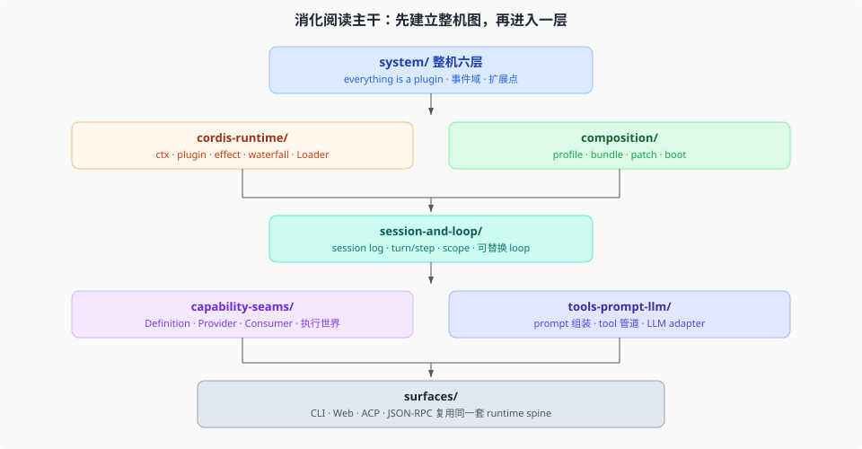

# `_digested` — DeepSeek Harness 源码消化

这个目录是对 DeepSeek Harness 源码的**消化分析**：从 TypeScript 源码出发，理解机制、架构和设计意图。它不是用户指南，也不是给 upstream 的补丁。

> **当前源码基线**：本文档集以 DeepSeek Harness `0.1.0-rc.5`（commit `47f943859bef60e4160492346772ded9b24f765a`，与 `upstream/master` 重合）为准。版本演进只记录在 [`_change_log/`](./_change_log/00-index.md)；正文中的机制结论描述当前 checkout。

`_digested/` 面向已熟悉 agent harness / plugin 运行时，但尚未建立 DeepSeek Harness 概念体系的读者。这里先抓住思想主轴，再进入源码机制——而不是把 `packages/` 目录平铺成分类货架。

当前阶段各专题的 `00-map.md` 是**图文介绍**：把这一层是什么、不是什么、和谁接、图在哪，讲清楚。机制级深挖以后另开章节。图一律放在该专题目录下的 `figures/`。

文件不叫 `README.md`：仓库的 bilingual pairing 门禁会把任意 `README.md` 当成产品文档语料。研究目录用 `00-index.md` / `00-map.md`。

## 分支纪律

| 分支 | 上面有什么 |
|------|------------|
| `master` | 干净的 upstream 镜像。不放研究材料，不改产品代码。 |
| `ethan` | 研究分支。源码随 `upstream/master` merge 进来；研究只进 `_digested/` 和 `_faq_on_digested/`。 |

同步方式：在 `ethan` 上非快进 merge `upstream/master`，让源码对齐新基线，保留这两个研究目录，再按 `_change_log/` 审计过期结论。

## 与同级目录的关系

| 目录 | 本质 | 受众 |
|------|------|------|
| **`_digested/`** | 源码消化，机制剖析 | 想彻底搞懂背后发生了什么的人 |
| `_faq_on_digested/` | 跨消化材料的二次研究 | 我自己（产出者） |

本仓库不另做用户手册。官方怎么用、怎么扩展，仍读 `docs/` 和 package README。

## 子目录

专题按 **Harness 自己的主轴** 切，不按 OpenSpec 的 schema / CLI workflow 切。

| 目录 | 聚焦 | 一句话 |
|------|------|--------|
| `system/` | 总体系统专题 | everything-is-a-plugin、组合层、循环、seam、扩展点怎么拼成一台运行中的 `dsh` |
| `cordis-runtime/` | 被 vendor 的框架 | `ctx` / plugin / effect / event / waterfall / fiber / Loader |
| `composition/` | 启动组合 | profile、bundle、patch 层、Harness home、`dsh --dump-config` |
| `session-and-loop/` | 会话与驱动 | session log、turn/step、agent-loop、model-visible ⟺ logged、agent scope |
| `capability-seams/` | 可替换能力 | Service Definition / Provider / Consumer 三角色，以及为什么换一个 provider 能带走一整面执行世界 |
| `tools-prompt-llm/` | 模型可见面 | tool registry、system prompt 组装、LLM adapter、tool 执行瀑布 |
| `surfaces/` | 人对机器的入口 | CLI、Web host/client、ACP、JSON-RPC SDK |
| `_coverage/` | 覆盖矩阵 | 维护用索引，按源码组追踪 digest 覆盖状态 |
| `_change_log/` | 上游同步记录 | 每次 upstream 合入后的变更摘要与资料审计 |

## 阅读路径



- **熟悉 agent / plugin 运行时，但不熟 dsh** → `system/00-map.md`
- **想先搞懂 Cordis 在这棵树里到底是什么** → `cordis-runtime/00-map.md`，官方入门仍是 [`docs/cordis-primer.md`](../docs/cordis-primer.md)
- **想搞懂一次 `dsh --profile web` 怎么变成插件树** → `composition/00-map.md`
- **想搞懂一轮对话怎么跑** → `session-and-loop/00-map.md`
- **想加能力或换后端** → `capability-seams/00-map.md`
- **想搞懂模型看见什么** → `tools-prompt-llm/00-map.md`
- **想搞懂 CLI / Web / ACP 怎么接到同一棵树上** → `surfaces/00-map.md`

推荐主干顺序：

```text
system/
  → cordis-runtime/
  → composition/
  → session-and-loop/
  → capability-seams/ 或 tools-prompt-llm/
  → surfaces/
```

读完介绍再深挖。`cordis-runtime/` 已有 01–04 机制级正文；其余专题末尾的「以后深挖」仍是待开的源码专题。
