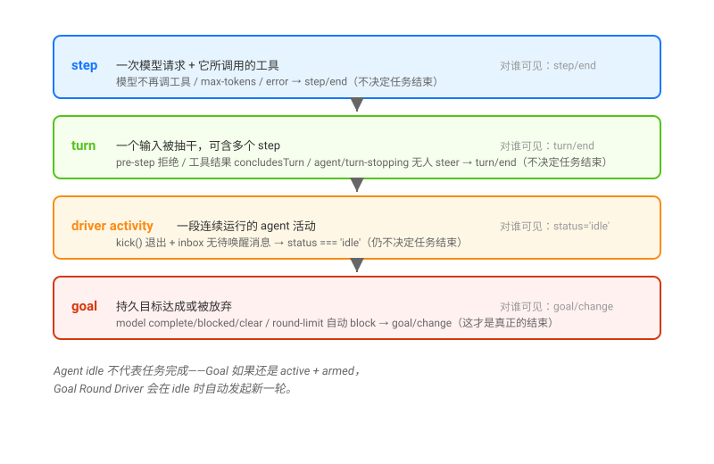

# Agent Loop · 推进、边界与 Goal 驱动

## 一句话

ruofei 说「Agent Loop 管推进，结束却分好几层」。Loop 不是「模型回答完就结束」——一次 step 结束不等于 turn 结束，agent idle 不等于任务完成，因为 Goal 可能还是 `active`，随时发起新一轮。



## 四层结束边界

| 层 | 什么结束 | 谁决定 | 对谁可见 |
|----|---------|-------|---------|
| **step** | 一次模型请求 + 它所调用的工具 | 模型不再调工具 / `max-tokens` / error | `step/end` 事件 |
| **turn** | 一个输入被抽干（可含多个 step） | 工具结果 `concludesTurn` / `agent/turn-stopping` 无人 `steer` | `turn/end` 事件 |
| **driver activity** | 一段连续运行的 agent 活动 | Agent 回到 idle，且 inbox 无待唤醒消息 | `agent/status === 'idle'` |
| **goal** | 一个持久目标达成或被放弃 | 模型调用 `update_goal` complete/blocked，或 round-driver 自动 block | `goal/change` 事件 |

**Agent idle 不代表任务完成**——它只说明此刻没有待处理的消息。Goal 如果还是 `active + armed`，Goal Round Driver 会在 idle 时自动发起下一轮。

## 三种创建 Goal 的路径

这是你最关心的实际问题。DSH 没有隐藏的意图理解引擎。Goal 只能通过以下三种方式产生：

| 路径 | 触发器 | 代码入口 | 典型场景 |
|------|--------|---------|---------|
| **Human `/goal`** | 用户手敲 `/goal 重构整个模块` | `packages/goal/command-goal/` | 你明确想设一个持久目标 |
| **Model `create_goal`** | LLM 在 turn 中调用 `create_goal` tool | `packages/goal/tool-goal/` | 你给了一个需求，模型判断这是长期任务、主动创建 goal |
| **Goal Round Driver** | 不创建，只延续。在 active + armed goal 下按 idle → 下一轮 | `packages/goal/goal-round-driver/` | 自动续轮，不会自动创建 |

**你遇到的「需求进去后 DSH 理解为 ongoing goal」——这是模型（LLM）通过 `create_goal` tool 做到的**，不是系统自动推断的。

`create_goal` tool 的 description（`packages/goal/tool-goal/src/index.ts:46-49`）：

> "**You may infer that intent without requiring the user to say 'create a goal'.** Do not use this for trivial single-turn work. Execution rejects non-human and subagent authority."

加上 system prompt 里 `tool:goal` section（order 114）进一步引导：

> "create_goal may infer goal intent from a direct human request in any language; do not create a goal for routine single-turn work."

所以**模型自己**读了你的需求、判断它需要跨多轮、自主调用 `create_goal`。然后 Goal Round Driver 在 agent 每次 idle 时自动推下一轮，形成持续到 objective 达成的效果。

## Goal 状态机

```
create() ──→ active (armed)
                │
     ┌──────┬──┴────┬────────┐
     │      │       │        │
     ▼      ▼       ▼        ▼
  pause()  complete()  block()  round-driver 触发下一轮
     │      │         │           │
     ▼      ▼         ▼           └─→ active (再次)
  paused  complete  blocked
     │                 │
     └── resume() ─────┘ ──→ active (re-armed)

  complete 是终态：不可 resume，只能被 create() 替换（新 goal id）
```

详细的状态机、每个转换的代码入口、CAS 机制见 [`01-goal-lifecycle.md`](./01-goal-lifecycle.md)。

## Agent Loop 的完整代码栈

```
┌─────────────────────────────────────────┐
│            goal-round-driver            │  ← 自动续轮
│  监听 agent/status === 'idle' + goal    │
│  通过 followup() 注入下一轮 prompt      │
├─────────────────────────────────────────┤
│           agent-loop                    │  ← turn/step 驱动
│  turn() → claim → pre-step → step()    │
│  → tool-execute → turn-stopping        │
├─────────────────────────────────────────┤
│           dsh-agent                     │  ← Agent 接口
│  AgentRegistry / AgentFactory          │
│  inbox / status / followup / steer     │
├─────────────────────────────────────────┤
│           session                       │  ← 仅追加事件流
│  turn/* / step/* / user/message /      │
│  assistant/* / tool/* / goal/change    │
└─────────────────────────────────────────┘
```

## 阅读路径

下面先读 goal 的完整生命周期（含你的核心问题的详细答案），再读 Goal Round Driver 的自动续轮机制，最后读四层结束边界如何配合。

| 文件 | 内容 |
|------|------|
| [`01-goal-lifecycle.md`](./01-goal-lifecycle.md) | Goal 状态机、三种创建路径详解、「模型推断 vs 手动敲」的透彻答案 |
| [`02-goal-round-driver.md`](./02-goal-round-driver.md) | Round Driver 如何监听 idle、注入 round prompt、pre-step 验证 |
| [`03-activity-vs-goal-boundaries.md`](./03-activity-vs-goal-boundaries.md) | step/turn/activity/goal 四层分别在哪结束、崩溃恢复时序 |

Agent Loop 内部（turn/step/inbox/claim）的详细时序已在 [`_digested/session-and-loop/02-inbox-与turn-时序.md`](../session-and-loop/02-inbox-与turn-时序.md) 覆盖，这里不再重复。

## 源码入口

| 路径 | 角色 |
|------|------|
| `packages/core/agent-loop/src/agent.ts` | `ReactLoopAgent`：`turn()`、`step()`、tool 执行 |
| `packages/core/agent-loop/src/index.ts` | loop 插件：`ctx.agents.setFactory(this)` |
| `packages/goal/goal/src/index.ts` | `GoalService`：create / pause / resume / complete / block / clear |
| `packages/goal/tool-goal/src/index.ts` | `create_goal` / `get_goal` / `update_goal` 三个 model-facing tool |
| `packages/goal/command-goal/src/index.ts` | `/goal` human command |
| `packages/goal/goal-round-driver/src/index.ts` | Goal Round Driver：自动续轮、pre-step 验证 |
| `packages/goal/goal-round-driver/src/prompt.ts` | 下一轮注入的 prompt 文本 |
| `packages/goal/goal/src/types.ts` | GoalId、GoalSnapshot、GoalPhase、GoalView、GoalProjection 类型 |
| `packages/goal/goal/src/fold.ts` | 严格的纯函数 fold（回放时重建 goal 状态） |
| `packages/goal/goal/src/invariant.ts` | goal stream 不变量（回放时校验） |
| `packages/goal/tool-goal/src/authority.ts` | 谁可以操作 goal：direct human 或当前 goal round；subagent 被拒绝 |
| `packages/bundle/base/cordis.patch.yml` | `goal`、`goal-round-driver`、`command-goal`、`tool-goal` 都在 base bundle 的 insert 里 |
| `_digested/session-and-loop/00-map.md` | turn/step 基础词汇和事件骨架 |
| `_digested/session-and-loop/02-inbox-与turn-时序.md` | turn() 内部时序、claim、pre-step |
