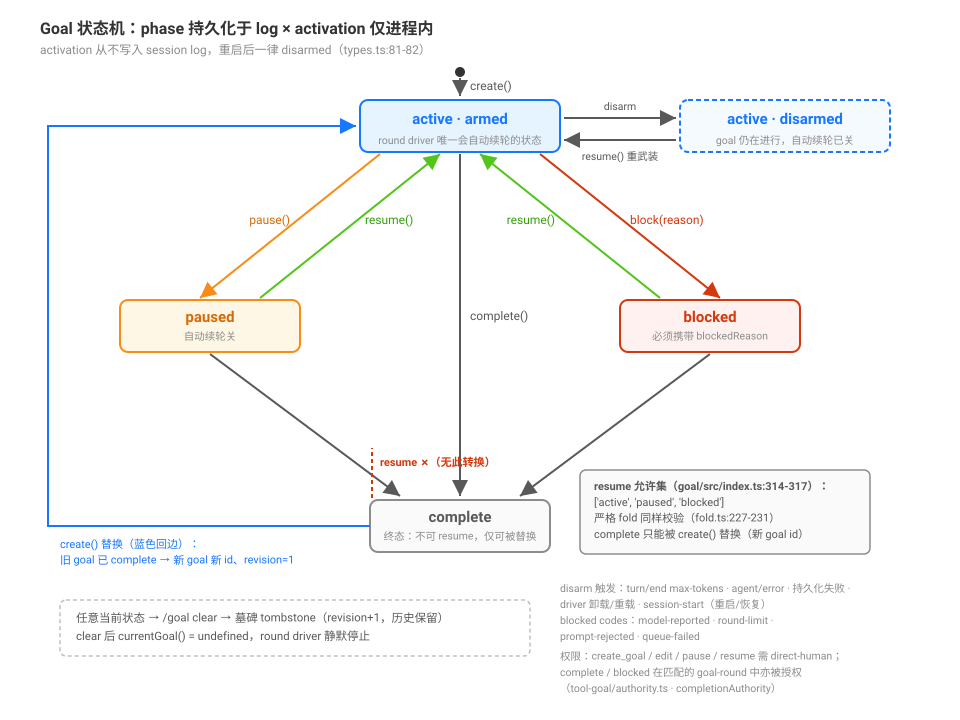

# Goal 生命周期：创建、状态机与三种路径

## 源码核验入口

`packages/goal/goal/src/index.ts`（`GoalService`）、`packages/goal/goal/src/types.ts`（类型）、`packages/goal/goal/src/fold.ts`（fold 验证）、`packages/goal/tool-goal/src/index.ts`（模型 tool）、`packages/goal/command-goal/src/index.ts`（human 命令）。

## 你的核心问题：goal 是怎么被创建的？

DSH 没有隐藏的「意图理解引擎」来自动创建 goal。goal 只能通过以下方式产生：

### 路径一：模型通过 `create_goal` tool 创建 ← 你看到的效果

`packages/goal/tool-goal/src/index.ts:207-232` 注册了 `create_goal` tool。关键的引导在于 tool 的 `description`（第 46-49 行）：

> "Create one persisted same-session completion goal when the current direct human request is a long-running objective that should continue across autonomous goal rounds. **You may infer that intent without requiring the user to say 'create a goal'.** Do not use this for trivial single-turn work."

加上 system prompt 的 `tool:goal` section（第 189-193 行，order 114）进一步给模型同样的授权：

> "**create_goal may infer goal intent from a direct human request in any language**; do not create a goal for routine single-turn work."

**这就是你体验到的效果**：你给了一个需求（比如「把这个模块重构了」），模型在自己的 system prompt 里看到 `tool:goal` 的政策说明，判断这是长期任务，**自己调用** `create_goal` tool。不是系统自动推断的，是 LLM 在 tool description 引导下自主决策。

`create_goal` 执行前还有一个守卫（`authority.ts`）：

```
requireDirectHuman(ctx, execution)  // 只允许在 human 发起的 turn 中创建
```

所以 subagent 或自动场景不能创建 goal。

### 路径二：用户手敲 `/goal <objective>`

`packages/goal/command-goal/src/index.ts:188-196` 注册了 `/goal` 命令。解析（第 34-44 行）是**整词匹配，不是前缀匹配**：`clear`/`pause`/`resume`/`edit` 必须与整个输入相等（`edit` 也可以是 `edit ` 加空白加 objective），其余一切输入——包括 `cleanup` 这种恰好「以 clea 开头」的词——都视为创建：

```ts
if (/^edit(?=\s)/iu.test(input)) return { kind: 'edit', objective: input.slice(4).trim() }
return { kind: 'create', objective: input }  // 其余所有输入 = 创建；空输入 = show
```

调用 `ctx.goals.create(invocation.agent, { objective: command.objective })`。

### 路径三：Goal Round Driver — 不创建，只延续

Goal Round Driver（`goal-round-driver/src/index.ts`）不会自动创建 goal。它的 `drive()` 方法第一行就检查：

```ts
const goal = currentGoal(state)
if (goal === undefined || goal.phase !== 'active' || goal.activation !== 'armed') return
```

没有 goal 就静默返回。它只负责在 active + armed 的 goal 下自动推进下一轮。

### 所以答案很明确

| 你做的 | 系统反应 | 路径 |
|--------|---------|------|
| `/goal 重构这个模块` | 立刻创建，主动回显 | Human 命令 |
| 你说「把这个模块重构了」 | 模型判断是长期任务，调用 `create_goal` | 模型 tool（你看到的效果） |
| 什么都没说 | 不会自动创建任何 goal | 无 |

## Goal 状态机



`phase`（active / paused / blocked / complete）持久化于 session log；`activation`（armed / disarmed）是进程内状态，从不持久化。全部转换与守卫：

| 操作 | 允许的当前 phase | 结果 | 权限 |
|------|-----------------|------|------|
| `create()` | 无 goal，或 `complete`（替换，新 goal id） | active + armed | direct-human |
| `edit()` | 任意当前 | phase 不变，revision+1 | direct-human |
| `pause()` | 仅 active | paused + disarmed | direct-human |
| `resume()` | `active·disarmed` / paused / blocked | active + armed（需剩余 round 预算） | direct-human |
| `complete()` | active / paused / blocked | complete + disarmed | direct-human 或 goal-round |
| `block()` | 仅 active | blocked + disarmed（带 blockedReason） | direct-human 或 goal-round |
| `clear()` | 任意当前 | 墓碑 tombstone（revision+1） | human 命令 |

两个容易记错的点：**`complete` 是终态，不可 resume**——`resume` 的允许集只有 `['active', 'paused', 'blocked']`（`goal/src/index.ts:366`，严格 fold 同 `fold.ts:227-231`），complete goal 只能被 `create()` 替换；**blocked 可以手动 resume**（需 human 权限），只是不会被 round driver 自动续轮。

### 各状态的含义

| 状态 | 含义 | round-driver 是否继续 |
|------|------|---------------------|
| `active (armed)` | 目标正在进行中，自动续轮已打开 | 是，idle 后自动下一轮 |
| `active (disarmed)` | 目标在进行中，但自动续轮已关闭 | 否（需要手动 resume 或 `/goal clear`） |
| `paused` | 暂停，agent 不再为此工作 | 否 |
| `complete` | 目标已达成 | 否 |
| `blocked` | 目标被阻塞；不会被自动续轮，但可由 human 手动 resume | 否（等待 human） |

### 驱动 goal 往前走的两种机制

**Goal Round Driver** 只管在 active + armed + 未达 round limit 时发起下一轮。它不检查 objective 是否完成。

**模型**通过 `update_goal` tool 可以 `complete`、`blocked`、`edit`、`pause`、`resume`。其中 `complete` 和 `blocked` 不需要 human origin（在 goal-round 中被授权），因为这是模型自己报告任务状态：

```ts
// tool-goal/src/index.ts 第 285 行
const authority = completionAuthority(ctx, execution)
// authority.kind === 'goal-round' 时允许 complete/blocked
```

## 持久化与 CAS

Goal 的所有变更通过 session log 的 `goal/change` 事件持久化。系统使用 **compare-and-set**（CAS）防止竞态：

- 每次变更带 `revision` 编号
- `fold.ts` 的 `applyGoalChange()` 严格验证：只能从 revision N 到 N+1
- 同一会话、同一时间只允许一个 goal（completed 后可替换）
- 回放时从 session log 的 `goal/change` 事件重建 goal 状态
- `roundsStarted` 由 goal 来源（`source.kind === 'goal'`）的 `user/message` 推进，fold 严格验证 round 归属（`fold.ts:321-331`）

### 默认配置

| 配置 | 默认值 | 位置 |
|------|--------|------|
| `maxGoalRounds` | 256（可配） | `GoalService.Config.defaultMaxGoalRounds` |
| `blockedAfterConsecutiveRounds` | 3（可配） | `tool-goal.Config.blockedAfterConsecutiveRounds` |

## 源码入口

| 路径 | 角色 |
|------|------|
| `packages/goal/goal/src/index.ts` | `GoalService`：领域边界、所有 mutation 方法 |
| `packages/goal/goal/src/types.ts` | `GoalId`、`GoalRef`、`GoalSnapshot`、`GoalView`、`GoalPhase` |
| `packages/goal/goal/src/fold.ts` | 严格的回放重构、CAS 验证、round 归属验证 |
| `packages/goal/goal/src/domain.ts` | `GoalChangeMeta`、`GoalMessageSource`、`GoalChanged` 事件 |
| `packages/goal/tool-goal/src/index.ts` | 三个模型 tool + system prompt section |
| `packages/goal/tool-goal/src/authority.ts` | 执行权限守卫 |
| `packages/goal/command-goal/src/index.ts` | `/goal` 命令解析与执行 |
