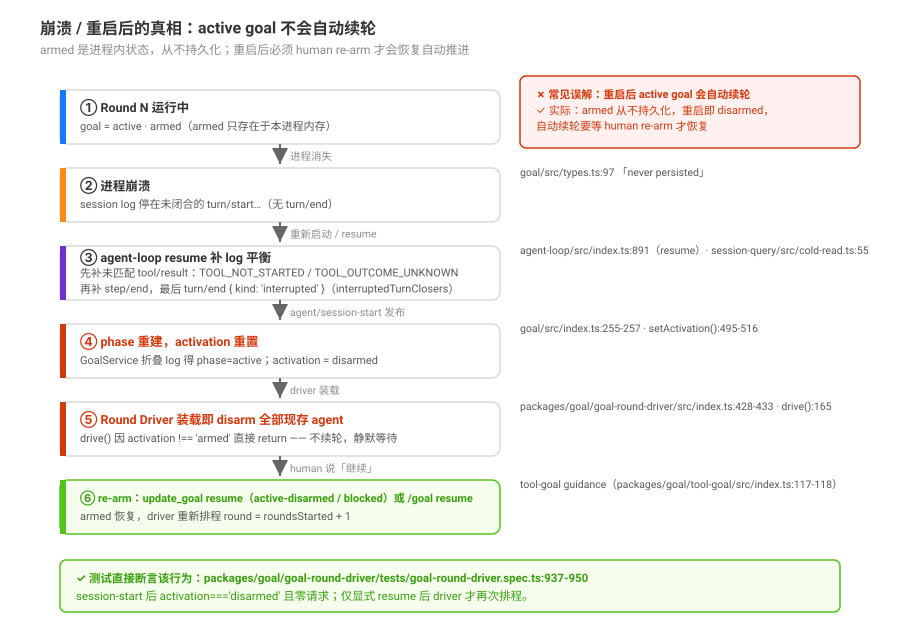
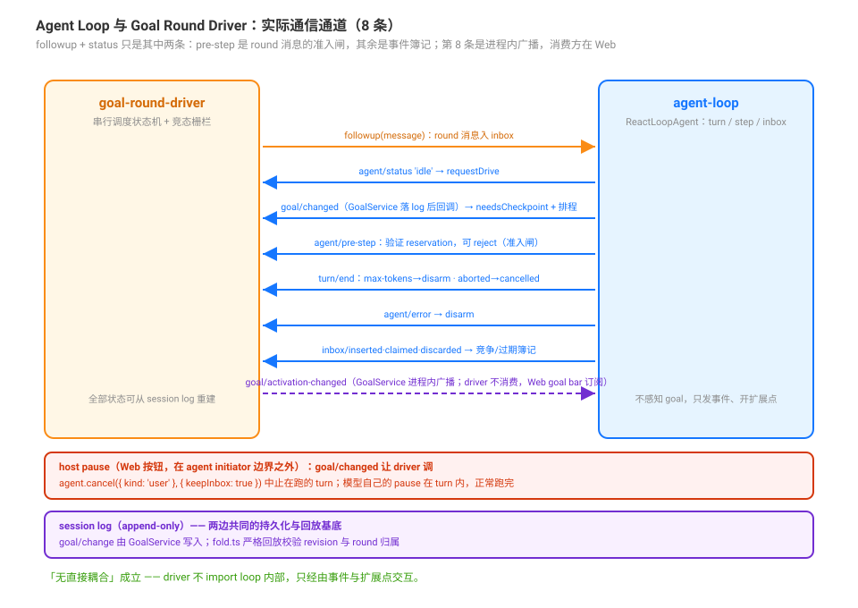

# 四层结束边界 — step / turn / activity / goal

## 源码核验入口

`packages/core/agent-loop/src/agent.ts`（step、turn、activity）、`packages/goal/goal-round-driver/src/index.ts`（goal 层）、`packages/goal/goal/src/index.ts`（goal 状态持久化）。

## 四层总览

ruofei 文章原文：「最小 Loop 常被写成 `while (hasToolCalls)`。真实任务里，模型这一轮没再调工具，只能说明这一次请求结束了，任务未必结束。」

DSH 把一层层边界分开，每一层由不同的组件负责，终结条件也各自独立：

### step（步）

| 问题 | 答案 |
|------|------|
| 谁驱动 | `ReactLoopAgent.step()`（packages/core/agent-loop/src/agent.ts:352-498） |
| 什么时候结束 | 流式 chunk 收完 → `BlockAssembler.finish` 判断：`completed`（无 tool-call）、入工具执行（可能 `concludesTurn`）、`max-tokens`、`error` |
| 对谁可见 | `step/start` → `step/end` 事件写入 session |
| 关键细节 | 请求错误（`agent/request-error`）可以 `retry`，同一 step 内重发请求，不新开 step |

### turn（对话轮）

| 问题 | 答案 |
|------|------|
| 谁驱动 | `ReactLoopAgent.turn()`（packages/core/agent-loop/src/agent.ts:269-350） |
| 什么时候结束 | `preStep` 被 reject（`blocked`）；首次 step 消息为空（`completed`）；所有 step 完成后 `turn-stopping` 无人 steer 且 inbox 无 next-step 消息 |
| 对谁可见 | `turn/start` → `turn/end` 事件写入 session，`turn/end.reason` 记录结束原因 |
| 关键细节 | turn 可以含 0 个或多个 step。`turn/end` 不会发 `interrupted`——那是崩溃恢复层补的 |

### driver activity（驱动活动）

| 问题 | 答案 |
|------|------|
| 谁驱动 | `ReactLoopAgent.wakeDriver()` → `kick()`（packages/core/agent-loop/src/agent.ts:225-238；`wakeDriver` 本体 :187-208） |
| 什么时候结束 | `kick()` 的 `while (await this.turn()) {}`（packages/core/agent-loop/src/agent.ts:227）返回 `false`（turn 返回 false 的三条路径：pre-step reject→`blocked`（packages/core/agent-loop/src/agent.ts:292）、首步消息为空（packages/core/agent-loop/src/agent.ts:299）、inbox 无待唤醒消息（packages/core/agent-loop/src/agent.ts:344）） |
| 对谁可见 | `agent/status` 从 `'running'` 变回 `'idle'` |
| 关键细节 | 整段 activity 在 `ctx.agents.withInitiator(agent, () => kick())` 的因果边界内运行（packages/core/agent-loop/src/agent.ts:207）——这是 host / model pause 判据的来源（见 [`04-agent-runtime-identity.md`](./04-agent-runtime-identity.md)）。`maintenance` 阶段 `status` 也是 `'idle'`。`kick()` catch 所有 error（packages/core/agent-loop/src/agent.ts:228-229）并 contained 在 driver 边界。activity 结束后自动重检查 `wakeRequested`（packages/core/agent-loop/src/agent.ts:235） |

### goal（持久目标）

| 问题 | 答案 |
|------|------|
| 谁驱动 | `Goal Round Driver` 监听 `agent/status === 'idle'` |
| 什么时候结束 | `goal/change` operation = `complete` / `blocked` / `clear`；或自动 `round-limit` block（disarm 只是收回自动续轮，不是结束） |
| 对谁可见 | `goal/change` 事件写入 session，`goal` projection 单元对外暴露 |
| 关键细节 | agent idle 不代表 goal 结束。goal 真正结束是 phase 离开 active（complete / blocked / clear）；active + disarmed 只是失去自动续轮，仍可 resume |

## turn/end 的 reason 对照

`turn/end` 的 `reason` 字段记录这一轮为什么结束，各方据此决定下一步行动。loop 只会写下表这五种 reason；`{ kind: 'interrupted' }` 不是 loop 发的，而是由 `interruptedTurnClosers` 在 agent-loop resume（`packages/core/agent-loop/src/index.ts:891`）与 session-query 冷读（`packages/core/session/src/repair.ts:29`）两处补写：

| reason | 含义 | round-driver 反应 | user 看到 |
|--------|------|-------------------|-----------|
| `{ kind: 'completed' }` | 正常完成，无更多 step | 检查 goal，若 active+armed 则下一轮 | 模型回复正常展示 |
| `{ kind: 'max-tokens' }` | 输出达到 token 上限 | **disarm** goal！不再自动续轮 | 消息截断 |
| `{ kind: 'aborted', reason }` | 被取消（`user` / `parent` / `hook` / `disposed`；反序列化的旧记录可带 `legacy`） | attempt 标记 cancelled，driver 重新评估 | 中途打断 |
| `{ kind: 'blocked' }` | pre-step 拒绝，无 step 被处理 | 不特别处理（pre-step hook 可能已 block goal） | 未产生回复 |
| `{ kind: 'error', error }` | 执行出错 | disarm（经 `agent/error` 事件，`goal-round-driver/src/index.ts:246-249`） | 错误提示 |

`aborted.reason` 的类型是 `TurnEndCancelCause`：`AgentCancelCause`（`user` / `parent` / `hook` / `disposed`）再加上 `{ kind: 'legacy' }`，后者只出现在导入的旧记录里（`packages/core/session/src/types.ts:188-195`）。

## 崩溃恢复

进程崩溃时，session log 里有 `turn/start` 但没有匹配的 `turn/end`。补 closer 的实现从「持久化协调器的职责」改成由两个消费点各自调用同一个可复用函数 `interruptedTurnClosers`（`packages/core/session/src/repair.ts:29`；该函数在 OLD 基线已存在，OLD 的调用点是 `git show a66e470204:packages/session/session-persistence/src/coordinator.ts` 第 1080 行），两侧各调一次：

```
turn/start (turn=5)
  step/start (turn=5, step=1)
  step/end   (turn=5, step=1)  ← 这之前的都可信
  ? 可能还有未闭合的 step 或 chunk  ?
turn/end (turn=5, reason={ kind: 'interrupted' })  ← 之后补的
```

- **agent-loop 的 resume** 打开写句柄、读完已存日志后，把这些 closer **追加写回**（`packages/core/agent-loop/src/index.ts:888-894`）——这是唯一落盘的一侧，不是 loop 运行时发的。
- **session-query 的冷读**在只读句柄上为读取视图合成同一组 closer，不写回存储（`packages/session-query/session-query/src/cold-read.ts:55`）。

`turn/end` 的 `interrupted` 只用于恢复。不要和 `assistant/message.interrupted` 混——那是 loop 取消时主动写的前缀定稿。

## Goal 的持久化保障



`phase` 不依赖进程内存：所有 `goal/change` 事件写入 session log，进程重启后 fold（`fold.ts`）从 log 重放，重建 goal 状态。但 **`activation`（armed / disarmed）从不持久化**（`packages/goal/goal/src/types.ts:97` 的 `activation` 字段注释「never persisted」）：`agent/session-start` 时 `GoalService` 把 activation 重置为 `disarmed`（`goal/src/index.ts:255-257`），Round Driver 装载时也会 disarm 全部现存 agent（`goal-round-driver/src/index.ts:428-433`）。

所以崩溃重启后，goal 停在 active + **disarmed**——**自动续轮不会自动恢复**，必须 human re-arm 之后，driver 才从 `roundsStarted + 1` 继续；round 计数完全重建自 log，不会漏也不会超前。re-arm 的通道要分清：模型 `update_goal resume` 只覆盖 `active·disarmed` 与 `blocked`，若 goal 处于 `paused` 则必须走 human 的 `/goal resume` 或 Web 恢复（`tool-goal/src/index.ts:279-286`）。测试直接断言 session-start 后的重置行为（`packages/goal/goal-round-driver/tests/goal-round-driver.spec.ts:937-950`）。

## Goal 与 Agent Loop 的通信通道

Goal 与 Agent Loop 之间没有直接耦合：driver 不 import loop 内部，loop 也不感知 goal，双方只经由事件与 inbox 交互——但通道不止 followup 和 status 两条：



1. `agent.followup()` — driver 往 inbox 写 round 消息，loop 在 pre-step 时 claim
2. `agent/status === 'idle'` — driver 监听这个信号决定要不要推进下一轮
3. `agent/pre-step` waterfall — driver 验证 reservation，可返回 `reject`（round 消息的准入闸）
4. `goal/changed` — mutation 提交后触发 checkpoint 标记与重新排程；host 发起的 `pause` 还会让 driver 调 `agent.cancel({ kind: 'user' }, { keepInbox: true })` 中止在跑的 turn（`goal-round-driver/src/index.ts:283-294`）
5. `turn/end` — `max-tokens` 触发 disarm；`aborted` 把 claimed/admitted 的 attempt 标记 cancelled
6. `agent/error` — 触发 disarm
7. `agent/inbox/inserted` / `claimed` / `discarded` — competing / stale 簿记
8. `goal/activation-changed` — `GoalService.setActivation()` 在 activation 真正变化时广播的进程内事件（`goal/src/index.ts:495-516`）。driver 不消费它；消费方是 Web goal bar（经 Remote 白名单转发，`packages/api/remotes/src/remote-events.ts:26`；订阅点 `packages/client/ui-goal/src/client/index.ts:95`）

## 场景：一次完整的 goal 生命周期

```
人: "把这个模块重构了"
                     ↓
模型推断是长期任务，调用 create_goal
                     ↓
goal/change { operation: 'create', phase: 'active' }
  round-driver 被 goal/changed 事件触发
  → 但 agent 正在 running，不满足 idle
                     ↓
turn 结束，agent 回到 idle
  round-driver 收到 agent/status === 'idle'
  → drive() 检查通过
  → followup() 注入 round 1 的 <goal_round> prompt
                     ↓
turn（round 1）:
  模型工作 → 部分完成 → 没调 complete → turn 结束
                     ↓
agent idle → driver 注入 round 2
                     ↓
turn（round 2）:
  模型继续工作 → 全部完成 → 调 update_goal complete
  → deferContext() 注入 <goal_complete> wrapup
  → 模型向人写关闭消息 → turn 结束
                     ↓
agent idle → driver 检查 goal.phase === 'complete'
  → 直接 return → 不再续轮
                     ↓
完结
```

## 四层分别由谁关停

| 层 | 关停操作 | 源码位置 |
|----|---------|---------|
| step | `step()` 内 `return { kind: 'max-tokens' }` 或 `{ kind: 'completed' }` | packages/core/agent-loop/src/agent.ts:484（max-tokens）、:487、:492（completed） |
| turn | `return false`：pre-step reject→`blocked`、首步消息为空、inbox 无 pending | packages/core/agent-loop/src/agent.ts:292、:299、:344 |
| activity | `kick()` finally 块 `setPhase({ kind: 'idle' })` | packages/core/agent-loop/src/agent.ts:225-238（`setPhase` 调用 :234） |
| goal | `ctx.goals.complete()` / `block()` / `clear()` | goal/src/index.ts:390-400（complete）、:409-424（block）、:432-447（clear）<br>goal-round-driver:166-172（auto block） |
