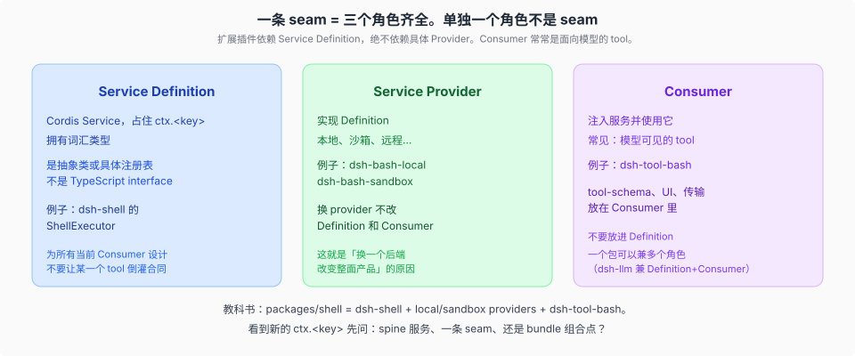
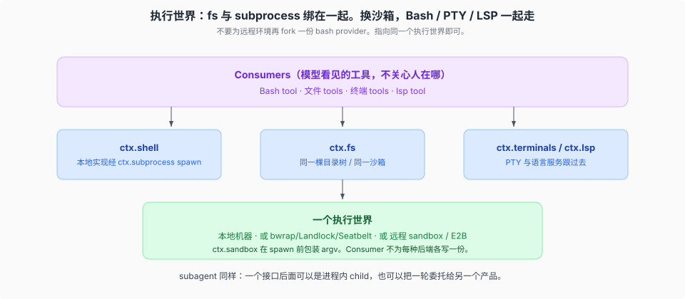

# Capability seams · 可替换能力

## 一句话

一条 **seam** 是可替换的**完整能力**，必须有三个角色：Service Definition、Service Provider、Consumer。单独一个角色不是 seam。加一项能力，意味着把三者一并设计。

扩展插件依赖 Definition，绝不依赖具体 Provider。这就是「换一个后端，整面产品跟着变，Consumer 不用改」的原因。

## 三角色

| 角色 | 它是什么 | 典型落点 |
|------|----------|----------|
| **Service Definition** | 声明 `ctx.<key>` 和词汇的 Cordis `Service`（抽象类或注册表，不是 `interface`） | `dsh-shell` 的 `ShellExecutor` |
| **Service Provider** | 实现它 | `dsh-bash-local` / `dsh-bash-sandbox` |
| **Consumer** | 注入并使用；常见是面向模型的 tool | `dsh-tool-bash` |

一个包可以兼多个角色——`dsh-llm` 同时拥有 Definition 和 Consumer。角色分包装，是因为它们会独立演化；合在一个包里，是因为它们就是同一件事。

**设计 Definition 时对着所有当前 Consumer。** tool-schema、Loader、UI、传输、某个 provider 的癖好，放在 Consumer 或 provider 里。反味：一个公开服务方法只有一个内部调用者——那多半该是私有闭包，不该抬成合同。

看到新的 `ctx.<key>`，先问它是 spine 服务、一条 seam、还是 bundle 组合点。只有三角色齐全才叫 seam。

## 远程执行世界与本地 confinement

在 E2B 组合里，`dsh-fs-e2b` 与 `dsh-subprocess-e2b` 注入同一个 `ctx.e2b`，因此共享一棵远程 Linux 目录树和进程世界。依赖 `ctx.fs` / `ctx.subprocess` 的 Consumer 随 provider 组合切换，不必为远程再 fork 一份实现。

本地 shell 经 `ctx.subprocess` spawn；`ctx.sandbox` 在 spawn 前包装 argv。这种 confinement 约束一次本地进程启动，不会自行迁移 `ctx.fs`，也不等于一套完整的远程执行世界。Consumer 面对的是 Definition，不是「我在哪台机器上」。

subagent 是同一模式的另一个例子：一个接口后面，可以是进程内 child agent，也可以是经 ACP 或 JSON-RPC 驱动的独立进程。

教科书路径：顺着 `packages/shell/` 走完 Definition → provider → `dsh-tool-bash`。组级 README 拥有「这个组有哪些包、对应哪个 `ctx` key」——本专题不手抄完整包表，完整图在生成的 [`docs/capability-seams.md`](../../docs/capability-seams.md)。

## 源码入口

| 路径 | 角色 |
|------|------|
| [`docs/glossary.md`](../../docs/glossary.md) `capability-seam` | 术语合同 |
| [`docs/capability-seams.md`](../../docs/capability-seams.md) | 生成的包 / key / 实现 / 消费者图 |
| `packages/shell/` | 范本家族 |
| `packages/fs/`、`packages/subprocess/` | 执行世界的文件与进程能力 |
| `packages/sandbox/` | 本地进程 argv confinement |
| `packages/llm/` | Definition 与 Consumer 可同包 |
| `packages/subagent/` | 差异极大的 provider，同一接口 |
| `.agents/notes/implemented/architecture/2026-06-13-capability-seams.md` | 为什么这样切 |

## 机制级正文

| 文件 | 内容 |
|------|------|
| [`01-三角色与分包装.md`](./01-三角色与分包装.md) | 分包装的味道；换 E2B 时 tool 源码不动 |
| [`02-一次bash从tool到sandbox.md`](./02-一次bash从tool到sandbox.md) | resolve → confine → spawn；run 的失败合同 |

模型可见的 tool 管道在 [`../tools-prompt-llm/00-map.md`](../tools-prompt-llm/00-map.md)。
