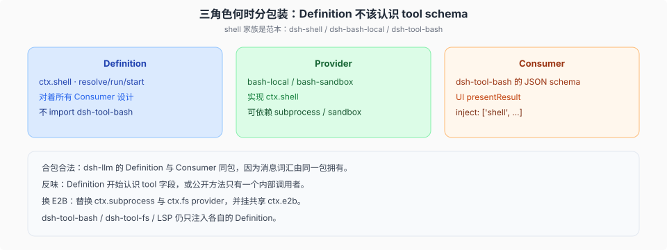

# 三角色、分包装、换执行世界

源码核验入口：`packages/shell/shell/src/index.ts`、`docs/capability-seams.md`、`.agents/notes/implemented/architecture/2026-06-13-capability-seams.md`、`packages/e2b/e2b/README.md`。

本篇说明角色何时需要分包装，以及换 E2B 时哪些 Consumer 保持不变。



## 三个角色，一个 `ctx` key

以 shell 为范本：

| 角色 | 包 | 它认识什么 |
|------|----|------------|
| Definition | `dsh-shell` | `ctx.shell`：`resolve` / `run` / `start`、`ShellExecRequest` → `ShellExecSpec` |
| Provider | `dsh-bash-local`、`dsh-bash-sandbox` | 怎么变成进程；local 走 `ctx.subprocess` |
| Consumer | `dsh-tool-bash` | 模型 JSON schema、`presentResult`、审批文案 |

Definition 是 Cordis `Service` 抽象类，不是 TypeScript `interface`。加载第二个 `ctx.shell` 按 Cordis 重复服务失败。win32 层用 pwsh 行换掉 POSIX 行，不会两个 executor 同时挂。

`resolve(request): Spec` 是默认化的显式一步。`run` 收 Spec，不收半填的 request。这是包边界「explicit > implicit」的模板。

## 何时必须分包装

分，是因为角色会**独立演化**：换沙箱提供方不该重发 npm 上的 tool schema；改模型可见参数不该动 spawn 实现。

必须分开的味道：

- Definition 开始出现 tool 的 JSON 字段名、UI card 类型、ACP 映射。
- 一个公开服务方法只有一个内部调用者——那是私有闭包，不该抬成 `ctx` 合同。
- Consumer 为了「方便」把 schema 倒灌进 Definition，让第二个 Consumer 被迫认识第一个 tool 的参数。

可以合包：`dsh-llm` 同时拥有消息/流词汇（Definition）和组装 Consumer。拆开会让「什么是一条 LLM 消息」有两个家。合是因为它们就是同一件事。

看到新的 `ctx.<key>`，先问：spine（`ctx.sessions`）、一条 seam、还是 bundle 组合点。只有三角色齐全才叫 seam。`ctx.jobs` 有 Definition / 本地 provider / `job_*` tools，是 seam。`ctx.agentLoop` 是默认驱动插件，不是「loop seam」。

## 换 E2B / 远程时，谁可以一字不改

文件系统和进程共享**一个执行世界**。E2B 家族：

```text
dsh-e2b          ctx.e2b   一块远程 Linux 树 + 进程世界的生命周期
dsh-fs-e2b       ctx.fs    inject e2b
dsh-subprocess-e2b  ctx.subprocess  inject e2b
```

Consumer 只 inject Definition：

- `dsh-tool-bash` → `ctx.shell`（其 provider 再 inject `ctx.subprocess`）
- `dsh-tool-fs` → `ctx.fs`
- `dsh-tool-lsp` / PTY / terminal：跟着 subprocess + fs 走

把 local subprocess/fs 行换成 e2b 那两行（外加共享 owner），这些 tool 源码不用改。要改的是 **bundle / profile patch**，不是 Consumer。

bash-local 的注释写明：执行政策属于 `tools/pre-execute` 或一个会 sandbox 的 executor 子类，不属于 local spawn 自己。远程世界若还要 Seatbelt/bwrap 那套 argv 包装，那是另一条 `ctx.sandbox`；E2B 提供方是另一台机器，confine 语义不同，不要假设 local sandbox 插件在远程仍有意义。

subagent 是同一模式：一个接口后面可以是进程内 child，也可以是经 ACP 或 JSON-RPC 驱动的独立进程。Consumer（`dsh-tool-subagent`）仍只看见 Definition。产品 Codex / Claude Code provider 的安装与 host 平面挂载是 profile 的事；tool 行上的 `backgroundMode` 决定后台是父级 Job 还是可续 child，见 [`03-subagent后台与产品provider.md`](./03-subagent后台与产品provider.md)。
