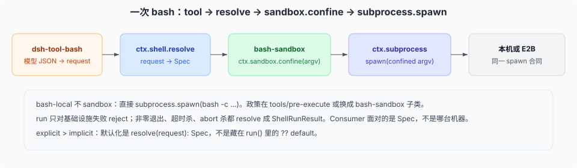

# 一次 bash：从 tool 调用到 sandbox argv

源码核验入口：`packages/shell/tool-bash/`、`packages/shell/shell/`、`packages/shell/bash-local/`、`packages/shell/bash-sandbox/`、`packages/shell/tool-bash-persistent/`、`packages/terminal/terminal-bash/`、`packages/sandbox/sandbox/`、`packages/subprocess/`。

教科书路径：顺着 shell 家族把一次 spawn 追完。Consumer 始终面对 Definition。

## 调用链

1. 模型发出 `tool/call`，name 是 bash 工具，`arguments` 是原始 JSON 字符串（未解析）。loop 记入 log。
2. 工具注册表解析并冻结参数；`tools/pre-execute` 只作 allow / deny / ask 决策。deny 或缺 answerer 的 ask 不进 body。
3. `tools/execute` 包住下面的 tool body。timeout 政策读 **tool** 的 `timeoutMs`；checkpoint 也在这一层先 flush。
4. `dsh-tool-bash` `execute`：校验 args → `sandboxPolicy.resolve` → **升权审批在这里**（`approveEscalation` + `ctx.approval`，不是 Definition 方法）→ 收成 `ShellExecRequest` → `ctx.shell.resolve` 得到 Spec。`stdin` / `env` / `stdoutMaxBytes` 不进模型 schema。
5. 前台 `ctx.shell.run(spec)` 或后台 `start(spec)`。
6. **bash-local**：`spawnSpec` 把 Spec 映成 `bash -c …` 的 `SubprocessSpawnSpec`，`this.ctx.subprocess.spawn(...)`。环境先合并 `ENV_OVERRIDES`（`NO_COLOR=1`、`TERM=dumb`、`PAGER=cat`、`GIT_PAGER=cat`），调用方显式 env 仍能盖掉。
7. **bash-sandbox**（子类）：在 spawn 前 `ctx.sandbox.confine(argv, policy)`，用包装后的 argv 再交给 subprocess。Windows 走另一套 ACL runner，合同仍是 confine → spawn。
8. body 结算后进入 `tools/post-execute`，随后 `tool/result` 入 log。

## `run` 的失败合同

`ShellExecutor` 规定：`run` **只**对基础设施失败 reject。非零退出、超时杀、abort 杀都 **resolve** 成 `ShellRunResult`。Consumer 把结果写成模型可见文本，不要把退出码 1 当成 harness 崩溃。

`start` 立即返回；后台进程没有 timeout。`done` 结算且**永不 reject**：provider 在给出直接结果之前失败时结算为 `killed`，stderr 上是一条 stage-neutral 注记（`subprocess failed before reporting an outcome: …`，`packages/shell/bash-local/src/index.ts:294`；合同措辞见 `packages/shell/shell/src/types.ts:168`-`:170`）。仍在跑的后台进程在组合拆除时停掉并等待。有 subprocess seam 时，这个边界是 `ctx.subprocess` 的 dispose——executor 单独 HMR 不会把活进程带走。

## 政策挂在哪

| 层 | 管什么 |
|----|--------|
| `tools/pre-execute` | hooks 等：准不准进 body |
| Consumer `execute` 里的 `approveEscalation` | sandbox 升权；走 `ctx.approval`，不在 `ShellExecutor` 上 |
| `approval/request` | 审批 seam；缺 answerer fail-closed |
| `ctx.sandbox.confine` | argv 怎么包（bwrap / seatbelt / windows-acl） |
| `ctx.shell.resolve` | cwd、timeout 默认与上限（实现拥有的 caps） |
| `ctx.subprocess.spawn` | 真正创建进程（本地或 E2B）；provider 在 spawn 前选定受管范围，普通句柄不再暴露 pid |
| tool `timeoutMs` + timeout-policy | 整次 tool 调用的协作截止 |

local executor 注释写：command defaulting、deadline 分类、模型友好终端环境、后台 stdout/stderr 合并，归它；执行政策不归它。

## 受管范围与原生 containment

`ctx.subprocess` 的公开句柄不再有 `pid`（`packages/subprocess/subprocess/src/types.ts:167`）：`spawn` 同步返回，target identity 是 provider 私有事实；`terminate()` 与 `waitForExit()` 作用于同一个 provider 选定的**受管范围**，provider 无法再观察该范围时 `waitForExit()` throw（`packages/subprocess/subprocess/src/index.ts:95`）。这是相对旧基线「进程组/进程树」语义的替换——一条子进程可以 `setsid`、reparent 或活过直接父进程，从而离开任何单一进程关系描述的范围；唯一保留 `pid` 的是终端句柄（`packages/subprocess/subprocess/src/types.ts:235`），PTY 身份与前台 inspection 需要它。

Linux 上合格的普通与 PTY 启动进入 user-systemd transient scope 加一次性 bootstrap，Windows 上合格的普通启动进入私有 runner 拥有的 kill-on-close Job；macOS 普通启动、Windows ConPTY 等未支持宿主回退到 PGID / `taskkill /T` / identity-fenced PTY 观察，并给出一条 provider 生命期警告（逃出可观察关系的后代不保证被终止或推迟 `waitForExit()`）。选中 native 路径后的失败不重放目标，避免执行两次。两条 native 路径、回退边界与 `native/system` 的 landlock-run + flock 双能力见 [`07-原生containment与native-system.md`](./07-原生containment与native-system.md)。

## 持久 bash 怎样判定「命令结束了」

`dsh-tool-bash-persistent` 把命令包进 start/end marker，再 `eval`。它**不**把 `PS1` 改成自己的提示符：setup 只做 `stty -echo`，好让后端自己的 prompt 就绪检测继续工作。

真正的受控 prompt 在 `dsh-terminal-bash`：bash 方言里 `PS1` 仍是 `CONTROLLED_PROMPT`，`PROMPT_COMMAND` 先打 OSC 133 结束标记，再重新赋上同一份 `PS1`。命令若改写了 `PS1`，下一轮 prompt 渲染前会被改回来。`shellDialect: pwsh` 时 `PS1`/`PROMPT_COMMAND` 无效，改用经 session 写入的 `prompt` 函数（`PWSH_PROMPT_SETUP`）并以 `ENCODING_PREAMBLE` 钉住 UTF-8；win32 的 persistent shell 由 `dsh-tool-pwsh-persistent` 提供，同一条 seam。

命令若没打出 end marker、却已经再次读 stdin（自己的 prompt，或前台子进程的 read），`waitReason === 'stdin_read'` 时返回已捕获输出，而不是空转到 tool deadline。`exec`、中断、交互式子进程走这条路。

## 和 jobs 的分界

job id、所有权、轮询、通知属于 `dsh-jobs`，不进 ShellExecutor。executor 独立于 session。这就是「Definition 对着所有 Consumer」：tool-bash 和 jobs 都可以 `resolve`/`start`，不必让 shell 认识 session。
