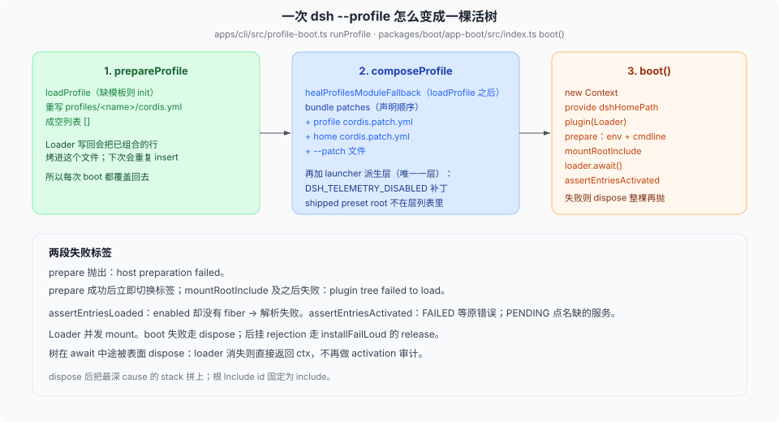
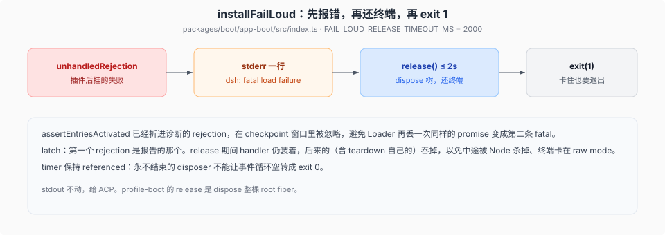

# `boot()` 时序

源码核验入口：`apps/cli/src/profile-boot.ts`（含 `installProxyFromEnvironment` 调用）、`packages/util/http-proxy/`、`packages/boot/app-boot/src/index.ts`、`packages/boot/app-boot/src/profile.ts`。

一次 `dsh --profile` 先准备磁盘上的空根，再计算层列表，由 `boot()` 挂载 Include，最后审计每一行是否激活。启动失败分两段标签；boot 结算后出现的 rejection 由 `installFailLoud` 处理。



## 入口是 `runProfile`，不是直接 `boot`

产品 bin 走 `apps/cli/src/bin.ts` → `runProfile`。`boot()` 不知道 profile、bundle、home patch；它只收一份绝对路径的根 YAML 和一份已经展平的 `patches`。

`runProfile` 做五件事，再把树交给插件自己过一辈子（或一次性 runner 自己退出）：

0. `installProxyFromEnvironment`：在任何行 mount **之前**按启动环境快照装进程级出网代理（`apps/cli/src/profile-boot.ts:249-252`，dispose 在 shutdown 链 `:256-260`）。Node 内建 `fetch` 自己不看 `HTTP_PROXY`，不装就每个 profile 都直连；从 launcher 快照而非 `process.env` 解析，`.env` 层里声明的代理才生效。它不是 patch 层，`--dump-config` 里没有。desktop-host 经 `runProfile` 起树，所以桌面同样被这条路覆盖（0.1.7 线起「桌面不走代理」的旧分歧已不存在）。
1. `composeProfile`：**先算 runtime resolution**（`composeProfile` 第一步 `await createRuntimeResolution(...)`）、加载 profile、叠层、加 launcher 派生补丁。
2. `installFailLoud`：后挂失败时先报错、再还终端、再 `exit(1)`。
3. `boot(NAME, rootConfig, structuredClone(allPatches), prepare)`；`prepare` 里 `provide('profileContext')`、启动环境快照与 `PluginPackages`（resolution 交给解析拦截层）。
4. `provideCmdline` 之后、树还活着就 commit `appReady`（`profile-boot.ts:317`）——profile HMR 的就绪前提，见 [`03-user-patch-hmr.md`](./03-user-patch-hmr.md)。

`prepare` 在任何配置树行 mount **之前**跑：把 `ctx` 存进 shutdown 闭包、`provide` 启动环境快照、`provideCmdline`。命令行参数和环境不是 patch 列表的一部分，活过 recomposition。

## `prepareProfile`：根文件每次都写成 `[]`

`PROFILE_ROOT_FILENAME = 'cordis.yml'`。内容是注释加 `[]`。`prepareProfile` **每次** `writeFileSync` 覆盖它。

原因：Loader 的树写回会把已经组合好的行烤进这个文件。下次再当根 include，bundle 的 `insert` 会插第二遍。dump 也锚定同一份空文件，boot 和 dump 才共用同一个 base。

## 模块解析：runtime-resolution 拦截层（0.1.7 线起）

~~`healProfilesModuleFallback` 在 `composeProfile` 内把安装闭包 BFS 链到 `$DSH_HOME/profiles/node_modules`~~（0.1.7 线退役，全仓 src 无此符号；0.1.5 的 `.dsh-module-fallback` link 投影由 `removeLinkProjections` 在装载期清除，`packages/boot/app-boot/src/profile.ts:275-283`）。现机制是**解析拦截**，不写任何文件：`composeProfile` 先经 `createRuntimeResolution`（`profile.ts:431-464`，入参 `installAnchor` + profile）算出一份不可变的 `RuntimeResolution`，随 `composed.resolution` 交给 boot 后由 `PluginPackages` 服务装到 Node 的 ESM + CJS 解析器上（`packages/boot/app-boot/src/profile-resolution/resolver.ts` 的 `installRuntimeInterception`）。解析顺序：profile 本地 `node_modules` 命中优先，其次是安装锚（installation manifest 的 deps+peers 闭包，`collectInstallationScopePackages`），再按声明者位置找 linked root（profile `node_modules` 下指向共享树之外的 symlink，`linkedProfileRoots`）；missing peer（cordis 等）也由这层补齐，全部插件共享同一解析结果。bundle 解析仍是**安装锚点优先**，列出的包没有 `dsh.bundle` 声明 → fail loud，不会默默跳过。

## 层列表：用户层之上还有 launcher 派生

`composeProfile` 算出的 `allPatches`：

```text
bundle patches（dsh.profile.bundles 声明顺序）
  + profile 的 cordis.patch.yml
  + $DSH_HOME/cordis.patch.yml（压过 profile）
  + --patch 文件（argv 顺序）
  + 仅 boot：DSH_TELEMETRY_DISABLED 非空 → { id, disabled: true }
```

只有 telemetry 这一层是 launcher 派生的 boot-only 层、不进 `--dump-config`。算法仍是 `composeEntries` → `applyEntryPatches([], structuredClone(flat))`。层集合不同，见 [`02-dump-与boot-保真.md`](./02-dump-与boot-保真.md)。

`resolveTelemetryPatch`：环境变量**任意非空**（含 `'0'` / `'false'`）都关掉。组合里没有 `session-telemetry-otel` 这一行就不生成补丁。隐私开关宁可误关，不误开。

**（0.1.7 线重写）** shipped preset root 机制已随 preset 声明式重设计退役：shipped presets 改由 bundle 携带（`packages/bundle/web-app/presets/*.patch.yml`），`agent-preset` 包不再有 `SHIPPED_PRESET_ROOT` / `includeShippedRoot` / `USER_PRESET_DIR` 的 discovery 常量；用户侧声明进 profile YAML。此段保留 0.1.5 线机制的原文记录。

## `boot()` 本身

```text
new Context()
  ctx.baseUrl = 根 YAML 所在目录的 file URL
  provide('dshHomePath', dshHomePath)     // !!js 能写 home
  plugin(Loader)
  prepare(ctx)                            // 阶段标签仍是 host preparation
  stage = 'plugin tree failed to load'    // prepare 成功后立即切换
  mountRootInclude(...)
  loader.await()
  若 loader 已消失 → 直接返回 ctx
  assertEntriesActivated
```

`mountRootInclude` 静态 import Include / Group，固定 id `'include'`，config 是 `{ path: fileURL, patches }`。稳定 id 使诊断和 snapshot 可重复。Group 一起注册，才能给 provider 和 consumers 同一个 `isolate` realm。

裸模块名默认对着 config 目录解析；打包运行时可以传 `bareModuleBaseUrl`，让主机而不是配置工程拥有整套插件。

## 两段失败标签

`stage` 初始为 `host preparation failed`。`prepare` 成功返回后、调用 `mountRootInclude` 之前切成 `plugin tree failed to load`，所以 Include 自身的解析和挂载失败属于插件树。catch 里 `await ctx.fiber.dispose()`——根 fiber 的清理按观察者隔离，重复 dispose 返回已结算的单次结果，这个 await 不会再抛、盖掉原来的 `cause`。

诊断把最深 `cause` 的 stack 拼上去。Loader 事务会按树层各包一层消息；真正的激活现场在最里面那个 Error。

树在 `await` 中途被表面 dispose：Loader 服务跟着走。再读 `ctx.loader` 会 TypeError，而应用其实是按请求退出的。所以每个 await 之后重查；loader 没了就返回，不做 activation 审计。

## 结算审计

`assertEntriesActivated` 先 `assertEntriesLoaded`：enabled 却没有 fiber → 解析失败，点名 `options.name`。

然后扫 fiber 状态（数值与 `tool-cordis` / web client 对齐，Cordis const enum 没有可 import 的运行时对象）：

| 状态 | 处理 |
|------|------|
| ACTIVE | 通过 |
| 无 fiber / disabled | 跳过 |
| FAILED | `await fiber.await()` 收回原 rejection，保留原 stack |
| PENDING | 在**该 fiber 自己的 ctx** 上点名还缺的服务 |
| 其它数字 | 原样写进诊断 |

FAILED 的 rejection 会先经过 process checkpoint，让 Loader 再丢一次同样的 promise 时被 `installFailLoud` 忽略，避免第二条 fatal。

## `installFailLoud`：先报错，再还终端



boot 的 `throw` 覆盖启动窗口。插件后挂的失败走 `unhandledRejection`：

1. stderr 一行 `dsh: fatal load failure:`（stdout 不动，留给 ACP）。
2. `release()` 与 2000ms 超时赛跑。timer **保持 referenced**：永不结束的 disposer 不能让事件循环空转成 exit 0。
3. `exit(1)`。release 自己失败也吞掉——致命退出已经拥有结局。

latch：第一个 rejection 是报告的那个。handler 在 release 期间仍装着，后来的（含 teardown 自己的）吞掉，以免 Node 中途杀掉、终端卡在 raw mode。profile-boot 的 `release` 是 dispose 整棵 root fiber。

启动窗口里 SIGTERM / SIGINT 已经接上：插入的 provider 可能在兄弟行还没 mount 完就对外服务。SIGTERM 退出 0（监督者普通停止）；SIGINT 退出 130。

## 环境分层，在树 mount 之前冻住

`loadLayeredEnv`：继承的 `process.env` > 项目目录 `.env` > home `.env`。两个文件都校验完才往 `process.env` 写，且**不覆盖**已有名字。Harness home 在读文件之前就从继承环境解析。

bootstrap-only 名字（`PATH`、代理、`DEEPSEEK_BASE_URL`、一切 `DSH_` 前缀等）不允许来自**项目目录**的 `.env`，声明即抛。唯一的例外是 Harness home 的 `.env` 放行四个代理名 `HTTP_PROXY` / `HTTPS_PROXY` / `ALL_PROXY` / `NO_PROXY`（`BOOTSTRAP_NAMES` 起 `packages/boot/app-boot/src/index.ts:132`、`HOME_LAYER_PROXY_NAMES` `:165`、放行判定 `:208-209`）——项目 `.env` 随 clone 一起到达，不能决定出网路由；`DSH_HOME` 本身仍是 bootstrap-only，所以没有 `.env` 能把豁免改指到仓库控制的目录。这是启动方式 / 代码从哪来 / 网络怎么走，不是应用配置。

启动环境冻住之后、任何行 mount 之前，`runProfile` 就从这份快照装进程级出网代理（见上文第 0 步）；`.env` 里声明的代理因此在首个插件发请求前生效。

快照经 `prepare` provide，插件读同一份不可变出处，不自己再扫一遍 `.env`。
