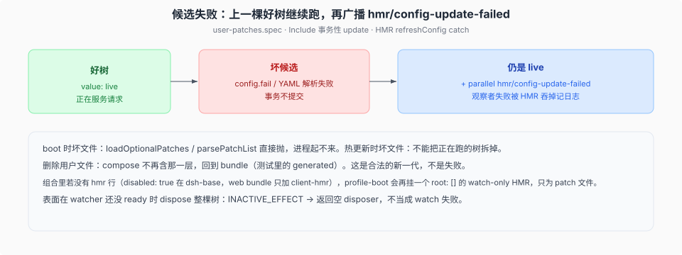

# 用户 patch 的 HMR

源码核验入口：`packages/boot/hmr/src/index.ts`（hmr 插件本体）、`packages/boot/app-boot/src/index.ts` 的 `reconcileProfilePatches`、`packages/boot/app-boot/src/profile-resolution/`（模块解析拦截层）、`apps/cli/tests/profile-hmr.spec.ts`。

boot 叠完的树不是一次性的。profile 的 `cordis.patch.yml`、home 层 patch 与 profile 的 `package.json` 改了要热更新；失败的候选不能把正在服务的树拆掉；bundle 层和 `--patch` / launcher overlays 不许被用户文件挤掉。

## 0.1.7 线的机制换代

旧机制是 launcher 侧的 `composeLive` + `watchUserPatches` + `patchReload: live` 字段（compose 闭包每次重读两层、夹住用户层、失败保留上一棵好树）。0.1.7 线随「事务性 Cordis 重载」的退役整体换掉（commit `e07f41d5fd` 回滚事务重载、`2abb542a22` 适配非事务 Loader，2026-09-09；note `2026-09-09-nontransactional-loader.md`）：~~`composeLive` / `watchUserPatches` / `patchReload` / `hmr/config-update-failed` / `hmr.registerConfig`~~ 在源码中已全部不存在（重建的 vendor hmr 库文件除外）。现机制：**`hmr` 插件自己监视三份文件，经 `reconcileProfilePatches` 原子换入新 patch 集**，模块热替换与配置重载共用同一条串行队列（`packages/boot/hmr/src/index.ts:1` "Serialized module and profile-configuration reloads"）。

## hmr 插件看哪三份文件

`hmr` 服务的 `[Service.init]`（`packages/boot/hmr/src/index.ts:198-237`）在 `profileContext` 在场时（`:206`）启动 profile 监视：

- profile 的 `cordis.patch.yml`（`profile.patchPath`）；
- home 层 patch（`$DSH_HOME/cordis.patch.yml`）；
- profile 的 `package.json`（bundle 清单变更也触发重载——`:214` 的 `manifestPath`、`:215` 的两个 patch 路径，`refresh(manifestOnly)` 对 bundle 变化单独比对 `:222-227`）。

**前提是应用就绪**：`appReady` 不在场直接抛 `Profile HMR requires application readiness`（`:208-209`）。`appReady` 由 launcher 经 `provideCmdline({ ready })` 提供并注入 `ctx.provide('appReady', …)`（`packages/boot/cmdline/src/index.ts:88`），`runProfile` 在 `ctx.fiber` ACTIVE 且 loader 在场时 commit（`apps/cli/src/profile-boot.ts:266/:308/:315`）。这个前提就是 0.1.7 线把 headless / sdk-app / acp-app 显式 disable hmr 行之外的第二道闸：**desktop**（desktop-host 经 `runProfile` 起 profile、`profileContext` 在场但调用侧不传 `ready`）与 webworker 宿主的 HMR 初始化会命中这条抛错而不挂 watcher（desktop-host 进程自身经 IPC `{type:'ready'}` 向壳报告就绪，`apps/desktop-host/src/index.ts:82`，与 `appReady` 是两条不同的就绪信号）。

## 刷新做什么

任一被监视文件变化 → `refresh()`（`:218-237`）：

1. 重读三份文件内容做指纹比对，无变化直接返回；ENOENT 视为该层为空。
2. `readProfilePatches('dsh', profile)` 组出完整 patch 列表（bundle 层 + 用户两层由 profile 读取函数统一装配，bundle 与 overlay 不会被用户文件挤掉）。
3. `reconcileProfilePatches(root, patches, 'dsh')`（`packages/boot/app-boot/src/index.ts:271-300`）：从根 Include 的当前 config 拆掉旧 `patches`、保留其余 Include 选项，`prepareProfilePatches` 后 `entry.update({ config: { …includeConfig, patches } })` 一次提交；等旧 fiber 收束、loader 静止后清点失活条目。
4. **失败大声**：只对「本次新引入」的失活条目抛错（`:291-294`）——启动时就坏的条目不会因为一次无关刷新把进程打死；先前已存在的失败以 warning 逐条记录（返回值）。
5. 成功后 `ctx.emit('app-boot/config-reload')`（`:298`；声明 `app-boot/src/index.ts:52`；消费方如 `SettingsForms` 以它作失效信号，`packages/settings/settings/src/index.ts:234`）。

模块热替换与这条配置链共用 `watchConfig(filename, refresh)`（`:160`，同队列、重复路径抛错；watcher 失败记日志不致命）与 `hmr.runExclusive`（plugin-manager / config-editor 的写路径都从这条队列过，`packages/boot/plugin-manager/src/index.ts:759`、`packages/boot/config-editor/src/index.ts:141`）。

## 门控：哪些 profile 有 HMR

base bundle 的 `hmr` 行用 profileContext 门控（`packages/bundle/base/cordis.patch.yml:27-32`）：`disabled: !!js "!ctx.get('profileContext')"` + `config: { root: [] }`，行上注释 "Profile configuration reloads by default; module roots are opt-in"——即 launcher profile 默认开**配置重载**，模块热替换根（`root`）按部署显式给。headless（`:33-34`）、sdk-app（`:24-25`）、acp-app（`:23-25`）再显式 `disabled: true`；sdk-minimal 与 web-app 不带 `hmr` 行（web-app 只有 `client-hmr`，client 插件热重载归 client 资源管线）。非 launcher 语境（无 `profileContext`，如 webworker 宿主）整行关断。

## 候选失败：上一棵好树继续跑

reconcile 的事务边界在 Include / Loader：`entry.update` 的候选失败不提交，正在服务的树继续用旧 patch 集；本次刷新**新引入**的失败抛出后，该次刷新的其余效果不半途悬挂（旧的失活条目保持原样，不重试）。boot 时坏文件：`readProfilePatches` 直接抛，进程起不来。热更新时坏文件：正在跑的请求还在用上一棵树，失败经日志与事件可见。

删除用户文件是合法的新一代：compose 不再含那一层。写字面上的 `[]`（空数组 entry 列表）同样是「这一层关掉」。只有注释的文件（解析成非数组）、不是数组、读不了：在场的坏层，按新引入失败处理。

## 和 boot 时序的分工

| 窗口 | 坏配置的结局 |
|------|----------------|
| `composeProfile` / `boot()` | 抛，dispose 半棵树，进程起不来 |
| 后挂 `unhandledRejection` | `installFailLoud`：报错、还终端、`exit(1)` |
| HMR refresh | 保留好树，日志/事件可见，进程继续；只有**新引入**的失败升级为抛错 |

长寿命表面（web / desktop 经 `runProfile` 的启动）靠第三行；headless / sdk / acp 这类一次性表面显式关断，调试它们要重启。
