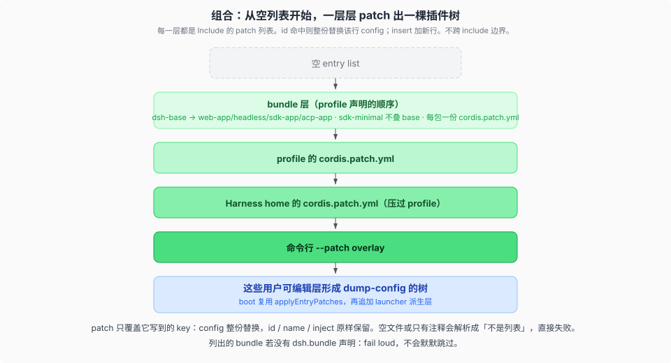
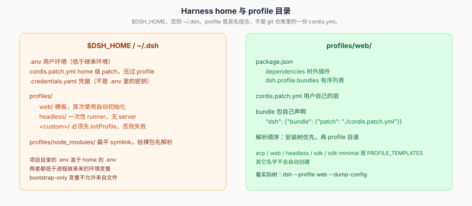

# Composition · 启动组合

## 一句话

一次正在跑的 `dsh` 是 boot 时按层**叠出来的插件树**。profile 是 Harness home 里的具名组合，bundle 是可安装的 patch 层，用户的 `cordis.patch.yml` 叠在所有 bundle 之上。

仓库里没有一份「最终 cordis.yml」代表你机器上的树。那棵树是算出来的。

## 从空列表开始叠



顺序固定：

```text
空 entry list
  + 每个 bundle 的 cordis.patch.yml（profile 里写的顺序）
  + 该 profile 的 cordis.patch.yml
  + Harness home 的 cordis.patch.yml
  + 命令行 --patch
```

两条机械规则：

- **id 命中：整份替换**该行 `config`。想保留的字段必须重写，没有深合并。
- **`insert`：加新行。** 同一次列表里，后面的 patch 必须能打到前面刚 insert 的行（这是 vendor Include 的本地修改之一）。

列出的 bundle 若没有 `dsh.bundle` 声明，启动失败，不会默默跳过。空的或只有注释的 patch 文件会解析成「不是列表」，同样失败。要关掉某一层，写 `[]`。

`composeEntries`、`boot()`、`renderConfigDump` 共用 Include 的 `applyEntryPatches`。所以 dump 和 boot 对用户层是同一套算法。launcher 派生的两层（shipped `agent-presets.roots`、`DSH_TELEMETRY_DISABLED`）只在 `runProfile` 里追加，不进 `--dump-config`；`!!js` 在 dump 里原文打出。细节见 [`02-dump-与boot-保真.md`](./02-dump-与boot-保真.md)。

```sh
dsh --profile web --dump-config
```

看到的每一行都可以被你自己的 patch 整行替换。不要把 dump 里缺的 telemetry disable 当成算法漏了。

## Profile 住在 home，不在 git 仓库根



- **profile**：`$DSH_HOME/profiles/<name>`（未设 `DSH_HOME` 则为 `~/.dsh`）。里面有 `package.json`（`dsh.profile.bundles` + 树外插件）和用户自己的 `cordis.patch.yml`。
- **bundle**：npm 包，清单里写 `"dsh": { "bundle": { "patch": "./cordis.patch.yml" } }`。`dsh-base` 是每个 profile 的第一层；`dsh-web-app` 加浏览器应用；`dsh-headless` 加一次性 runner，完全不带服务器。
- **模板**：`web` 和 `headless` 首次使用会自动初始化。其它名字必须先 `initProfile`，否则 fail loud。

环境变量分层：进程继承 > 项目目录 `.env` > home `.env`。bootstrap-only 变量不允许来自文件。凭据走 `.credentials.yaml`，不要把密钥只放在 `.env` 里当正途。

`cordis:group` 和 Include 一起注册，这样可以把一个 `isolate` realm 同时给某个 provider 和它的 consumers——agent preset 这种树外组合也靠它。

## 源码入口

| 路径 | 角色 |
|------|------|
| `packages/boot/app-boot/` | `boot`、`loadProfile`、`composeEntries`、`renderConfigDump` |
| `packages/boot/cmdline/` | CLI 如何选 profile / patch |
| `packages/bundle/base/` | 每个 profile 的第一层 |
| `packages/bundle/web-app/` | Web 应用层 |
| `packages/bundle/headless/` | 一次性 runner |
| `apps/cli/` | 产品 bin `dsh` |
| [`packages/boot/app-boot/README.md`](../../packages/boot/app-boot/README.md) | profile 机器合同 |

## 机制级正文

| 文件 | 内容 |
|------|------|
| [`01-boot-时序.md`](./01-boot-时序.md) | `runProfile` → `prepareProfile` → `boot()`；两段失败标签；`installFailLoud` |
| [`02-dump-与boot-保真.md`](./02-dump-与boot-保真.md) | 同一 `applyEntryPatches`；dump 不含 launcher 派生层；`!!js` 不求值 |
| [`03-user-patch-hmr.md`](./03-user-patch-hmr.md) | `composeLive` 夹住用户层；候选失败保留上一棵好树 |

介绍篇建立直觉。机制级正文对源码。下一专题是 [`../session-and-loop/00-map.md`](../session-and-loop/00-map.md)。
