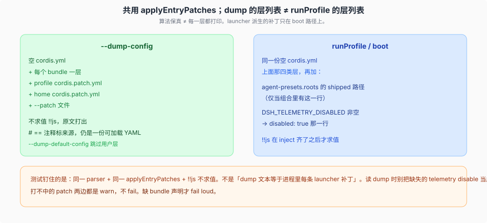

# dump 与 boot 保真

源码核验入口：`apps/cli/src/dump-config.ts`、`packages/boot/app-boot/src/index.ts` `renderConfigDump`、`packages/boot/app-boot/src/profile.ts` `composeEntries`、`packages/boot/app-boot/tests/config-dump.spec.ts`。

`--dump-config` 与 boot 共用空根、`applyEntryPatches` 和 YAML dialect；dump 的层列表比 `runProfile` 少 launcher 派生的那一层（telemetry switch），并且不求值 `!!js`。



## 保真对象是组合算法

`composeEntries(layers)` 是 `applyEntryPatches([], structuredClone(layers.flat()), warn)`。boot 的根 Include 对同一份空 `cordis.yml` 再调一次 `applyEntryPatches`。dump 的 `renderConfigDump` 对同一文件、同一函数、同一 `entryListSchema`。

测试 `config-dump.spec.ts` 明确钉的是「所有层展平成**一次** `applyEntryPatches`，和 `boot()` 一样」：

- 某层用 id patch 把 group 的 `config` 换成带 `child` 的列表。
- 下一层按 id 打 `child`。
- 单次调用的索引看得到 **insert 进去的行**，看不到「整份替换 group config 之后才出现的孩子」。
- 于是 `child` 那条 patch 被 skip，warn，孩子仍是第一层写进去的值。

若 dump 按层各 compose 一次、每次重建索引，第二层会打中那个孩子——真 boot 从不挂那样的树。保真是这个单次调用语义，不是「把 boot 里每一条 launcher 补丁都印出来」。

## dump 实际叠了哪些层

`runDumpConfig`：

```text
prepareProfile（同样重写空 cordis.yml）
  每个 bundle 一层（label = 包名）
  + 若非 --dump-default-config：
      profile cordis.patch.yml（文件存在才加这一层）
      home cordis.patch.yml（loadOptionalPatches 有内容才加）
      每个 --patch 文件一层
```

`--dump-default-config` 把 `userLayer` 设成 `false`：不解析损坏的用户文件，用来恢复诊断。

dump 也接受 `--from-default-profile <模板>`（`apps/cli/src/dump-config.ts:35` 的第四个形参，`:37` 透传给 `prepareProfile`）：profile 缺失时先按模板建出它，再照上面的层列表 dump。它只影响「哪个 profile 被创建」，层列表一条不多、一条不少，也不 boot。

缺的、只在 `composeProfile` 里追加的：

| 层 | 谁加 | dump 有没有 |
|----|------|-------------|
| `DSH_TELEMETRY_DISABLED` → `disabled: true` | `runProfile`，且组合里有 `session-telemetry-otel` | 无 |

（shipped preset root 是 `dsh-agent-presets` 包内解析，不经 `composeProfile`，不是派生层。）

读 dump 时不要把「没看到 telemetry disable」当成 dump bug。那是 launcher 唯一的派生层，不是用户 patch 算法漏了。

## `!!js` 原文打出

dump 不 boot，没有 inject 齐了的插件 ctx，不能求值。`entryListSchema` 把 `!!js expr` 收成 `__jsExpr` 节点；YAML 写回仍是 `!!js`。求值时机见 [`../cordis-runtime/03-loader-include-与js插值.md`](../cordis-runtime/03-loader-include-与js插值.md)。

所以 dump 是「将要交给 Loader 的字面量树」，不是「`!!js` 跑完之后进程里的值」。

## 打不中的 patch：warn，不 fail

Include 对「目标 id 不在当前索引」记一条 patch skip。dump 没有 logger，把 `%C` 替成 JSON，前面加上 `[layer.label]`。继续 compose。一条 overlay 可以在 web / headless 之间共用，不必每棵树都有每一行。

缺 bundle 声明、根 YAML 缺失 / 解析失败 / 不是数组：抛。用户 patch 文件**存在**但读不了、不是数组：`loadOptionalPatches` / `parsePatchList` 抛——在场的坏层不是「没有这一层」。关掉某一层要写字面上的 `[]`（一个空数组 entry 列表）；解析成数组的东西都合法。解析出来**不是数组**才抛——例如只有注释的文件（YAML 里只有注释、没有任何 entry 行）解析成非数组，同样抛。

`--patch` 走 `loadOverlayPatches`：文件是调用者点名的，缺失也抛，不是 ENOENT → 空层。

## 来源注释仍是一份可加载 YAML

`renderConfigDump` 按前缀做 snapshot：`snapshot_k` = 前 k 层展平后的一次 `applyEntryPatches`。相邻行若 origin / patchedBy 相同，合成一条 `# == file, patched by ...`。stdout 仍是 entry 列表，可以再被 Loader 吃进去。

每层 snapshot 都 `structuredClone` 那一段 patches。`applyEntryPatches` 把 entry 列表拆出来，但 `insert` 行是从 patch 列表**按引用**推进去的——所以每次 snapshot 都 clone 一份 patches，正是为了挡住「跨 snapshot 共用同一批对象、后面 snapshot 的原地修改漏进前面的结果」。这是已知且有意的防护：如果共享对象，dump 的 snapshot_k 前缀会互相污染。

## 和 boot 对齐时该对哪张表

| 该对齐 | 不该假设对齐 |
|--------|----------------|
| 空 `cordis.yml` 作为 base | launcher 派生的 telemetry switch |
| `applyEntryPatches` 单次展平 | `!!js` 求值后的运行时值 |
| 打不中 → warn 并继续 | dump 文本等于 `ctx.loader` 里每一行的当前 config |
| insert 立刻进索引（vendor 本地修改） | `--dump-default-config` 含用户层 |

产品代码里再手写一份「类似的 patch」会和真树漂移。这是 vendor Include 导出 `applyEntryPatches` 的原因，见 [`../cordis-runtime/04-vendor-本地修改.md`](../cordis-runtime/04-vendor-本地修改.md)。
