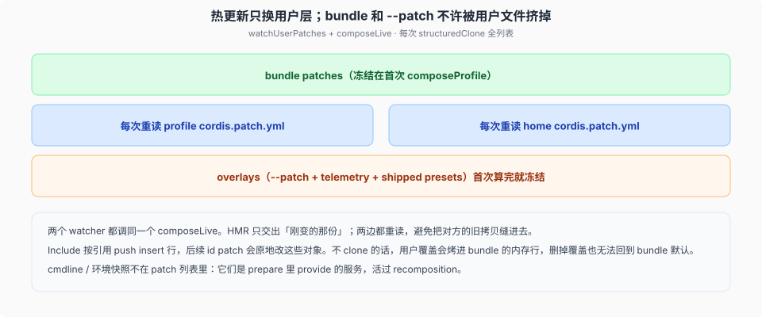
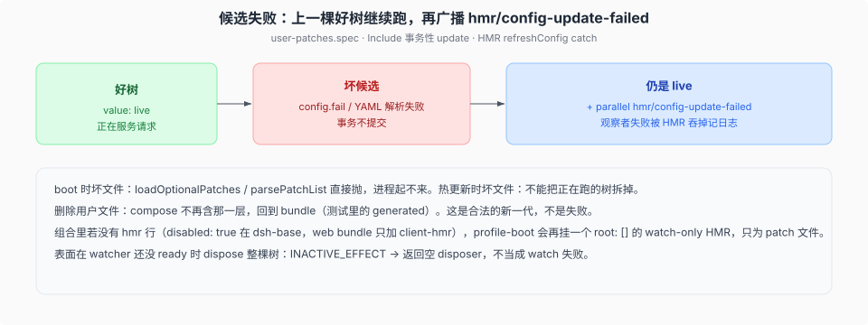

# 用户 patch 的 HMR

源码核验入口：`apps/cli/src/profile-boot.ts` `composeLive`、`packages/boot/app-boot/src/index.ts` `watchUserPatches`、`packages/boot/app-boot/tests/user-patches.spec.ts`。

boot 叠完的树不是一次性的。profile 和 home 的 `cordis.patch.yml` 改了要热更新。失败的候选不能把正在服务的树拆掉。bundle 层和 `--patch` / launcher overlays 不许被用户文件挤掉。



## 谁在看哪两个文件

`runProfile` 在 `boot()` 结算之后，先判 `composed.profile.patchReload === 'live'`（`apps/cli/src/profile-boot.ts:355-358`）——非 live 直接不挂 watcher；live 之下若信号没中止、根 fiber 仍 ACTIVE、loader 还在，就挂两个 `watchUserPatches`：

- `composed.profile.patchPath`（该 profile 的 `cordis.patch.yml`）
- `homePatchPath()`（`$DSH_HOME/cordis.patch.yml`）

两个 watcher 的 `compose` 都是同一个 `composeLive`。HMR 每次只交出「刚变的那份」；`composeLive` **两边都重读**，避免把对方的旧拷贝缝进这一代。

`watchUserPatches` 要求 `ctx.get('hmr')` 和 `bootstrapIncludes` 里的根 Include。缺一就抛——静默跳过会打破「长寿命表面改 patch 文件即生效」的合同。

## 组合里可能没有 `hmr` 行

关掉共享模块热更新 `hmr` 行的不是 web bundle——web-app 的 cordis.patch.yml 本身没有 `hmr` 行，`disabled: true` 的 `hmr` 行在 dsh-base（`packages/bundle/base/cordis.patch.yml:19-25`，行上注释：Module reload is opt-in per profile，`patchReload: live` 的 config watching 走 launcher 的 watch-only 兜底、不依赖该行）。没有 HMR 服务时，profile-boot 再挂一个 `{ root: [] }` 的 watch-only 实例，只为 patch 文件。HMR 还 inject timer；光秃的自定义 profile 可能连 timer 都没有，就先 `loader.create` timer。

一次性表面走有界 shutdown，会在事件循环排空前 dispose 这些 watcher。watching 不按「是不是 web」分支跳过，而是按 `patchReload === 'live'` 门控（`apps/cli/src/profile-boot.ts:355-358`）：shipped 模板仅 web 为 live，headless / sdk / sdk-minimal / acp 均为 startup（`packages/boot/app-boot/src/profile.ts:110-131`），自定义 profile 默认 live（`profile.ts:142`）。

表面在 watcher 还没 ready 时 dispose 整棵树：HMR 登记 effect 抛 `INACTIVE_EFFECT`。那是应用按请求退出，不是 watch 失败 → 返回空 disposer。其它登记失败照样抛；若 shutdown 已经拥有这棵树（信号或 `appExit`），`suppressShutdownError` 吞掉。

## `composeLive`：中间两层每次重读，上下冻结

```text
structuredClone([
  ...bundlePatches,                          // 首次 composeProfile 冻结
  ...loadOptionalPatches(profile.patchPath), // 每次重读
  ...loadOptionalPatches(homePatchPath()),   // 每次重读
  ...overlays,                               // --patch + telemetry，冻结
])
```

用户编辑永远夹在 bundle 和 overlays 之间，挤不掉它们。cmdline / 环境快照根本不在这个列表里。

`composeLive` 忽略 HMR 传来的 `userPatches` 参数，自己重读两个文件。`watchUserPatches` 默认的 identity compose（用户层 = 整份 patch 列表）只给测试和没有夹层的调用方；产品路径必须把用户层嵌回去。

## 为什么每次都要 `structuredClone`

Include 把 `insert` 行**按引用**推进挂上的树，后面的 id patch 会原地改这些对象。boot 时若不 clone，Include 的修改会写回 `composed.bundlePatches` 里的内存行。用户覆盖一旦烤进 bundle 对象，删掉覆盖也无法回到 bundle 默认。

测试里 unlink 用户文件之后，`value` 回到 `'generated'`（app-owned 那一层）。能回去，是因为每一代都从干净的 clone 再 apply。

## 刷新做什么

`hmr.registerConfig(filename, refresh)`。refresh：

1. 从根 Include 的当前 `options.config` 拆掉 `patches`，保留其余 Include 选项，避免刷新把非 patch 配置还原。
2. `loadOptionalPatches`：ENOENT → `[]`（没有这一层）。文件在场但坏 → 抛，进失败路径。
3. `compose(...)` 得到完整 patch 列表。
4. `entry.update({ config: { ...includeConfig, patches } })`。

事务在 Include / Loader 里。候选失败不提交。

## 候选失败：上一棵好树继续跑



候选配置按以下状态转换：

| 事件 | 树上的 `value` | 副作用 |
|------|----------------|--------|
| 写入合法 override | `live` | 提交 |
| `config.fail: true` | 仍是 `live` | `hmr/config-update-failed` |
| YAML 解析失败 | 仍是 `live` | 再一条 failed 事件 |
| 写入合法恢复 | `recovered` | 提交 |
| unlink 文件 | `generated`（bundle 层） | **不是**失败 |

boot 时坏文件：`loadOptionalPatches` / `parsePatchList` 直接抛，进程起不来。热更新时坏文件：正在跑的请求还在用上一棵树。HMR 把 refresh 的异常收掉记日志，再 `parallel('hmr/config-update-failed', filename, error)`。观察者自己失败也被 HMR 吞掉记日志，不从 watcher 逃出去。

删除用户文件是合法的新一代：compose 不再含那一层。写字面上的 `[]`（空数组 entry 列表）同样是「这一层关掉」，解析成空数组，不是解析失败。只有注释的文件（解析成非数组）、不是数组、读不了：在场的坏层，抛。

## 和 boot 时序的分工

| 窗口 | 坏配置的结局 |
|------|----------------|
| `composeProfile` / `boot()` | 抛，dispose 半棵树，进程起不来 |
| 后挂 `unhandledRejection` | `installFailLoud`：报错、还终端、`exit(1)` |
| HMR refresh | 保留好树，广播失败，进程继续 |

长寿命表面（web）靠第三行。一次性 runner 通常等不到用户改文件，但 watcher 仍挂着，免得合同按表面类型分叉。
