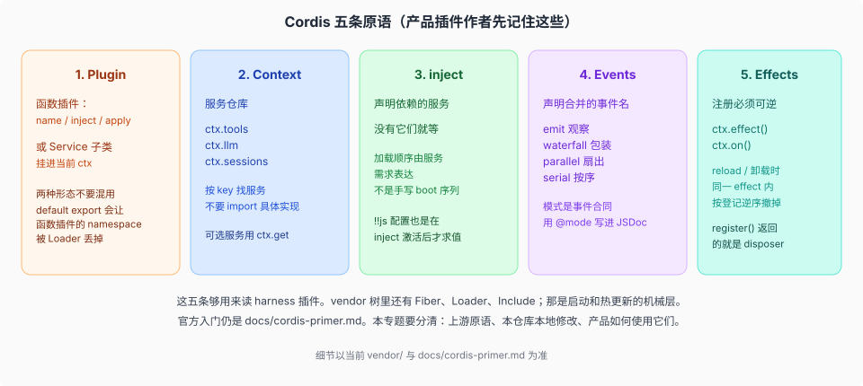
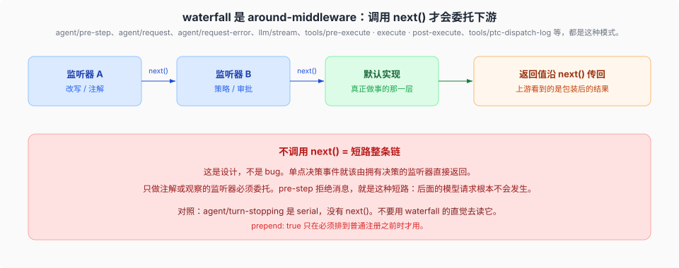
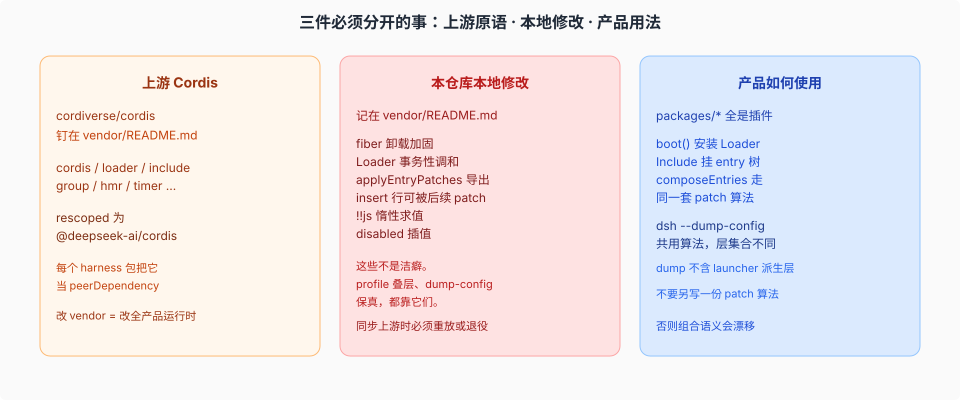

# Cordis runtime · 被 vendor 的框架

产品源码基线：`46a7f68b09`（`dsh-v0.1.7-rc.1`）；本专题结论与该 commit 的项目树一致，跨度对照的 OLD 侧为 `a66e470204`（`0.1.2-rc.1`），`rc.1` → `rc.2` 的增量见 [`_change_log/0007`](../_change_log/0007-0.1.5-rc.1-to-0.1.5-rc.2.md)。

## 一句话

Harness 把 Cordis 源码放进 `vendor/`，rescoped 成 `@deepseek-ai/cordis`，再在上面长产品。读 dsh 之前先分清三件事：**上游原语**、**本仓库记在 `vendor/README.md` 的本地修改**、**产品插件怎么用它们**。包名映射（上游包名 ↔ `@deepseek-ai/*` 产品名）的权威是 [`docs/rescope.md`](../../docs/rescope.md)，`vendor/README.md` 只记版本与本地修改。

官方教程是 [`docs/cordis-primer.md`](../../docs/cordis-primer.md)；本页只定位 Harness 依赖的运行时原语。

## 五条原语

对读 harness 插件最有用的对照：

| 原语 | 在 dsh 里长什么样 |
|------|-------------------|
| Plugin | `packages/*` 中的能力以插件装入树，并由 fiber 管理生命周期。 |
| Context | 服务按 `ctx.tools`、`ctx.llm`、`ctx.sessions` 等 key 查找；Consumer 依赖 Definition，不导入具体 Provider。 |
| inject | 插件声明服务依赖；缺少依赖时等待，满足后激活。 |
| Events | 事件通过 TypeScript 声明合并扩展，`emit` / `waterfall` / `parallel` / `serial` / `bail` 是调用合同的一部分。 |
| Effects | 注册、监听和子插件都由 effect 拥有；fiber 卸载时贡献一并撤销。 |

## waterfall：`next()` 委托下游

dsh 里最容易踩的事件合同就是 waterfall。它是 around-middleware，不是「通知一下」。

`agent/pre-step` 可以短路模型请求。`agent/turn-stopping` 不是 waterfall，而是关闭 turn 前的 serial 续跑检查：监听器没有 `next()`，需要继续时调用 `agent.steer()`。

## 上游 · 本地修改 · 产品用法

[`vendor/README.md`](../../vendor/README.md) 是本地修改的权威清单。Harness 直接依赖其中的 effect 卸载时序、Include 的解析保护与持久化写、共享 patch 算法和延迟配置插值；profile 组合、dump 与 HMR 都建立在这些行为上。产品依赖和对应源码见 [`04-vendor-本地修改.md`](./04-vendor-本地修改.md)。

> **vendor 4.0.4**（0008 复核更新）：本地修改清单现为 **22** 条——0008 跨度新增 #16（cordis 发布 src）/ #20（entry fiber identity）/ #21（logger exporter disposal）/ #22（volatile config 四件套），第 8/9/12 条随 0.1.7 线事务重载退役而重写；发布版本 cordis 4.0.4 / loader 1.0.5 / include 1.0.9 / schemastery 3.18.4 / cosmokit 1.8.5。0006 时「vendor 零改动」的结论已被本跨度推翻，下一次同步须逐条重放。具体修改内容见 [`04-vendor-本地修改.md`](./04-vendor-本地修改.md)。

## 源码入口

| 路径 | 角色 |
|------|------|
| `vendor/cordis/` | Context / Fiber / Service / Events |
| `vendor/loader/` | Loader |
| `vendor/include/` | `cordis:include`，patch 算法 |
| `vendor/group/` | `cordis:group`，`isolate` realm |
| `vendor/hmr/` | 配置与模块热更新 |
| [`vendor/README.md`](../../vendor/README.md) | 固定的 SHA、本地修改清单、同步步骤 |
| [`docs/cordis-primer.md`](../../docs/cordis-primer.md) | 作者向的五条思想 |
| [`docs/cordis-tutorial/`](../../docs/cordis-tutorial/index.md) | 同一套思想的动手教程 |

## 机制级正文

| 文件 | 内容 |
|------|------|
| [`01-五条原语对照源码.md`](./01-五条原语对照源码.md) | Plugin / Context / inject / Events / Effects 对到 `vendor/cordis/src/` |
| [`02-waterfall-与事件合同.md`](./02-waterfall-与事件合同.md) | `waterfall` 源码算法；`agent/pre-step` vs `agent/turn-stopping` |
| [`03-loader-include-与js插值.md`](./03-loader-include-与js插值.md) | `!!js` 两处求值；`applyEntryPatches` 为何能叠 bundle |
| [`04-vendor-本地修改.md`](./04-vendor-本地修改.md) | 产品依赖的 vendor 修改及其后果 |

Profile / boot 时序见 [`../composition-boot/01-boot-时序.md`](../composition-boot/01-boot-时序.md)。
