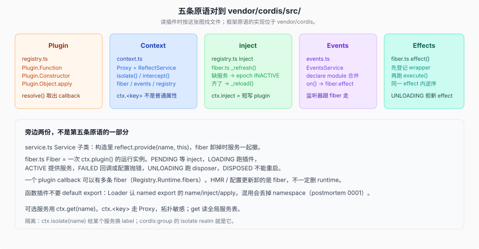

# 五条原语对照源码

源码核验入口：`vendor/cordis/src/` 下的文件和符号。

本篇把五条 Cordis 原语对应到具体类型，供阅读 `packages/` 中的 `ctx.plugin`、`ctx.on` 和 `ctx.effect` 时查找。

## Plugin → `registry.ts`

三种入口，`RegistryService.resolve()` 抽出同一个 `callback`：

| 形态 | 类型 | 实际被调用的函数 |
|------|------|------------------|
| 函数 | `Plugin.Function` | 函数本身 `(ctx, config)` |
| 类 | `Plugin.Constructor` | 构造函数 |
| 对象 | `Plugin.Object` | `apply(ctx, config)` |

`ctx.plugin(plugin, config)` 为这一次调用建一条 Fiber。同一个 callback 的所有 fiber 挂在 `Plugin.Runtime.fibers` 上。HMR 或配置更新卸的是 fiber，不一定从 registry 删掉 runtime。

`ctx.inject(deps, callback)` 是短写：`ctx.plugin({ inject: deps, apply: callback })`。依赖的服务一变，这条 fiber 卸掉重跑。

函数插件的产品合同（Harness 自己的，不是 Cordis 上游）：named export `name` / `inject` / `Config` / `apply`，**不要 default export**。Loader 碰到 default 会丢掉函数插件的 namespace，见 `docs/postmortem/0001-acp-default-export-drops-inject.md`。

## Context → `context.ts` + `reflect.ts`

`new Context()` 返回的是 Proxy，不是裸对象。属性读走 `ReflectService.handler`，所以 `ctx.tools` 不是「对象上的字段」，是按 isolate 标签解析出来的服务。

三个造子 ctx 的方法，都不改父：

- `extend(meta)` — 叠自己的属性。
- `isolate(name, label?)` — 给名为 `name` 的服务换一个 scope label。相同 label 的两个 isolate 共享实现。`cordis:group` 的 `isolate` realm 就是这个。
- `intercept(name, config)` — 给该服务的解析配置再叠一层。

可选服务用 `ctx.get(name)`。`ctx.<key>` 对拓扑敏感；`get` 读全局服务表。ACP 相关的 postmortem 把这两者写进了产品规则。

## inject → `fiber.ts` `_refresh`

fiber 上有一份 `inject` 图（服务名 → 可选 intercept）。`_refresh()` 扫这些名字：

- 缺任何一个实现：epoch 设成 `INACTIVE`，状态 `PENDING`，插件代码不跑。
- 齐了：epoch 变成实现 fiber uid 的拼接，触发 `_reload()`，状态 `LOADING`。

所以加载顺序不是 boot 脚本里的数组下标，而是「谁 provide 了谁在等的 key」。服务被替换（uid 变了）也会让依赖方卸掉重载。

配置真正交给插件之前，走 `_resolveConfig`：先 `internal/config` waterfall，再 `resolveConfig(runtime, config)` 用插件的 Standard Schema。这是 `!!js` 插值的挂点，见 [`03-loader-include-与js插值.md`](./03-loader-include-与js插值.md)。

## Events → `events.ts`

`Events` 接口靠 `declare module './context.ts'` 合并。Harness 各包往里面加 `agent/pre-step` 这种名字。模式是合同：只能用对应的 `ctx.emit` / `waterfall` / `parallel` / `serial` / `bail` 派发。

`ctx.on(name, listener)` 在当前 fiber 上登记 effect。fiber 一卸，监听器撤掉。布尔参数是 `prepend` 的简写。

`dispatch()` 先剥可选的 `thisArg`，再用 `thisArg[Context.filter]` 过滤 hook。这就是 scoped 事件只送到对的 `agent.ctx` 的机械层；产品侧的 `scopeTarget(agent, agent)` 造出带 filter 的 carrier。

五种模式里 primer 表写了四个。源码还有 `bail`：同步版的 serial，碰到 `isBailed`（不是 `null` / `false` / `undefined`）就停。waterfall 的细节单独一篇。

## Effects → `fiber.ts` `effect()`

`execute()` 立刻跑。它返回的 disposer（或 iterable 里 yield 的每一份）收进这一条 effect 的列表；手动调用公开 disposer，或 fiber 卸载触发这条 effect 时，列表按登记逆序执行。

倒序只保证在**同一条 effect 内**成立。Fiber 的 `_unload()` 用 `Promise.all` 启动多个顶层 effect wrapper 的清理，所以整个 fiber 不是一条全局 LIFO 栈。两个资源若有严格释放顺序，应由同一 effect 收集 disposer，或由一个 disposer 显式等待另一个清理完成。

本地修改把 wrapper **先**推进 `_disposables`，再跑 `execute()`。这样 setup 期间若有人开始卸 fiber，卸载快照里已经看得到这个 effect，不会把 setup 里登记的子清理漏掉。`UNLOADING` 时再 `effect()` 会抛 `INACTIVE_EFFECT`。`PENDING` 和 `LOADING` 仍允许——等依赖时登记东西是合法的。

公开 disposer 是单次的；内部用 `effectInertia` 让外层 effect 能 join 已经开始的清理。这是 vendor 清单第 6 条，产品 HMR / 配置失败回滚靠它。

## Service → `service.ts`

不是第六条原语，是「把一个对象挂到 `ctx.<name>`」的标准写法。`super(ctx, name)` 立刻 `reflect.provide`。子类是 Definition 最常见的载体。fiber 卸掉，provide 一起撤。

带 `[Service.invoke]` 的服务会变成可调用实例（`ctx.logger('x')` 这种）。

## 读包时怎么用这张图

打开一个 `packages/<group>/<pkg>/src/index.ts`：

1. 函数插件还是 `Service` 子类？决定你找 `apply` 还是构造函数。
2. `inject: ['tools', 'sessions']` 之类 → 这个包在等谁 provide。
3. `ctx.on(...)` / `ctx.effect(...)` → 贡献跟这条 fiber 走。
4. `declare module '@deepseek-ai/cordis'` 加事件 → 去看 `@mode` 和派发点是否一致。
