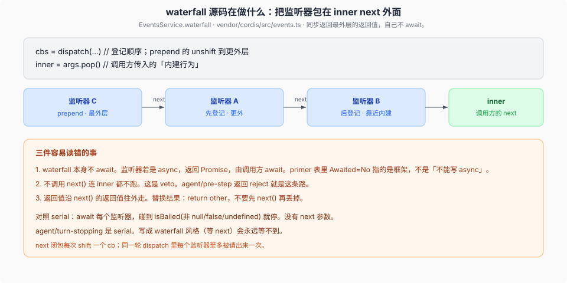
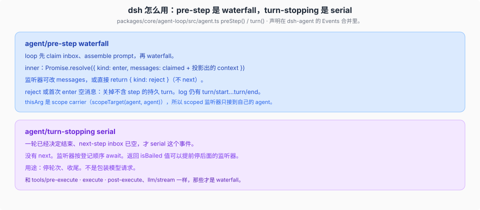

# waterfall 与事件合同

源码核验入口：`vendor/cordis/src/events.ts` `EventsService.waterfall`、`packages/core/agent-loop/src/agent.ts`、`packages/core/agent/src/runtime-types.ts`。

本篇说明 waterfall 的组合算法，并区分 `agent/pre-step` 与 `agent/turn-stopping`。

## 框架算法



精简后的实现就是：

```text
cbs   = 过滤后的监听器（登记顺序；prepend 的在更前面）
inner = 调用方传入的最后一个参数（内建行为）
next  = () => (cbs.shift() ?? inner)(...args)
把 next 推进 args，然后 next()
```

所以：

1. **先登记的普通监听器更靠外**，后登记的更靠近 inner。`prepend: true` 再往外一层。
2. **不调用 `next()`，inner 也不跑。** 这是 veto，不是「我观察完了」。
3. **返回值是最外层监听器的返回值。** 想改结果：`return other`，或 `const r = next(); return wrap(r)`。调用 `next()` 却丢掉返回值，等于把下游的决定扔了。
4. **waterfall 自己不 await。** primer 表里 Awaited = No 指框架。监听器可以 `async`，那时返回 Promise，由**调用方** await。`agent/pre-step` 的 loop 就是 `await this.dispatch.waterfall(...)`。

`next` 每次 `shift` 一个 callback。同一轮 dispatch 里每个监听器至多出现一次；不要假设 `next()` 能重入同一监听器。

## 和 serial / emit 的差别

| | waterfall | serial | emit |
|--|-----------|--------|------|
| 监听器签名 | `(...args, next)` | `(...args)` | `(...args)` |
| 框架是否 await | 否 | 是，按序 | 否 |
| 怎么停下游 | 不调用 `next()` | 返回 `isBailed` 值 | 不停 |
| 内建行为 | 调用方传入的 inner `next` | 没有 | 没有 |

`isBailed(value)`：`value` 不是 `null` / `false` / `undefined` 就算 bail。serial 用这个提前结束。waterfall **不用** isBailed；停不停只看你调没调 `next()`。

`parallel` 是 `Promise.allSettled`，谁失败都收到，最后可能 `AggregateError`。`bail` 是 serial 的同步版。

## dsh：pre-step vs turn-stopping



`Agent` 事件在 `dsh-agent` 里声明合并。loop 通过 `dispatch.waterfall` / `dispatch.serial` 发出去，`thisArg` 是 `scopeTarget(agent, agent)`，所以 scoped 监听器只接到自己的 agent。

### `agent/pre-step`

loop 的 `preStep()`：

1. `inbox.claim(...)`
2. `systemPrompt.assemble(...)`
3. `waterfall('agent/pre-step', { messages, turn, step, signal }, inner)`

`inner` 默认 `{ kind: 'enter', messages: claimed 加上投影出的 context }`。

监听器两种合法做法：

- 合作：改 `messages`（或等 `next()` 再包一层），然后 `return next()`。
- 决策：直接 `return { kind: 'reject' }`，不调 `next()`。模型请求不会发生。

loop 看到 `reject`，或**第一个 step** 的 enter 消息长度为 0：关掉一个不含 step 的持久 turn。`turn/start` 已经写入 log，最后仍有 `turn/end`，因此没有发起模型请求的尝试也可从日志重建。

只想观察、不拥有决策的监听器必须 `next()`。否则你把整条链（含 inner 的默认 enter）否决了。

### `agent/turn-stopping`

一轮已有结束原因、且 `inbox.nextStep` 为空时，loop 才 `serial('agent/turn-stopping', { turn, signal })`。

没有 `next`，监听器按登记顺序 await，声明返回 `Promise<void> | void`。监听器若调用 `agent.steer()`，驱动会在 serial 链结束后重读 `inbox.nextStep` 并继续下一 step；inbox 仍为空才写 `turn/end`。

不要依赖 Cordis `serial` 的通用 bail 返回值：该事件的公开返回类型是 void。把它写成 `async (_, next) => next()` 也会因没有 `next` 参数而出错。

### 同家族的 waterfall

这些才和 pre-step 同类：`agent/request`、`llm/stream`、`tools/pre-execute`、`tools/execute`、`tools/post-execute`。管道细节在 [`../tools-prompt-llm/00-map.md`](../tools-prompt-llm/00-map.md)。

## 声明合同

新事件要在 JSDoc 写 `@mode`。生成目录会核对声明和派发点。模式写错，类型上还能编过，运行时则会用错方法（waterfall 当 emit 派，监听器多出来的 `next` 变成普通参数）。

`internal/update`、`internal/config`、`internal/get`、`internal/set` 也是 waterfall。Loader 的 `!!js` 插值就挂在 `internal/config` 上。
