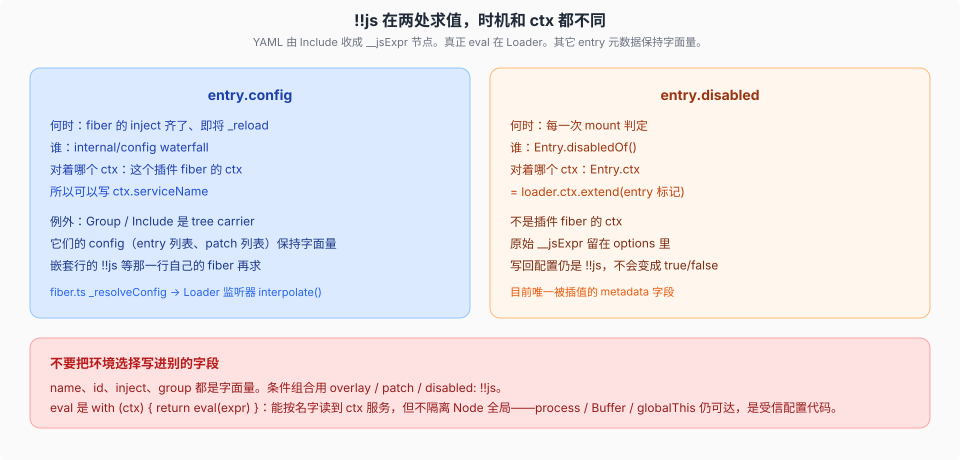
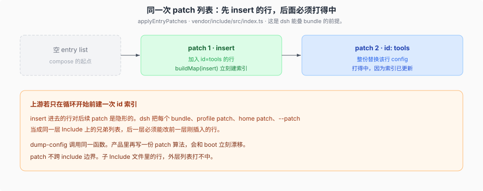

# Loader、Include 与 `!!js` 插值

源码核验入口：`vendor/loader/src/index.ts`、`vendor/loader/src/config/entry.ts`、`vendor/loader/src/config/utils.ts`、`vendor/include/src/index.ts`。

本篇说明 `!!js` 的求值时机和 context，以及 patch 如何命中同一列表中刚 insert 的行。

## YAML 里的 `!!js` 变成什么

Include 把 `!!js expr` 收成 `{ __jsExpr: "expr" }`（`isJsExpr`）。Loader 的 `evaluate` 执行表达式：

```text
with (ctx) { return eval(expr) }
```

`with (ctx)` 让表达式直接按名字访问传入 `ctx` 上的服务和 Loader 属性，但不隔离 Node 全局；表达式仍可访问 `process`、`Buffer` 和 `globalThis`。`!!js` 是在宿主进程中执行的受信配置代码，不是安全沙箱。

## 两处求值，两个 ctx



### `config`：等 inject 齐，对着插件 ctx

fiber `_reload()` 里 `_resolveConfig(raw)`：

1. `ctx.waterfall(fiber, 'internal/config', raw, () => raw)`
2. 再用插件的 `Config` schema `resolveConfig`

Loader 在 `internal/config` 上挂了全局监听器：先 `next()` 拿到下游结果，再 `interpolate(this.ctx, config)`。这里的 `this` 是 **Fiber**，`this.ctx` 是**这个插件**的 context。inject 已经激活，所以表达式可以写 `ctx.tools` 这类服务名。

**Tree carrier 例外。** 插件若带 `EntryGroup.key`（Group、Include），监听器原样返回 config，不 interpolate。它们的 config 是「别人的行」：entry 列表、patch 列表。那些行里的 `!!js` 属于**目标行自己的 fiber**，现在求值会用错 ctx，也会把表达式提前吃掉。

这就是 vendor 清单里「惰性求值 / lazy config」那条：原始 config 留在 fiber 上，inject 齐了才 resolve。provider 被换掉时按新 ctx 再求一次。

### `disabled`：每次 mount 判定，对着 Loader ctx

`Entry.disabledOf()`：若 `options.disabled` 是 js 节点，`evaluate(this.ctx, expr)`。`Entry.ctx` 是 `loader.ctx.extend({ [Entry.key]: this })`，**不是**插件 fiber 的 ctx。

每次看「要不要 init / 要不要卸」都会再求一次。原始节点留在 `options` 里，写回文件仍是 `!!js`，不会被存成 `true`/`false`。

`id`、`name`、`inject`、`group` 都是字面量。环境要选插件，用 overlay、patch，或 `disabled: !!js`，不要发明第二个可插值的 metadata 字段。

父 entry 的 disabled 会向上传播；group 行本身视为 enabled（它只是容器）。

## patch：insert 之后立刻建索引



`applyEntryPatches(data, patches, warn)`（Include 导出，`boot` / `composeEntries` / `renderConfigDump` 共用）：

- 非 insert：按 `id` 找行，把其余字段**整份写上**（`config` 替换，不是深合并）。
- insert：推进目标 group 的 `config` 数组，或顶层列表；然后 **`buildMap(insert)`**，让同一列表里后面的 patch 能打到这些新 id。

没有第二步，dsh 的组合模型会断：`dsh-base` insert 出一堆行，profile / home / `--patch` 按 id 改它们——全在同一层 Include 的兄弟 patch 列表里。上游若只在循环开始前建一次 map，新行是隐形的。

命中失败只 warn、跳过，不会抛。dump-config 把「patch 打不中」打到 stderr。要 fail loud 的是「列出的 bundle 根本不是 bundle」，那是 `loadProfile` 的事，不是 patch 函数的事。

**不跨 include 边界。** 外层列表改不了子 Include 文件里的 id。这就是为什么用户 overlay 必须叠在同一 Include 上，而不是再套一层文件却指望 id 穿透。

## Include 自己的队列

Group 的事务性 `update` 不可重入。Include 把初始 apply、refresh、HMR 触发的再 apply 全部 `enqueue` 成串：

```text
run = applyQueue.then(task, task)   // 前一个失败也不挡住下一个
applyQueue = run.then(() => {}, () => {})
return run
```

前一次失败是那次调用者的结果，不闸死后面的任务。没有这条队列，HMR 的 initial scan 会和首次 apply 交错 create/rollback，把 Include fiber 卡在卸不完的状态（vendor 清单第 12 条）。

## 和 composition 专题的分工

profile / bundle 层顺序、`$DSH_HOME` 布局在 [`../composition/00-map.md`](../composition/00-map.md)；`boot()` 时序和 dump 保真在 [`../composition/01-boot-时序.md`](../composition/01-boot-时序.md)、[`../composition/02-dump-与boot-保真.md`](../composition/02-dump-与boot-保真.md)。本篇只回答：那几层 patch **为什么能叠在同一套算法上**，以及 `!!js` 何时变成值。
