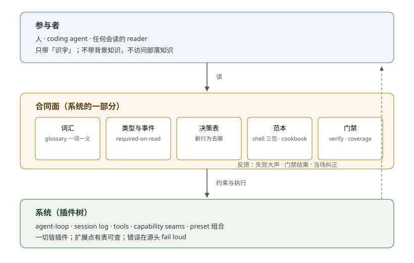

# Harness idea · dsh 作为 harness 的思想

## 一句话

dsh 做对的核心，不是「实现了一个聪明的 agent loop」，而是把**「如何正确参与」的知识外置成一套运行时语法**：插件图回答「系统现在由什么组成」，事件流回答「系统刚才做过什么」，loop 在两者之间取能力、写事实。参与者因此面对的是「读合同 + 照范本 + 过门禁」，而不是「懂行」。

这个形状有两个不同来源，不能混为一谈：**生产方式**解释它为什么长成 agent 形状（写作者自称以 coding agent 为主）；**组合压力**解释这个形状在什么条件下才划算（多宿主、多 provider、会话级隔离、运行时装卸）。前者见 [`01`](./01-role-and-substrate.md)，后者见 [`07`](./07-boundaries-costs-fit.md)。

本专题是 `_digested/` 里唯一**以判断为主、不进入机制核验矩阵**的专题：其它专题以解释「机制是什么」为完成标准，本篇以「dsh 为什么对参与者友好」为完成标准——为什么没有背景知识的读者（尤其 coding agent）容易读懂它，读懂了之后照着做就做对，以及这份判断自己的可信度从哪里来。文中引用机制只作为判断证据，机制真伪仍归 `_coverage/`。

## 为什么存在本专题

1. `_digested/` 其它专题回答「机制是什么」，默认读者已经决定要读懂 dsh；本专题回答「它为什么值得这样被读」，并把答案整理成**可迁移的判断**——可以用来检验任何 harness，不限于 dsh。
2. 答案的核心不依赖背后是不是 LLM：它说的是知识外置（knowledge externalization）与合同面的多重消费，不是模型能力。把 LLM 语境抽掉，它仍是 harness 设计的一般思想（见 [`07`](./07-boundaries-costs-fit.md)）。
3. 判断需要与证据分离：每篇末尾的「证据入口」引用源码与文档，立场单独成文，便于被反驳和修正。
4. 判断需要出处（provenance）：本专题最核心的因果判断不是凭空生成的，是从 Agent Notes 里挖出来的；一个完全新的 coding agent 大概率写不出这些句子。这本身就是「知识在训练先验之外、主要靠搬运与核对」的例子（见 [`08`](./08-judgement-discipline.md)）。

## 章节构思

构思顺序是「先立基底，再拆读懂，再拆做对，再给参与路径与动态可读性，然后补技术选型，最后划边界、给纪律」：

- **01 立基底**（[`01-role-and-substrate.md`](./01-role-and-substrate.md)）：harness 与框架的差别；dsh 的基底是插件图 + 事件流两套系统；参与规则最终由五个运行时问题回答；因果链按证据等级拆开。
- **02 拆「读懂」**（[`02-legibility.md`](./02-legibility.md)）：静态可读性来自八个机制，共同保证「全部参与知识都以字面形式存在」，并且负知识、上下文入口也被外置。
- **03 拆「做对」**（[`03-paved-road.md`](./03-paved-road.md)）：正确路径来自扩展点路由、控制权语义、生命周期归属、门禁与 invariant、以及**门禁自身被测试**的元验证。
- **04 参与阶梯**（[`04-participation-paths.md`](./04-participation-paths.md)）：从改配置到改 loop，不同参与半径有不同的门、合同与检查半径；一次贡献还有完整生命周期。
- **05 动态可读性**（[`05-dynamic-legibility.md`](./05-dynamic-legibility.md)）：dsh 不只可读，还可查询、可试验——`dump-config`、生成目录、`cordis_inspect` / `cordis_mount` 让读者能问运行时。
- **06 技术选型与语言贴合**（[`06-tech-and-language-fit.md`](./06-tech-and-language-fit.md)）：回答「dsh 的技术为什么容易被 coding agent 消化」——先验密度、语义贴合、低密度承重件本地化，三层共同作用。
- **07 边界、成本与适用条件**（[`07-boundaries-costs-fit.md`](./07-boundaries-costs-fit.md)）：合同面被多重消费；原则与智能无关但形状与生产方式和组合压力有关；诚实列出 dsh 的成本与「何时不该学它」。
- **08 判断纪律**（[`08-judgement-discipline.md`](./08-judgement-discipline.md)）：本专题自己的知识从哪来、如何标出处、如何做反事实检验，并给出核心 claim register。

推荐顺序即构思顺序。机制编号只为引用方便：边界故意重叠，不是拼图。

## 术语对照

本专题的重要术语首次出现时中英对照；官方定义以 [`docs/glossary.md`](../../docs/glossary.md) 为准，本表只收录本专题自己的判断性词汇。

| 中文 | English | 含义 |
|------|---------|------|
| 参与规则 | participation rules | harness 外置的「怎么参与」：可见性、激活、作用域、清理、配置到树 |
| 运行时语法 | runtime grammar | Context / Plugin / Fiber / Event / Effect 五原语组成的一套参与规则 |
| 插件图 | live plugin graph | Cordis 维护的当前运行时组成：服务、依赖、作用域、生命周期 |
| 事件流 | session event log | 仅追加的会话事实；模型上下文、UI、fork、遥测都是它的投影 |
| 合同面 | contract surface | 词汇、类型与事件、决策表、范本、门禁组成的字面知识层 |
| 知识外置 | knowledge externalization | 把参与知识从读者脑中搬进系统本身 |
| 部落知识 | tribal knowledge | 只存在于资深参与者脑中、未字面化的规则 |
| 可读性 | legibility | 无背景读者建立正确心智模型的成本 |
| 正确路径 | paved road / pit of success | 正确做法是阻力最小路径的性质 |
| 扩展点路由 | extension routing | 按「事实 / 拦截 / 能力 / loop」四问决定新行为落在哪 |
| 参与阶梯 | participation ladder | 从配置 patch 到扩展点、seam、loop 的分层参与路径 |
| 门禁 | gates | 把合同变成可执行检查的验证脚本 |
| 扩展表 | extension table | architecture.md 的「目标 → 机制」归属表 |
| 注册即效果 | registrations are effects | 贡献经 `ctx.effect` 注册、卸载自动撤销 |
| 失败大声 | fail loud | 误配置在最早可解析点报错，不静默跳过 |
| 一词一义 | one canonical term per concept | glossary 的术语纪律 |
| 一个事实一个家 | one home per fact | 文档 tier 的归属纪律 |
| 模型可见 ⟺ 已记录 | model-visible ⟺ logged | 请求可从 session log 重建的不变量 |
| 负知识 | negative knowledge | 被拒绝方案、已知限制、「为什么这里没有检查」的显式记录 |
| 出处 | provenance | 一条判断从哪份证据（Agent Note / 源码 / 文档）挖出来的记录 |
| 分布外知识 | out-of-distribution knowledge | LM 凭训练先验生成不出来的知识，只能靠检索、核对或人类播种进入文本 |
| 反事实标记 | counterfactual marker | 自问「一个没读过本仓库的 fresh agent 会不会自然写出这句」——会，是通式；不会，才可能是本仓库信息 |
| 多重消费 | multi-consumption | 同一合同面被编译器、门禁、生成器、双 SDK、harness 自身与读者同时消费；漂移先被机器抓住 |

## 核心论点

参与一个 harness 需要两类知识：**系统外置的**（写在哪、怎么写、怎么验证）和**读者自带的**（背景、行话、部落知识）。dsh 的工程重心是让第一类尽可能多、第二类尽可能少：

1. **参与规则住在运行时里，不在人脑里。** dsh 的基底是两套系统：插件图回答「现在由什么组成」，事件流回答「刚才发生过什么」。参与时最关键的五个问题——能看到什么、依赖未就绪怎么办、同名能力如何隔离、谁清理副作用、配置如何变成树——全部有运行时可查的答案（[`01`](./01-role-and-substrate.md)）。
2. **合同是可执行的，不只是可读的。** 类型在编译期拒绝、门禁在提交前纠正、运行时 invariant 在请求发出时比对；门禁本身还要求「证明无效案例会被拒绝」。正确性由系统证明，不由读者自觉（[`03`](./03-paved-road.md)）。
3. **正确路径是分层的、有判定顺序的。** 扩展点路由四问先定落点，event 分发模式定控制权，Fiber 与 effect 定生命周期；patch、扩展点、seam、loop 四层参与各有摩擦与检查半径（[`03`](./03-paved-road.md)、[`04`](./04-participation-paths.md)）。
4. **这个形状来自生产方式与组合压力，不是设计宣言。** 写作者自称以 coding agent 为主，使知识被迫外置；多宿主、多 provider、会话级隔离与运行时装卸，使外置到运行时语法成为划算的选择。两者共同塑形，但都不是「对 agent 友好」的事先宣言（[`01`](./01-role-and-substrate.md)、[`07`](./07-boundaries-costs-fit.md)）。

## 边界

| 本专题回答 | 本专题不回答 |
|------------|--------------|
| 为什么参与容易且正确 | 为什么值得参与（产品价值问题） |
| 知识门槛如何被移除 | 识字门槛如何被完全移除（dsh 的 patch 层只算一部分努力） |
| 什么样的 harness 设计让 reader 能上手 | 具体机制是什么（各专题的 `00-map.md`） |
| 判断的出处与可信度如何管理 | 源码事实的核验（`_coverage/` 的职责） |
| dsh 形状在什么条件下划算 | Pi / OpenClaw / Codex 等项目的源码级评价 |

## 章节

| 文件 | 回答的问题 |
|------|-----------|
| [`01-role-and-substrate.md`](./01-role-and-substrate.md) | 框架与 harness 的差别；插件图与事件流；五个运行时问题；这个形状的因果来源 |
| [`02-legibility.md`](./02-legibility.md) | 为什么没有背景知识的读者（尤其 coding agent）能读懂 dsh |
| [`03-paved-road.md`](./03-paved-road.md) | 为什么正确路径是阻力最小的路径，而且路径本身被测试 |
| [`04-participation-paths.md`](./04-participation-paths.md) | 不同参与半径的门、合同与生命周期 |
| [`05-dynamic-legibility.md`](./05-dynamic-legibility.md) | 为什么 dsh 不只可读，还可以被查询和试验 |
| [`06-tech-and-language-fit.md`](./06-tech-and-language-fit.md) | dsh 的技术为什么容易被 coding agent 消化 |
| [`07-boundaries-costs-fit.md`](./07-boundaries-costs-fit.md) | 哪些原则与智能无关；这个形状何时划算、代价是什么 |
| [`08-judgement-discipline.md`](./08-judgement-discipline.md) | 本专题自己的判断纪律与 claim register |

推荐顺序：`01` → `02` → `03` → `04` → `05` → `06` → `07` → `08`。每篇末尾列证据入口；判断与证据分离，判断是消化后的立场，证据是 DSH 官方源码、文档与 Agent Note 的引用。

## 我的判断

- **判断一：prose 是索引，执行才是保证。** dsh 的规则文档（`docs/`、`AGENTS.md`）写得克制，是因为每一条关键规则都有机器可执行的落点：`verify-export-jsdoc`、`verify-package-invariants`、`doc-typecheck`、coverage 门禁、运行时 invariant。文档负责「告诉你往哪看」，系统负责「证明你做对了」。
- **判断二：「模型可见 ⟺ 已记录」能成立，是因为它被写成了运行时检查。** `dsh-agent-loop/invariant` 在 loop 构建的每次 `llm/stream` 上独立重建请求并与日志比对，不一致直接 fail（机制见 [`03`](./03-paved-road.md)，源码在 `packages/core/agent-loop/src/invariant.ts`）。它是 invariant 体系的一个实例；invariant 体系的另一半纪律是「只在有独立可观察关系时 publish，不造无意义断言」——`0.1.2-rc.1` 连「显式空断言」都裁掉了（见机制六）。agent-loop 实例因有真实关系而在废除中幸存。
- **判断三（反转但有分级）：LLM 读得懂 dsh 不是设计目标，是生产方式残留。** [`2026-06-11-quality-gates`](../../.agents/notes/implemented/process/2026-06-11-quality-gates.md) 的 Problem 段第一句是仓库对自身生产方式的自述；`docs/architecture.md` 那句「推荐用 agent 探索代码库」是后来的注脚。但「开发主力就是 agent」应标为第一方自述，不等同于外部普查；本专题按“自述 + 机制推断”处理。
- **判断四：dsh 的形状还要过「组合压力」检验。** 生产方式解释它为什么是 agent 形状，组合压力解释这个形状何时值得模仿。两者都是判断，不是源码能直接证明的定律（[`07`](./07-boundaries-costs-fit.md)）。
- **判断五：本专题自己也要过分布纪律。** 框架性通式（知识外置、paved road、三问检验）落在 LM 喜欢的分布内，谁都能写；挖出来的事实（因果反转、vendor manifest 门禁、required-on-read、invariant 只在有真关系处断言而「显式空断言」被 `0.1.2-rc.1` 裁掉、note 语料库的出处）在分布外，必须带出处。执行办法在 [`08`](./08-judgement-discipline.md)。

## 判断纪律（摘要）

本专题不进 `_coverage/` 核验矩阵：它不追踪机制覆盖度，只记录消化后的判断。替代纪律在 [`08-judgement-discipline.md`](./08-judgement-discipline.md)，核心是四条：

1. **钉基线**：全部判断对照 DeepSeek Harness `dsh-v0.1.5-rc.2`（commit `fb2c4b9e698e30edb738bca4cf0618587db7d203`），与 `_digested/` 其它专题同一基线。上游同步后按 `_change_log/` 复核本专题的证据锚点。
2. **出处分级**：每条判断标注来源——`[原文]`、`[源码]`、`[推断]`、`[框架]`；后两类可信度最低，只提供结构或假设。
3. **反事实标记**：写判断时自问「一个没读过本仓库的 fresh agent 会不会自然写出这句」；会，是分布内通式；不会，才可能是信息。
4. **自我适用**：[`08`](./08-judgement-discipline.md) 末尾用「三个问题」检验本专题自身，并维护一个核心 claim register。

## 与其它专题的关系

- 机制详情可继续读 `_digested/` 的对应专题，但它们只作研究上下文，不进入证据引用。
- 本专题的证据一律以 DSH 官方文件（`docs/`、`AGENTS.md`、`.agents/notes/`、`packages/`、`scripts/`）为准。
