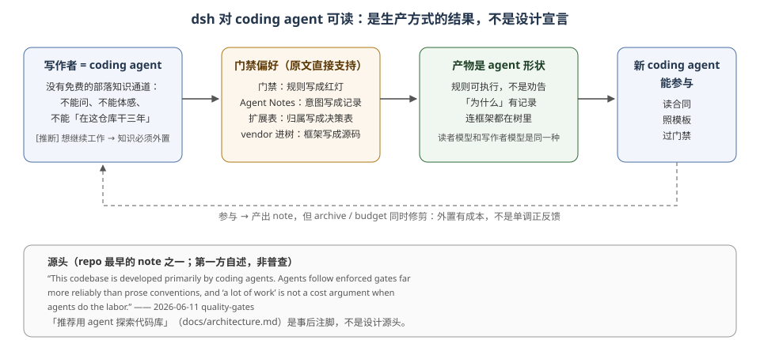

# Harness 的职责与基底：插件图、事件流与五个运行时问题

## 问题

有些系统文档齐全、注释规范，新来的人（或 coding agent）仍然上不了手。原因不是文档写得差，而是**参与规则（participation rules）的位置不对**：规则住在资深开发者的脑子里，文档只描述了局部，系统的形状没有约束任何人。

dsh 的做法不是写更多散文，而是把「怎么参与」下沉成**运行时语法（runtime grammar）**。参与一个 dsh 插件时最关键的五个问题，在运行时里都有确定答案，而不是靠读者猜。

## 框架给原语，harness 给参与规则

框架（Cordis 这层）给的是原语：Context、Plugin、Fiber、Event、Effect——「你能用什么」。harness（dsh 这层）额外回答五个问题：

| 问题 | 运行时答案在 dsh 哪里 |
|------|---------------------|
| 插件在当前位置能看到哪些能力 | `ctx` 是能力地址空间：普通属性读取进入作用域化服务解析器；类型来自 declaration merging；生成目录 [`docs/cordis-api/context.md`](../../docs/cordis-api/context.md) 给出字面 API |
| 必需能力未出现时，插件是否该启动 | `inject` 声明依赖；Fiber 保持 `PENDING`，依赖可解析后才激活，不靠配置文件位置碰运气 |
| 同名服务能否在不同会话或作用域解析到不同实现 | `isolate` 建立私有服务 realm，`extend` 继承，`intercept` 向下游合并配置；group / preset 决定作用域 |
| 插件退出时谁清理注册项、监听器、进程和句柄 | `ctx.effect()` / `ctx.on()` 注册带所有者的副作用；Fiber 卸载时逆序执行 disposer；HMR 复用同一条卸载路径 |
| 静态配置怎样变成可检查的运行时插件树 | Profile / Bundle / Patch 按固定顺序从空根叠加，Loader 逐条挂载；`dsh --dump-config` 输出该机器实际会挂的树 |

这五个问题的答案不是「文档写清楚了」，而是**运行时的形状本身就执行了它们**。`[框架]` 这是 harness 与框架的差别：框架不承诺这五问，承诺它们的是 harness 对框架的使用方式。`[推断]` 这也是本专题从 DSH 的架构文档中归纳出的读法。

## 基底：两套同时运行的系统

dsh 的主体不是 loop，而是两套系统 `[推断]`：

1. **插件图（live plugin graph）**：Cordis 维护当前有哪些能力、它们依赖谁、在哪个作用域生效、卸载时怎样清理。它回答「系统现在由什么组成」。
2. **事件流（session event log）**：Session 维护仅追加的会话事实，模型历史、UI 轨迹、fork、遥测、持久化都从它投影。它回答「系统刚才做过什么」。

Agent loop 位于两者之间：从插件图取模型、工具、提示词与会话服务，再把执行过程写回事件流。这个分工使「当前组成」与「已发生事实」成为两个可分别查询的字面平面，读者不需要从一段控制流里同时还原两者。`[源码]` 对应机制见 [`docs/architecture.md`](../../docs/architecture.md) 的 `## Session log` 与 `## Turn flow`。

一句话记法：**服务回答「能力是什么」，事件回答「何时可以介入」，会话日志回答「发生过什么」。** `[推断]` 这是本专题从 DSH 架构文档中归纳的记法。

## 因果：为什么 dsh 长成 agent 的形状

因果链是全文其余判断的根，但必须按证据等级拆开，不能把解释写成原文。

### `[原文]` quality-gates note 说了什么

> This codebase is developed primarily by coding agents. Agents follow enforced gates far more reliably than prose conventions, and "a lot of work" is not a cost argument when agents do the labor.
>
> —— `.agents/notes/implemented/process/2026-06-11-quality-gates.md:11`（基线 `dd6322d6…`）

直接支持的因果是：**agent 更可靠地服从机械门禁，且 agent 劳动力便宜 → 用 enforced gates 替代 prose conventions。** 这是「门禁为什么这么多」的一手解释。

### `[推断]` 从生产方式推到知识外置

在此基础上本专题推断：写作者没有低成本的部落知识通道，为了让写作者自己第二天还能继续工作，知识必须外置；产物因此天然是 agent 形状。这个推断说得通，但不是 note 原文直接陈述，必须与原文分开。

### `[推断]` 「primarily」是自述，不是普查

quality-gates note 是仓库的第一方自我描述；本专题不把它当作外部普查结论，只作为生产方式自述。因此因果写成「生产方式自称 + 可解释的机制」，不再写成斩钉截铁的既成事实。

### `[原文]` architecture 说了什么；`[推断]` 它是注脚

[`docs/architecture.md`](../../docs/architecture.md) 开篇说「We recommend using an agent to explore the codebase and understand its architecture」。这句话是原文；「它是后来的注脚、不是设计源头」是本专题从 note 时间先后推出的判断——源头是生产方式带来的机械门禁偏好。

> We recommend using an agent to explore the codebase and understand its architecture.
>
> —— `docs/architecture.md:7`（基线 `dd6322d6…`）

## 参与规则的三层载体

| 载体 | 可读 | 可查 | 可执行 | 会腐烂 | 谁在消费 |
|------|------|------|--------|--------|---------|
| 人脑（部落知识 · tribal knowledge） | 否 | 否 | 否 | 会（遗忘、离职） | 只有本人 |
| 文档（prose） | 是 | 是 | 否 | 会（漂移） | 只有人类读者与 LLM 读者 |
| 系统本身（类型、事件、表、模板、门禁、运行时检查） | 是 | 是 | 是 | 漂移更早撞上机器 | 编译器、门禁、生成器、双 SDK、harness 自身、人类与 LLM 读者 |

注意最后一行不再写「系统不会漂移」：系统也会漂移，只是被多个机器消费者消费，漂移更早暴露。dsh 三层都用，但把关键规则下沉到第三层：

- **归属**：[`docs/architecture.md`](../../docs/architecture.md#where-new-behavior-goes) 的 18 行「目标 → 机制」直接回答「这段代码放哪」；[`extension cookbook`](../../docs/cookbook/extension-cookbook.md) 还有更细的 feature → mechanism 表。
- **合同**：Service Definition 是 Cordis `Service`（抽象类或注册表，不是 `interface`）；事件经声明合并成为类型化 map；`SessionEventMap` 成员默认 required-on-read。
- **门禁（gates）**：`verify-export-jsdoc`、`verify-package-invariants`、`doc-typecheck`、`test:coverage`（per-file 100%）。规则不是劝告，是红灯。
- **词汇**：[`docs/glossary.md`](../../docs/glossary.md) 规定一个概念一个词；文档标准规定「一个事实一个家」（[`docs/AGENTS.md`](../../docs/AGENTS.md)）。
- **设计意图**：`为什么` 单独住在 Agent Notes——baseline 共 1486 个 `.md` 文件，其中 1124 个在 `implemented/`；被分类、双语、归档政策管辖。`docs/` 只写当前状态，读者不用从 git log 反推意图。
- **负知识**：被拒方案住在 `rejected/`；归档 note 冻结且不当现行权威；package 的 `./invariant` 允许「有理由的空 companion」；README 的 Known Limitations 被门禁检查。读者不只查到「怎么做」，也查到「什么不要做」。

## 结论

harness 的职责 = 让「正确参与」不依赖参与者的背景知识。做到的系统，读者只需要识字（literacy），加上一小撮**被拆小、有工具支持的判断**（见 [`03`](./03-paved-road.md) 与 [`04`](./04-participation-paths.md)）；做不到的系统，读者需要行。dsh 特殊之处不是「把它当工程目标」，而是**生产方式让外置知识成为工程现实，组合压力让外置到运行时语法成为划算选择**——前者是自述加推断，后者见 [`07`](./07-boundaries-costs-fit.md)。

## 证据入口

- [`2026-06-11-quality-gates`](../../.agents/notes/implemented/process/2026-06-11-quality-gates.md)（第 11 行；因果原文）
- [`2026-06-11-vendor-cordis-as-source`](../../.agents/notes/implemented/process/2026-06-11-vendor-cordis-as-source.md)（第 9 行；框架层被搬进仓库的真实理由）
- [`docs/architecture.md`](../../docs/architecture.md)（第 9 行；扩展表、事件域、推荐用 agent 探索）
- [`docs/cordis-primer.md`](../../docs/cordis-primer.md)（五条原语）
- [`docs/glossary.md`](../../docs/glossary.md)（第 5 行；一词一义）
- [`../../AGENTS.md`](../../AGENTS.md)（standing orders：面向 agent 的规则本身）
- [`docs/event-producer-consumer.md`](../../docs/event-producer-consumer.md)（事件 dispatcher / listener 矩阵）
- [`../../scripts/run-gates.ts`](../../scripts/run-gates.ts)（门禁聚合器）
- [`../../packages/core/agent-loop/src/invariant.ts`](../../packages/core/agent-loop/src/invariant.ts)（运行时 invariant 实例）
