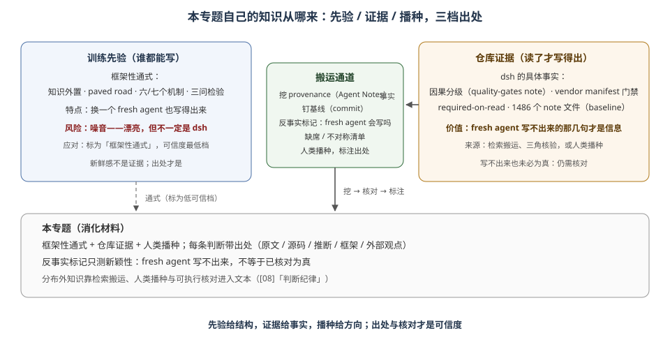

# 什么会杀死可参与性（participability）：反面清单

本页是 [`02`](./02-legibility.md) 与 [`03`](./03-paved-road.md) 的镜像：每一条「杀死可参与性」的设计，dsh 都有一个反制。用这张表检验任何 harness：规则住在哪层、正确与错误路径的摩擦差多少、错误何时被发现。

| 杀死可参与性的设计 | 表现 | dsh 的反制 |
|--------------------|------|-----------|
| 隐藏默认值 | `?? default` 埋在 `run()` 里 | `resolve(request): Spec` 显式步骤；参数都是 `Config` 字段 |
| 部落知识 | 正确写法只在 review 口头传递 | `AGENTS.md` 字面规则；cookbook 范本；门禁强制执行 |
| 文档漂移 | 手抄 catalog、文档与源码各说各话 | 目录从源码生成 + freshness gate |
| 特殊案例 | 每加一个功能都要改 loop | 扩展表：一切新行为走扩展点 |
| 歧义 | 两个词指一个东西、两条路都能做 | glossary 一词一义；closed union；`assertNever` |
| 失败沉默 | 误配置静默跳过、错误离源头远 | fail loud at load；required-on-read；错误消息指明规则 |
| 反馈缺失 | 写错直到人类 review 才发现 | `verify-*`、per-file 100% 覆盖率、snapshot、运行时 invariant |
| 变迁史散文 | 文档讲「以前 / 现在 / 以后」 | 当前状态散文；历史归 Agent Notes |
| 无范本 | 正确写法只存在于某个 300 行文件里 | `defineTool` 最小 shape；shell 三包生产级范本 |
| 判断二选一 | 正式注册与临时挂载是两种写法 | 注册即效果，只有一种写法 |
| 无基线漂移 | 判断不钉 commit，上游改了没法复核 | 本专题：全部判断钉 `528c682e…` 基线 + 证据锚点 |
| 分布洗钱 | 人类播种的洞察被磨成模型输出，出处丢失 | 本专题：判断标注出处（挖自 note / 播种自人 / 框架性通式） |
| 无工具支持的判断 | 「哪些检查必须跑」靠经验口传 | `dsh-pre-push-checks`：按改动面选最小检查集 |
| 上下文预算爆炸 | 规则多到读不完、装不进上下文 | 规则分层 + 一个事实一个家 + `verify-doc-budgets` 字数预算 |

## 用三个问题检验一个 harness

1. **规则在哪层？** 人脑（部落知识 · tribal knowledge）→ 文档（可读不可执行）→ 系统（类型、表、门禁、运行时检查）。dsh 的答案：尽可能第三层。
2. **正确路径与错误路径的摩擦差多少？** 差越大，读者越容易做对。dsh 的答案：形状上只有一条路。
3. **错误何时被发现？** 当场（编译期 / load / 运行时检查）→ 提交前（门禁）→ review（以天计）→ 生产。dsh 的答案：当场。

把这三个问题用在任何「对 agent 不友好」的系统上，答案几乎总是：规则在文档与人脑之间、正确路径与错误路径摩擦相等、错误在生产才暴露。这不是玄学，是知识外置程度的三个读数。

## 反面的反面：外置不是全部

外置过头也会伤可参与性：规则多到读不完、门禁严到修不动、词汇细到记不住。dsh 的节制体现在：

- 规则有层级：`AGENTS.md` 只放 standing orders，细节链接到 home（[`docs/AGENTS.md`](../../docs/AGENTS.md)）；
- 门禁有窄化原则：只跑覆盖当前 diff 的最小检查（[`dsh-pre-push-checks`](../../.agents/skills/dsh-pre-push-checks/SKILL.md)）；
- 文档有字数预算：`verify-doc-budgets` 把每份文档钉在预算内。

但节制是有成本的，成本应该有数：`scripts/run-gates.ts` 聚合 **54 个具名门禁**、`.agents/notes/` 存着**约 1500 条** Agent Note、per-file 100% 覆盖率对每次改动征收测试税、根 `AGENTS.md` 每个会话都要占用上下文预算。可参与性（participability）= 外置程度 ÷ 外置成本。本专题讲的都是分子，这一节是分母——分母不为零，dsh 的选择是把分母花在「机器可检查」上，而不是花在「人可读不可执行」的散文上。

## 自我适用：用三个问题检验本专题

本专题主张「关键规则要下沉到第三层」，那就用它自己的尺子量自己：

1. **规则在哪层？** 本专题的判断落在第二层（prose）：`_digested/verify.mjs` 只查链接、UTF-8 与 SVG 结构，不查判断真伪。本专题**接受**这个事实，替代纪律写进 [`00-map.md`](./00-map.md)「判断纪律」：钉基线、出处标记、反事实标记、自我适用。
2. **正确路径与错误路径的摩擦差多少？** 每条判断带出处：挖自 Agent Notes 的是信息，框架性通式（知识外置、paved road——LM 分布内谁都会写）是噪音风险最高的部分。出处标记让「说不出从哪挖出来的判断」变得显眼——这是本专题自己的 paved road。
3. **错误何时被发现？** 上游同步时按 `_change_log/` 复核（基线变了会牵动证据锚点），以及每次人读时。没有机器帮本专题抓错——诚实地说，这就是第二层载体的处境，也是第三层载体更值得向往的原因。

最后一层自省：**本专题的框架性通式（六/七个机制、三层载体、三问检验）落在 LM 喜欢的分布内，换一个 fresh agent 也写得出来；本专题的信息性内容（因果反转、vendor manifest、required-on-read、note 语料库的出处）在分布外，只能从证据里搬。** 判断一篇消化材料有没有价值，问的不是「写得漂不漂亮」，是「哪几句是 fresh agent 写不出来的」。分布之外的知识不能幻想写出来——只有两条路：读证据，或人类播种。

## 证据入口

- [`../../AGENTS.md`](../../AGENTS.md)（不变量陈述与门禁清单）
- [`docs/AGENTS.md`](../../docs/AGENTS.md)（tier taxonomy：一个事实一个家；字数预算）
- [`../cordis-runtime/02-waterfall-与事件合同.md`](../cordis-runtime/02-waterfall-与事件合同.md)（waterfall 合同被违反时的行为）
- [`../composition/01-boot-时序.md`](../composition/01-boot-时序.md)（fail loud 的两段失败标签）
- [`2026-06-11-quality-gates`](../../.agents/notes/implemented/process/2026-06-11-quality-gates.md)（门禁成本的源头记录）
