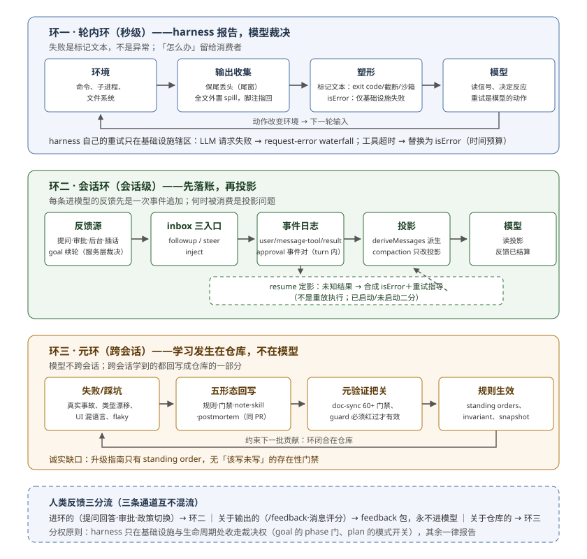

# 反馈如何闭环：harness 报告，模型裁决，仓库学习

## 问题

loop engineering 的讨论把一轮循环拆成控制链：目标 → 行动 → 环境反馈 → 裁决 → 继续/停止 → 状态与结果分账 `[框架]`。这条链里 harness 真正拥有的是**反馈链路本身**——信号是否保真、是否可达、是否可恢复；裁决（继续还是停）在多数系统里另有归属。所以「DSH 的反馈环路如何设计」这个问题，准确问法是三个：DSH 把失败信号塑造成什么形状交给模型？反馈如何持久化与恢复？harness 自己如何从失败中学习？

本篇的回答是一个三环结构：**轮内环**（环境事实 → 模型可见信号的塑形层）、**会话环**（反馈 → 事件日志 → 投影的记录层）、**元环**（harness 自身的失败 → 仓库规则的学习层）。支撑三环的是一个统一的、反直觉的设计立场：**harness 在轮内环里拒绝裁决**——它报告失败而不吞掉失败，把「怎么办」留给模型；只有两处例外，都发生在 harness 真正拥有所有权的地方（基础设施与目标生命周期）。

## 基线

本篇是新篇，证据锚定当前工作树 `0.2.0-rc.2`（commit `4e97cf7530`），与本专题其余篇章的基线 `0.1.7-rc.1 @ 46a7f68b09` 不同。上次同步（`_change_log/0009`）对本篇引用件的已知变更已包含在本篇锚内：user-questions 的 timed waits 与 late replies 即 0009 引入，本篇引用其当前形态；其余引用件（tool-bash render、subprocess 输出收集、guard 家族、goal、feedback、repair）未见变更记录。跨基线稳定的关键件（`dsh-agent-loop/invariant`）在 [`03`](./03-paved-road.md) 已按旧基线引用。

## 机制一：失败是标记文本，不是异常

`bash` 工具把一次命令运行的退出状态渲染成**普通文本标记**，排在输出末尾：

> Non-zero exits are reported, not errored — the model decides how to react; only infrastructure failures (spawn errors, aborts) surface as isError results.
>
> —— `packages/shell/tool-bash/src/render.ts:19-21`（基线 `4e97cf7530`）

这条注释划出了本专题在反馈问题上读到的最重要分界。`isError=true` 的来源是封闭清单：工具体抛错、pre-execute 审批拒绝、post-execute 策略 block、guard 超时、调度中止的合成结果（`packages/core/tools/src/index.ts:1520-1531,1786-1794`；`packages/guard/timeout-policy/src/index.ts:41-48`；`packages/core/agent-loop/src/tool-calls.ts:250-260`）。其余一切——非零退出、被信号杀死、超时被杀、stderr 段、沙箱拒绝、输出截断——都以 `[exit code: N]` 一类标记拼进普通 text（`tool-bash/render.ts:43-61`）。分界原则不是「失败与否」，是**失败发生在谁的辖区**：命令级失败是环境事实，基础设施失败才是 harness 自己的错。

由此推出一个容易被误读为缺陷的设计决定 `[推断]`：**工具失败没有 harness 侧的重试与熔断**。整条 retry waterfall 只挂在 LLM 请求失败上——`agent/request-error` 事件，返回 `{kind:"retry"}` 才重试，否则抛错结束 turn（`packages/core/agent-loop/src/agent.ts:494-509`）；重试策略由 provider 的退避策略给出（`packages/llm/llm-retry/src/index.ts:194-241`），context 超限还被 compaction 插手抢修后重发同一请求（`packages/compaction/compaction-basic/src/index.ts:190-233`）。工具失败则一次结算：这条结果永远进入下一轮上下文，「重试」是模型读着 `[exit code: N]` 自己决定的下一个动作。反馈的裁决权在信号层被完整留给了消费者。

## 机制二：保真三件套——保尾、外置全文、截断语义收窄

反馈链路最常见死法是「送达即失真」（截断与摘要丢掉关键事实）`[框架]`。dsh 的对策是三件一起上 `[源码]`：

1. **保尾丢头**：进程输出按字节保留内存尾窗，因为「errors and final results cluster at the end of command output」——这条理由连出处都写进了注释（tail-keep rationale，取自 pi/OpenCode，`packages/subprocess/subprocess-local/src/output.ts:126-127`）。
2. **丢掉的部分外置成工件**：全量输出尽力写入 spill 文件，模型可见文本末尾一行 `[output truncated; full output: <spillPath>]` 指回去（`tool-bash/render.ts:11-15`）。被摘要的信号永远带着找回全文的路径。
3. **`truncated` 语义被收窄成合同**：它只表示「预算省略」，不表示「上游不完整」；权限失败、provider 部分失败一律留在工具域字段，绝不折叠进 `truncated`（`packages/util/output-retention/src/index.ts:11-15`）。

第三件最见功力：一个布尔字段被写成有明确反例的语义合同，防止「截断」这个词慢慢吞掉所有失败种类的差异。配套的 compaction 也是预算反馈而非内容裁决——两级降费（先模型无关的 tool-result 投影修剪，再 LLM 摘要），摘要以 surface replace 写回，**日志原件不改、可重放**，invariant 仍要求请求可从完整日志重建（`compaction-tool-result-pruner/src/index.ts:83-122`；`compaction-basic/src/region.ts:473-509`；`agent-loop/invariant.ts:36-43`）。

## 机制三：守护者只观察与富化，不绝决

guard 家族（`packages/guard/`，base bundle 默认启用）处理两个经典失控模式，两个都选了「不接管控制流」的形态。重复调用检测器自述立场：

> Observe-and-enrich, never veto: count first … then fold the reminder onto whatever came back — additionalContexts rides both decision variants, so a blocked call still gets the nudge.
>
> —— `packages/guard/repeat-tool-reminder/src/index.ts:216-219`

重复 call 按 `[3,5,8]` 阈值升级提醒，提醒以 notice 形态的 user message 进下一步 inbox，**连被拒绝的调用也计数**——「a model hammering a denied call is exactly the loop worth breaking」（`:190-194`）；用户插话即重置。沙箱升级被拒时，同轮的升级提示骑在 denial 结果上，因为「the nudge lives at the decision point so the sanctioned retry does not depend on the model recalling the tool description」（`packages/sandbox/sandbox/src/escalation.ts:75-78`）——反馈在决策点就地供给，不赌消费者记得说明书。

例外恰好反证原则：`timeout-policy` 是唯一**替换**结果的 guard（isError，`TOOL_TIMEOUT`），因为它守护的是基础设施的时间预算——又落回「harness 只在自己辖区裁决」。

## 机制四：反馈先落账，再进上下文

会话环的第一定律是「模型可见 ⟺ 已记录」在反馈面上的应用：每一条进模型的反馈都先是一次事件追加。人的三类输入共用一条管道——`followup`（下一 turn 唤醒）、`steer`（下一 step 插入）、`inject`（下一步不唤醒），统一经 inbox splice 进队，落 `user/message` 事件（`packages/core/agent-loop/src/agent.ts:154-173,420-423`）。审批是 turn-enclosed 事件对（`approval/asked` + `approval/decided`，裸事件在恢复时是 crash-tail 垃圾，`packages/interaction/user-approval/src/index.ts:215-234`）；提问的回答以 `user-question-reply` 来源 steer 回注（`packages/interaction/user-questions/src/index.ts:165-206`）；后台任务结束发 notice，空闲则唤醒开新 turn、忙碌则注入下一步（`packages/jobs/tool-jobs/src/index.ts:271-308`）。

「状态回注」这个形状在 dsh 里有三个实现，裁决者各不相同——这是读懂其反馈分权的关键表格 `[源码]`：

| 件 | 粒度 | 裁决者 | 机制 |
|---|---|---|---|
| todo | 本轮任务清单 | 模型自裁决 | last-write-wins 投影，下个 turn/start 清空，log-only 不回注 prompt（`packages/todo/tool-todo/src/index.ts:123-131,199`） |
| goal | 整个目标生命周期 | 服务层 + driver（模型提议，权威门裁决） | CAS revision + phase 转换表 + 续轮 driver（见下） |
| plan | 会话协作模式 | 用户 | log-only 布尔，切换以叙事 user message 注入（`packages/plan/plan-mode/src/index.ts:457-467`） |

goal 的续轮是最完整的反馈控制回路：agent idle 且 goal armed 时，driver 把 `<goal_round>` 提示按 `Round: n/max` 排队；轮数上限触发 `block('round-limit')`（`packages/goal/goal-round-driver/src/index.ts:164-192`）；模型报 `blocked` 有最小连续轮数门槛（默认 3，防一次挫败就弃）`[源码]`；`complete` 需要 direct-human 或确切 goal-round 权威（`packages/goal/tool-goal/src/index.ts:263-330`）；resume 轮数耗尽时拒绝并要求人先调上限，模型不能自行 resume paused goal。裁决在服务层，不在模型——**提议权与裁决权分离** `[推断]`。

## 机制五：恢复时旧状态被定影，不是重放

resume 遇到中断的尾轮，dsh 不重放执行，而是把未知结果**定影**（fixation）为带重试指导的合成错误结果：

> The tool call was interrupted after it was recorded, but no result was durably recorded. Its outcome is unknown. Decide whether to retry from the tool semantics: retry only if the operation is read-only or idempotent; if it may have side effects, first verify external state or ask the user. Do not retry blindly.
>
> —— `packages/core/session/src/repair.ts:32-41`

`interruptedTurnClosers`（入口 `repair.ts:209`，resume/fork/冷读共用）调 `openTurnClosers`（`:53-98`）补齐 tool/result（isError）→ step/end → turn/end，seq 续接、时间戳复用最后真实事件；同一机制在活 loop 的 step 失败路径复用（`agent.ts:331-352`），fork 的继承面有变体文案（`repair.ts:37-39`），冷读导出也补同一组 closers（`packages/session-query/session-query/src/cold-read.ts:55`）。已启动与未启动二分——「结果未知」与「根本没跑」是两个不同的反馈，给出不同的重试资格。这是「旧证据以什么资格复用」这个问题在 dsh 里的答案：不是复用，也不是丢弃，是**把不确定性本身作为反馈交给消费者** `[推断]`。

## 机制六：人类反馈三分流

dsh 把「人的反馈」按目的地拆成三条互不混流的通道（three-way split）`[源码]`：

1. **进环的**：提问回答、审批、政策切换——到达模型的路径各不相同但都有名有姓（提问回答以 `user-question-reply` steer 回注；审批的 asked/decided 事件对本身 log-only，模型看到的是它的下游——拒绝转 isError 工具结果、policy never 的说明语注入 system prompt：`NEVER_SENTENCE`，`user-approval/src/index.ts:73`；政策变化注入 user message：`:188-194`）。
2. **关于输出的**：`packages/feedback/` 的会话备注与逐条消息评分，README 一句话钉死方向——「Neither kind of feedback reaches the model — these are signals about the output, never input to it」（`packages/feedback/README.md:12`；`:28`「recording one is safe at any point … never changes what the model sees」）。log-only，消费者是产品面与分享策略，不是下一轮请求。
3. **关于仓库的**：对 harness 自身行为的反馈，走元环（机制七）。

值得停下来的是第 2 条的反面 `[推断]`：很多 harness 把用户 rating 直接拼进上下文教模型「讨好」，dsh 明确拒绝——**对产出的评价是给维护者的信号，不是给模型的奖励**。奖励信号的环路根本不存在，而不是被小心管理。

## 机制七：元环——学习发生在仓库，不在模型

dsh 没有任何「模型从历史会话学习」的机制：跨会话持久的只有会话日志本身（fork/resume 原样重放），没有从中提炼并回注 prompt 的记忆系统 `[源码]`（负证据：全 `packages/` 无 memory/recall 包、无 MemoryService 类件；feedback 包已排除）。它把慢反馈整个外置到仓库层——失败经五条形态回写成系统的一部分 `[源码]`：

- **改规则**：`2026-09-19-no-unknown-casts` note（生产代码借 `unknown` 断言绕类型检查）→ `AGENTS.md:147` 一条 standing order；
- **造门禁**：同 note → `verify-no-unknown-casts` 门禁（`scripts/run-gates.ts:371`）；UI 混语言 → `verify-client-ui-i18n`（`:368`）；持久化类型漂移 → `verify-persistence-changes`（`:828`）；
- **写决策理由**：Agent Note 同 PR 写入，「Alternatives considered」强制——「A decision recorded without what it beat invites re-litigation」（`.agents/notes/README.md:46,111`）；
- **外置判断为 skill**：COT 泄漏、CI flake 诊断都从踩坑变成可复用的诊断流程（`.agents/skills/dsh-trim-cot-leakage/SKILL.md:8`、`dsh-ci-test-reliability`）；
- **写事故报告**：`docs/postmortem/0001`（178 绿测 + 100% 覆盖下 ACP 全挂）→ `docs/testing.md` 的「Test the real entry path」规则——postmortem 是唯一允许 war-story 的 tier。

且回写本身被检查：`doc-sync` 聚合 60+ 门禁管文档与代码同步；note 新增强制 supersession check；归档件封进 SHA-256 append-only manifest；元验证条文要求「A guard only guards if the regression fails it … prove it: introduce the regression, watch red, revert」，e2e 要「re-runs the command or re-reads the file externally; a keyword probe on the agent's own output lets a cheating agent pass」（`docs/testing.md:40,33-35`）。诚实缺口也登记在案：升级指南的「破坏必须立即写 guide」只有 standing order（`AGENTS.md:11`），`verify-upgrade-guides`（`run-gates.ts:848`）只查已存在 guide 的格式，**不查该写未写**——元环上唯一没有机器存在性强制的一段 `[源码]`。

## 边界：DSH 的 Eval 层是薄的

借 loop_engineering 归纳的「loop 对 harness 七项能力要求」作对照尺 `[框架]`：观察真实结果、关联当前对象、呈送可行动信息、使消费者能恢复、保护证据与判据、暴露预算与中断、留下决策与接手依据。dsh 在 1/2/3/4/6/7 上都有上文对应的机制；弱在第 5 项——**裁判与执行不分离**。轮内环没有独立 grader seam：测试由当事 agent 自己写自己跑，验收靠门禁体系事后兜底而非运行中独立裁决；goal 的 `complete` 是权威门（谁有权说完成）而不是证据裁决（什么证据算完成）。也就是说，dsh 把「反馈保真」做到了工程强度，把「验收独立性」留给了门禁与 review 这套仓库侧慢环路——快环内它信任模型读信号，快环外它不相信任何自报 `[推断]`。这组张力是有意的：同一系统在轮内乐观（信号给足，模型自理）、在仓库层悲观（一切自报都要机器再验一遍）。

## 总结

三环一句话：**轮内环保真不裁决**（失败是带找回路径的标记，guard 只提醒，重试是模型的动作）；**会话环先账后投影**（反馈先落事件，何时被消费是投影问题，恢复把未知定影成带指导的错误）；**元环把学习做成仓库的构建系统问题**（失败→规则/门禁/skill/note，且回写被元验证把关）。贯穿的立场是分权：harness 只在基础设施与生命周期处收走裁决权，其余一切报告给人与模型；而学习不发生在模型里，发生在仓库里——因为模型不跨会话，仓库跨。

## 证据入口

- `packages/shell/tool-bash/src/render.ts:19-21,43-61`（reported, not errored；marker 清单）
- `packages/subprocess/subprocess-local/src/output.ts:126-127`（tail-keep rationale）、`packages/util/output-retention/src/index.ts:11-15`（`truncated` 语义合同）
- `packages/core/agent-loop/src/agent.ts:154-173,494-509,671-686`（inbox 三入口、request-error waterfall、deriveMessages）、`packages/core/agent-loop/src/tool-calls.ts:250-289`（合成与结算）、`packages/llm/llm-retry/src/index.ts:194-241`（重试策略）
- `packages/guard/README.md:12`、`repeat-tool-reminder/src/index.ts:190-231`、`packages/sandbox/sandbox/src/escalation.ts:75-78`（观察与富化、决策点提示）
- `packages/compaction/compaction-basic/src/index.ts:158-233`、`region.ts:473-509`、`compaction-tool-result-pruner/src/index.ts:83-122`（预算反馈与 surface replace）
- `packages/interaction/user-approval/src/index.ts:73,188-234`、`packages/interaction/user-questions/src/index.ts:165-206`（审批与提问回注）
- `packages/goal/goal-round-driver/src/index.ts:164-192`、`packages/goal/tool-goal/src/index.ts:263-330`、`packages/todo/tool-todo/src/index.ts:123-131`、`packages/plan/plan-mode/src/index.ts:457-467`（三种状态回注的裁决者）
- `packages/core/session/src/repair.ts:32-41,53-98,209`（定影文案、closers 与入口）、`packages/feedback/README.md:12,28`（单向信号）
- [`docs/testing.md:33-40`](../../docs/testing.md)（元验证条文）、[`AGENTS.md:11,147`](../../AGENTS.md)（升级指南 standing order、no-unknown 规则）、[`scripts/run-gates.ts:368,371,828,848`](../../scripts/run-gates.ts)（防漂移门禁）、[`.agents/notes/README.md:46,111`](../../.agents/notes/README.md)（note 纪律）、[`docs/postmortem/0001-acp-default-export-drops-inject.md`](../../docs/postmortem/0001-acp-default-export-drops-inject.md)（事故→规则实例）
- 对照框架（不作证据）：`ai_dev_sdlc_aidc/02_research/01_agent_engineering/loop_engineering/digested/09-feedback-harness-interface.md`（控制链与七项能力要求的研究归纳）
