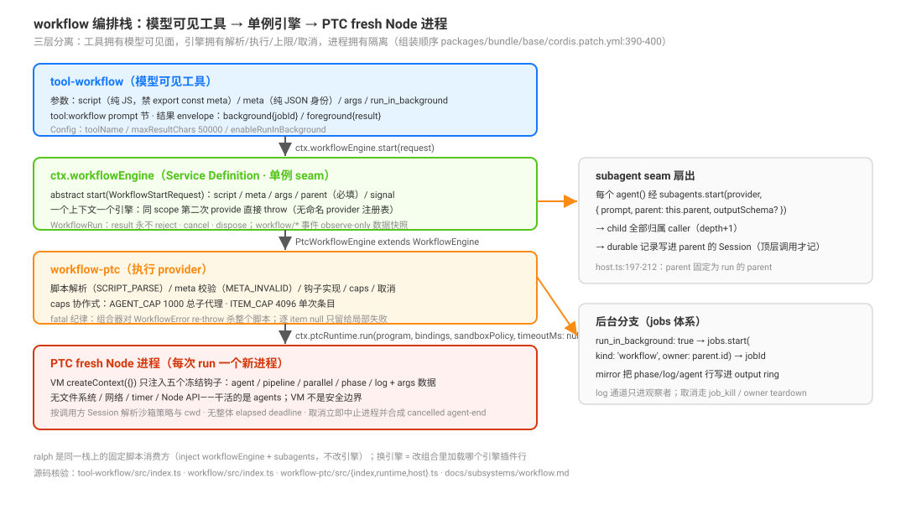

# workflow：模型编写的 JS 编排脚本与子代理扇出机制

源码核验入口：`packages/workflow/tool-workflow/src/index.ts`、`packages/workflow/workflow/src/index.ts`、`packages/workflow/workflow-ptc/src/`（`index.ts`/`runtime.ts`/`host.ts`/`guest.ts`/`meta.ts`/`realm.ts`）、`packages/core/tools/src/json-schema.ts`、`packages/jobs/jobs/src/index.ts`、`packages/workflow/tool-ralph/src/index.ts`、`packages/bundle/base/cordis.patch.yml`、`docs/subsystems/workflow.md`。

本页回答：模型写的 workflow 编排脚本在什么进程里跑、能调用什么钩子、失败如何结算、结果如何持久化？工具的选择边界（什么时候该用）不在本页，见 [`02-什么时候用哪个原语-官方选择决策语义全景.md`](./02-什么时候用哪个原语-官方选择决策语义全景.md)。

## 为什么是这个形状：设计考量

没有 workflow 时，扇出型工作（多文件审计、迁移、多角度调研）只能**逐轮委派**：每个中间结果都落进父上下文、计划无处持久、每步协调花一次模型往返（`.agents/notes/implemented/feature/2026-07-05-dynamic-workflows.md` Problem 节）。设计者的答案是让**脚本而不是对话**持有循环、分支与中间结果——模型写一段 JS 编排脚本，脚本扇出子代理、自己消化中间值，父上下文只收最终结果。这是 Claude Code dynamic workflows 的合同（meta 字段词汇对齐），但有一个**故意的分歧**：钩子滥用（写错的选项、越界的 schema、触顶）在 CC 里会溶进一个与子代理失败无法区分的 `null`，DSH 把它升级为 fatal——「一个 typo 的选项绝不能溶解成 null，那正是本仓库禁止的 accepted-then-ignored 失败模式」（同 note Decision 节）。引擎侧同样有取舍：`ctx.workflowEngine` 一个上下文只有一个引擎、无命名 provider 注册表——**引擎是部署替换件，不是共居者**（子代理的 transports 才是共居的）；`result` 永不 reject（失败结算为 stopReason，消费方永不处理 rejection）；`workflow/*` 事件是 observe-only 的数据快照——**控制权留在 run 的持有者手里**，订阅者拿不到 cancel。

## 定位：三层分离



```text
tool-workflow（模型可见工具：schema、tool:workflow prompt 节、结果 envelope）
        │ ctx.workflowEngine（Service Definition，一个上下文一个引擎）
        ▼
workflow-ptc（执行 provider：脚本解析、钩子实现、caps、取消）
        │ ctx.ptcRuntime + ctx.subagents + ctx.sandboxPolicy
        ▼
PTC fresh Node 进程（脚本 VM 只注入钩子与 args；子代理经 subagent seam 派发）
```

工具拥有模型可见面（schema、系统提示节、结果渲染），引擎拥有脚本解析、执行、上限与取消；「caller 必须供应执行引擎，隔离策略可换而可见行为不变」（`packages/workflow/workflow/README.md:12`、`packages/workflow/tool-workflow/README.md:66`）。shipped base 组合依次加载 `dsh-ptc-runtime-node` → `dsh-workflow-ptc`（`provider: spawn`）→ `dsh-tool-workflow`（`packages/bundle/base/cordis.patch.yml:390`-`400`）。

引擎是单例 seam：`ctx.workflowEngine` 之上无命名 provider 注册表，同 scope 第二次 provide 直接 throw（cordis 通用规则，`vendor/cordis/src/reflect.ts:290`；`docs/subsystems/workflow.md:5`）。换引擎 = 改组合里加载哪个引擎插件行（`packages/workflow/workflow/README.md:71`）。

## 工具面：注册、参数与 Config

- 注册：`inject = ['tools', 'workflowEngine', 'systemPrompt']`（`packages/workflow/tool-workflow/src/index.ts:40`-`41`）；工具名与 prompt 节名都来自 `toolName` config（默认 `'workflow'`）。
- 参数四件：`script`（纯 JS 函数体，禁 TypeScript、禁 `export const meta` 头、允许顶层 await、以 `return` 收尾，`:332`-`337`）；`meta`（工作流身份的纯 JSON 数据：`name`/`description` 必填，`whenToUse`/`phases` 可选，`:338`-`360`）；`args`（原样暴露为脚本全局的 JSON 输入，`:363`-`367`）；`run_in_background`（仅当 `enableRunInBackground` 为 true 时出现，`:368`-`373`）。
- Config 三项（`:59`-`63`）：`toolName`（默认 `workflow`）、`maxResultChars`（默认 50000，超限截断并附 `[truncated: …]`，`:239`-`246`）、`enableRunInBackground`（默认 true；关闭时参数不暴露且调用被拒，`:414`-`417`）。
- 输出 envelope 两支：后台 `{kind:'background', jobId, runId}`；前台 `{kind:'foreground', runId, agentsStarted, result}`（`:375`-`398`）。

**调用形态与完整示例**（脚本 DSL 的全貌——五个钩子 + args，没有 fs/network/timer/Node API）：

```json
{ "script": "<纯 JS 函数体>", "meta": { "name": "audit-repo", "description": "逐文件审计并汇总",
    "phases": [{ "title": "逐文件审计" }, { "title": "汇总" }] },
  "args": { "files": ["a.ts", "b.ts"] } }
```

```js
phase('逐文件审计')
const results = await pipeline(args.files,
  async (prev, file, i) => await agent(
    `审计 ${file} 的导出与依赖，返回问题清单`,
    { label: `audit ${file}`, schema: {
        type: 'object',
        properties: { file: { type: 'string' }, issues: { type: 'array', items: { type: 'string' } } },
        required: ['file', 'issues'], additionalProperties: false } }),
  async (report) => report === null ? null : { file: report.file, count: report.issues.length })
phase('汇总')
const merged = await parallel([
  () => agent('汇总已审计文件的问题并排序', { label: 'merge', phase: '汇总' }),
  () => agent('给出修复优先级建议', { label: 'prioritize', phase: '汇总' }),
])
return { audited: results.filter(Boolean).length, merge: merged[0], priorities: merged[1] }
```

`meta` 在任何脚本文本被执行前先做 schema 校验、失败即拒绝——引擎绝不为了拿 meta 而求值脚本（`docs/subsystems/workflow.md:13`）。

## 脚本钩子：能调用什么

VM 上下文 `createContext({})` 后只注入五个冻结函数（`agent`/`parallel`/`pipeline`/`phase`/`log`）与 `args` 数据（`packages/workflow/workflow-ptc/src/runtime.ts:83`-`98`）。**脚本没有文件系统、网络、timer 或 Node API——干活的是 agents**（工具描述末句，`packages/workflow/tool-workflow/src/index.ts:166`；VM 不是安全边界，进程级约束由 PTC 与 OS 文件策略持有，`packages/workflow/workflow-ptc/README.md:159`）。

| 钩子 | 语义 | 实现入口 |
|------|------|---------|
| `agent(prompt, opts?)` | 跑一个子代理到完成；无 `opts.schema` 返回子代理全文拼接，有则返回校验后的对象；子代理失败返回 `null` | `packages/workflow/workflow-ptc/src/runtime.ts:163`-`229` |
| `pipeline(items, ...stages)` | 逐项独立跑完整 stage 链，**无跨 stage 屏障**：每个 item 的 for 循环只等自己的前一段；stage 收 `(prev, item, index)`，首段为 `(item, item, index)` | `packages/workflow/workflow-ptc/src/runtime.ts:310`-`340` |
| `parallel(thunks)` | `Promise.all` **全量屏障**：等所有零参函数；一个 thunk 抛错该位置为 `null` | `packages/workflow/workflow-ptc/src/runtime.ts:285`-`308` |
| `phase(title)` | 进度分组，**无执行语义**（`packages/workflow/workflow/src/types.ts:26`-`27`）；后续无 `phase` opt 的 `agent()` 继承当前标题 | `packages/workflow/workflow-ptc/src/runtime.ts:351`-`356` |
| `log(message)` | 给观察者的叙事行 | `packages/workflow/workflow-ptc/src/runtime.ts:360`-`366` |

`agent()` 的合法 opts 仅 `label`/`phase`/`schema`/`provider`/`model`（SUPPORTED_AGENT_OPTIONS，`packages/workflow/workflow-ptc/src/runtime.ts:33`）；Claude Code 风格的 `effort`/`isolation`/`agentType` 被点名拒绝为 deferred（`:35`、`:254`-`257`），其余未知键 `UNSUPPORTED_OPTION`。`provider`/`model` 是每子代理独立的 LLM 目标覆盖，经 `agentOptions` 下传 subagent seam（`packages/workflow/workflow-ptc/src/host.ts:205`-`210`）。并发槽 FIFO：进入前 `acquireSlot()`（`packages/workflow/workflow-ptc/src/runtime.ts:143`-`160`）；seq 在扣槽**之前**分配——排队中的调用也计入 `agentsStarted`（`:174`-`175`）。

进度传播链：runtime observer → guest 批量单飞行 flush（首批在同步脚本抢占事件循环前送达，`packages/workflow/workflow-ptc/src/guest.ts:21`-`48`）→ host `progress` binding（`packages/workflow/workflow-ptc/src/host.ts:181`-`184`）→ `emitWorkflowEvent`（`packages/workflow/workflow-ptc/src/index.ts:168`-`171`）。事件是 **observe-only 的数据快照**：payload 只带 `WorkflowRunInfo`（id+meta）不带 live run，订阅者拿不到 `cancel`/`dispose`；每个 listener 收到自己的 payload 克隆，抛错只被记录不传播（`docs/subsystems/workflow.md:120`；事件容器化在 `packages/workflow/workflow/src/index.ts:175`-`186`）。

## opts.schema：结构化输出的 JSON Schema 子集

校验在 `packages/core/tools/src/json-schema.ts`（与工具结构化输出共用同一子集）：

- 约束关键字白名单（CONSTRAINT_KEYWORDS）：`type`/`oneOf`/`properties`/`required`/`additionalProperties`/`items`/`enum`/`const`（`:76`-`85`）；注解关键字 `description`/`title`/`default`/`examples` 校验忽略但必须是 lossless JSON（`:86`、`:259`-`265`）。
- 对象根强制（`:397`-`405`）；`type` 单值、`oneOf` 至少两支且不与其他约束关键字并存、`enum`/`const` 仅限标量、`required` 的键必须出现在 `properties`、`additionalProperties` 必须 boolean、循环 schema 拒绝。
- 违反聚合为 `violations` 列表后抛 `JsonSchemaError`（code `UNSUPPORTED_SCHEMA`，`:65`-`74`）；workflow 引擎包成 fatal `WorkflowError`（`packages/workflow/workflow-ptc/src/runtime.ts:269`-`273`），host 侧 binding 边界再校验一次（`packages/workflow/workflow-ptc/src/host.ts:49`-`54`）。

## 失败语义：fatal 与逐 item null 的两级纪律

两级失败先分清：

1. **run 创建前同步拒绝**（引擎 `start()` throw，run 不存在）：meta 无效 `META_INVALID`（`packages/workflow/workflow-ptc/src/meta.ts:76`-`81`）、脚本不 parse `SCRIPT_PARSE`（含禁止 `export const meta` 头部，`packages/workflow/workflow-ptc/src/index.ts:48`-`64`）、provider 路由不存在 `AGENT_START`（`:67`-`79`）、`maxTotalAgents` 非法 `INVALID_ARGUMENT`（`:82`-`94`）。工具层把同步 throw 变成模型可纠正的 isError 结果（`packages/workflow/tool-workflow/src/index.ts:430`-`432`）。
2. **执行中失败**：`result` 永不 reject，经 `stopReason`（`completed`/`cancelled`/`error`）结算；非 completed 携带 `error`，消费方映射为 isError 而非把部分输出当成功（`docs/subsystems/workflow.md:65`）。

执行中再分两级：

- **fatal（杀整个脚本）**：所有 `WorkflowError` 默认 `fatal: true`（`packages/workflow/workflow/src/index.ts:134`-`138`）；`parallel()`/`pipeline()` 对 fatal **re-throw** 而不是把 item 变 null——「写错的选项必须响亮地杀死脚本，绝不溶进一个读起来像普通子代理失败的 null」（`:121`-`129` JSDoc）。fatality 判定用 host realm 的 `instanceof`，脚本 realm 造的对象无法伪造也无法误触发（`:146`-`148`）。
- **逐 item `null`（只留给局部失败）**：子代理自身失败（stopReason 非 completed）与普通 stage/thunk 错误（`packages/workflow/workflow/README.md:92`；`packages/workflow/workflow-ptc/src/runtime.ts:221`-`222`、`:332`-`338`）。

上限是协作式配额而非主机强制（`packages/workflow/workflow-ptc/README.md:156`）：总子代理数 `AGENT_CAP` 默认 1000（`packages/workflow/workflow-ptc/src/runtime.ts:168`-`173`、`packages/workflow/workflow-ptc/src/index.ts:108`）、单次 parallel/pipeline 条目 `ITEM_CAP` 默认 4096（`packages/workflow/workflow-ptc/src/runtime.ts:342`-`349`、`packages/workflow/workflow-ptc/src/index.ts:109`）。子代理 result **reject**（基础设施故障）≠ 子代理失败：配对 lifecycle 后抛 fatal `AGENT_RESULT`（`packages/workflow/workflow-ptc/src/runtime.ts:198`-`206`）。返回值不可物化为 lossless JSON（exotic 原型/循环/稀疏数组/bigint/嵌套 undefined 等）→ `RESULT_UNSERIALIZABLE`（`packages/workflow/workflow-ptc/src/runtime.ts:127`-`140`、`packages/workflow/workflow-ptc/src/realm.ts:74`-`147`）。

## PTC 进程模型

- **fresh Node 进程**：引擎把自包含 guest 程序（data: URL ESM）交给 `ctx.ptcRuntime.run(...)`；Node PTC provider 每次 run 起新进程（`packages/workflow/workflow-ptc/src/host.ts:25`-`26`、`:276`-`283`；`packages/ptc-runtime/ptc-runtime-node/README.md:12`）。
- **调用方 Session 的文件沙箱**：引擎按 `runCtx.sandboxPolicy.resolve({ session: request.parent.session })` 解析父会话的常设策略，cwd 取 `policy.workspaceRoot`（`packages/workflow/workflow-ptc/src/index.ts:166`；`packages/workflow/workflow-ptc/src/host.ts:279`-`280`）。
- **取消**：`cancel(reason)`（首个 reason 生效）→ `controller.abort()` + 立即 dispose 所有已发布 child——**立即中止受管进程，不等 guest 确认**（`packages/workflow/workflow-ptc/src/host.ts:148`-`153`；`packages/workflow/workflow-ptc/README.md:98`）；终局 finally 处置全部 child、为残余 liveAgents 合成 `cancelled` agent-end（`packages/workflow/workflow-ptc/src/host.ts:293`-`303`）。工具层把 `exec.signal` 桥为 `run.cancel('parent step aborted')`（`packages/workflow/tool-workflow/src/index.ts:444`-`448`）。
- **无整体 elapsed deadline**：`timeoutMs: null` 显式请求免计时器（`packages/workflow/workflow-ptc/src/host.ts:281`；`packages/workflow/workflow-ptc/README.md:157`）；仅初始同步片有 `syncTimeoutMs`（默认 5000ms，`packages/workflow/workflow-ptc/src/index.ts:110`）。旁路限制：Node provider 的 `maxPendingCalls`（默认 128）同时限制 workflow 并发（`packages/workflow/workflow-ptc/README.md:49`）。
- **装载约束**：要求 Node **TypeScript** PTC runtime，否则装载即 throw；Python PTC 组合必须禁用 workflow-ptc/tool-workflow/tool-ralph 行（`packages/workflow/workflow-ptc/src/index.ts:117`；`packages/workflow/workflow-ptc/README.md:28`）。

## 归属与持久记录

`WorkflowStartRequest.parent` **必填**——脚本起的每个 child 都归属到这个 live Agent，cwd、谱系与深度经 subagent seam 传递（`packages/workflow/workflow/src/runtime-types.ts:30`-`31`）。工具层取 `exec.agent` 作 parent，无调用 agent 即 fail loud（`packages/workflow/tool-workflow/src/index.ts:407`-`413`）；host 每次 `agent()` 经 `this.subagents.start(provider, { prompt, parent: this.parent, ... })` 发布 child（`packages/workflow/workflow-ptc/src/host.ts:197`-`211`）；本地 run 在 child session 的 `parentSession` header 记录父会话 id（`docs/subsystems/subagent.md:389`）。引擎在 start 时捕获 `subagents`/`ptcRuntime` 服务句柄，引擎卸载不撤销已接受的 run；调用方必须 dispose 每个 run（`packages/workflow/workflow-ptc/src/index.ts:154`-`156`；`packages/workflow/workflow/README.md:53`）。

持久 Chat 记录（只顶层 transport 调用记录，嵌套不记，`packages/workflow/tool-workflow/src/index.ts:440`-`442`、`packages/workflow/tool-workflow/README.md:174`）：`tool-workflow/run-start` 在 run 被接受后写入；成员 start/end 按 `runId + seq` 配对；`tool-workflow/run-end` 只在结果已知且 disposal 静默后写入；首次 append 失败即停写该 run，日志保持空或合法前缀（`docs/subsystems/workflow.md:124`）。`dsh-tool-workflow/invariant` 在 live commit 前与 Session 装载时校验同一协议：一 run 一 start、正数唯一成员序列、成员配对、无 open member 结束的 run 结尾（`docs/subsystems/workflow.md:126`）。

## 后台模式：接入 jobs 体系

workflow 不是私有一套后台——它是 `ctx.jobs`（JobRegistry 抽象 seam）的一个 producer，job kind `'workflow'` 经 `JobKindMap` 声明合并注册（`packages/workflow/tool-workflow/src/index.ts:34`-`38`）。`run_in_background: true` → `jobs.start({ kind: 'workflow', label: meta.name, owner: parent.id, run })` 立即返回 `{kind:'background', jobId, runId}`（`:262`-`313`）；引擎 `start()` 在 job starter 内部同步执行，同步拒绝直接冒出 starter、registry 不注册任何东西（`:278`-`287`）。

live output 经 mirror 订阅引擎事件写进 job 的 output ring（`packages/workflow/tool-workflow/src/record.ts:37`-`64`）：phase 进度行、log 行、agent start/end 行——注意这些走 channel `log`，**模型的 `job_output` 不渲染 log channel，仅人可见**（`record.ts:4`-`7`）。结算映射：completed 的渲染返回值作为 job result（完成通知播报）；cancelled → `killed`；error → `failed`（`packages/workflow/tool-workflow/src/index.ts:290`-`305`）。取消通道：后台 run 无 tool-step signal，`job_kill`、列表停止控件或 owner teardown 才取消（`:307`；`packages/workflow/tool-workflow/README.md:42`）。

## ralph：同一引擎上的固定脚本

`ralph` 不是第二个引擎——它是 `ctx.workflowEngine` + `ctx.subagents` 之上的**普通插件**，复用同一 PTC 执行 provider，agent-loop 里没有 Ralph 模式（`inject = ['tools', 'workflowEngine', 'subagents', 'systemPrompt']`，`packages/workflow/tool-ralph/src/index.ts:18`；`packages/workflow/tool-ralph/README.md:61`）。差异全在工具层：

- **固定脚本**：`RALPH_SCRIPT` 由部署持有，模型只供数据（objective/maxRounds），改不了 loop、provider 路由、schema 与 handoff 校验（`packages/workflow/tool-ralph/src/index.ts:88`-`175`、`:445`-`453`）。
- **provider 预检**：必须存在、支持 `outputSchema`、`inheritsParentContext: false`（真 fresh child，`:218`-`230`）；轮数上限经 `maxTotalAgents` 与引擎总量 backstop 协调（`:449`-`450`）。
- **前台 only**：无 job id / 后台（`packages/workflow/tool-ralph/README.md:163`）；终局 `complete`/`blocked`/`budget-limited` + 报告，普通 child 失败即终局不重试（`packages/workflow/tool-ralph/README.md:166`）。
- **默认关闭**：base 组合包含 `tool-ralph` 行，但将 `disabled: true`；该行保留 `subagentProvider: spawn` 与 `maxRounds: 64`，overlay 可将 `disabled` 改为 `false`（`packages/bundle/base/cordis.patch.yml:440`-`452`；默认状态见 [`00-map.md`](./00-map.md)）。

## 源码入口

| 路径 | 一句话 |
|------|--------|
| `packages/workflow/tool-workflow/src/index.ts` | 工具注册、DESCRIPTION、参数 schema、Config、前台生命周期（abort 桥 `:444`-`448`、dispose `:465`-`479`） |
| `packages/workflow/tool-workflow/src/record.ts` | 后台 mirror：引擎事件 → job output ring |
| `packages/workflow/workflow/src/index.ts` | `WorkflowEngine` Service Definition、`WorkflowError` fatal 纪律（`:121`-`148`）、事件容器化 |
| `packages/workflow/workflow/src/runtime-types.ts` | `WorkflowStartRequest`（parent 必填）与 `WorkflowRun`/`WorkflowResult` |
| `packages/workflow/workflow-ptc/src/runtime.ts` | 钩子实现：agent/pipeline/parallel/phase/log、并发槽、caps |
| `packages/workflow/workflow-ptc/src/host.ts` | guest 程序、subagents.start 归属、取消与终局处置 |
| `packages/workflow/workflow-ptc/src/meta.ts` | meta 校验（META_INVALID） |
| `packages/workflow/workflow-ptc/src/realm.ts` | 返回值物化（lossless JSON 纪律） |
| `packages/core/tools/src/json-schema.ts` | schema 子集校验（与工具结构化输出共用） |
| `packages/jobs/jobs/src/index.ts` | JobRegistry：start/kill/output ring/settled 留存 |
| `packages/workflow/tool-ralph/src/index.ts` | ralph：固定脚本消费方、provider 预检 |
| `docs/subsystems/workflow.md` | seam 层权威文档：start request、事件 observe-only、durable 记录协议 |
| `packages/bundle/base/cordis.patch.yml` | shipped 执行链组装顺序（`:390`-`400`） |
