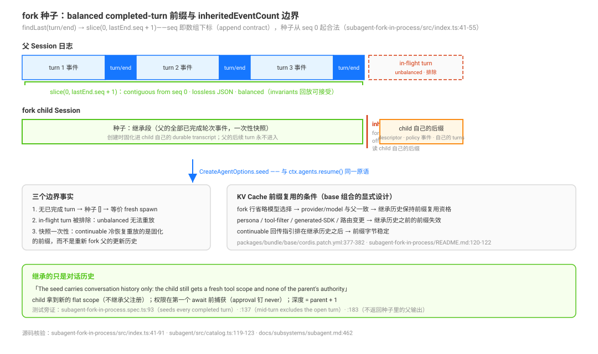

# subagent 与 subagent_fork：有界委派的隔离、继承与 continuable 控制面

源码核验入口：`docs/subsystems/subagent.md`、`packages/subagent/subagent/src/`（`types.ts`/`index.ts`/`continuation.ts`/`continuation-activation.ts`/`child-agent.ts`/`depth.ts`）、`packages/subagent/tool-subagent/src/index.ts`、`packages/subagent/tool-subagent-control/src/`、`packages/subagent/subagent-fork-in-process/src/`、`packages/bundle/base/cordis.patch.yml`、`packages/bundle/web-app/presets/cordis.patch.yml`。

本页回答：一次委派到底隔离了什么、fork 继承了什么、one-shot 与 continuable 差在哪、控制面（`send_message`/`interrupt_agent`/`list_agents`）的边界规则是什么？工具描述里的选择语义（什么时候用）见 [`02-什么时候用哪个原语-官方选择决策语义全景.md`](./02-什么时候用哪个原语-官方选择决策语义全景.md)；seam 的 provider 结构、catalog 投影与 host Queue/Steer 交付见 [`../capability-seams/03-subagent后台与产品provider.md`](../capability-seams/03-subagent后台与产品provider.md) 与 [`../capability-seams/05-subagent-catalog与host交付.md`](../capability-seams/05-subagent-catalog与host交付.md)，本页不重复。

## 为什么是这个形状：设计考量

**为什么是多 provider 注册表而不是单实现**：同一个会话里，父可能既要一个便宜的进程内 child 干零活，又要一个隔离的进程外 child（ACP/Codex/Claude Code）——transports 是**共居的选择**而非部署的替换，所以 `ctx.subagents` 是具名注册表（像 LLM adapter），不像 bash 的单执行器（`.agents/notes/implemented/feature/2026-06-21-subagent-capability-seam.md` Problem 节）。**为什么 continuable 是「一个 durable Session + 至多一个进程内 Activation」**：旧设计把 Task、provider 执行、结果边界绑成同一生命周期——结算即销毁 child、完成即注入通知；这带来三个病：两条 FIFO 没有单一顺序权威、走 Jobs 会复制 Agent loop 的准入/取消/静止机制、父 runtime 生命周期比一个 turn 宽（child 还在跑时不能销毁父）。答案是 Activation 只是「一个 residency epoch」——它可能跑多个 FIFO turn、等后代时可保持驻留，但它**不是**请求/结果/取消/Task 边界；Agent inbox 是唯一 turn FIFO（`.agents/notes/implemented/feature/2026-07-28-continuable-subagent-conversations.md` Problem 与 Decision 节）。**为什么 base 的 fork 是 one-shot**：fork 的种子要花 token，它的回报是 provider 侧前缀复用——任何 child-only 的 prompt 节或工具 schema 排在继承历史**之前**都会毁掉这个回报；早期的 one-shot 限制是旧 child-only return 工具的**后果**而非 fork 的本质属性（`.agents/notes/implemented/architecture/2026-08-10-fork-children-stay-one-shot.md` Problem 节）。所以 web preset 后来可以放开 fork continuable：现在的组合不再引入 child-only section（回传指引排在继承历史之后）。

## 一次 start 的解剖

subagent seam 与 bash 型 seam 的关键差异：**多个具名 provider 共存**于一个 `ctx.subagents` 注册表（像 LLM adapter 注册表，不像 bash 的单执行器）（`docs/subsystems/subagent.md:5`-`7`）。provider 是"具名的子代理 transport"：`spawn`（进程内 fresh）、`fork`（进程内继承）、`acp`/`codex`/`claude-code`（进程外）、`dsh-sdk`。

`SubagentStartRequest` 的可选面与能力旗标**一一对应**（`packages/subagent/subagent/src/types.ts:130`-`136`、`:145`-`201`）：`agentOptions`/`outputSchema`/`depthLimit`（↔`maxDepth`）/`toolFilter`/`persona` 五 flag；service 在 `start` 前逐一校验，缺则 `UNSUPPORTED_CAPABILITY` 拒绝，绝不"接受后忽略"（`packages/subagent/subagent/src/index.ts:644`-`660`）。`toolFilter` 在 child 创建窗口内做 scoped `tools.restrict()`——工具从 prompt 消失**且**执行被拒（one visibility），未知名字 fail loud；`persona` 是仅该 child 可见的 scoped persona 前缀节。**continuable 由另一种途径发现**：provider 有没有可选方法 `prepareContinuable`（TS narrowing 即发现，`types.ts:374`-`389`）。

进程外后端广告**零或近零能力**：ACP「Advertises NO start-time capabilities」（`packages/subagent/subagent-acp/src/index.ts:142`-`147`）；claude-code/codex 同（`NO_START_CAPABILITIES`）；dsh-sdk 仅 `agentOptions: true`（`packages/subagent/subagent-dsh-sdk/src/index.ts:135`）。`inheritsParentContext` 是**描述性标志**（fork=true，其余全 false），不是服务校验的能力——它是模型措辞的来源（「fork 继承对话」vs「spawn 不共享上下文」）。

provider 只参与**准备初始创建 spec**——返回物只有脱离的 provider 特有创建输入（fork 的 parent-history seed），不含 Agent、`AgentHandle`、prompt 交付、结果、处置或恢复；**冷恢复根本不走 provider**：continuation manager 折叠通用 descriptor，经 activation-owner scope 调 `ctx.agents.resume()`（`docs/subsystems/subagent.md:223`）。

创建路径分家（`docs/subsystems/subagent.md:457`）：**one-shot** 由 spawn/fork backend 经 `parent.ctx` 创建普通 agent（service 侧流程：expectProvider → assertCapabilities → 深度/schema 校验 → snapshot one-shot descriptor → `provider.start` → local child 存在则 `establishCatalogChild`（失败即 dispose run 并抛错）→ `observeRun`，`packages/subagent/subagent/src/index.ts:559`-`589`）；**continuable** 由 continuation manager 经自己的 activation-owner scope 创建。provider 卸载阻断新 start，**不撤销已接受的 run**；**每个 child 拿到新的 flat scope**，不继承父的任何注册。

## fork 继承什么：balanced completed-turn 前缀

fork 种子的构造（`packages/subagent/subagent-fork-in-process/src/index.ts:41`-`55`）：`parent.session.snapshotEvents()` → `findLast(e => e.type === 'turn/end')` → `slice(0, lastEnd.seq + 1)`——**到含最后一个 `turn/end` 的全量事件前缀**（不是消息投影），seq 即数组下标（append contract）保证从 seq 0 起合法。三个边界事实：

1. **无已完成 turn → 种子为 `[]`**，child 等价 fresh spawn（`start` 只在 `seed.length > 0` 时传 seed，`:76`-`83`）；
2. **in-flight turn 被排除**因为它 unbalanced、无法作为合法子会话重放（模块头注释 `:4`-`6`；runtime-diagnostics invariants 只接受 balanced 前缀，`docs/subsystems/subagent.md:462`）；
3. **快照是一次性的**：one-shot `start()` 每次现算；continuable `prepareContinuable()` 在创建时固化——「The fork prefix is captured ONCE, at creation: it becomes part of the child's own durable transcript, so a later cold resume replays that prefix instead of re-forking the parent's newer history」（`:85`-`91`）；父的后续 turn 永远到不了 child，没有 live context sharing。

推论与边界：

- **`Session.inheritedEventCount` 是 fork 谱系边界**：catalog 投影忽略 offset 以下事件；descriptor 权威读子会话自己的后缀，身份投影 last-wins 折叠（`docs/subsystems/subagent.md:265`；`packages/subagent/subagent/src/catalog.ts:119`-`123`）；
- **继承的只是对话历史**：「The seed carries conversation history only: the child still gets a fresh tool scope and none of the parent's authority」（`packages/subagent/subagent-fork-in-process/README.md:32`）；
- **KV Cache 前缀复用是显式设计**：base 的 fork 行省略模型选择，让 provider/model 与父一致、继承历史保持前缀复用资格（`packages/bundle/base/cordis.patch.yml:377`-`382`，引 `.agents/notes/implemented/architecture/2026-08-10-fork-children-stay-one-shot.md`）。细粒度条件（`subagent-fork-in-process/README.md:120`-`122`）：同 provider/model 下 child 可复用**字节一致**的继承前缀；persona、tool-filter、generated-SDK 或路由变更会使继承历史**之前**的前缀失效，之后的历史 append-only。continuable 的回传指引（「Your parent agent id is … send your result with send_message…」）经 `withContinuableReturnGuidance` 追加在**继承历史之后**的 initial user task 里，保持前缀字节稳定（`packages/subagent/subagent/src/continuation-messages.ts:81`-`97`）。

测试旁证：`subagent-fork-in-process.spec.ts:93`（seeds every completed parent turn through the last turn/end）、`:137`（forking mid-turn excludes the open turn）、`:183`（child 无自己的消息时不返回种子里的父输出）、`tool-subagent-control.spec.ts:127`（fork child 里 send_message 定义与排序字节一致）。

## 深度与谱系：嵌套边界

深度是双字段取大（`packages/subagent/subagent/src/depth.ts:28`-`36`）：`max(header.delegationDepth ?? 0, options.subagentDepth ?? 0)`——**持久 header 是单调 floor**，运行时值只能加深不能降（resume 后的 child 不能伪装 top-level）。child 深度 = parent + 1（`child-agent.ts:50`-`59`）；超 `maxDepth` 抛 `SubagentDepthError`。seam 独占这两个字段（loop 不读不写，`docs/subsystems/subagent.md:461`）。

**上限有三层，默认值是关键驾驶座事实**：

| 层 | 来源 | 默认 |
|----|------|------|
| Host 设置 `maxDepth` | volatile 配置 | **1**——默认不允许多级嵌套（`packages/subagent/subagent/src/index.ts:202`） |
| 工具行 `maxDepth` | `number` 或 `'provider-managed'` | `0` 禁止委派；`'provider-managed'` 不发 cap、递归预算归 child runtime（codex/claude-code 行即配 provider-managed，`packages/subagent/tool-subagent/src/index.ts:94`-`103`） |
| 请求级 `request.maxDepth` | 调用侧绝对上限 | 需 `depthLimit` 能力（`docs/subsystems/subagent.md:84`-`89`） |

**没有显式的"禁止再委派"检查**——嵌套完全由深度预算控制：默认 maxDepth=1 时，depth-1 子代理再委派得 depth-2 > 1 的 `SubagentDepthError`（`packages/subagent/subagent/tests/continuation.spec.ts:770`）。

child 的 session header 由 `childSessionMeta` 写入（`packages/subagent/subagent/src/child-agent.ts:139`-`157`）：`cwd`（= 父 header cwd）、`agentPreset`（从父 **live scope chain** 读而非 header——防父切换后冷恢复 child 重建出错误工具集）、`parentSession`、`isSeeded`、`origin: 'subagent'`（仅导航分类，descriptor 才是 mode 权威）、`delegationDepth`。Workspace 继承经 cwd：同目录即同 Workspace（membership 要求 header 的 canonical cwd 等于 workspace 目录，`packages/workspace/workspace/src/types.ts:55`-`60`）；lineage trace 按 `parentSession` 递归向上（`packages/session-query/session-query/src/tracing.ts:135`-`150`）。

`SubagentRuntime.listDescendants` 递归读各级 catalog，稳定前序；不可读分支只停该支（`corrupt`/`unavailable`）；每行带 catalog parent 与 root-relative depth（`docs/subsystems/subagent.md:273`-`281`）。

## 权限与工具面：child 拿到什么

**工具面经 preset join 全量重建**：`applyChildComposition`（`packages/subagent/subagent/src/child-agent.ts:200`-`219`）在 child 创建窗口内做四件事——`agentPresets.composeFrom(childCtx, parent.ctx)` 加入父 preset（**没有这个 join，child 看到的是空工具注册表**，`:190`-`196`）、注册固定 delegation-scope 声明、挂 per-child persona、`tools.restrict(toolFilter)`。**shipped 组合没有任何 toolFilter 配置**（bundle/preset 全部 yml 零命中）→ 子代理看到与父相同的模型可见工具集（subagent、subagent_fork、workflow、todo、goal 等全部在内）——能不能用另算（见 goal authority）。

**权限在第一个 await 之前捕获**（`docs/subsystems/subagent.md:459`；`child-agent.ts:222`-`280`）：

- `permissionPreset` 仅继承 auto/danger-full-access 的身份；`sandboxMode` 只捕获父 session 的**显式**沙箱覆盖（不捕部署默认、不捕一次性授权）；`approvalPolicy` 钉死 `'never'`；以 `source: 'delegation'` 事件写入 child 日志、位于 fork seed **之后**（新 policy 覆盖旧 seed 状态）；冷恢复只重放已持久事件、不重捕获；
- 每个 Auto child 调用**独立审查**（`parentSession` + 创建 prompt + 认证消息；low/medium/high 见 `.agents/notes/implemented/feature/2026-08-28-auto-review.md`）；
- child 还被注入 `SUBAGENT_DELEGATION_CONTEXT` runtime-context（`child-agent.ts:172`-`176`）：「your permission scope was fixed when you were started and cannot be widened from inside this session — operations that require approval are rejected automatically… state the limitation in your reply」。

## one-shot 与 continuable：两种后台模式

路由由 `dsh-tool-subagent` 的 `backgroundMode` 配置选择（完整表见 `capability-seams/03`），组合层事实：

| 组合 | subagent（spawn） | subagent_fork（fork） |
|------|-----------------|---------------------|
| base bundle | `continuable`（`packages/bundle/base/cordis.patch.yml:370`-`375`） | `one-shot`（`:383`-`388`，保 KV 前缀注释） |
| web preset | `continuable` + `modelSelectionSettings: true`（`packages/bundle/web-app/presets/cordis.patch.yml:93`-`97`） | **`continuable`**（`:98`-`101`） |
| codex / claude-code 行 | preset 内默认 `disabled: true`，`one-shot` + `maxDepth: provider-managed`（`:103`-`116`） | — |

**可写接口**（`packages/subagent/tool-subagent/src/index.ts:383`-`427`）：`{"description": "审计引用行号", "prompt": "打开下列文件核对每条 path:line……（自包含：fresh 不共享本对话上下文）", "run_in_background": true}`——`description` 必填 3-5 词显示标签（continuable 时即持久创建标签）；`provider`/`model`/`reasoning_effort` 仅组合开启 `modelSelectionSettings` 时出现（base 的 subagent 行不开、fork 行永不開，保 KV 前缀）；`run_in_background` 语义随 backgroundMode 翻转。

**one-shot**：前台等待（`settleForegroundRun`：`run.result` 非 completed 即抛错、部分输出附诊断文本；`run.dispose()` 失败合并 AggregateError，`packages/subagent/tool-subagent/src/index.ts:208`-`238`）；驱动侧 `followup → whenIdle → readResult`，从 activation boundary（seed 长度）之后的 own events 读结算（`packages/subagent/subagent-in-process-driver/src/index.ts:178`-`237`）。显式后台时接入 jobs：`jobs.start({ kind: 'subagent', label, owner: parent.id, run })`，**无 output sources——中间细节留在 child session 里**（`tool-subagent/src/index.ts:538`-`560`）；结算映射 `settleRun`（completed→result 文本；本地取消→`killed`；其余→`failed`，`packages/subagent/subagent/src/run-settlement.ts:37`-`75`）；完成通知由 tool-jobs 的 `completionDelivery`（默认 `'wakeup'`）投递：「background job <id> (<kind>: <label>) finished … Read its output with job_output.」（`packages/jobs/tool-jobs/src/index.ts:121`-`137`）。

**continuable**：`startContinuable` 在 **inbox 接纳 initial prompt 即返回** `{childId, messageId}`——不等 turn 开始、不等消息进 Session log（`packages/subagent/subagent/src/index.ts:252`-`263`）；manager 全流程（`continuation.ts:104`-`192`）：reserve childId（重复即 `DUPLICATE_CHILD`）→ 深度解析 → snapshot continuable descriptor（**版本 3**，含 provider/label + agentProvider/agentModel/agentReasoningEffort/persona/toolFilter，`descriptor.ts:48`）→ 首个 await 前 `captureDelegatedPolicyOverrides` → `holdOwnership`（idle 父不被结算）→ `host.prepareContinuable`（provider 只贡献 seed）→ 锁内 `materialize` → `submitMaterialized` → `establishCatalogChild` commit；任何失败回滚整个 child。**child 是 durable session**（硬依赖 sessionPersistence 与 sessionQuery，缺失即 `PERSISTENCE_UNAVAILABLE`，`continuation.ts:527`-`549`）；settled 只释放 Activation 与 handle，再 `send_message` 走冷恢复。容量：`maxActiveSubagents` 默认 **8**（volatile，`packages/subagent/subagent/src/index.ts:203`），ActivationPool 槽位在"不间断 continuable 链"间共享、root 间隔离；one-shot run 不占 continuable 容量。

**settle notice**（结算通知）：settled 判定 = 无 pending inbox 且无 owned children（`continuation-activation.ts:724`-`790`）；通知仅在 activation 曾被 announce 过时发出，向 durable direct parent 投递一行结算摘要（如「Background subagent <id> finished and will do no further work unless you send it more.」）+「Its closing message:」+ 最后非空 assistant text blocks（无则 `It left no closing message.`）；source `kind: 'subagent-settled'` / `form: 'notice'`——与 agent-message 刻意区分，「a transcript that merged them would credit the child with words it never wrote」（`continuation-messages.ts:23`-`29`、`:106`-`160`）；投递方式随父状态：idle → queue、运行中 → steer、父自身在 teardown → `parent.inject` 不唤醒（`continuation-activation.ts:871`-`888`）；**通知先于所有权释放**（`finishDisposal` 顺序：resident.delete → releaseSlot → notifySettlement → releaseOwnership → observer.settle，`:793`-`868`）。

Activation 所有权图（`docs/subsystems/subagent.md:165`-`170`）：每个 Activation 拥有 `AgentHandle` 与 `ownedChildren: Set<SessionId>`；一个 Session 至多一个 live Activation；父在集合非空时不能结算；child 释放五条件（无活跃工作、Inbox 空、孙辈全处置、flush 结算、`AgentHandle` 处置完成）。

## 控制面：send_message / interrupt_agent / list_agents

**`send_message` 是相邻一跳的双向通道**（`packages/subagent/tool-subagent-control/src/index.ts:28`-`72`）：

- **下行**（父→child）：目标必须是自己**相邻一跳**的 direct continuable child；child 运行中 → steer 最近 step；idle → 开新 turn；**absent（settled/冷）→ 冷恢复**：observeSession → lineage 授权（child header 的 `parentSession` 必须等于 sender 的 session id）→ 折叠自己非 seed 后缀的 descriptor → 经 `agents.resume()` 重建 → 提交等待中的 turn（`continuation.ts:406`-`456`，不经任何 provider）；
- **上行**（child→父）：resident continuable child 以自己 parentSession 为目标发送 → `sendToParent`——「Agent <sender-id> sent a message: 」前缀 + `AgentMessageSource{kind: 'agent-message', form: 'relay'}`（`continuation.ts:339`-`362`）；
- 只确认送达（返回 `{messageId}`——inbox id 即回执），不回答案；兄弟、超一跳祖先、self、stale agent、one-shot child 全部拒绝（`docs/subsystems/subagent.md:150`）。

**`interrupt_agent` 不等待停止**（`tool-subagent-control/src/index.ts:74`-`111`；`continuation-activation.ts:283`-`326`）：同步授权（exact live caller、禁 self、ancestry WeakSet 必须含 caller；user authority 则 child header 的 parentSession 须匹配）→ `agent.cancel(cause, { keepInbox: true })` 即返回。Activation、未认领 inbox 工作、已发布后代**不受影响**；被中断 driver idle 后，一次 waking send 恢复 parked FIFO。目标缺席（未知/one-shot/已结算）是合法 no-op；越权抛 `UNAUTHORIZED`。授权两型：`user`（人类出示的 durable direct-parent 地址）| `ancestor`（精确 live Agent 对象，任意深度的 live 祖先——**这就是深度 >1 条目只剩 interrupt 的机制本体**：send_message 限相邻一跳，interrupt 限 live 祖先链）。

**`list_agents` 只列 continuable 条目**（`packages/subagent/tool-subagent-control/src/list-agents.ts:60`-`79`）：one-shot 仍是 descendants 遍历的通路但不列出（「One-shot children cannot be continued by send_message」）；`scope` 默认 `children`；status 由 `agents.get(id)?.status === 'running'` 派生；深度规则写在模型可见描述里（`:97`-`99`「entries deeper than 1 accept only interrupt_agent」），机制本体是上述两个授权半径的差。底层列表不加载/resume 任何 Agent；`list_agents` 面依赖 session-projection 挂载，缺了 fail loud（`packages/bundle/base/cordis.patch.yml:153`-`156`）。

## 与相邻原语的关系

- **workflow 的 `agent()` 钩子就是 subagent 调用**：每次 `agent()` 经 `ctx.subagents.start(provider, { parent })` 发布 child（[`01`](./01-workflow-模型编写的JS编排脚本与子代理扇出机制.md) 归属节）；
- **agent-teams 复用 spawn/fork provider**：成员创建直接走 subagent seam 的 spawn/fork（[`../experimental/02-agent-teams.md`](../experimental/02-agent-teams.md)）；
- **goal 工具对子代理可见但操作被 authority 层拒绝**：`hasDirectHumanInput` 要求 `ctx.agents.roots().includes(execution.agent)`——非 runtime root 的子代理不满足（`packages/goal/tool-goal/src/authority.ts:80`-`83`，拒绝文案「this goal operation requires a direct human turn on a top-level agent」，`:91`-`99`）；`complete`/`blocked` 另接受 exact goal-round authority（`:102`-`114`），但 **fork/resume 后 goal 一律 disarmed**（`packages/goal/tool-goal/src/index.ts:117`；`goal.spec.ts:227`-`233`：fork child 继承 goal 但 `activation: 'disarmed'`）——子代理继承的 goal 永远不会自己跑轮。三道门合起来：子代理实际无法有效操作 goal。

## 源码入口

| 路径 | 一句话 |
|------|--------|
| `docs/subsystems/subagent.md` | seam 权威文档：能力旗标、start request、seed、深度、权限、interrupt、settle notice |
| `packages/subagent/subagent/src/types.ts` | `SubagentStartRequest`/`SubagentCapabilities`/provider 接口（`:130`-`201`、`:344`-`389`） |
| `packages/subagent/subagent/src/index.ts` | 服务注册、start 流程（`:559`-`589`）、capability 校验（`:644`-`660`）、`maxDepth` 默认 1（`:202`）、`maxActiveSubagents` 默认 8（`:203`） |
| `packages/subagent/subagent/src/continuation.ts` | continuation manager：startContinuable、sendMessage 双向路由、coldResume、持久化硬依赖 |
| `packages/subagent/subagent/src/continuation-activation.ts` | Activation 注册表：容量池、interrupt、settled 判定、settle notice |
| `packages/subagent/subagent/src/child-agent.ts` | childSessionMeta、applyChildComposition（preset join）、delegated policy 捕获 |
| `packages/subagent/subagent/src/depth.ts` | 双字段深度取大、单调 floor |
| `packages/subagent/subagent/src/descriptor.ts` | 版本 3 descriptor：冷恢复身份，不快照 merge-extensible 字段 |
| `packages/subagent/subagent-fork-in-process/src/index.ts` | fork 种子：`findLast(turn/end)` 切片、一次性快照 |
| `packages/subagent/tool-subagent/src/index.ts` | 工具层：双 provider wording、backgroundMode 路由、jobs 接入（`:208`-`238`、`:538`-`560`） |
| `packages/subagent/tool-subagent-control/src/index.ts` | `send_message` / `interrupt_agent` 薄适配 |
| `packages/subagent/tool-subagent-control/src/list-agents.ts` | `list_agents`：只列 continuable、深度规则文案 |
| `packages/goal/tool-goal/src/authority.ts` | goal 权限：runtime-root 检查把子代理拒之门外 |
| `packages/bundle/base/cordis.patch.yml:370`-`388` | base 组合：subagent continuable / fork one-shot + KV 注释 |
| `packages/bundle/web-app/presets/cordis.patch.yml:93`-`116` | web preset：fork 也 continuable；codex/claude-code 默认 disabled + provider-managed 深度 |
