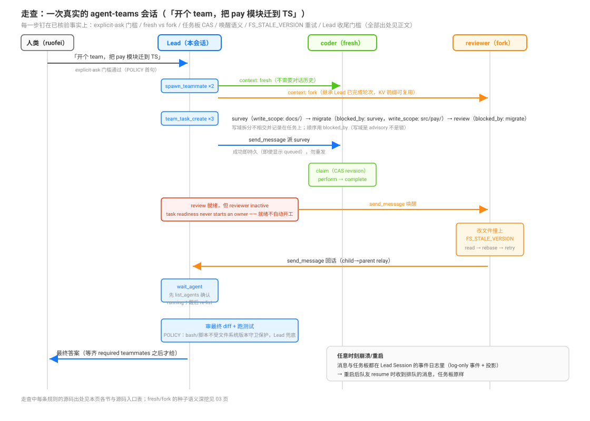

# agent-teams 的驾驶座用法：启用代价、Lead 工作流与协作纪律

源码核验入口：`packages/experimental/tool-agent-team/src/index.ts`（`POLICY` 与九个成员级工具）、`packages/experimental/agent-team-profile/cordis.patch.yml` 与 `README.md`、`packages/experimental/agent-team/src/index.ts`（服务上限）、`packages/boot/app-boot/src/profile.ts`（OPTIONAL_BUNDLES）。

本页回答：启用 agent-teams 的组合代价是什么（你换掉了什么）？Lead 的实际工作流怎么串九个工具？`team:policy` 里的协作纪律有哪些？机制（TeamService、journal、投影、九工具注册、UI 落点）见 [`../experimental/02-agent-teams.md`](../experimental/02-agent-teams.md)；选择语义（仅显式要求、与 subagent 控制面互斥）见 [`02-什么时候用哪个原语-官方选择决策语义全景.md`](./02-什么时候用哪个原语-官方选择决策语义全景.md)；队友创建复用的 spawn/fork 语义见 [`03`](./03-subagent与subagent-fork-有界委派的隔离继承与continuable控制面.md)。

## 为什么是这个形状：设计考量

**为什么需要 teams 这个原语**：subagent 委派解决「一次性把活交出去」，但**协调状态活不过一次委派**——任务清单、成员分工、相互消息在 one-shot 结束时全部蒸发；全局控制面（`list_agents`/`send_message`）是**人类驱动**的：要人（或顶层模型）逐个派活、逐个收结果。当工作是「几个人**持续**协作、互相等、共享一个任务板」时，这两者都撑不住。teams 的答案是给 Lead 一套**持久的协调状态**：具名队友（可 offline/resume）、跨崩溃的任务板与邮箱（事件日志 + 投影，见 [`../experimental/02-agent-teams.md`](../experimental/02-agent-teams.md)）——**协调状态本身成为会话的可重放事实**。这个选择的代价是组合互斥（见下节启用代价表）：重名控制面必须让位、continuable 委派被压缩——**DSH 用「换掉低层原语」而不是「叠加」来表达这是一个不同的协作模式**，避免同一会话里两套控制语义打架。experimental 的包装也是考量：用户要能从 npm 一键装完整组合，而内部原型保持私有——所以它是 `OPTIONAL_BUNDLES` 里的一个独立 bundle，而非散装包（`.agents/notes/implemented/architecture/2026-08-18-experimental-agent-teams-packages.md`）。

## 启用代价：一个 bundle 换掉的东西

启用方式：`dsh plugin --profile <name> add @deepseek-ai/dsh-experimental-agent-team-profile`（已发布、从 npm 装，要求 profile 已含 `dsh-base`），或 Web 插件管理器（Official 组）一键开——它是 `OPTIONAL_BUNDLES` 成员（`packages/boot/app-boot/src/profile.ts:214`）。统一 bundle 同时服务 Host 与 Web。

组合代价表（`packages/experimental/agent-team-profile/README.md:49` 与其 `cordis.patch.yml`）：

| 动作 | 你得到/失去什么 |
|------|----------------|
| disable `tool-subagent-control` / `tool-subagent-list-agents` | 全局 `send_message`/`interrupt_agent`/`list_agents` 让位给成员级同名工具（非 Team 成员也看不到全局控制面） |
| `tool-subagent` / `tool-subagent-fork` 压成 `backgroundMode: one-shot` | **continuable 委派语义没了**——subagent 不再返回可持续对话的 id，一次性等待 |
| insert `agent-team` + `tool-agent-team` + `ui-agent-team` | TeamService、九工具、Web 会话头部的 Team 动作（名册/任务板/队友导航，读投影无 RPC） |
| **workflow 不动** | Workflow 保留 base 的 `spawn` provider——脚本扇出 fresh children 照常可用 |

服务上限（`packages/experimental/agent-team/src/index.ts:41`-`45`；profile 把 `maxMembers` 钉回 8）：`maxMembers` 代码默认 16 / profile 钉 8、`maxTasks` 256、`maxPendingMessagesPerMember` 64、`maxMessageBytes` 65536、`disposalTimeoutMs` 5000。**团队面需要持久 session 存储才激活**（机制见 [`../experimental/02-agent-teams.md`](../experimental/02-agent-teams.md)）。

## Lead 的工作流：九个工具怎么串

每个普通 runtime 根都是**隐式 Lead**（`TeamId` 就是其 `SessionId` 的 branded 别名，无需创建事件）。一个典型 Lead 工作流：

```text
spawn_teammate（仅 Lead；context: fresh 无 Lead 历史 / fork 继承已完成轮次）
  → team_task_create（subject + description + blocked_by 依赖 + write_scopes）
  → send_message 派活（steer 运行中队友 / 唤醒 inactive 队友）
  → wait_agent（观察变化；醒后 re-list）
  → team_task_list / get（看 readiness/owner/revision/blockers）
  → 队友 claim（CAS revision）→ perform → complete
  → Lead 等齐 required teammates → 最终答案
```

驾驶座要点（工具描述与 `POLICY`，`packages/experimental/tool-agent-team/src/index.ts:31`-`37`、`:177`-`365`）：

- **`send_message` 成功即持久**："A successful send is already durable even when its result says queued; **do not resend it**."——steer 运行中目标于最近 step 边界、start/resume inactive 目标；送达的 peer 消息以稳定 message id + sender 名开头；
- **`wait_agent` 只观察不唤醒**："Wait for the next teammate status, mailbox, or shared-task change **after this call starts**. This never wakes inactive members and returns noProgress immediately when no other member is running or provisioning. **Re-list after wakeup or timeout instead of polling.**"（`timeout_ms` 10000–3600000，默认 30000）；等待前先 `list_agents` 确认有 running/provisioning 的队友，inactive 的先用 `send_message` 唤醒（`NO_ACTIVE_PEER_MESSAGE`，`:41`-`42`）；
- **任务板是 CAS 工作流**："Shared-task workflow is list, get, **claim with the current revision**, perform the work, then complete."——`team_task_update` 用 `expected_revision` 做前置条件（"Compare-and-set a shared task action using the latest revision"，`:362`）；`team_task_list` 返回 readiness/owner/revision/blockers/**write-scope warnings**；
- **任务就绪不自动开工**："**Task readiness never starts an owner.**"——依赖解开只是就绪，owner 不会因此开 turn，要 `send_message` 去叫。

## 走查：一次完整的团队会话

规则集读一遍不如演一遍。设定一个具体任务——「把 pay 模块从 JS 迁到 TS」——把上面所有规则串成时间线（图中每条规则都能在下文或前文找到源码出处）：



1. **你说「开个 team，把 pay 模块迁到 TS」**——这句话过了 explicit-ask 门槛（POLICY 首句：只在用户显式要求时才建队友）；当前会话的 agent 成为隐式 Lead，不用任何创建动作。
2. **Lead 派两个队友**：`coder` 用 `fresh`（迁移实现不需要对话历史），`reviewer` 用 `fork`（评审要建立在 Lead 已完成的勘察轮次上，且继承前缀保 KV 复用——种子语义见 [`03`](./03-subagent与subagent-fork-有界委派的隔离继承与continuable控制面.md)）。
3. **建三个任务**：`survey`（write_scope: `docs/`）→ `migrate`（`blocked_by: survey`，write_scope: `src/pay/`）→ `review`（`blocked_by: migrate`）。写域拆分不相交、顺序用依赖表达——但记住这是 **advisory 不是锁**（POLICY 纪律 1）。
4. **`send_message` 派 survey 给 coder**——成功即持久，即使结果显示 queued 也不重发。coder 按 CAS 工作流干活：list → get → claim（带当前 revision）→ perform → complete。
5. **`review` 就绪了，但 reviewer 是 inactive 的**——「Task readiness never starts an owner」，就绪不会自动开工；Lead 得 `send_message` 把它叫醒（这个坑是新手最容易栽的：等了半天没人动，其实要主动唤）。
6. **reviewer 干活时撞上 `FS_STALE_VERSION`**（别人也动过那个文件）——按协议 read → rebase 到新内容 → retry；如果它用了 bash 跑 formatter，那不受版本守卫保护，风险记在 Lead 账上。
7. **reviewer 用 `send_message` 回话给 Lead**（child→parent 的 relay 通道，消息带 sender 名）。
8. **Lead `wait_agent`**——先 `list_agents` 确认有 running 的队友再等（否则 noProgress 立即返回）；醒来后 re-list，不轮询。
9. **Lead 审最终 diff、跑测试**——POLICY 纪律 2 的兜底义务：bash/脚本不受守卫保护，最终一致性由 Lead 把关。
10. **等齐 required teammates 才给最终答案**（POLICY 收尾门槛）——这就是「Lead 必须等」的字面执行。

**任意一步崩溃**：消息与任务板都在 Lead Session 的事件日志里（四个 log-only 事件 + 投影，见 [`../experimental/02-agent-teams.md`](../experimental/02-agent-teams.md)）——重启后队友 resume 时收到排队的消息，任务板原样。走查的每条规则出处：explicit-ask/唤醒/收尾门槛在 `packages/experimental/tool-agent-team/src/index.ts:31`-`37`；CAS 与工具描述在 `:177`-`365`；fork 种子在 [`03`](./03-subagent与subagent-fork-有界委派的隔离继承与continuable控制面.md)。

## POLICY 的协作纪律（共享文件系统是核心假设）

`team:policy` 是 Lead 与队友共享的协作指南（`packages/experimental/tool-agent-team/src/index.ts:31`-`37`），四条硬纪律：

1. **写域拆分是 advisory 不是锁**："The Team Lead and all teammates share the same working directory and filesystem. Edits are immediately visible to every member. **Split write work into disjoint scopes, record expected write scopes on shared tasks, and use task dependencies when work must be ordered. Write-scope overlap is advisory, not a lock.**"
2. **文件改动的重试协议**："Prefer read/edit/write for file changes. If a file operation returns `FS_STALE_VERSION`, read the current file, rebase your intended change onto the new content, and retry."——**bash、formatter、代码生成器、脚本不受文件系统版本守卫保护**：显式协调，**Lead 审最终 diff 并跑测试**；
3. **状态词汇表不许误读**：`inactive` 只表示"没有 turn 在执行"，**不描述任务完成/成功/失败/等待**；`provisioning` = 创建中；`failed` = 创建失败；
4. **Lead 的收尾门槛**："The Lead must wait for required teammates before giving the final answer."

## 持久语义：跨崩溃的协调状态

消息与任务状态**完全走 Lead Session 的事件日志 + 投影**，不另设存储（机制见 [`../experimental/02-agent-teams.md`](../experimental/02-agent-teams.md)）：四个 log-only 事件先 append 后 flush，flush 成功才算操作成功；协调记录不进派生模型历史。驾驶座效果：**崩溃/重启/中断后，离线队友 resume 时收到排队的消息**——"Messages and task state survive crashes, reloads, and interruptions"（`packages/experimental/agent-team/README.md:12`）。

## 与阶梯的关系：什么时候选 teams

对照已核验的选择语义（[`02`](./02-什么时候用哪个原语-官方选择决策语义全景.md)）：

| 维度 | subagent/fork | workflow | agent-teams |
|------|--------------|----------|-------------|
| 触发 | 常规委派（一两次优先） | 用户显式要求大规模编排 | 用户显式要求 teams/teammates |
| 协调状态 | 无（one-shot）或 inbox（continuable） | 脚本内（随 run 消失） | **持久任务板 + 双向邮箱（跨崩溃）** |
| 成员生命 | 一次或可续 | run 内 | **长驻具名队友（可 offline/resume）** |
| 与 subagent 工具 | — | 保留 spawn provider | **互斥替代**（disable + one-shot 压缩） |

一句话判据：**一次性委派用 subagent，吞吐型扇出用 workflow，需要长驻协作与共享任务板才上 teams**——而 teams 的成员创建机制就是 spawn/fork（[`03`](./03-subagent与subagent-fork-有界委派的隔离继承与continuable控制面.md)），所以它买到的是协调状态，不是新的委派原语。

## 源码入口

| 路径 | 一句话 |
|------|--------|
| `packages/experimental/tool-agent-team/src/index.ts:31`-`37` | `POLICY` 全文：写域纪律、FS_STALE_VERSION 协议、状态词汇、收尾门槛 |
| `packages/experimental/tool-agent-team/src/index.ts:177`-`365` | 九个成员级工具的描述（spawn/wait/task 族） |
| `packages/experimental/tool-agent-team/src/index.ts:41`-`42` | `NO_ACTIVE_PEER_MESSAGE`：wait 前先唤醒的指令 |
| `packages/experimental/agent-team-profile/cordis.patch.yml` | 组合代价：disable/one-shot 压缩/insert 三段 |
| `packages/experimental/agent-team-profile/README.md:49` | "subagent 与 fork 工具被 disable；Workflow 保留 spawn" |
| `packages/experimental/agent-team/src/index.ts:41`-`45` | 服务上限（maxMembers 16/8、maxTasks 256 等） |
| `packages/experimental/agent-team/README.md:12` | 持久语义一句话（crashes/reloads/interruptions） |
| `packages/boot/app-boot/src/profile.ts:213`-`218` | OPTIONAL_BUNDLES |
| `_digested/experimental/02-agent-teams.md` | 机制深挖（引用不重复） |
