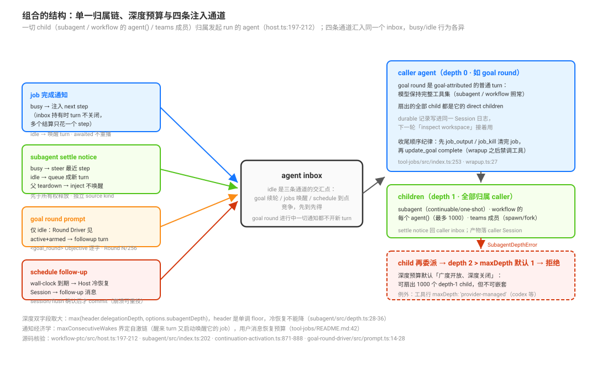

# 组合模式：归属链、深度预算、通知通道与收尾纪律

源码核验入口：本页是专题综合页——**不引入新机制**，把 [`01`](./01-workflow-模型编写的JS编排脚本与子代理扇出机制.md)-[`07`](./07-agent-teams-驾驶座用法-启用代价Lead工作流与协作纪律.md) 已核验的事实组合成协同模式；新增的直接源码引用只有三处：`packages/workflow/workflow-ptc/src/host.ts:197`-`212`（扇出归属）、`packages/goal/tool-goal/src/wrapup.ts:27`/`:37`（收尾禁工具）、`packages/jobs/tool-jobs/src/index.ts:253`（收 job 纪律）。

本页回答：原语叠起来用时，结构性的事实是什么？哪些协同形态被源码直接支撑？收尾时要守哪些跨原语纪律？选择语义（单原语什么时候用）见 [`02`](./02-什么时候用哪个原语-官方选择决策语义全景.md)。

## 为什么是这个形状：设计考量

把专题八页的考量收拢成一句话：**DSH 拒绝了「一个通用编排引擎」，选择了「一组正交原语 + 单一的归属与通知骨架」**。这个选择的依据在两处决策记录里写得很直白：goal 与 ralph 的两策略决策明文否决了 `packages/loop/` 家族、`LoopDriver`、universal `StopCondition` 与 generic `loop` 工具——因为「定时 prompt、同会话续跑、fresh-agent 迭代都在重复工作，但状态、权限、记忆、生命周期完全不同」，泛化成通用 loop 会掩盖这些差异（`.agents/notes/implemented/feature/2026-07-16-harness-level-loop.md`）；workflow 的 seam 决策同样拒绝了多引擎共居——引擎是部署替换件（`.agents/notes/implemented/feature/2026-07-05-dynamic-workflows.md`）。**组合因此不是引擎里的一张调度表，而是三条跨原语不变量**：归属链单一（一切 child 挂在发起 agent 上）、通知通道分工（四条通道各有 busy/idle 行为）、深度用预算表达（默认广度开放、深度关闭）。原语之间靠**工具描述里的明文路由**互相推荐（[`02`](./02-什么时候用哪个原语-官方选择决策语义全景.md)），而不是靠一个中心决策者——这正是 [`09`](./09-对照外部叙事-Captain与Kahn调度与rollback与KV看板的逐条源码真相.md) 纠正外部叙事的根据。

## 三个结构性组合事实

一切组合都建立在这三条已核验的事实上：

**事实一：归属链是单一的。** 无论是 subagent 工具、workflow 脚本的 `agent()` 还是 agent-teams 的成员创建，child 都归属**发起 run 的那个 agent**：workflow 的每个 `agent()` 经 `this.subagents.start(provider, { prompt, parent: this.parent })` 发布——`this.parent` 就是 run 的 parent（`packages/workflow/workflow-ptc/src/host.ts:197`-`212`）；teams 成员"直接复用 subagent seam 的 spawn/fork provider"（[`../experimental/02-agent-teams.md`](../experimental/02-agent-teams.md)）。推论：**goal round 里扇出的全部 child 都是这一轮 agent 的 direct children**——结算通知、目录、深度都挂在这条单一链上。

**事实二：深度预算默认"广度开放、深度关闭"。** 默认 `maxDepth = 1`（[`03`](./03-subagent与subagent-fork-有界委派的隔离继承与continuable控制面.md)）：顶层 agent（depth 0）可以经 workflow 扇出**最多 `maxTotalAgents`（默认 1000）个 depth-1 child**（[`01`](./01-workflow-模型编写的JS编排脚本与子代理扇出机制.md) caps 节），但任何 child 再委派就是 depth 2 > 1 的 `SubagentDepthError`。例外是工具行配 `'provider-managed'`（递归预算归 child runtime，codex/claude-code 行即如此）。**没有"禁止嵌套"的专门检查——组合的纵向深度完全由这个预算表达。**

**事实三：四条注入通道汇入同一个 inbox，busy/idle 行为各异。**

| 通道 | 触发 | busy agent | idle agent |
|------|------|-----------|-----------|
| job 完成通知（[`06`](./06-jobs与schedule-后台作业平台与定时跟进的时间平面.md)） | 后台 job 结算 | 注入 next step（inbox 持有通知时 turn 不关闭，多个结算只花一个 step） | 唤醒 turn |
| subagent settle notice（[`03`](./03-subagent与subagent-fork-有界委派的隔离继承与continuable控制面.md)） | continuable child 结算 | steer 最近 step | queue 成新 turn |
| goal round prompt（[`05`](./05-goal-驾驶座用法-objective写法轮预算与终结纪律.md)） | Round Driver 见 idle + armed goal | —（只在 idle 发生） | followup turn |
| schedule follow-up（[`06`](./06-jobs与schedule-后台作业平台与定时跟进的时间平面.md)） | wall-clock 到期（Host 冷恢复 Session） | —（排队为消息） | follow-up turn |

推论一：goal round 进行中，job 完成与 settle notice 都**不开新 turn**——它们以 step 注入/steer 的方式并入当前轮；只有 schedule 到期会作为新消息排队。推论二：idle 是三条通道的交汇点——"idle 时该发生什么"由 goal（续轮）、jobs（唤醒）、schedule（到点）三方竞争，先到先得。

## 模式 A：goal 驱动的扇出-收敛循环

一个 goal round 内：`todo_write`（并行模式，shipped 即 `allowParallelInProgress: true`——该开关的存在理由就是"agents that may run work concurrently (subagents, background commands, workflow fan-out)"，`packages/todo/tool-todo/README.md:36`）→ 起若干 subagent 有界委派（读码/研究/评审）→ **不忙轮询**（[`02`](./02-什么时候用哪个原语-官方选择决策语义全景.md) tool:jobs 纪律）→ settle notice steer 进当前 step 或 queue 成 turn → 回写产物 → agent idle → Round Driver 注入下一轮 `<goal_round>`（"inspect workspace instead of assuming earlier narration"，[`05`](./05-goal-驾驶座用法-objective写法轮预算与终结纪律.md)）。

支撑事实：goal round 是全工具普通 turn（05）；subagent continuable 默认后台 + settle notice 三态投递（03）；fork 可让子任务建立在已完成轮次上且保 KV 前缀（03）。

## 模式 B：后台扇出 + 跨轮收割

`workflow run_in_background: true` → 立即拿 job id（[`01`](./01-workflow-模型编写的JS编排脚本与子代理扇出机制.md)）→ 本轮继续别的活 → 完成通知注入 step → `job_output` 收割结果（**wait: true 只在真被堵住时用**，[`02`](./02-什么时候用哪个原语-官方选择决策语义全景.md)）。跨 goal 轮的长扇出由此成立：一轮发起、任意后续轮收割。

**收尾顺序纪律（goal × jobs 的真实张力）**：goal 的 wrapup 指令在 `update_goal complete` **之后**注入且明令 "Do not call any more tools in this run"（`packages/goal/tool-goal/src/wrapup.ts:27`、`:37`）；而 tool:jobs 纪律要求 "Before giving a final answer, collect every still-relevant job with job_output … and job_kill jobs that stopped mattering"（`packages/jobs/tool-jobs/src/index.ts:253`）。两者相遇的唯一正确顺序：**先 `job_output`/`job_kill` 清完 job，再调 `update_goal complete`，最后让 wrapup 收尾**——complete 之后才想起来的 job 只能等用户的下一条消息。

## 模式 C：fork 的对话延续链

子任务需要"建立在这次对话已完成轮次上"时用 `subagent_fork`（继承 balanced completed-turn 前缀、KV 前缀字节复用，[`03`](./03-subagent与subagent-fork-有界委派的隔离继承与continuable控制面.md)）→ child 可经 `send_message` 回话给父（relay 语义）→ 父随时 `send_message` 续命 / `interrupt_agent` 打断（keepInbox 保留未领工作）→ child settled 后仍可冷恢复。组合要点：**fork 的省钱前提是别动 provider/model/persona/toolFilter**（任何变更毁掉继承前缀的复用资格）。

## 模式 D：两种长任务形态的选择（goal vs ralph）

[`04`](./04-ralph-fresh-agent循环的轮间传递与固定脚本机制.md) 的两策略表是组合层的最终判据：**同会话持久目标（保留对话上下文、goal-attributed 轮）用 goal；有意丢弃对话上下文、只信 workspace + 有界报告的 fresh 迭代用 ralph**（仅人类显式要求）。两者都是"外层策略迭代"，Round 语义不同源，不可混用。

## 模式 E：长驻协作（teams）的进入与退出

需要持久任务板 + 双向邮箱 + 具名队友时上 teams（[`07`](./07-agent-teams-驾驶座用法-启用代价Lead工作流与协作纪律.md)）——同时接受组合代价：全局 subagent 控制面被 disable、subagent/fork 压成 one-shot；**workflow 的 spawn 保留**，所以 teams 会话里的大扇出仍走 workflow。

## 跨模式收尾纪律清单

1. **goal complete 前收 job**（模式 B 的顺序纪律）；
2. **最终答案前收 job**（tool:jobs 原文，对一切 final answer 生效，[`02`](./02-什么时候用哪个原语-官方选择决策语义全景.md)）；
3. **Lead 必须等 required teammates 才能给最终答案**（teams POLICY，[`07`](./07-agent-teams-驾驶座用法-启用代价Lead工作流与协作纪律.md)）；
4. **plan → todo 的顺序**：plan 模式内不用 todo_write（计划本身属于 `exit_plan_mode`）；批准后的**实施**才用 todo 跟踪（`packages/bundle/base/cordis.patch.yml:330`）；
5. **wait_agent 醒后 re-list、不轮询**；**send_message 成功即持久勿重发**（[`07`](./07-agent-teams-驾驶座用法-启用代价Lead工作流与协作纪律.md)）；
6. **KV 前缀经济**：fork 不选模型（保前缀）；组合链上保持 child 的 provider/model/persona/toolFilter 与前缀稳定（[`03`](./03-subagent与subagent-fork-有界委派的隔离继承与continuable控制面.md)）。

## 源码入口

| 路径 | 一句话 |
|------|--------|
| `packages/workflow/workflow-ptc/src/host.ts:197`-`212` | 事实一：每个 `agent()` child 归属 run 的 parent |
| `packages/goal/tool-goal/src/wrapup.ts:27`、`:37` | 事实四：终结后 wrapup 禁再调工具 |
| `packages/jobs/tool-jobs/src/index.ts:253` | 事实五：最终答案前收 job 纪律 |
| `packages/todo/tool-todo/README.md:36` | todo 并行开关的组合理由 |
| `packages/bundle/base/cordis.patch.yml:330` | plan 与 todo 的顺序纪律 |
| 本专题 01-07 各页 | 模式支撑事实的全部出处（页内已带 path:line） |
