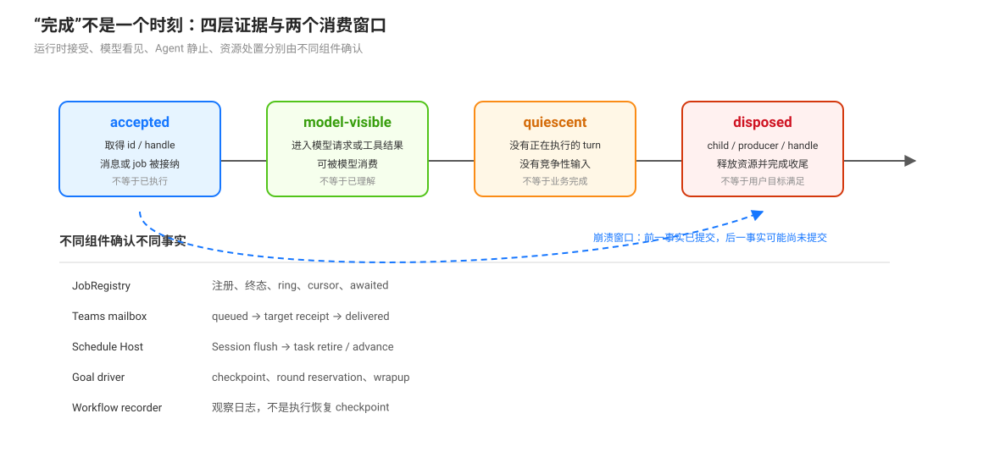

# 完成语义与崩溃窗口：接受、可见、静止与处置

本页补齐编排专题中最容易混淆的词：一个请求被接受，不等于模型已经看见；模型看见，不等于 turn 已经静止；资源终态，也不等于结果已经被消费。不同原语把这些时刻交给不同的日志、投影、inbox、句柄和 Host 存储。

## 四个时刻

| 时刻 | 说明 | 不能推出什么 |
|------|------|-------------|
| accepted | 运行时接受请求并取得可继续的句柄、消息 id 或 job id | 工作已经执行、结果已经可见 |
| model-visible | 消息已被投影进实际模型请求，或工具结果已回到模型上下文 | 模型已正确理解、验证或执行消息；仅进入 inbox 还不能证明这个时刻发生 |
| turn-quiescent | Agent 没有正在执行的 turn，且没有会抢占本轮的排队输入 | 资源已释放或目标已完成 |
| resources-disposed | producer、child、Activation 或 Host 投递过程已经释放其资源 | 业务目标已经满足 |

这些时刻需要分别记录。把它们压成一个 `completed` 状态，会掩盖通知丢失、重复投递、资源泄漏和模型尚未读取等真实窗口。

## 各原语的完成证据

### One-shot subagent 与 workflow

one-shot subagent 的 `start` 接受后，run 句柄由持有者负责处置；provider 卸载不会撤销已接受的 run。`run.result` 表示 child run 的结算结果，`run.dispose()` 负责生命周期收尾，二者不是同一事件（`packages/subagent/subagent/src/index.ts`；专题 [`03`](./03-subagent与subagent-fork-有界委派的隔离继承与continuable控制面.md)）。

workflow 运行在 PTC 受管进程中。`result` 按 `completed`、`cancelled` 或 `error` 结算；脚本的 `workflow/*` 记录是观察性日志，不是可恢复执行 checkpoint。工具 recorder 在记录 append 失败后停止继续记录，但不会把记录故障升级为 workflow 执行失败（`packages/workflow/tool-workflow/src/index.ts:89`-`:149`）。

### Continuable subagent

continuable start 返回的是初始 inbox 接受的 `childId` 与 `messageId`，不是一个已完成结果。child 只有在没有 pending inbox、没有 owned children 且当前 Activation 工作结束后才可能自然 settle；settle notice 只是把结算摘要投递给父，不表示父已经读取摘要。冷恢复会重建 Activation，但不会重新调用原 provider（专题 [`03`](./03-subagent与subagent-fork-有界委派的隔离继承与continuable控制面.md)）。

### Goal

goal round 需要先通过 idle、竞争输入、目标 phase、activation 和 revision 等准入检查。需要 checkpoint 时，driver 先 await Session flush，再重新检查是否仍可保留下一轮；flush 抛错会 disarm。`complete` 或 `blocked` 是目标状态变更，随后还会注入 wrapup；wrapup 禁止继续调用工具，因此目标结算和最终用户消息之间仍然存在一个收尾步骤（`packages/goal/goal-round-driver/src/index.ts:102`-`:205`；专题 [`05`](./05-goal-驾驶座用法-objective写法轮预算与终结纪律.md)）。

### Jobs

Job producer 负责执行资源，JobRegistry 负责 id、状态、输出 ring、读取游标和通知。`running → stopping` 不是资源已经停止；`JobHooks.done` 只有在 producer 释放资源后才应 resolve。`job_output` 的 `result` 只在结算后的第一次消费性读取中返回；`readAt` 是非消费读取，供观察者使用。settled 事件的 `awaited` 字段说明是否已有 waiter 收集结算，不说明模型已经读取结果（`packages/jobs/jobs/src/types.ts:104`-`:117`、`:160`-`:217`）。

### Agent Teams 消息与任务

Teams 消息先把 `team/message/queued` 追加并 flush，再尝试投递目标。目标 Session flush 成功且 receipt 存在后，Lead 才追加 `delivered`。`delivered` 证明消息写入目标 Session，不证明目标 Agent 已执行或读完消息；目标离线时消息可以继续保持 queued（`packages/experimental/agent-team/src/mailbox.ts:117`-`:150`、`:234`-`:281`）。

任务 `completed` 只表示任务板上的 owner 完成了状态转换。它不自动证明 Agent settle，也不回滚已经运行的后继任务；`ready` 是当前 claim/reassign 的准入条件，不是持续锁（专题 [`11`](./11-图计算的本质-不变量推导与执行的三件分置.md)）。

### Schedule

schedule 的到期流程先恢复目标 Session，再把 `schedule` follow-up 放入 inbox，flush 成功后才 retire one-shot task 或推进 recurring task。两套存储更新不是原子操作：崩溃可能造成重复投递；失败会保留任务并记录告警，不等于模型已经完成提醒内容（`packages/schedule/schedule/src/runtime.ts:85`-`:165`；`packages/schedule/AGENTS.md`）。

## 崩溃窗口

| 过程 | 崩溃前事实 | 重启后的事实 |
|------|-------------|--------------|
| Teams queued → target receipt → Lead delivered | queued 已持久化，receipt 或 Lead ack 可能尚未持久化 | dispatcher 按 message id 检查目标 receipt，避免重复接受；仍 pending 的消息继续尝试 |
| Schedule inbox flush → task advance | inbox 可能已 flush，task record 可能仍 active | 任务仍可能被再次扫描并投递；这是允许的重复，不是隐式 exactly-once |
| Workflow lifecycle record | run-start 或成员事件可能已写入 | 记录可供观察和审计，但不会恢复 PTC 脚本或 child run |
| Job terminal → model read | job 已终态，模型尚未读取 result | completion notice 或后续 `job_output` 仍是模型消费入口；已 awaited 的结算不重复播报 |
| Goal phase complete → wrapup | durable goal 已进入终态，最终回复尚未生成 | Session 恢复只保留 phase；activation 不因 durable active 自动恢复，终态不会凭空产生新工作 |

## 审查规则

审查一条编排实现时，分别询问：谁确认 accepted？哪条日志或投影证明 model-visible？谁持有资源处置责任？崩溃后哪个 id 防止重复接受？哪个状态只表示记录提交而不表示业务完成？如果一段说明没有回答这些问题，就不能把“完成”作为单一事实使用。

## 源码入口

| 路径 | 关注点 |
|------|--------|
| `packages/jobs/jobs/src/types.ts:104`-`:217` | producer 资源、registry 状态、消费读取与 awaited |
| `packages/experimental/agent-team/src/mailbox.ts:117`-`:281` | queued、目标 receipt、Lead delivered |
| `packages/schedule/schedule/src/runtime.ts:85`-`:165` | Session flush 与任务 retire/advance 的非原子窗口 |
| `packages/workflow/tool-workflow/src/index.ts:89`-`:149` | workflow 观察记录不影响执行结算 |
| `packages/goal/goal-round-driver/src/index.ts:102`-`:205` | quiescence、checkpoint、round reservation |
| `packages/subagent/subagent/src/continuation.ts` | durable child、Activation 与冷恢复 |
