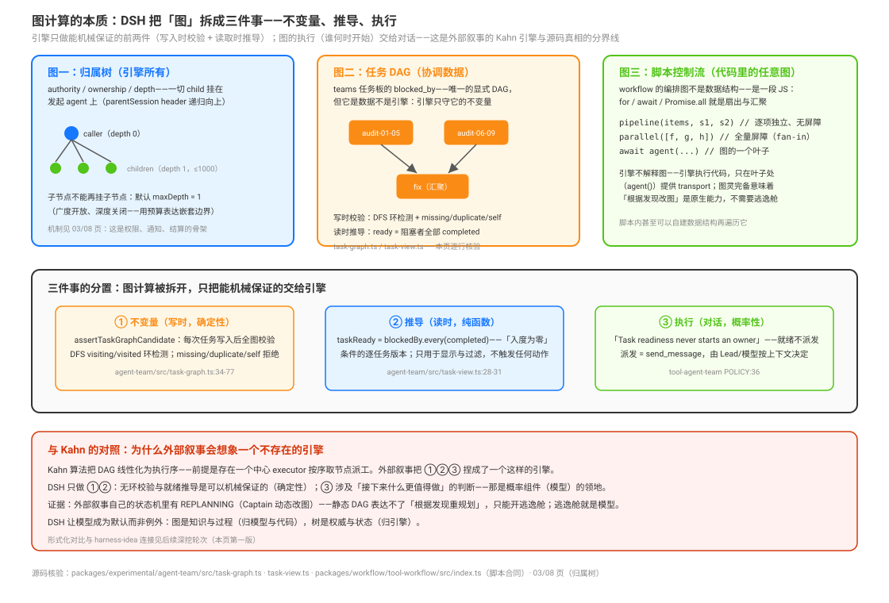

# 图计算的本质：不变量、推导与执行的三件分置

源码核验入口：`packages/experimental/agent-team/src/task-graph.ts`（图校验）、`packages/experimental/agent-team/src/task-view.ts`（就绪推导）、`packages/experimental/agent-team/src/task-board.ts:242` 与 `projection.ts:280`（两个校验调用点）、`packages/experimental/tool-agent-team/src/index.ts`（POLICY 与 ready 过滤）、`packages/workflow/tool-workflow/src/index.ts`（脚本合同）。

编排的骨子里确实是**图计算问题**——但 DSH 对它的回答不是「造一个图引擎」，而是把图计算**拆成三件分置的事**：引擎只做能机械保证的前两件，第三件交给对话与模型。本页逐行核验这个分置在源码里的形态，并回答：编排里真实的图有哪些？引擎对图做了什么、拒绝做什么？为什么这个分界画在这里？



## 三个真实的图

| 图 | 形态 | 归谁 | 本专题落点 |
|----|------|------|-----------|
| **归属树** | parentSession header 递归向上的树；一切 child（subagent / workflow 的 `agent()` / teams 成员）挂在发起 agent 上，深度用预算表达（默认 maxDepth=1：广度开放、深度关闭） | **引擎所有**——权限、通知、结算的骨架 | [`03`](./03-subagent与subagent-fork-有界委派的隔离继承与continuable控制面.md)、[`08`](./08-组合模式-归属链深度预算通知通道与收尾纪律.md) |
| **任务 DAG** | teams 任务板的 `blocked_by`——唯一的显式 DAG，但它是**协调数据**不是执行引擎 | 引擎守不变量；语义归团队 | 本页逐行核验 |
| **脚本控制流** | workflow 的编排图不是数据结构——是一段 JS：`for`/`await`/`Promise.all` 就是扇出与汇聚，`agent()` 是图的叶子 | 代码所有（图灵完备） | [`01`](./01-workflow-模型编写的JS编排脚本与子代理扇出机制.md) |

外部叙事把这三个图捏成了一个「Kahn 拓扑调度引擎」——都不存在（[`09`](./09-对照外部叙事-Captain与Kahn调度与rollback与KV看板的逐条源码真相.md)）。真实形态是下面的分置。

## 任务 DAG 的引擎侧：写时校验 + 读时推导

**写时校验（不变量，确定性）**：每次任务创建或变更，`assertTaskGraphCandidate` 对**替换候选快照后的全图**做完整性校验（`packages/experimental/agent-team/src/task-graph.ts:26`-`69`），拒绝三类违规（`TeamTaskGraphViolation`，`:6`）：

- `missing`：blocker 不存在或已删除（"blocker task … is missing or deleted"，`:46`）；
- `duplicate`：同一 blocker 重复列出（"repeats blocker"，`:41`）；
- `cycle`：**自引用**（"cannot block itself"，`:38`）或**依赖环**——后者用经典 DFS 三色标记检测：`visiting`/`visited` 两个 Set，访问中再遇即环（":54`-`65`）。这不是 Kahn 算法（Kahn 是反复摘入度零节点来线性化），是环检测——校验的目的是**拒绝非法图**，不是排出执行序。

校验有**两个调用点**：任务板命令事务内（`packages/experimental/agent-team/src/task-board.ts:242`，提交前）与事件折叠时（`projection.ts:280`）——**重放也重验**：任何时刻从日志重建任务板，非法图在折叠时同样炸出来，图的不变量因此是 durable 的。

**读时推导（纯函数）**：就绪不是一个存储的状态，是每次读取时推导的（`packages/experimental/agent-team/src/task-view.ts:24`-`26`）：

```ts
export function taskReady(state: TeamState, task: TeamTaskSnapshot): boolean {
  return task.blockedBy.every(id => state.tasks.find(...)?.status === 'completed')
}
```

这就是「入度为零」条件的**逐任务版本**——一个任务 ready 当且仅当它的全部 blocker 已 completed。推导结果只进两处：任务视图的 `ready` 字段（且仅当 `status === 'pending'`，`:59`）与 `team_task_list` 的 `ready` 过滤参数（`packages/experimental/tool-agent-team/src/index.ts:323`）。就绪推导的本体不住在这两处，而在 `taskReady`——一处 3 行的纯函数。同文件还推导 **advisory 写域重叠警告**（`scopesOverlap` 前缀包含关系，`:14`；`in_progress` 任务的写域与本任务重叠即告警，`:46`）——同样是提示不是锁。

## 执行分置：引擎拒绝做拓扑调度

关键句在 POLICY 里："**Task readiness never starts an owner.**"（`packages/experimental/tool-agent-team/src/index.ts:37`）——就绪不派发。派发的唯一途径是 `send_message`：由 Lead 或队友按上下文判断「现在该叫谁」。引擎对图的全部职责到此为止：**校验它合法、推导它就绪、拒绝替你调度它**。

对照 Kahn：Kahn 算法把 DAG 线性化为执行序，前提是存在一个中心 executor 按序取节点、派工、在节点完成时给后继减入度。外部叙事想象的正是一个这样的引擎（就绪队列、汇聚解冻、入度减一）。DSH 的分界线画在：**线性化与派发需要判断「接下来什么更值得做、失败了要不要重试、要不要改图」——那是概率判断，不是机械保证**。确定性归引擎（不变量 + 推导），概率性归模型（决策 + 重规划）。

## 为什么分界画在这里：重规划是常态

外部叙事自己的状态机里有一个 `REPLANNING` 态（Captain 动态手术改图）——这个态的存在本身就是证据：**静态 DAG 表达不了真实工作的图**。真实任务的依赖是做出来的过程中才被发现的（审计到一半才知道哪两个文件耦合）；一个写死的 DAG schema 要么假装图已知（然后频繁重规划），要么长出逃逸舱——而逃逸舱就是模型。DSH 让模型成为默认而非例外：

- **teams**：图（任务板）随时可改——`team_task_update` 换 `blocked_by` 即改图，改完立刻全图重校验（写时校验的设计动机正在于此：图是活的，每次改动都要保不变量）；
- **workflow**：编排图干脆用**图灵完备代码**表达——循环里可以根据中间结果构造下一批节点，改图是原生能力，不需要 DSL 逃逸舱（取舍记录见 `.agents/notes/implemented/feature/2026-07-05-dynamic-workflows.md`——脚本而不是对话持有循环、分支与中间结果）；
- **goal/ralph**：连图都不预设——objective 驱动的轮次里每轮重新决定做什么（同会话持久目标 vs fresh 迭代的两策略分裂见 [`04`](./04-ralph-fresh-agent循环的轮间传递与固定脚本机制.md)）。

## 后续深挖登记

本页是第一版；以下问题按「挣到再写」惯例登记，随轮次补深：

| 问题 | 状态 |
|------|------|
| 归属树的机械细节：ancestry WeakSet、parentSession header、initiator 的维护与遍历 | 待挖（部分在 03 页） |
| workflow 用图灵完备代码而非 DAG DSL 的完整取舍记录（dynamic-workflows note 的 alternatives 节） | 待挖 |
| 确定性/概率性边界与 harness-idea 专题的连接 | 待挖 |
| 外部 Kahn 与 DSH DFS 校验的形式化对比（线性化 vs 合法性、入度队列 vs 就绪过滤） | 待挖 |
| ~~图视角下全部原语的统一重述~~ | **已答**（下节「Agent 是原子」：Agent 视角与图视角的合并重述） |

## Agent 是原子：全部原语的统一重述

把三件分置再往下压一层，得到整个专题最深的统一性：**DSH 里一切工作的原子是 Agent**——一个 session + inbox + 驱动模型 turn 的 loop（loop 本身也是插件，`docs/architecture.md`；Agent 接口与 inbox 契约见 [`../agent-loop/00-map.md`](../agent-loop/00-map.md)）。**全部编排原语都是同一件事的变体：构造上下文 × 决定让哪个 Agent 何时跑 × 结果怎么回来**：

| 原语 | 构造什么上下文 | 哪个 Agent | 何时跑 | 结果怎么回 |
|------|--------------|-----------|--------|-----------|
| subagent spawn | prompt + fresh session + preset 重组 + 委派权限（[`03`](./03-subagent与subagent-fork-有界委派的隔离继承与continuable控制面.md)） | 新 child | 立即/后台 | 工具结果 / settle notice |
| subagent fork | 上述 + 种子=父已完成轮次（KV 前缀可复用） | 新 child（带历史） | 同上 | 同上 |
| workflow | 脚本按中间结果**逐个**构造 prompt+schema（[`01`](./01-workflow-模型编写的JS编排脚本与子代理扇出机制.md)） | 一批 child | 脚本控制流决定 | 脚本内消化，只回最终值 |
| ralph | 六段 prompt + workspace 为唯一记忆（[`04`](./04-ralph-fresh-agent循环的轮间传递与固定脚本机制.md)） | 每轮**全新** child | 上一轮结束 | 五字段有界报告 |
| goal | `<goal_round>` 注入 + durable session（[`05`](./05-goal-驾驶座用法-objective写法轮预算与终结纪律.md)） | **同一个** Agent | idle + armed | wrapup 收尾消息 |
| teams | 任务板 + 邮箱 + POLICY 注入（[`07`](./07-agent-teams-驾驶座用法-启用代价Lead工作流与协作纪律.md)） | 具名队友（spawn/fork） | 对话唤醒（就绪不派发） | relay 消息 + 任务状态 |
| schedule | 到期提醒消息（[`06`](./06-jobs与schedule-后台作业平台与定时跟进的时间平面.md)） | 目标会话的 Agent | wall-clock | follow-up 消息 |

两个精确的例外：**bash/pwsh 后台 job 是非 Agent 进程工作**（无模型无 loop——底层也会搬字节）；**todo/plan 只构造上下文不发射任何东西**（组织的是同一个 Agent 自己的工作记忆）。

这个视角与三件分置互为表里：**上下文构造与发射时机是确定性的（引擎），Agent 拿上下文做什么、判断接下来什么更值得做是概率性的（模型）**——引擎负责把 Agent 放进正确的图位置（归属树的节点、任务 DAG 的 owner），模型负责图上的语义决策。外部叙事虚构的中心调度引擎，在这个统一性下就是「把概率判断偷渡进确定性引擎」的尝试——源码从头到尾拒绝的正是这一步。

### 能力包络与代码-语言光谱

再往里压两层。**Agent 的能力包络 = 智力（模型：推理与决定）× 体力（工具集：bash/fs/browser……）× 许可（权限/沙箱/深度预算）**——loop 是确定性的交替驱动器（模型请求 → 工具执行 → 再请求，直到 turn 抽干），且 loop 与工具都是插件：连「体力」的清单都是可组合的。**关系的结构有两个层面：骨架是传统程序**（CAS、环检测、inbox FIFO、通知通道、深度预算——确定性代码），**流经骨架的是语言**（prompt、消息、报告、任务描述——给模型读的）：铜线是代码，电流是语言。

由此，**编排阶梯本质上是「代码-语言光谱」上的不同点位**——每个原语选一个"关系语义里代码占多少、语言占多少"的配比：

| 原语 | 关系语义的代码占比 | 语言占比 |
|------|------------------|---------|
| workflow | **全部写死成代码**（JS 脚本定扇出/汇聚/分支） | 只有叶子任务描述 |
| ralph | 节拍与校验是代码（固定脚本 + 报告 schema） | 轮间内容是语言（五字段报告） |
| goal | 节拍是代码（round driver 注入） | 每轮做什么全是语言 |
| teams | 只有不变量是代码（CAS/环检测/邮箱） | **协调几乎全是语言**（对话 + 任务板） |

光谱的两端就是两种极端的取舍：代码占比越高越确定、越可复算、越不能临场变（workflow）；语言占比越高越灵活、越能重规划、越依赖模型判断（teams）。**没有中心调度引擎 = 引擎只提供光谱上的确定性端点（骨架），每个原语自己选配比**。

## 源码入口

| 路径 | 一句话 |
|------|--------|
| `packages/experimental/agent-team/src/task-graph.ts:26`-`69` | 写时全图校验：missing/duplicate/cycle（DFS 环检测） |
| `packages/experimental/agent-team/src/task-board.ts:242` | 命令事务内的校验调用点 |
| `packages/experimental/agent-team/src/projection.ts:280` | 折叠时的校验调用点（重放重验，不变量 durable） |
| `packages/experimental/agent-team/src/task-view.ts:24`-`26`、`:59` | taskReady 纯函数推导 + ready 视图字段 |
| `packages/experimental/agent-team/src/task-view.ts:14`、`:46` | scopesOverlap 与 advisory 写域警告 |
| `packages/experimental/tool-agent-team/src/index.ts:37` | "Task readiness never starts an owner" |
| `packages/experimental/tool-agent-team/src/index.ts:323` | team_task_list 的 ready 过滤 |
| `packages/workflow/tool-workflow/src/index.ts:158`-`166` | 脚本合同：图灵完备控制流的钩子签名 |
