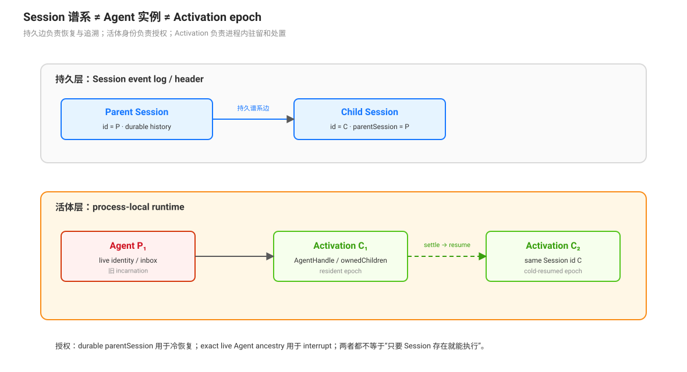

# Session 谱系与 Agent 实例：持久边与活体权限

编排系统同时使用 Session、Agent、Activation 和 provider。它们不是同一个对象：Session 保存可重建的历史与身份，Agent 是某次运行中的驱动实例，continuable Activation 是一个 Agent 的进程内驻留期，provider 只负责特定创建或传输路径。混淆这些对象会错误理解冷恢复、权限和资源释放。

## 四种身份

| 对象 | 生命周期 | 主要职责 | 能否单独证明当前执行存在 |
|------|----------|----------|----------------------------|
| Session | 持久，可跨进程恢复 | 事件日志、header、`parentSession`、inherited prefix | 否；Session 可以没有 live Agent |
| Agent | 进程内某次 runtime incarnation | inbox、turn loop、工具作用域、实时状态 | 是；但 Agent id 被替换后，旧实例不再授权 |
| Activation | continuable child 的一次驻留 epoch | 持有 `AgentHandle`、inbox、owned children、容量槽和 settlement watcher | 只证明该 epoch 存活，不改变 child 的 durable Session id |
| Provider | 创建或传输实现 | 准备 seed、启动 one-shot run 或提供外部后端 | 否；冷恢复 continuable child 使用 durable descriptor，不重新调用 provider |

同一 Session 可以经历多个 Agent incarnation 和多个 Activation epoch。`parentSession` 表示持久谱系边，不是 live Agent 引用，也不代表每个 provider 都在同一 host 内创建 Session。

## Session 谱系：向上可持久追溯

in-process child 创建时，child header 写入父 Session id、工作目录、agent preset、delegation depth 和是否带 seed（`packages/subagent/subagent/src/child-agent.ts:139`-`:156`）。Session Query 沿 `parentSession` 向上追溯；它检测循环，并在父记录缺失时返回 unresolved parent，而不是把缺失父节点伪造为 live Agent（`packages/session-query/session-query/src/tracing.ts:132`-`:150`）。

fork 的 inherited prefix 只表示创建时复制到 child 的已完成父历史。父 Session 后续追加的事件不会实时进入 child；continuable 冷恢复读取 child 自己的后缀和 descriptor。因此 lineage、fork seed 和 live parent authority 是三个不同问题。

## Activation：Session 不变，runtime epoch 可更换

continuable Activation 保存 `childId`、持久 direct parent、当前 provider、AgentHandle、child inbox、活体 ancestry 和 owned children（`packages/subagent/subagent/src/continuation-activation.ts:64`-`:105`）。其中：

- `parentSession` 用于在 handle 释放后定位持久 direct parent；
- `ancestry: WeakSet<Agent>` 只回答某个 live caller 是否属于当次 materialization 观察到的祖先链，不能枚举父节点；
- `ownedChildren: Set<SessionId>` 用于生命周期闭包，非空会阻止 child settlement；
- Activation registry 的 `resident` 是进程内表，不写入 Session，新的 Activation 可以复用同一个 child Session id。

child 的投递、释放和处置通过 per-child lock 串行化。`startContinuable` 在首个 inbox prompt 被接受后返回 `{ childId, messageId }`；创建、持久化、权限捕获或提交失败时回滚 Activation 和 parent ownership，不返回可用 id（`packages/subagent/subagent/src/continuation.ts:97`-`:191`）。

## 权限：持久来源与活体来源必须同时成立

委派时，child 的权限覆盖在第一个 await 前从父 Agent 捕获，并作为 `delegation` 事件写入 child Session；其中只继承显式 sandbox override 和允许的 permission preset，approval capability 存在时固定为 `never`（`packages/subagent/subagent/src/child-agent.ts:238`-`:280`）。冷恢复重放这些事件，不重新读取当前父 Agent 的权限。

控制面按操作区分授权半径：冷恢复要求调用者是 durable direct parent；`interrupt_agent` 需要精确 live ancestor；`send_message` 的下行目标限 direct continuable child，上行只到 direct parent。一个旧 Agent 即使拥有相同 Session id，也不能替代当前 live Agent 作为活体授权者。

## 冷恢复：不经过原 provider

`send_message` 找不到 live child 时，continuation manager 先观察持久 Session，再确认 header 的 `parentSession` 与调用者一致，折叠 child 自身后缀中的 descriptor，最后 materialize 新 Activation（`packages/subagent/subagent/src/continuation.ts:402`-`:455`）。该路径不调用原 provider；descriptor 提供 provider 名、模型参数、persona 和 tool filter，Session 日志提供已捕获的 policy 与对话状态。

这解释了三个常见误读：

1. provider 卸载不会自动撤销已经接受的 one-shot run；
2. child Session 存在不表示 child 当前正在运行；
3. Session resume 重建的是一个新的 Agent/Activation incarnation，不是恢复原来的 JS 对象或原来的 in-memory inbox。

## 外部 provider 不共享同一模型

in-process spawn/fork 可以使用 parent Session、child header、Agent scope 和 Session log 组成上述模型。ACP、Codex、Claude Code、SDK 等外部 provider 的能力旗标、cwd、工具作用域、上下文继承和结果交付由各自 provider 合同定义；不能把它们都描述成同一 host 内的 Agent + Session + inbox 树。跨 provider 的统一抽象是 `SubagentStartRequest` 与能力检查，而不是统一的 runtime incarnation 结构。

## 审查问题

审查一个编排路径时，分别确认：谱系边写入哪个 durable header；当前权限来自哪个事件；哪个对象持有取消和处置责任；授权检查需要 durable parent 还是 exact live Agent；冷恢复依赖 descriptor 还是重新调用 provider；Session、Agent 和 Activation 的 id 是否被错误地当成同一身份。

## 源码入口

| 路径 | 关注点 |
|------|--------|
| `packages/subagent/subagent/src/child-agent.ts:139`-`:156` | child header 与持久谱系 |
| `packages/subagent/subagent/src/child-agent.ts:238`-`:280` | 委派权限捕获与 durable policy 事件 |
| `packages/subagent/subagent/src/continuation-activation.ts:64`-`:105` | Activation epoch、ancestry 与 owned children |
| `packages/subagent/subagent/src/continuation.ts:97`-`:191` | continuable 创建、持有与回滚 |
| `packages/subagent/subagent/src/continuation.ts:402`-`:455` | lineage 授权与不经 provider 的冷恢复 |
| `packages/session-query/session-query/src/tracing.ts:132`-`:150` | Session lineage 追溯与循环检测 |
