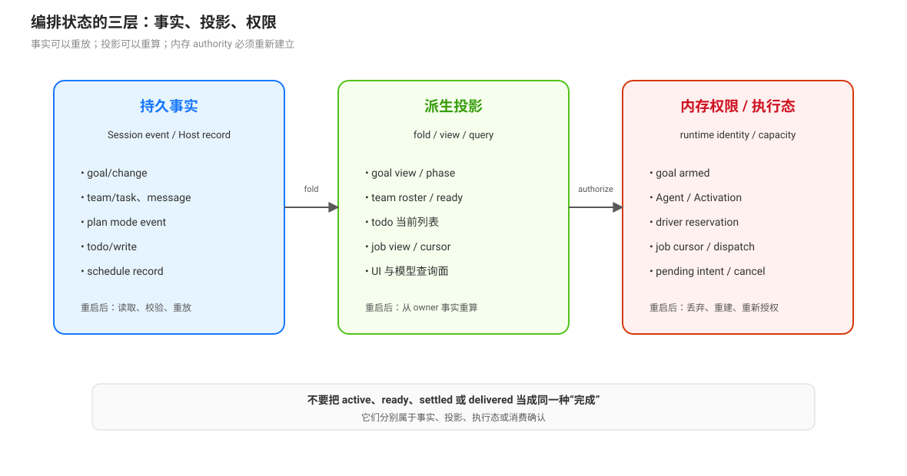

# 持久事实、派生投影与内存权限：编排状态三分法

DSH 的编排状态不能只按“有没有保存”二分。当前实现至少分成三层：Session 或 Host 存储中的持久事实、由事实折叠得到的派生投影、只存在于进程内并决定当前操作资格的 runtime authority。三层的恢复和失效规则不同。

## 三层定义

| 层 | 典型内容 | 生命周期 | 主要用途 | 重启后如何处理 |
|------|----------|----------|----------|----------------|
| 持久事实 | Session event、goal change、team task/message、plan mode event、schedule record | 日志或 Host 存储确认后保留 | 重建状态、审计、恢复输入 | 读取并重新折叠；若事实不完整，按拥有者规则拒绝或保留待处理 |
| 派生投影 | goal view、team roster/task view、todo list、job view、session catalog | 从事实或 registry 状态计算 | UI、模型查询、过滤与诊断 | 重新计算；投影不单独成为新的事实来源 |
| 内存权限/执行态 | goal armed、driver reservation、Agent identity、Activation、job cursor、pending dispatch | 当前进程或当前 runtime incarnation | 防止竞态、授权、容量、取消、资源收尾 | 丢弃并重新建立；不能从“持久 phase 存在”直接推导执行授权 |

“派生”不等于“不重要”：projection 可以包含 `ready`、`failure` 或 roster 等调用方必须看到的结果；但它仍应由权威事实重新计算，而不是被当作可独立修改的状态。

## Goal：phase 持久，activation 内存化

goal service 只以 owning Session log 作为 durable backing。`phase`、objective、revision、round budget 和 round counters 通过 `goal/change` 事件重建；`armed/disarmed` 保存在 `WeakMap<Session, GoalRuntimeState>` 中（`packages/goal/goal/src/index.ts:239`-`:267`）。Agent 创建时默认 disarmed，driver unload 也只移除 continuation authority，不改变 durable phase（`:282`-`:293`）。

Round driver 另外保留 exact Agent 的 reservation、竞争输入、checkpoint 和 stopping 状态；它在异步 checkpoint 后重新检查 Agent identity、idle 状态和竞争输入，再决定是否入队（`packages/goal/goal-round-driver/src/index.ts:37`-`:45`、`:102`-`:190`）。因此 active goal 不是自动执行许可，旧 Agent 也不能凭相同 Session id 继续执行。

## Todo：事件持久，standing projection 会在新 turn 清空

`todo_write` 追加完整 `todo/write` 列表；projection 读取最新列表，但在下一次 `turn/start` 清为 `null`，`turn/end` 不清空，因此刚结束的 turn 仍可展示已完成清单（`packages/todo/tool-todo/src/index.ts:119`-`:134`）。这是一份 turn-scoped working memory，不是跨 turn 自动维护的任务系统；它没有 dependency graph，也不会启动 owner。

## Plan：pending intent 不是已提交 mode

plan mode 的 selected state 在 accepted pre-step 才追加 mode event。命令或工具可以先把选择放进 `pendingIntents`；如果当前 step 被 reject、signal aborted 或没有 pending intent，就不提交。append 失败会保留 pending，等待后续 accepted pre-step 再尝试（`packages/plan/plan-mode/src/index.ts:182`-`:215`）。因此“用户已经选择 plan mode”和“Session log 已记录 plan mode”之间存在明确窗口。

plan mode 的持久 event 只记录 mode 状态；pending intent、narration 选项和下一步适用的过程状态属于进程内 runtime。plan mode 也不是 sandbox 或 approval policy，它只改变规划提示和审批流程。

## Jobs：持久性取决于 registry provider

`jobs-local` 将 job lifecycle、output ring 和 model cursor 全部保存在内存，并返回 detached projection 和 chunk copies（`packages/jobs/jobs-local/src/index.ts:1`-`:10`）。进程重启不会从 jobs-local 恢复运行中的 job、ring 或 cursor；需要跨重启执行必须由另一个 JobRegistry provider 实现相应合同。

Job 记录本身由 registry 管理，producer 资源、终态、owner fence、输出读取和 teardown 分属不同责任。`settled` 只表示 producer/kill/teardown 已写入终态；`awaited` 只表示某个 live wait 已领取结算，不表示模型已经理解或消费输出。

## Teams：事实在 Lead log，projection 在读取侧

Agent Teams 将成员、任务和 mailbox 事件追加到 Lead Session，并在 flush 成功后发布。任务视图由 roster、非删除任务、`ready` 派生；projection failure 会停止继续折叠并让 journal 后续权威读取拒绝操作。Mailbox 的 queued、目标 receipt 和 Lead delivered 是不同的事实，不能用一个投影字段替代三段确认（专题 [`10`](./10-完成语义与崩溃窗口-接受可见静止处置.md)）。

## 统一恢复问题

审查一个状态字段时，先问四个问题：

1. 它是否进入 Session 或 Host durable storage？
2. 它是从哪些事件或记录重新计算的？
3. 哪个 exact Agent、Activation、driver 或 registry 持有当前权限？
4. 重启或 runtime replacement 后，系统是恢复、重新计算、重新授权，还是保持 pending？

只有第一问回答“是”，才能把它作为跨进程事实；只有第二问有明确 owner，才能把它称为 projection；只有第三问明确指出 runtime owner，才能把它用于当前执行授权。

## 源码入口

| 路径 | 关注点 |
|------|--------|
| `packages/goal/goal/src/index.ts:239`-`:267` | goal durable backing 与 disarmed runtime activation |
| `packages/goal/goal-round-driver/src/index.ts:37`-`:45`、`:102`-`:190` | round reservation 与异步 checkpoint 后的竞态复查 |
| `packages/todo/tool-todo/src/index.ts:119`-`:134` | todo projection 与 `turn/start` 清空 |
| `packages/plan/plan-mode/src/index.ts:182`-`:215` | pending intent 与 accepted pre-step 提交 |
| `packages/jobs/jobs-local/src/index.ts:1`-`:10` | process-local job、ring、cursor |
| `packages/experimental/agent-team/src/projection.ts:225`-`:237`、`:342`-`:360` | Team projection failure 与完整 client view |
