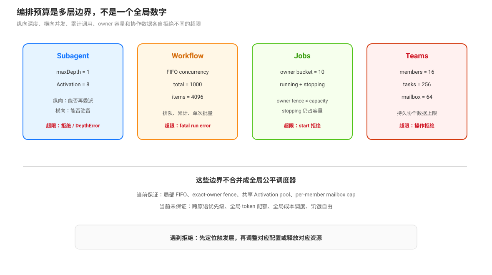

# 资源预算与公平性：深度、并发、总量与容量边界

DSH 的编排限制不是一个统一的“任务预算”。不同层分别限制递归深度、活体 Agent 数、workflow 并发、单次项目数、总子代理调用、owner 的后台 job 数量，以及 teams 的成员、任务和 mailbox 容量。一个组合请求的实际上限由这些边界中最先触发的一层决定。

## 预算维度

| 维度 | 默认或来源 | 作用 | 触发后的语义 |
|------|------------|------|--------------|
| delegation depth | subagent runtime `maxDepth` 默认 1；请求可进一步收紧 | 限制嵌套委派的纵向深度 | `SubagentDepthError`，不把越界委派当成成功 |
| continuable capacity | `maxActiveSubagents` 默认 8，共享于不间断 continuable 链 | 限制同时驻留的 continuable Activation | `ACTIVATION_LIMIT_REACHED`，调用方需等待已有 child 结束或继续当前工作 |
| workflow concurrency | `maxConcurrentAgents` 默认按 `min(16, max(1, cores - 2))` 解析 | 限制一个 workflow 同时运行的 child agent 数 | 后续 `agent()` 按 FIFO slot 排队 |
| workflow total | `maxTotalAgents` 默认 1000 | 限制一个 workflow 已开始的 `agent()` 调用总数 | `AGENT_CAP` fatal，整个脚本失败 |
| workflow item | `maxItemsPerCall` 默认 4096 | 限制单次 `parallel` 或 `pipeline` 的项目数 | `ITEM_CAP` fatal，整个脚本失败 |
| jobs owner capacity | jobs-local 默认每个 exact owner 10 个 `running` 或 `stopping` job | 防止一个 owner 占满后台 job registry | `jobs.start()` 拒绝；需等待、完成或 kill 现有 job |
| Agent Teams | `maxMembers=16`、`maxTasks=256`、每成员 pending message=64、单消息 65,536 bytes | 限制一个 Team 的持久协作数据和成员规模 | 对应创建、发送或任务操作拒绝 |

这些数值是部署和 provider 组合的一部分，不应概括为整个 DSH 的全局公平调度器。Teams profile 还可以把 `maxMembers` 覆盖为 8；workflow 的配置也可以改变默认并发和总量。

## 深度不是横向容量

`maxDepth=1` 的含义是顶层 Agent 可以创建 depth-1 child，不能据此推出可以无限创建 child。continuable Activation 受共享容量 8 限制；workflow 受 FIFO concurrency、total cap 和 item cap 限制；jobs 受 exact-owner active bucket 限制。深度预算回答“能否再嵌套”，容量预算回答“当前能同时或累计保留多少工作”。

## Workflow：排队与 fatal cap 是两套机制

workflow runtime 在 `agent()` 开始时先检查 `maxTotalAgents`，递增 started 计数，再取得并发 slot。slot waiter 按 FIFO 顺序释放（`packages/workflow/workflow-ptc/src/runtime.ts:142`-`:180`）；排队调用仍算入已开始计数。`parallel()` 和 `pipeline()` 在进入前检查项目数量，超出 `maxItemsPerCall` 直接抛 `ITEM_CAP`（`:342`-`:347`）。

普通 child 失败和普通 stage/thunk 异常可以局部变成 `null`；错误选项、schema、cap 或基础设施错误保持 fatal。并发 slot 只控制运行时占用，不保证叶子模型结果可复现，也不保证跨 workflow 之间的公平顺序。

## Jobs：owner fence 与 owner capacity 不同

jobs-local 按 exact live owner 计数，只统计 `running` 与 `stopping`；默认上限是 10（`packages/jobs/jobs-local/src/index.ts:29`-`:35`、`:207`-`:223`）。owner fence 控制谁能读、停和接收通知，capacity 控制该 owner 可以同时占用多少 registry 记录。一个 job 进入 `stopping` 后仍占用容量，直到 producer 的 `done` 结算并释放资源。

jobs-local 的容量和记录是 process-local。进程重启不会恢复旧 registry、ring 或 cursor；不能把 capacity 统计误读成跨重启的持久配额。

## Agent Teams：持久数据上限不是调度器

Teams 对成员数、任务数、pending mailbox 和消息字节数设硬上限。任务 readiness 会作为 `claim` 和带 owner 的 `reassign` 准入，但 readiness 不会自动启动 owner。write-scope overlap 只是 warning，不是锁；任务 completed 也不释放一个通用调度队列，因为系统没有由 ready 队列自动派工的中心 executor。

## 公平性边界

当前源码提供局部公平或隔离机制：workflow 自身的 FIFO slot、jobs 的 exact-owner bucket、teams mailbox 的 per-member pending cap、continuable 的共享 Activation pool。它们不组成跨原语的全局 scheduler：没有一个组件按所有 Agent 的成本、优先级、token、wall-clock 或 job 类型计算全局配额。因此文档应使用“局部容量、队列顺序、owner fence”描述已实现保证，不应声称系统提供全局公平性或饥饿自由。

## 驾驶座检查顺序

遇到“为什么没有继续启动”时，按以下顺序检查：当前 delegation depth；continuable Activation 是否达到上限；workflow 是否在 FIFO slot 等待；workflow total/item cap 是否已触发；owner 的 running/stopping job 数；Team member/task/mailbox 上限；最后检查 provider capability 和服务组合。不要只提高一个总预算来解决另一个层的拒绝。

## 源码入口

| 路径 | 关注点 |
|------|--------|
| `packages/subagent/subagent/src/index.ts:191`-`:203` | `maxDepth` 与 continuable capacity 默认值 |
| `packages/workflow/workflow-ptc/src/index.ts:102`-`:111` | workflow Config 默认限制 |
| `packages/workflow/workflow-ptc/src/runtime.ts:142`-`:180` | FIFO concurrency slot 与 total cap |
| `packages/workflow/workflow-ptc/src/runtime.ts:342`-`:347` | per-call item cap |
| `packages/jobs/jobs-local/src/index.ts:29`-`:35`、`:207`-`:223` | owner capacity 默认值与拒绝 |
| `packages/experimental/agent-team/src/index.ts:41`-`:65` | Team 成员、任务、消息和字节限制 |
| `packages/experimental/agent-team/src/task-board.ts:129`-`:186` | ready 的 claim/reassign 准入 |
