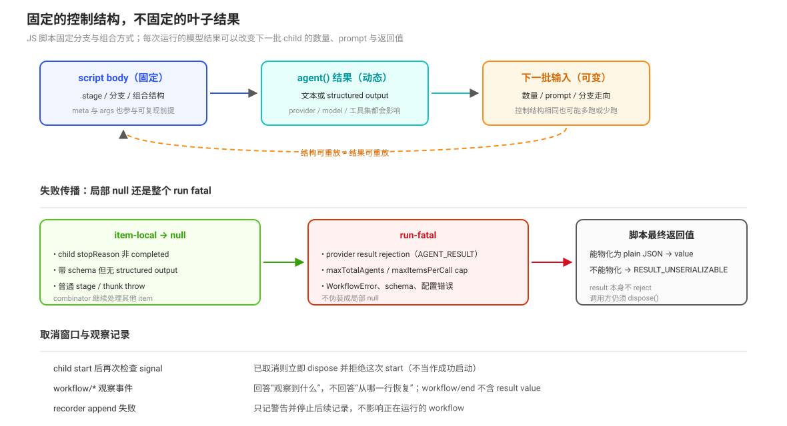

# workflow 可复现性与生命周期：动态结果、取消和观察记录

workflow 把控制结构放进受管 PTC 脚本，但不把结果变成可复算的纯函数。脚本输入、模型子代理结果、provider 行为、workspace 和时间之外部因素都可能影响下一次控制流；运行时只保证脚本 API、容量、失败传播和资源处置的明确语义。

## 动态控制流不是静态 DAG

`agent()` 返回值可以被脚本传给下一阶段、用于分支，或用于构造下一批 `pipeline` / `parallel` 输入。`pipeline` 对每个 item 顺序执行 stage，但不同 item 之间没有 stage barrier；`parallel` 启动所有 thunk 并等待全部结果（`packages/workflow/workflow-ptc/src/runtime.ts:284`-`:339`）。因此：

- JS 代码固定的是控制结构，不是每次运行的叶子结果；
- 结果依赖的分支可以改变下一批 child 的数量、prompt 和返回值；
- FIFO slot 只规定等待中的 child 获得执行槽的顺序，不规定模型结果顺序或结果内容；
- `phase()` 只改变观察分组和后续 `agent()` 的 phase 标签，不形成同步 barrier。

`maxTotalAgents`、`maxItemsPerCall` 和并发 slot 让 runaway work 以确定方式受到限制，但不提供跨运行的 replay 或全局公平排序。

## 失败传播：item-local 与 run-fatal

workflow 必须区分三种失败：

| 失败 | 传播范围 | 语义 |
|------|----------|------|
| child 返回非 `completed` stopReason | 当前 `agent()` 解析为 `null` | combinator 可以继续处理其他 item |
| 普通 stage/thunk throw | 当前 pipeline item 或 parallel thunk 解析为 `null` | 其他 item 继续；pipeline 该 item 跳过剩余 stage |
| WorkflowError、cap、schema、启动/结果基础设施错误 | 整个 run fatal | 不把配置错误或 provider 故障伪装成局部 null |

带 `schema` 的 child 即使 stopReason 为 `completed`，却没有 structured output，也按 child failure 返回 `null`；provider `result` promise rejection 则升级为 `AGENT_RESULT` fatal（`packages/workflow/workflow-ptc/src/runtime.ts:195`-`:225`）。脚本最终返回值如果不能物化为 plain JSON，则为 `RESULT_UNSERIALIZABLE`。

## 启动、取消与处置竞态

一次 child 启动先进入 `children.startAgent()`，provider 可能在 `AbortSignal` 已触发后才发布 run。host 在发布后再次检查 signal；如果已取消，就立即处置 child 并拒绝这次 start（`packages/workflow/workflow-ptc/src/host.ts:197`-`:219`）。这避免把取消窗口中的 child 当成成功启动。

取消 workflow 时，host 将脚本 signal 置为 aborted，run 结果结算为 `cancelled`；随后处置已发布 child，并等待 pending startup 与 child disposal 完成。未在 start 后发布 child 的调用不会伪造一对生命周期事件；仍处于 live map 的成员会在最终处置阶段合成 `agent-end(cancelled)`（`packages/workflow/workflow-ptc/src/host.ts:269`-`:303`）。

`WorkflowRun.result` 不 reject；调用方通过 `stopReason` 和可选 error 读取结算，调用方仍必须调用 `dispose()` 等待脚本与 child 静止（`packages/workflow/workflow/src/runtime-types.ts:36`-`:49`）。

## 观察记录不是恢复 checkpoint

`workflow/start`、`workflow/phase`、`workflow/log`、`workflow/agent-start`、`workflow/agent-end` 和 `workflow/end` 为观察者提供生命周期与进度事实。`workflow/end` 刻意不包含最终 result value；tool recorder 将这些事件追加到父 Session，但 recorder append 失败时只记录警告并停止后续记录，不影响正在运行的 workflow（`packages/workflow/tool-workflow/src/index.ts:89`-`:149`）。

因此日志能够回答“曾经观察到什么”，不能回答“从哪一行恢复脚本”。PTC 脚本、未完成的 Promise、child handles 和 VM 内局部变量都不由这些事件重建。

## 可复现性审查清单

审查 workflow 是否可复现时，至少区分：

1. 脚本 body、meta 和 args 是否相同；
2. provider、model、工具集、权限和 workspace 是否相同；
3. child 的自然语言输出或 structured output 是否相同；
4. 并发 slot 获得顺序是否影响共享外部资源；
5. child failure、普通 throw 和 fatal error 是否保持原有传播级别；
6. 取消发生在 start 前、provider 发布后、result 等待中还是最终处置阶段；
7. 观察事件缺失时，系统是否仍把执行状态误判为可恢复。

除非这些输入和外部副作用都被固定，否则 workflow 的脚本结构可重放，不等于 workflow 的结果可重放。

## 源码入口

| 路径 | 关注点 |
|------|--------|
| `packages/workflow/workflow-ptc/src/runtime.ts:142`-`:180` | FIFO slot、total cap 与 child start |
| `packages/workflow/workflow-ptc/src/runtime.ts:195`-`:225` | child result、structured output 与 failure propagation |
| `packages/workflow/workflow-ptc/src/runtime.ts:284`-`:339` | parallel/pipeline 的 barrier 与 item-local null |
| `packages/workflow/workflow-ptc/src/host.ts:197`-`:247` | start-after-abort、result race 与 child disposal |
| `packages/workflow/workflow-ptc/src/host.ts:269`-`:303` | cancellation、pending startup 与合成 lifecycle end |
| `packages/workflow/workflow/src/runtime-types.ts:36`-`:49` | holder-owned result/cancel/dispose contract |
| `packages/workflow/workflow/src/index.ts:35`-`:134` | event pairing 与 fatal error taxonomy |
| `packages/workflow/tool-workflow/src/index.ts:89`-`:149` | Session observation recorder 的 contained failure |
