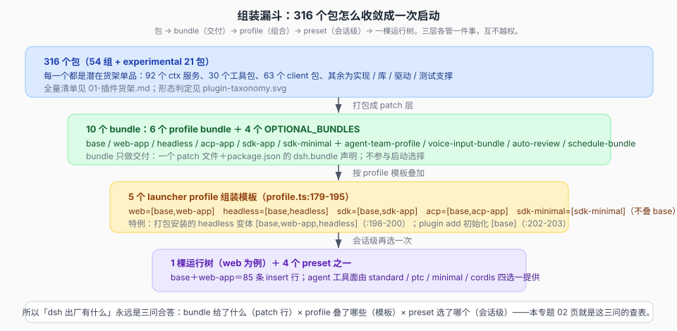

# Plugin inventory · 现成插件货架

产品源码基线：`639ed015397290b3745d163aafe02ffee4aa3f84`（`dsh-v0.2.0-rc.2`）；本专题结论与该 commit 的项目树一致。本专题是**快照式清单**：包数、服务数、组合成员随每次 upstream 同步漂移，重测义务登记在 [`_coverage/`](../_coverage/00-index.md) 的本专题行；引用生成目录与 bundle patch 时给区块级行号，结构变化以生成目录为真源。

## 一句话

动手写插件之前先查这里：dsh 出厂自带 316 个包、92 个 `ctx` 服务、30 个工具包，绝大多数能力已经有现货。本专题回答「我要的能力现成给了没有、以什么形态给、怎么拿到」，以及「哪些真的要自己写」。

## 复用决策路径

四步，每步的清单与例子在编号页：

1. **查货架** → [`01`](./01-插件货架.md)：按包组浏览全部 316 个包的形态（Def / Impl / Tool / cmd / bundle / UI / adapter / lib）与默认可见性（base / web / min / preset / opt / —）。
2. **对横切清单** → [`02`](./02-五张清单.md)：按「我要的是服务、工具、bundle、模式还是 skill」查五张总表，含每个 profile 实际暴露哪些模型可见工具。
3. **选出路** → [`03`](./03-复用路径与缺口.md)：调配置 → patch 换 Provider → 挂现成包 → 写胶水插件，四条出路按代价排序，各有带行号的真实例子。
4. **确认缺口** → [`03`](./03-复用路径与缺口.md) 末节：零 Provider 的 seam 与只有实验实现的稳定 seam，这些才是「必须自写」的候选。

## 与其他专题的分工

| 问题 | 去哪 |
|------|------|
| 有哪些现成的、从哪拿 | 本专题 |
| 换一个实现、三角色怎么分装 | [`capability-seams/`](../capability-seams/00-map.md) |
| 启动时怎么挂成一棵树 | [`composition/`](../composition/00-map.md) |
| 某种启动方式带了什么 | [`runtime-profiles/`](../runtime-profiles/00-map.md) |
| 生成目录怎么当量化底座 | [`harness-idea/05`](../harness-idea/05-dynamic-legibility.md) |

## 阅读路径

- **「我想做 X，dsh 有现成的吗」** → [`01`](./01-插件货架.md) 按组找，再用 [`02`](./02-五张清单.md) 的 profile 暴露表确认默认能不能看到。
- **「找到了，怎么用上」** → [`03`](./03-复用路径与缺口.md) 的四条出路。
- **「找不到，是不是要自己写」** → [`03`](./03-复用路径与缺口.md) 的缺口清单，先对照零 Provider seam 与 experimental 面。
- **「这些分类是怎么定的、背后在设计什么」** → [`04`](./04-插件分类与设计思考.md)。
