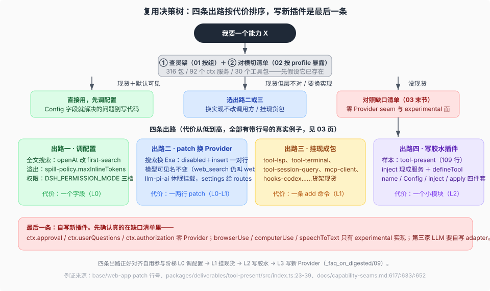

# 04 · 复用四条出路与缺口清单

基线 `dsh-v0.2.0-rc.2`。查到现货之后，按代价从低到高有四条出路；每条给带行号的真实例子。都走不通时，末节的缺口清单说明哪些能力现在必须自写。

## 出路一：调配置，不改代码

1. **全文搜索开关**：`session-query-sqlite` 出厂 `openAt: never`——seam 已挂、搜索关着；在后续层把 `openAt` 改 `first-search`/`startup` 并给 `path`，即得 SQLite FTS5 全文搜索（base:141-153，Config 8 字段）。
2. **溢出与裁剪策略**：`spill-policy.maxInlineTokens`（base:407-410）与 `compaction-tool-result-pruner` 的 thresholdChars / headChars / tailChars（base:418-423）都是字段，不是代码常量。
3. **权限档位**：`DSH_PERMISSION_MODE` 一个环境变量联动 `sandbox-policy.mode` 与 `approval.policy`（base:229-233、245-248），三档预设表在 permission-presets（base:250-262）。

字段全集查生成目录 [`docs/config-catalog.md`](../../docs/config-catalog.md)（145 包有 config 条目、117 个有可调字段）。

**改配置的三种位置**（新人最容易卡在「改哪里」）：Web 设置页与环境变量（如 `DSH_PERMISSION_MODE`）适合交互式调整；profile 的 `cordis.patch.yml` 或用户 patch 适合部署级持久化（层叠与热重载机制见 [`../composition-boot/03-user-patch-hmr.md`](../composition-boot/03-user-patch-hmr.md)）；`dsh --patch` 覆盖层适合临时试验（例子 `apps/web/tests/pin-browse-picker.overlay.yml:6-12`）。

## 出路二：patch 换 Provider（模型可见面不变）

1. **搜索换 Exa**：disabled `web-search-deepseek` 行＋insert `@deepseek-ai/dsh-web-search-exa` 行（packages/web/web-search-exa/README.md:40 的挂载示例；出厂对照 base:472-484）——`web_search`/`web_fetch` 的模型可见名不变（tool-catalog.md:47）。
2. **LLM 双轨**：`llm-pi-ai` 以休眠态随 base 挂载，settings 出现 `llm-pi-ai:` 段即注册多 Provider routes（base:120-128）；默认模型在 `agent-default-model` 行改（base:82-86）。
3. **`--patch` 覆盖**：`apps/web/tests/pin-browse-picker.overlay.yml:6-12` 的 disable＋insert 对换目录挑选后端；`tool-ralph` 的打开示例写在 base:440-446 注释里。
4. **OPTIONAL_BUNDLES 一键开**：四个实验 bundle 在 Web 插件页（或 `plugin_manager` 工具）开关，无需改文件（profile.ts:213-218；web-app:300-306）。

机制（为什么换 Provider 不用改 Consumer）归 [`capability-seams/`](../capability-seams/00-map.md)。

## 出路三：挂现成包

`dsh plugin --profile <name> add <package>`（apps/cli/src/args.ts:99；apps/cli/README.md:18）：内置 bundle 从安装闭包解析、外部包从 profile 的 node_modules 解析（apps/cli/README.md:46），兼容性由 DSH peer 范围把守（apps/cli/README.md:39；apps/cli/src/plugin.ts:100）。货架上的现货（[`02`](./02-plugin-catalog.md) 中「可见性＝—」的行）：`tool-str-replace-editor`、`tool-lsp`＋`lsp-stdio`、`tool-terminal`、`tool-session-query`、`web-search-exa`、`mcp-client`、`hooks-codex` 等。

## 出路四：写胶水插件，消费现成服务

最小 shipped 样本是 `@deepseek-ai/dsh-tool-present`（109 行，packages/deliverables/tool-present/src/index.ts）：`inject = ['tools', 'fs', 'sessionProjections']`（:23-26），apply 里 `ctx.tools.register(defineTool({...}))` 注册 `present`（:28、:39），文件解析与每会话交付状态分别白拿 `ctx.fs` 与 `ctx.sessionProjections`。一个功能插件＝name / Config / inject / apply 四件套（packages/AGENTS.md 的「Plugin exports」节），服务全部现成。

两点核查纪律：生成表 `docs/capability-seams.md` 的消费者列对 agent 作用域注册的工具插件不完备（tool-present 不在 `ctx.tools` 消费者行里），以源码 `inject` 与 config-catalog 各节的 `inject` 行为准；插件的最小合同与发布纪律归 [`_dsh_plugin_agent_ready_development/repo-harness/09`](../../_dsh_plugin_agent_ready_development/repo-harness/09-plugin-author-entry.md)。

## 缺口清单：这些现在必须自写

| 缺口 | 现状 | 出处 |
|---|---|---|
| 无 GUI 部署的审批回答器 | `ctx.approval` 零 Provider；回答者是 waterfall 监听器，shipped 只有 Web `ui-approval` 与 ACP 桥，缺席时 fail closed | :652 |
| 无 GUI 部署的提问回答器 | `ctx.userQuestions` 零 Provider；`tool-ask-user` 停在 provider 无关的 ask() promise 上，回答端在 Web 侧 | :633 |
| 新的凭据获取流 | `ctx.authorization` 零 Provider；除 deepseek-account-platform 的浏览器 PKCE 外没有别的流，接新 OAuth / 设备码流程要自写 flow 插件 | :617 |
| 浏览器 / 桌面控制 | `ctx.browserUse` / `ctx.computerUse` 是稳定 seam，但全部实现都在 experimental——要么挂实验包，要么自写 Provider | :586-587 |
| 第三家 LLM adapter | `ctx.llm` 的稳定实现只有 llm-deepseek 与休眠的 llm-pi-ai；第三家要么写 pi-ai settings profiles，要么自写 adapter | :591；base:120-128 |
| 语音识别后端 | 唯一实现是实验性 SenseVoice（本地 ONNX）；接云端 ASR 要自写 Provider | :658 |

写之前再对照两条：[`capability-seams/00-map`](../capability-seams/00-map.md) 的三角色分装纪律（Definition / Provider / Consumer 怎么拆包），与 [`_faq_on_digested/09`](../../_faq_on_digested/09_plugin-business-ladder/answer.md) 的自用价值判断（哪类插件对自用 owner 最值）。
