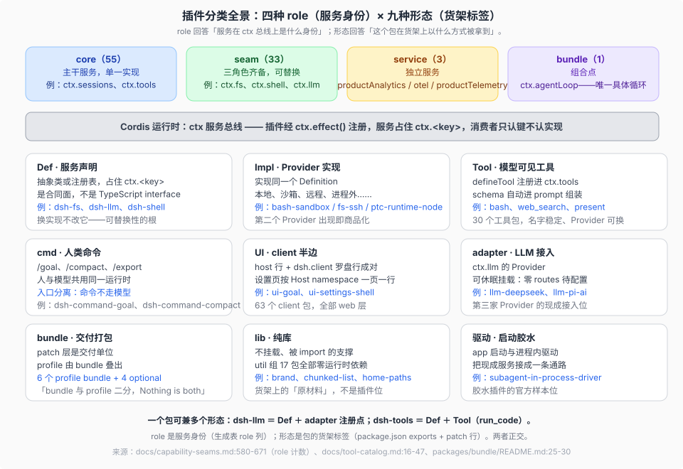
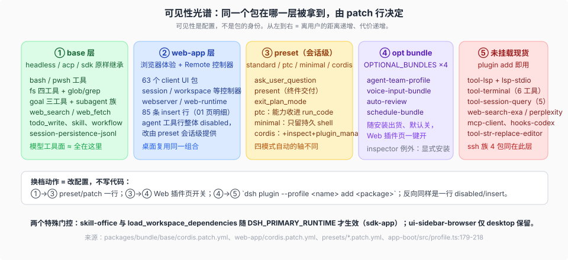

# 05 · 插件分类与设计思考

产品源码基线：`639ed015397290b3745d163aafe02ffee4aa3f84`（`dsh-v0.2.0-rc.2`）；快照式清单的重测义务见 [`_coverage/`](../_coverage/00-index.md)。

## 一句话

货架不是平铺的 `packages/` 目录：316 个包按「能力怎么进入运行时」切成九种形态、按「服务在总线上的身份」分成四种 role。分类本身就是 DSH 的设计决定清单——每一刀背后都有一个可以单独检验的承诺。

## 九种形态，各自回答一个问题

**Def（服务声明）回答「合同归谁」。** Service Definition 是抽象类或注册表，占住 `ctx.<key>`；刻意不是 TypeScript interface，因为合同需要运行时存在（可 `ctx.get`、可校验）。扩展插件只依赖 Def 不依赖实现——这是「换一个后端、整面产品跟着变」的根。判据：遇到一个 `ctx.<key>`，先找它的 Def 住在哪个包（生成表 owner 列）。

**Impl（Provider 实现）回答「谁在兑现合同」。** 同一 Def 可以有本地、沙箱、远程、进程外多个 Impl（bash-sandbox、fs-ssh、ptc-runtime-python）。第二个真实 Provider 出现而 Consumer 一行不改，是该能力商品化的直接读数（[`_faq_on_digested/08`](../../_faq_on_digested/08_plugin-seam-maturity/answer.md) 的供给侧判据）。

**Tool（模型可见工具）回答「模型看见什么」。** `defineTool` 注册进 `ctx.tools`，schema 自动进 prompt 组装。工具名稳定、Provider 可换：`web_search` 一直叫 `web_search`，后端可从官方搜索换成 exa。30 个工具包的全集与逐 profile 暴露见 [`03`](./03-reference-lists.md)。

**cmd（人类命令）回答「人从哪里进」。** `/goal`、`/compact`、`/export` 与模型工具共用同一运行时但入口分离——人不说话也能用上运行时，模型不经过命令层。

**UI（client 半边）回答「浏览器里放什么」。** host 行与 `dsh.client` 罗盘行成对出现；设置页按 Host namespace 一页一行（`ui-settings-*` 系列与 `ui-settings-plugins` 的罗盘页互补）。63 个 client 包遵守 Client composition discipline：模块物化顺序与 Cordis 激活顺序是两回事（`packages/client/AGENTS.md`）。

**adapter（LLM 接入）回答「模型从哪来」。** `ctx.llm` 的 Provider，可休眠挂载——`llm-pi-ai` 雏形零 routes，settings 出现 `llm-pi-ai:` 段才注册多 Provider。第三家 Provider 的接入位现成，不用改 loop。

**bundle（交付打包）回答「怎么发货」。** patch 层是交付单位，profile 是组合单位，二者刻意二分（「Nothing is both」，[`_agent_ready_development/repo-harness/09`](../../_agent_ready_development/repo-harness/09-plugin-author-entry.md)）。OPTIONAL_BUNDLES 是中间档：随安装出货、默认关、插件页一键开。

**lib（纯库）回答「哪些不是插件」。** util 组 17 包零运行时依赖，被 import 不被挂载。货架上必须有这一栏，否则「316 个包」会被误读成「316 个插件位」。

**驱动（启动胶水）回答「谁把服务接成通路」。** `subagent-in-process-driver` 这类包不注册面向模型的能力，只把现成服务接成一条执行路径——出路四（写胶水插件）的官方参照物。

## role 语法：core / seam / service / bundle 怎么判

一条 seam 必须三角色齐备（Definition + Provider + Consumer），只有单一实现的主干是 core，独立发布的观测与分析面是 service，组合点是 bundle。判定不靠感觉：生成表 [`docs/capability-seams.md`](../../docs/capability-seams.md) 的 implementations 与 direct consumers 两列就是判定数据，成熟度信号（P≥2、单 Provider、自消费、零 Provider）由 FAQ 08 承载，本专题不重复计数。

## 可见性是配置，不是身份

同一个包在光谱上的位置由 patch 行的 disabled / insert / 门控条件决定：出厂可见（base、web 层）→ preset 会话级提供 → OPTIONAL_BUNDLES 默认关 → 未挂载现货。两个特殊门控说明门控条件本身也是配置表达式（`!!js`）：`skill-office` 与 `load_workspace_dependencies` 需要 `DSH_PRIMARY_RUNTIME` 才生效（sdk-app），`ui-sidebar-browser` 仅 desktop 保留。

## 背后的四条设计决定

1. **everything-is-a-plugin → 先查货架再动手。** 对话循环、读写文件、跑命令、接模型、画界面都是树上的插件，所以「我要的能力多半已注册在 ctx 上」是默认假设，写新插件是例外而非起点。
2. **显式优于隐式 → 换实现永远是组合层的显式动作。** 出厂 Provider 被换掉，靠的是后续层一行 disabled / insert；OPTIONAL_BUNDLES 一键开但默认关。运行时不替部署猜。
3. **模型可见 ⟺ 已注册 → 工具面可查表。** 模型看见的一切来自 `ctx.tools` 注册与 preset patch，所以「模型能做什么」可以用 tool-catalog 与四个 preset patch 文件逐行回答，不需要跑起来试。
4. **交付、组合、会话三层分离 → 各改各的。** bundle 管发货、profile 管启动选型、preset 管会话级模式；这解释了为什么换 Provider 不动 bundle、切模式不换 profile。三层的收敛关系（316 包 → 10 bundle → 5 profile → 1 棵运行树）见 [`00-map`](./00-map.md) 的组装漏斗图。

## 与参与阶梯对齐

四条出路（调配置 / patch 换 / 挂包 / 写胶水）正好是 [`_faq_on_digested/09`](../../_faq_on_digested/09_plugin-business-ladder/answer.md) 的 L0–L3 参与阶梯：代价越低越靠前，「写新插件」在阶梯与决策树上都排最后。判断一类插件对自用 owner 值不值，用 FAQ 09 的三层价值；判断一个 seam 缺口值不值得补，用 FAQ 08 的信号强度排序；插件的 repo 组织与发布选择，用 [`_faq_on_digested/13`](../../_faq_on_digested/13_expert-plugin-repo-organization/answer.md) 的方案 A。
